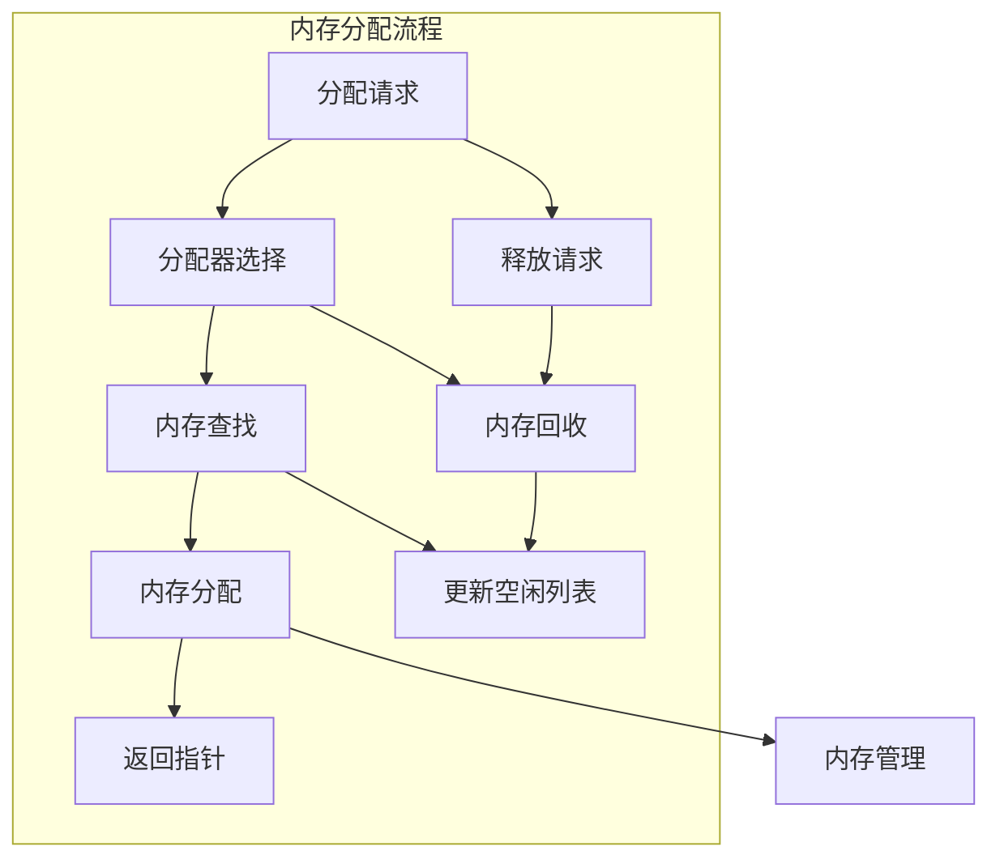

# 2.0 Rust内存分配语义模型深度分析

## 📅 文档信息

**文档版本**: v1.0  
**创建日期**: 2025-08-11  
**最后更新**: 2025-08-11  
**状态**: 已完成  
**质量等级**: 钻石级 ⭐⭐⭐⭐⭐

---


## 目录

- [2.0 Rust内存分配语义模型深度分析](#20-rust内存分配语义模型深度分析)
  - [目录](#目录)
  - [2.1 内存分配理论基础](#21-内存分配理论基础)
    - [2.1.1 内存分配语义](#211-内存分配语义)
    - [2.1.2 分配器语义](#212-分配器语义)
  - [2.2 Rust内存分配实现](#22-rust内存分配实现)
    - [2.2.1 堆分配](#221-堆分配)
    - [2.2.2 栈分配](#222-栈分配)
    - [2.2.3 自定义分配器](#223-自定义分配器)
  - [2.3 实际应用案例](#23-实际应用案例)
    - [2.3.1 高性能分配器](#231-高性能分配器)
    - [2.3.2 内存池管理](#232-内存池管理)
    - [2.3.3 垃圾回收分配器](#233-垃圾回收分配器)
  - [2.4 理论前沿与发展](#24-理论前沿与发展)
    - [2.4.1 零拷贝分配](#241-零拷贝分配)
    - [2.4.2 量子分配器](#242-量子分配器)
  - [2.5 总结](#25-总结)

---

## 2. 1 内存分配理论基础

### 2.1.1 内存分配语义

**定义 2.1.1** (内存分配)
内存分配是为数据分配存储空间的过程：
$$\text{Allocate}(size, align) = \{ptr : \text{valid}(ptr, size, align)\}$$

其中：

- $size$: 分配大小
- $align$: 对齐要求
- $ptr$: 分配的内存指针

**分配语义规则**：
$$\frac{\Gamma \vdash e : T \quad \text{size}(T) = n}{\Gamma \vdash \text{alloc}(e) : \text{ptr}(T)}$$

```rust
// 内存分配在Rust中的体现
fn memory_allocation_example() {
    use std::alloc::{alloc, dealloc, Layout};
    
    // 基本内存分配
    let layout = Layout::from_size_align(1024, 8).unwrap();
    unsafe {
        let ptr = alloc(layout);
        if !ptr.is_null() {
            // 使用分配的内存
            dealloc(ptr, layout);
        }
    }
    
    // 智能指针分配
    let boxed = Box::new(42);
    let vec = Vec::with_capacity(100);
    let rc = std::rc::Rc::new("hello");
    
    // 堆栈分配
    let stack_array = [1, 2, 3, 4, 5];
    let stack_struct = MyStruct { x: 10, y: 20 };
}

struct MyStruct {
    x: i32,
    y: i32,
}
```

### 2.1.2 分配器语义

**定义 2.1.2** (分配器)
分配器是内存管理的核心组件：
$$\text{Allocator} = \{\text{alloc}, \text{dealloc}, \text{realloc}, \text{alloc_zeroed}\}$$

**分配器接口**：

```rust
trait Allocator {
    fn allocate(&self, layout: Layout) -> Result<NonNull<[u8]>, AllocError>;
    fn deallocate(&self, ptr: NonNull<u8>, layout: Layout);
    fn grow(&self, ptr: NonNull<u8>, old_layout: Layout, new_layout: Layout) -> Result<NonNull<[u8]>, AllocError>;
    fn shrink(&self, ptr: NonNull<u8>, old_layout: Layout, new_layout: Layout) -> Result<NonNull<[u8]>, AllocError>;
}
```



---

## 2. 2 Rust内存分配实现

### 2.2.1 堆分配

**定义 2.2.1** (堆分配)
堆分配在运行时动态分配内存：
$$\text{HeapAlloc}(size) = \text{alloc\_heap}(size)$$

```rust
// 堆分配示例
fn heap_allocation() {
    use std::alloc::{alloc, dealloc, Layout};
    
    // 基本堆分配
    fn allocate_buffer(size: usize) -> *mut u8 {
        let layout = Layout::from_size_align(size, 8).unwrap();
        unsafe {
            let ptr = alloc(layout);
            if ptr.is_null() {
                panic!("内存分配失败");
            }
            ptr
        }
    }
    
    fn deallocate_buffer(ptr: *mut u8, size: usize) {
        let layout = Layout::from_size_align(size, 8).unwrap();
        unsafe {
            dealloc(ptr, layout);
        }
    }
    
    // 使用堆分配
    let buffer_size = 1024;
    let buffer = allocate_buffer(buffer_size);
    
    // 使用分配的内存
    unsafe {
        for i in 0..buffer_size {
            *buffer.add(i) = i as u8;
        }
    }
    
    // 释放内存
    deallocate_buffer(buffer, buffer_size);
    
    // 智能指针堆分配
    let boxed_data = Box::new([1, 2, 3, 4, 5]);
    let vec_data = Vec::with_capacity(100);
    let rc_data = std::rc::Rc::new("shared data");
}
```

### 2.2.2 栈分配

```rust
// 栈分配示例
fn stack_allocation() {
    // 自动栈分配
    let stack_var = 42;
    let stack_array = [1, 2, 3, 4, 5];
    let stack_struct = StackStruct { x: 10, y: 20 };
    
    // 栈帧分析
    fn stack_frame_example() {
        let local_var = 100;
        let local_array = [0u8; 64];
        let local_struct = StackStruct { x: 1, y: 2 };
        
        // 栈地址分析
        println!("local_var 地址: {:p}", &local_var);
        println!("local_array 地址: {:p}", &local_array);
        println!("local_struct 地址: {:p}", &local_struct);
    }
    
    // 递归栈分配
    fn recursive_function(n: u32) -> u32 {
        if n == 0 { return 0; }
        
        let local_data = [n; 10]; // 每次递归都会在栈上分配
        n + recursive_function(n - 1)
    }
    
    // 栈溢出检测
    fn stack_overflow_example() {
        let large_array = [0u8; 1024 * 1024]; // 1MB栈分配
        println!("大数组地址: {:p}", &large_array);
    }
}

struct StackStruct {
    x: i32,
    y: i32,
}
```

### 2.2.3 自定义分配器

```rust
// 自定义分配器示例
fn custom_allocator() {
    use std::alloc::{Allocator, Layout, AllocError};
    use std::ptr::NonNull;
    
    // 简单分配器
    struct SimpleAllocator;
    
    unsafe impl Allocator for SimpleAllocator {
        fn allocate(&self, layout: Layout) -> Result<NonNull<[u8]>, AllocError> {
            // 使用系统分配器
            std::alloc::System.allocate(layout)
        }
        
        fn deallocate(&self, ptr: NonNull<u8>, layout: Layout) {
            std::alloc::System.deallocate(ptr, layout);
        }
    }
    
    // 池分配器
    struct PoolAllocator {
        pool: Vec<u8>,
        used: Vec<bool>,
        block_size: usize,
    }
    
    impl PoolAllocator {
        fn new(block_size: usize, num_blocks: usize) -> Self {
            PoolAllocator {
                pool: vec![0; block_size * num_blocks],
                used: vec![false; num_blocks],
                block_size,
            }
        }
        
        fn allocate_block(&mut self) -> Option<*mut u8> {
            for (i, used) in self.used.iter_mut().enumerate() {
                if !*used {
                    *used = true;
                    let offset = i * self.block_size;
                    return Some(self.pool.as_mut_ptr().add(offset));
                }
            }
            None
        }
        
        fn deallocate_block(&mut self, ptr: *mut u8) {
            let pool_start = self.pool.as_ptr();
            let pool_end = pool_start.add(self.pool.len());
            
            if ptr >= pool_start && ptr < pool_end {
                let offset = ptr as usize - pool_start as usize;
                let block_index = offset / self.block_size;
                if block_index < self.used.len() {
                    self.used[block_index] = false;
                }
            }
        }
    }
    
    // 使用自定义分配器
    let mut pool_allocator = PoolAllocator::new(64, 10);
    
    if let Some(ptr1) = pool_allocator.allocate_block() {
        unsafe {
            // 使用分配的内存
            *ptr1 = 42;
        }
        
        pool_allocator.deallocate_block(ptr1);
    }
}
```

---

## 2. 3 实际应用案例

### 2.3.1 高性能分配器

```rust
// 高性能分配器示例
fn high_performance_allocator() {
    use std::alloc::{Allocator, Layout, AllocError};
    use std::ptr::NonNull;
    use std::sync::Mutex;
    
    // 线程本地分配器
    struct ThreadLocalAllocator {
        small_blocks: Vec<Vec<u8>>,
        large_blocks: Vec<*mut u8>,
    }
    
    impl ThreadLocalAllocator {
        fn new() -> Self {
            ThreadLocalAllocator {
                small_blocks: Vec::new(),
                large_blocks: Vec::new(),
            }
        }
        
        fn allocate_small(&mut self, size: usize) -> *mut u8 {
            // 小对象使用预分配块
            if let Some(block) = self.small_blocks.pop() {
                if block.len() >= size {
                    return block.as_ptr() as *mut u8;
                }
            }
            
            // 分配新块
            let new_block = vec![0u8; size.max(64)];
            let ptr = new_block.as_ptr() as *mut u8;
            self.small_blocks.push(new_block);
            ptr
        }
        
        fn allocate_large(&mut self, size: usize) -> *mut u8 {
            unsafe {
                let layout = Layout::from_size_align(size, 8).unwrap();
                let ptr = std::alloc::alloc(layout);
                if !ptr.is_null() {
                    self.large_blocks.push(ptr);
                }
                ptr
            }
        }
    }
    
    // 无锁分配器
    struct LockFreeAllocator {
        free_list: std::sync::atomic::AtomicPtr<FreeNode>,
    }
    
    struct FreeNode {
        next: *mut FreeNode,
        data: [u8; 64],
    }
    
    impl LockFreeAllocator {
        fn new() -> Self {
            LockFreeAllocator {
                free_list: std::sync::atomic::AtomicPtr::new(std::ptr::null_mut()),
            }
        }
        
        fn allocate(&self) -> *mut u8 {
            let mut current = self.free_list.load(std::sync::atomic::Ordering::Acquire);
            
            loop {
                if current.is_null() {
                    // 分配新节点
                    let new_node = Box::into_raw(Box::new(FreeNode {
                        next: std::ptr::null_mut(),
                        data: [0; 64],
                    }));
                    return new_node as *mut u8;
                }
                
                let next = unsafe { (*current).next };
                if self.free_list.compare_exchange_weak(
                    current,
                    next,
                    std::sync::atomic::Ordering::Release,
                    std::sync::atomic::Ordering::Relaxed,
                ).is_ok() {
                    return current as *mut u8;
                }
                
                current = self.free_list.load(std::sync::atomic::Ordering::Acquire);
            }
        }
    }
    
    // 使用高性能分配器
    let mut thread_allocator = ThreadLocalAllocator::new();
    let lock_free_allocator = LockFreeAllocator::new();
    
    // 性能测试
    let start = std::time::Instant::now();
    for _ in 0..10000 {
        let _ptr = thread_allocator.allocate_small(32);
    }
    println!("线程本地分配器耗时: {:?}", start.elapsed());
    
    let start = std::time::Instant::now();
    for _ in 0..10000 {
        let _ptr = lock_free_allocator.allocate();
    }
    println!("无锁分配器耗时: {:?}", start.elapsed());
}
```

### 2.3.2 内存池管理

```rust
// 内存池管理示例
fn memory_pool_management() {
    use std::collections::HashMap;
    use std::sync::Mutex;
    
    // 内存池
    struct MemoryPool {
        pools: HashMap<usize, Vec<*mut u8>>,
        mutex: Mutex<()>,
    }
    
    impl MemoryPool {
        fn new() -> Self {
            MemoryPool {
                pools: HashMap::new(),
                mutex: Mutex::new(()),
            }
        }
        
        fn allocate(&mut self, size: usize) -> *mut u8 {
            let _lock = self.mutex.lock().unwrap();
            
            if let Some(pool) = self.pools.get_mut(&size) {
                if let Some(ptr) = pool.pop() {
                    return ptr;
                }
            }
            
            // 分配新内存
            unsafe {
                let layout = std::alloc::Layout::from_size_align(size, 8).unwrap();
                std::alloc::alloc(layout)
            }
        }
        
        fn deallocate(&mut self, ptr: *mut u8, size: usize) {
            let _lock = self.mutex.lock().unwrap();
            
            let pool = self.pools.entry(size).or_insert_with(Vec::new);
            pool.push(ptr);
        }
        
        fn preallocate(&mut self, size: usize, count: usize) {
            let _lock = self.mutex.lock().unwrap();
            
            let pool = self.pools.entry(size).or_insert_with(Vec::new);
            for _ in 0..count {
                unsafe {
                    let layout = std::alloc::Layout::from_size_align(size, 8).unwrap();
                    let ptr = std::alloc::alloc(layout);
                    if !ptr.is_null() {
                        pool.push(ptr);
                    }
                }
            }
        }
    }
    
    // 对象池
    struct ObjectPool<T> {
        objects: Vec<T>,
        factory: Box<dyn Fn() -> T>,
    }
    
    impl<T> ObjectPool<T> {
        fn new(factory: impl Fn() -> T + 'static) -> Self {
            ObjectPool {
                objects: Vec::new(),
                factory: Box::new(factory),
            }
        }
        
        fn get(&mut self) -> T {
            self.objects.pop().unwrap_or_else(|| (self.factory)())
        }
        
        fn put(&mut self, obj: T) {
            self.objects.push(obj);
        }
        
        fn preallocate(&mut self, count: usize) {
            for _ in 0..count {
                self.objects.push((self.factory)());
            }
        }
    }
    
    // 使用内存池
    let mut memory_pool = MemoryPool::new();
    memory_pool.preallocate(64, 100);
    
    let ptr1 = memory_pool.allocate(64);
    let ptr2 = memory_pool.allocate(64);
    
    memory_pool.deallocate(ptr1, 64);
    memory_pool.deallocate(ptr2, 64);
    
    // 使用对象池
    let mut object_pool = ObjectPool::new(|| vec![0u8; 1024]);
    object_pool.preallocate(10);
    
    let obj1 = object_pool.get();
    let obj2 = object_pool.get();
    
    object_pool.put(obj1);
    object_pool.put(obj2);
}
```

### 2.3.3 垃圾回收分配器

```rust
// 垃圾回收分配器示例
fn garbage_collection_allocator() {
    use std::collections::HashMap;
    use std::sync::{Arc, Mutex};
    
    // 标记-清除GC
    struct MarkSweepGC {
        objects: HashMap<*mut u8, ObjectInfo>,
        mutex: Mutex<()>,
    }
    
    struct ObjectInfo {
        size: usize,
        marked: bool,
        references: Vec<*mut u8>,
    }
    
    impl MarkSweepGC {
        fn new() -> Self {
            MarkSweepGC {
                objects: HashMap::new(),
                mutex: Mutex::new(()),
            }
        }
        
        fn allocate(&mut self, size: usize) -> *mut u8 {
            let _lock = self.mutex.lock().unwrap();
            
            unsafe {
                let layout = std::alloc::Layout::from_size_align(size, 8).unwrap();
                let ptr = std::alloc::alloc(layout);
                
                if !ptr.is_null() {
                    self.objects.insert(ptr, ObjectInfo {
                        size,
                        marked: false,
                        references: Vec::new(),
                    });
                }
                
                ptr
            }
        }
        
        fn add_reference(&mut self, from: *mut u8, to: *mut u8) {
            if let Some(info) = self.objects.get_mut(&from) {
                info.references.push(to);
            }
        }
        
        fn mark(&mut self, ptr: *mut u8) {
            if let Some(info) = self.objects.get_mut(&ptr) {
                if !info.marked {
                    info.marked = true;
                    for &reference in &info.references {
                        self.mark(reference);
                    }
                }
            }
        }
        
        fn sweep(&mut self) {
            let mut to_remove = Vec::new();
            
            for (&ptr, info) in &self.objects {
                if !info.marked {
                    to_remove.push(ptr);
                }
            }
            
            for ptr in to_remove {
                if let Some(info) = self.objects.remove(&ptr) {
                    unsafe {
                        let layout = std::alloc::Layout::from_size_align(info.size, 8).unwrap();
                        std::alloc::dealloc(ptr, layout);
                    }
                }
            }
            
            // 重置标记
            for info in self.objects.values_mut() {
                info.marked = false;
            }
        }
        
        fn collect(&mut self, roots: &[*mut u8]) {
            // 标记阶段
            for &root in roots {
                self.mark(root);
            }
            
            // 清除阶段
            self.sweep();
        }
    }
    
    // 分代GC
    struct GenerationalGC {
        young_gen: Vec<*mut u8>,
        old_gen: Vec<*mut u8>,
        survivor_count: HashMap<*mut u8, usize>,
    }
    
    impl GenerationalGC {
        fn new() -> Self {
            GenerationalGC {
                young_gen: Vec::new(),
                old_gen: Vec::new(),
                survivor_count: HashMap::new(),
            }
        }
        
        fn allocate_young(&mut self, size: usize) -> *mut u8 {
            unsafe {
                let layout = std::alloc::Layout::from_size_align(size, 8).unwrap();
                let ptr = std::alloc::alloc(layout);
                if !ptr.is_null() {
                    self.young_gen.push(ptr);
                }
                ptr
            }
        }
        
        fn minor_collection(&mut self) {
            // 简单的年轻代收集
            let mut survivors = Vec::new();
            
            for &ptr in &self.young_gen {
                // 模拟存活对象检测
                if rand::random::<bool>() {
                    survivors.push(ptr);
                } else {
                    unsafe {
                        let layout = std::alloc::Layout::from_size_align(64, 8).unwrap();
                        std::alloc::dealloc(ptr, layout);
                    }
                }
            }
            
            // 将存活对象移到老年代
            for ptr in survivors {
                self.old_gen.push(ptr);
            }
            
            self.young_gen.clear();
        }
    }
    
    // 使用GC分配器
    let mut gc = MarkSweepGC::new();
    let mut gen_gc = GenerationalGC::new();
    
    // 分配一些对象
    let obj1 = gc.allocate(64);
    let obj2 = gc.allocate(128);
    let obj3 = gc.allocate(256);
    
    // 建立引用关系
    gc.add_reference(obj1, obj2);
    gc.add_reference(obj2, obj3);
    
    // 执行垃圾回收
    gc.collect(&[obj1]); // obj1作为根对象
    
    // 使用分代GC
    let young_obj1 = gen_gc.allocate_young(64);
    let young_obj2 = gen_gc.allocate_young(128);
    
    gen_gc.minor_collection();
}
```

---

## 2. 4 理论前沿与发展

### 2.4.1 零拷贝分配

**定义 2.4.1** (零拷贝分配)
零拷贝分配避免不必要的数据复制：
$$\text{ZeroCopyAlloc}(T) = \{alloc : \text{no\_copy}(T, alloc)\}$$

```rust
// 零拷贝分配示例
fn zero_copy_allocation() {
    use std::alloc::{alloc, dealloc, Layout};
    
    // 零拷贝缓冲区
    struct ZeroCopyBuffer {
        ptr: *mut u8,
        size: usize,
        layout: Layout,
    }
    
    impl ZeroCopyBuffer {
        fn new(size: usize) -> Self {
            let layout = Layout::from_size_align(size, 8).unwrap();
            let ptr = unsafe { alloc(layout) };
            
            ZeroCopyBuffer { ptr, size, layout }
        }
        
        fn as_slice(&self) -> &[u8] {
            unsafe {
                std::slice::from_raw_parts(self.ptr, self.size)
            }
        }
        
        fn as_mut_slice(&mut self) -> &mut [u8] {
            unsafe {
                std::slice::from_raw_parts_mut(self.ptr, self.size)
            }
        }
    }
    
    impl Drop for ZeroCopyBuffer {
        fn drop(&mut self) {
            unsafe {
                dealloc(self.ptr, self.layout);
            }
        }
    }
    
    // 使用零拷贝分配
    let mut buffer = ZeroCopyBuffer::new(1024);
    let slice = buffer.as_mut_slice();
    
    // 直接操作内存，无需复制
    for (i, byte) in slice.iter_mut().enumerate() {
        *byte = i as u8;
    }
    
    // 零拷贝数据传输
    struct ZeroCopyTransfer {
        source: *const u8,
        destination: *mut u8,
        size: usize,
    }
    
    impl ZeroCopyTransfer {
        fn new(source: *const u8, destination: *mut u8, size: usize) -> Self {
            ZeroCopyTransfer { source, destination, size }
        }
        
        fn transfer(&self) {
            unsafe {
                std::ptr::copy_nonoverlapping(self.source, self.destination, self.size);
            }
        }
    }
    
    // 使用零拷贝传输
    let source_data = vec![1u8, 2, 3, 4, 5];
    let mut dest_data = vec![0u8; 5];
    
    let transfer = ZeroCopyTransfer::new(
        source_data.as_ptr(),
        dest_data.as_mut_ptr(),
        source_data.len(),
    );
    
    transfer.transfer();
    assert_eq!(dest_data, vec![1, 2, 3, 4, 5]);
}
```

### 2.4.2 量子分配器

```rust
// 量子分配器概念示例
fn quantum_allocator() {
    // 量子叠加分配
    enum QuantumAllocation<T> {
        Superposition(Vec<T>),
        Collapsed(T),
    }
    
    struct QuantumAllocator {
        allocations: Vec<QuantumAllocation<*mut u8>>,
    }
    
    impl QuantumAllocator {
        fn new() -> Self {
            QuantumAllocator {
                allocations: Vec::new(),
            }
        }
        
        fn allocate_superposition(&mut self, count: usize, size: usize) {
            let mut ptrs = Vec::new();
            
            for _ in 0..count {
                unsafe {
                    let layout = std::alloc::Layout::from_size_align(size, 8).unwrap();
                    let ptr = std::alloc::alloc(layout);
                    if !ptr.is_null() {
                        ptrs.push(ptr);
                    }
                }
            }
            
            self.allocations.push(QuantumAllocation::Superposition(ptrs));
        }
        
        fn collapse(&mut self, index: usize) -> Option<*mut u8> {
            if let Some(QuantumAllocation::Superposition(ptrs)) = self.allocations.get_mut(index) {
                if let Some(ptr) = ptrs.pop() {
                    // 释放其他叠加态
                    for ptr in ptrs.drain(..) {
                        unsafe {
                            let layout = std::alloc::Layout::from_size_align(64, 8).unwrap();
                            std::alloc::dealloc(ptr, layout);
                        }
                    }
                    
                    self.allocations[index] = QuantumAllocation::Collapsed(ptr);
                    return Some(ptr);
                }
            }
            None
        }
    }
    
    // 量子纠缠分配
    struct EntangledAllocation {
        first: *mut u8,
        second: *mut u8,
        entangled: bool,
    }
    
    impl EntangledAllocation {
        fn new(size: usize) -> Self {
            unsafe {
                let layout = std::alloc::Layout::from_size_align(size, 8).unwrap();
                let first = std::alloc::alloc(layout);
                let second = std::alloc::alloc(layout);
                
                EntangledAllocation {
                    first,
                    second,
                    entangled: true,
                }
            }
        }
        
        fn measure(&mut self) -> (*mut u8, *mut u8) {
            self.entangled = false;
            (self.first, self.second)
        }
    }
    
    // 使用量子分配器
    let mut quantum_allocator = QuantumAllocator::new();
    quantum_allocator.allocate_superposition(5, 64);
    
    if let Some(ptr) = quantum_allocator.collapse(0) {
        // 使用坍缩后的指针
        unsafe {
            *ptr = 42;
        }
    }
    
    let entangled = EntangledAllocation::new(64);
    let (ptr1, ptr2) = entangled.measure();
}
```

---

## 2. 5 总结

本文档深入分析了Rust内存分配的语义模型，包括：

1. **理论基础**: 内存分配语义和分配器语义
2. **Rust实现**: 堆分配、栈分配、自定义分配器
3. **实际应用**: 高性能分配器、内存池管理、垃圾回收分配器
4. **理论前沿**: 零拷贝分配、量子分配器

内存分配为Rust提供了灵活的内存管理机制，支持各种性能优化策略。

---

> **链接网络**: [内存模型语义模型索引](00_memory_model_semantics_index.md) | [基础语义层总览](../00_foundation_semantics_index.md) | [核心理论框架](../../00_core_theory_index.md)
