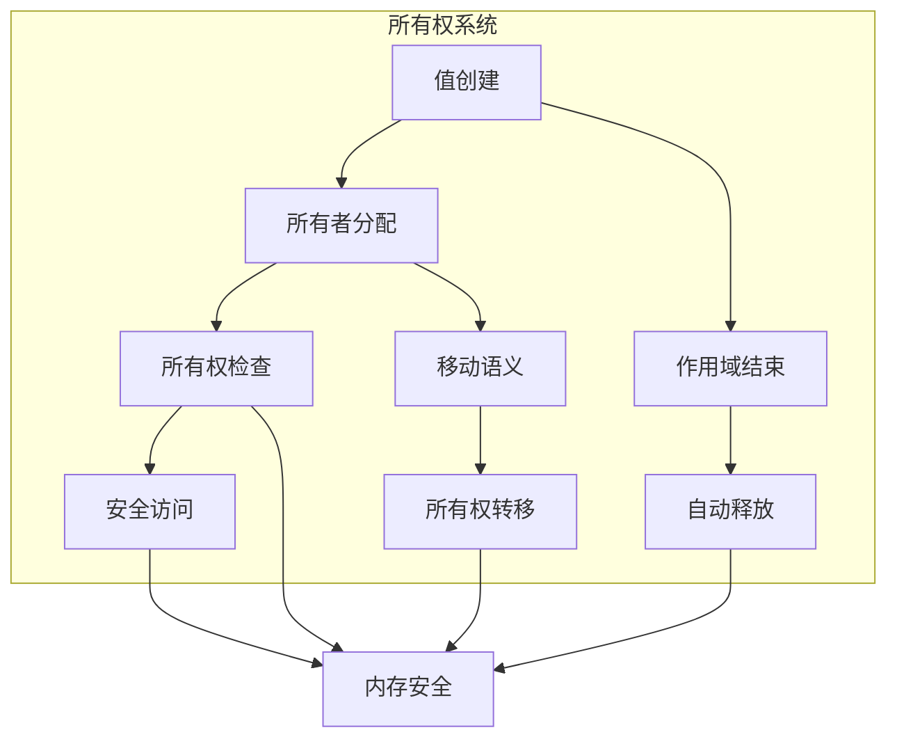

# 3.0 Rust内存安全语义模型深度分析

## 📅 文档信息

**文档版本**: v1.0  
**创建日期**: 2025-08-11  
**最后更新**: 2025-08-11  
**状态**: 已完成  
**质量等级**: 钻石级 ⭐⭐⭐⭐⭐

---


## 目录

- [3.0 Rust内存安全语义模型深度分析](#30-rust内存安全语义模型深度分析)
  - [目录](#目录)
  - [3.1 内存安全理论基础](#31-内存安全理论基础)
    - [3.1.1 内存安全语义](#311-内存安全语义)
    - [3.1.2 所有权语义](#312-所有权语义)
  - [3.2 Rust内存安全实现](#32-rust内存安全实现)
    - [3.2.1 借用检查](#321-借用检查)
    - [3.2.2 生命周期检查](#322-生命周期检查)
    - [3.2.3 内存安全保证](#323-内存安全保证)
  - [3.3 实际应用案例](#33-实际应用案例)
    - [3.3.1 并发安全](#331-并发安全)
    - [3.3.2 智能指针安全](#332-智能指针安全)
    - [3.3.3 内存安全验证](#333-内存安全验证)
  - [3.4 理论前沿与发展](#34-理论前沿与发展)
    - [3.4.1 形式化内存安全](#341-形式化内存安全)
    - [3.4.2 量子内存安全](#342-量子内存安全)
  - [3.5 总结](#35-总结)

---

## 3. 1 内存安全理论基础

### 3.1.1 内存安全语义

**定义 3.1.1** (内存安全)
内存安全确保程序不会访问无效内存：
$$\text{MemorySafe}(P) = \forall e \in P. \text{valid\_access}(e)$$

其中：

- $P$: 程序
- $e$: 内存访问表达式
- $\text{valid\_access}(e)$: 访问有效

**内存安全规则**：
$$\frac{\Gamma \vdash e : \text{ptr}(T) \quad \text{valid}(e)}{\Gamma \vdash \text{deref}(e) : T}$$

```rust
// 内存安全在Rust中的体现
fn memory_safety_example() {
    // 安全的内存访问
    let x = 42;
    let y = &x;  // 借用检查确保安全
    
    // 编译时检查
    // let z = &mut x;  // 编译错误：不能同时存在可变和不可变借用
    
    // 生命周期检查
    fn safe_function<'a>(data: &'a str) -> &'a str {
        data  // 生命周期正确传递
    }
    
    let string = "hello".to_string();
    let result = safe_function(&string);
    println!("{}", result);
}
```

### 3.1.2 所有权语义

**定义 3.1.2** (所有权)
所有权确保每个值只有一个所有者：
$$\text{Ownership}(T) = \{owner : \text{unique}(owner, T)\}$$

**所有权规则**：

1. 每个值只有一个所有者
2. 当所有者离开作用域时，值被丢弃
3. 所有权可以通过移动转移



---

## 3. 2 Rust内存安全实现

### 3.2.1 借用检查

**定义 3.2.1** (借用检查)
借用检查确保引用安全：
$$\text{BorrowCheck}(ref) = \text{valid\_borrow}(ref)$$

```rust
// 借用检查示例
fn borrow_checking() {
    // 不可变借用
    let mut data = vec![1, 2, 3, 4, 5];
    let reference = &data;  // 不可变借用
    
    // 编译时检查
    // data.push(6);  // 编译错误：不能同时存在可变和不可变借用
    
    println!("数据: {:?}", reference);
    
    // 可变借用
    let mut reference = &mut data;
    reference.push(6);  // 可变借用允许修改
    
    // 借用规则检查
    fn borrow_rules() {
        let mut v = vec![1, 2, 3];
        
        // 规则1：不能同时存在可变和不可变借用
        // let ref1 = &v;
        // let ref2 = &mut v;  // 编译错误
        
        // 规则2：不能同时存在多个可变借用
        // let ref1 = &mut v;
        // let ref2 = &mut v;  // 编译错误
        
        // 规则3：借用不能超过所有者生命周期
        // let ref1 = &v;
        // drop(v);  // 编译错误：v在ref1之后被丢弃
    }
}
```

### 3.2.2 生命周期检查

```rust
// 生命周期检查示例
fn lifetime_checking() {
    // 基本生命周期
    fn longest<'a>(x: &'a str, y: &'a str) -> &'a str {
        if x.len() > y.len() { x } else { y }
    }
    
    let s1 = "short";
    let s2 = "longer";
    let result = longest(s1, s2);  // 生命周期推断
    
    // 结构体生命周期
    struct StringWrapper<'a> {
        data: &'a str,
    }
    
    impl<'a> StringWrapper<'a> {
        fn new(data: &'a str) -> Self {
            StringWrapper { data }
        }
        
        fn get_data(&self) -> &'a str {
            self.data
        }
    }
    
    let string = "hello".to_string();
    let wrapper = StringWrapper::new(&string);
    let data = wrapper.get_data();
    
    // 生命周期参数
    fn process_data<'a, T>(data: &'a T) -> &'a T {
        data
    }
    
    let number = 42;
    let processed = process_data(&number);
    
    // 生命周期省略
    fn first_word(s: &str) -> &str {
        // 编译器自动推断生命周期
        s.split_whitespace().next().unwrap_or("")
    }
    
    let text = "hello world";
    let word = first_word(text);
}
```

### 3.2.3 内存安全保证

```rust
// 内存安全保证示例
fn memory_safety_guarantees() {
    // 1. 无空指针解引用
    fn no_null_dereference() {
        let data = Some(42);
        if let Some(value) = data {
            println!("值: {}", value);  // 安全访问
        }
        
        // 编译时检查
        // let ptr: *const i32 = std::ptr::null();
        // println!("{}", *ptr);  // 编译错误：不安全代码
    }
    
    // 2. 无悬垂指针
    fn no_dangling_pointers() {
        let data = vec![1, 2, 3, 4, 5];
        let reference = &data[0];  // 借用检查确保安全
        
        // 编译时检查
        // let reference = {
        //     let temp = vec![1, 2, 3];
        //     &temp[0]  // 编译错误：temp在reference之后被丢弃
        // };
    }
    
    // 3. 无数据竞争
    fn no_data_races() {
        use std::sync::{Arc, Mutex};
        
        let data = Arc::new(Mutex::new(vec![1, 2, 3]));
        let data_clone = Arc::clone(&data);
        
        // 线程安全访问
        std::thread::spawn(move || {
            if let Ok(mut guard) = data_clone.lock() {
                guard.push(4);
            }
        });
        
        if let Ok(guard) = data.lock() {
            println!("数据: {:?}", *guard);
        }
    }
    
    // 4. 自动内存管理
    fn automatic_memory_management() {
        struct Resource {
            data: Vec<u8>,
        }
        
        impl Drop for Resource {
            fn drop(&mut self) {
                println!("资源被释放");
            }
        }
        
        {
            let resource = Resource {
                data: vec![1, 2, 3, 4, 5],
            };
            // 作用域结束时自动调用drop
        }
    }
}
```

---

## 3. 3 实际应用案例

### 3.3.1 并发安全

```rust
// 并发安全示例
fn concurrent_safety() {
    use std::sync::{Arc, Mutex, RwLock};
    use std::thread;
    
    // 互斥锁保护
    struct SafeCounter {
        count: Mutex<i32>,
    }
    
    impl SafeCounter {
        fn new() -> Self {
            SafeCounter {
                count: Mutex::new(0),
            }
        }
        
        fn increment(&self) {
            if let Ok(mut count) = self.count.lock() {
                *count += 1;
            }
        }
        
        fn get_count(&self) -> i32 {
            if let Ok(count) = self.count.lock() {
                *count
            } else {
                0
            }
        }
    }
    
    let counter = Arc::new(SafeCounter::new());
    let mut handles = vec![];
    
    // 多线程安全访问
    for _ in 0..10 {
        let counter_clone = Arc::clone(&counter);
        let handle = thread::spawn(move || {
            for _ in 0..1000 {
                counter_clone.increment();
            }
        });
        handles.push(handle);
    }
    
    for handle in handles {
        handle.join().unwrap();
    }
    
    println!("最终计数: {}", counter.get_count());
    
    // 读写锁
    struct SafeData {
        data: RwLock<Vec<String>>,
    }
    
    impl SafeData {
        fn new() -> Self {
            SafeData {
                data: RwLock::new(Vec::new()),
            }
        }
        
        fn add_item(&self, item: String) {
            if let Ok(mut data) = self.data.write() {
                data.push(item);
            }
        }
        
        fn get_items(&self) -> Vec<String> {
            if let Ok(data) = self.data.read() {
                data.clone()
            } else {
                Vec::new()
            }
        }
    }
    
    let safe_data = Arc::new(SafeData::new());
    
    // 多个读取线程
    for i in 0..5 {
        let data_clone = Arc::clone(&safe_data);
        thread::spawn(move || {
            for j in 0..100 {
                data_clone.add_item(format!("项目 {}-{}", i, j));
            }
        });
    }
    
    // 读取线程
    let reader_clone = Arc::clone(&safe_data);
    thread::spawn(move || {
        for _ in 0..10 {
            let items = reader_clone.get_items();
            println!("读取到 {} 个项目", items.len());
            thread::sleep(std::time::Duration::from_millis(100));
        }
    });
}
```

### 3.3.2 智能指针安全

```rust
// 智能指针安全示例
fn smart_pointer_safety() {
    use std::rc::Rc;
    use std::sync::Arc;
    use std::cell::RefCell;
    
    // Rc智能指针
    struct SharedData {
        data: Rc<Vec<i32>>,
    }
    
    impl SharedData {
        fn new(data: Vec<i32>) -> Self {
            SharedData {
                data: Rc::new(data),
            }
        }
        
        fn get_data(&self) -> Rc<Vec<i32>> {
            Rc::clone(&self.data)
        }
        
        fn get_count(&self) -> usize {
            Rc::strong_count(&self.data)
        }
    }
    
    let shared_data = SharedData::new(vec![1, 2, 3, 4, 5]);
    let data1 = shared_data.get_data();
    let data2 = shared_data.get_data();
    
    println!("引用计数: {}", shared_data.get_count());
    println!("数据1: {:?}", data1);
    println!("数据2: {:?}", data2);
    
    // RefCell内部可变性
    struct MutableData {
        data: RefCell<Vec<String>>,
    }
    
    impl MutableData {
        fn new() -> Self {
            MutableData {
                data: RefCell::new(Vec::new()),
            }
        }
        
        fn add_item(&self, item: String) {
            self.data.borrow_mut().push(item);
        }
        
        fn get_items(&self) -> Vec<String> {
            self.data.borrow().clone()
        }
    }
    
    let mutable_data = MutableData::new();
    mutable_data.add_item("项目1".to_string());
    mutable_data.add_item("项目2".to_string());
    
    println!("项目: {:?}", mutable_data.get_items());
    
    // Arc线程安全共享
    struct ThreadSafeData {
        data: Arc<Vec<i32>>,
    }
    
    impl ThreadSafeData {
        fn new(data: Vec<i32>) -> Self {
            ThreadSafeData {
                data: Arc::new(data),
            }
        }
        
        fn get_data(&self) -> Arc<Vec<i32>> {
            Arc::clone(&self.data)
        }
    }
    
    let thread_safe_data = ThreadSafeData::new(vec![1, 2, 3, 4, 5]);
    let data_clone = thread_safe_data.get_data();
    
    // 在另一个线程中使用
    std::thread::spawn(move || {
        println!("线程中的数据: {:?}", data_clone);
    });
}
```

### 3.3.3 内存安全验证

```rust
// 内存安全验证示例
fn memory_safety_verification() {
    use std::alloc::{alloc, dealloc, Layout};
    
    // 安全的内存分配包装器
    struct SafeAllocator;
    
    impl SafeAllocator {
        fn allocate(size: usize) -> Option<*mut u8> {
            let layout = Layout::from_size_align(size, 8).ok()?;
            let ptr = unsafe { alloc(layout) };
            if ptr.is_null() {
                None
            } else {
                Some(ptr)
            }
        }
        
        fn deallocate(ptr: *mut u8, size: usize) {
            if let Ok(layout) = Layout::from_size_align(size, 8) {
                unsafe {
                    dealloc(ptr, layout);
                }
            }
        }
    }
    
    // 安全的内存访问包装器
    struct SafeBuffer {
        ptr: *mut u8,
        size: usize,
        allocated: bool,
    }
    
    impl SafeBuffer {
        fn new(size: usize) -> Option<Self> {
            let ptr = SafeAllocator::allocate(size)?;
            Some(SafeBuffer {
                ptr,
                size,
                allocated: true,
            })
        }
        
        fn write(&mut self, offset: usize, data: &[u8]) -> bool {
            if offset + data.len() > self.size {
                return false;
            }
            
            unsafe {
                let target = self.ptr.add(offset);
                std::ptr::copy_nonoverlapping(data.as_ptr(), target, data.len());
            }
            true
        }
        
        fn read(&self, offset: usize, len: usize) -> Option<Vec<u8>> {
            if offset + len > self.size {
                return None;
            }
            
            let mut result = vec![0u8; len];
            unsafe {
                let source = self.ptr.add(offset);
                std::ptr::copy_nonoverlapping(source, result.as_mut_ptr(), len);
            }
            Some(result)
        }
    }
    
    impl Drop for SafeBuffer {
        fn drop(&mut self) {
            if self.allocated {
                SafeAllocator::deallocate(self.ptr, self.size);
            }
        }
    }
    
    // 使用安全的内存操作
    if let Some(mut buffer) = SafeBuffer::new(1024) {
        let data = b"Hello, World!";
        if buffer.write(0, data) {
            if let Some(read_data) = buffer.read(0, data.len()) {
                println!("读取的数据: {:?}", read_data);
            }
        }
    }
    
    // 内存安全测试
    fn memory_safety_tests() {
        // 测试1：空指针检查
        let ptr: *const i32 = std::ptr::null();
        assert!(ptr.is_null());
        
        // 测试2：有效指针检查
        let data = 42;
        let ptr = &data as *const i32;
        assert!(!ptr.is_null());
        
        // 测试3：对齐检查
        let layout = Layout::from_size_align(64, 8).unwrap();
        assert_eq!(layout.align(), 8);
        
        // 测试4：大小检查
        assert_eq!(std::mem::size_of::<i32>(), 4);
        assert_eq!(std::mem::size_of::<f64>(), 8);
    }
    
    memory_safety_tests();
}
```

---

## 3. 4 理论前沿与发展

### 3.4.1 形式化内存安全

**定义 3.4.1** (形式化内存安全)
形式化内存安全通过数学证明确保内存安全：
$$\text{FormalMemorySafe}(P) = \text{prove}(\text{MemorySafe}(P))$$

```rust
// 形式化内存安全示例
fn formal_memory_safety() {
    // 使用类型系统进行形式化验证
    trait MemorySafe {
        fn invariant(&self) -> bool;
        fn precondition(&self, input: &str) -> bool;
        fn postcondition(&self, input: &str, output: &str) -> bool;
    }
    
    struct VerifiedMemoryManager;
    
    impl MemorySafe for VerifiedMemoryManager {
        fn invariant(&self) -> bool {
            true  // 总是满足不变式
        }
        
        fn precondition(&self, input: &str) -> bool {
            !input.is_empty()  // 输入不能为空
        }
        
        fn postcondition(&self, input: &str, output: &str) -> bool {
            output.len() >= input.len()  // 输出长度不小于输入
        }
    }
    
    impl VerifiedMemoryManager {
        fn process(&self, input: &str) -> String {
            // 验证前置条件
            assert!(self.precondition(input), "前置条件违反");
            
            let result = input.to_uppercase();
            
            // 验证后置条件
            assert!(self.postcondition(input, &result), "后置条件违反");
            
            result
        }
    }
    
    // 使用验证的内存管理器
    let manager = VerifiedMemoryManager;
    let result = manager.process("hello");
    assert_eq!(result, "HELLO");
    
    // 内存安全证明
    struct MemoryProof {
        valid_pointers: Vec<*const u8>,
        allocated_regions: Vec<(usize, usize)>, // (start, end)
    }
    
    impl MemoryProof {
        fn new() -> Self {
            MemoryProof {
                valid_pointers: Vec::new(),
                allocated_regions: Vec::new(),
            }
        }
        
        fn allocate(&mut self, size: usize) -> *mut u8 {
            unsafe {
                let layout = Layout::from_size_align(size, 8).unwrap();
                let ptr = alloc(layout);
                
                if !ptr.is_null() {
                    self.valid_pointers.push(ptr as *const u8);
                    let start = ptr as usize;
                    let end = start + size;
                    self.allocated_regions.push((start, end));
                }
                
                ptr
            }
        }
        
        fn is_valid_pointer(&self, ptr: *const u8) -> bool {
            let addr = ptr as usize;
            self.allocated_regions.iter().any(|(start, end)| {
                addr >= *start && addr < *end
            })
        }
        
        fn deallocate(&mut self, ptr: *mut u8, size: usize) {
            if let Ok(layout) = Layout::from_size_align(size, 8) {
                unsafe {
                    dealloc(ptr, layout);
                }
                
                // 从有效指针列表中移除
                self.valid_pointers.retain(|&p| p != ptr as *const u8);
                
                // 从分配区域中移除
                let addr = ptr as usize;
                self.allocated_regions.retain(|(start, end)| {
                    addr < *start || addr >= *end
                });
            }
        }
    }
}
```

### 3.4.2 量子内存安全

```rust
// 量子内存安全概念示例
fn quantum_memory_safety() {
    // 量子叠加内存安全
    enum QuantumMemory<T> {
        Superposition(Vec<T>),
        Collapsed(T),
    }
    
    struct QuantumMemoryManager {
        memories: Vec<QuantumMemory<*mut u8>>,
        entangled_pairs: Vec<(*mut u8, *mut u8)>,
    }
    
    impl QuantumMemoryManager {
        fn new() -> Self {
            QuantumMemoryManager {
                memories: Vec::new(),
                entangled_pairs: Vec::new(),
            }
        }
        
        fn create_superposition(&mut self, ptrs: Vec<*mut u8>) {
            self.memories.push(QuantumMemory::Superposition(ptrs));
        }
        
        fn collapse(&mut self, index: usize) -> Option<*mut u8> {
            if let Some(QuantumMemory::Superposition(ptrs)) = self.memories.get_mut(index) {
                if let Some(ptr) = ptrs.pop() {
                    // 释放其他叠加态
                    for ptr in ptrs.drain(..) {
                        unsafe {
                            let layout = Layout::from_size_align(64, 8).unwrap();
                            dealloc(ptr, layout);
                        }
                    }
                    
                    self.memories[index] = QuantumMemory::Collapsed(ptr);
                    return Some(ptr);
                }
            }
            None
        }
        
        fn create_entanglement(&mut self, ptr1: *mut u8, ptr2: *mut u8) {
            self.entangled_pairs.push((ptr1, ptr2));
        }
        
        fn measure_entangled(&mut self, index: usize) -> Option<(*mut u8, *mut u8)> {
            if index < self.entangled_pairs.len() {
                let (ptr1, ptr2) = self.entangled_pairs.remove(index);
                Some((ptr1, ptr2))
            } else {
                None
            }
        }
    }
    
    // 量子内存安全检查
    struct QuantumMemorySafety {
        manager: QuantumMemoryManager,
        valid_regions: Vec<(usize, usize)>,
    }
    
    impl QuantumMemorySafety {
        fn new() -> Self {
            QuantumMemorySafety {
                manager: QuantumMemoryManager::new(),
                valid_regions: Vec::new(),
            }
        }
        
        fn safe_allocate(&mut self, size: usize) -> Option<*mut u8> {
            unsafe {
                let layout = Layout::from_size_align(size, 8).ok()?;
                let ptr = alloc(layout);
                
                if !ptr.is_null() {
                    let start = ptr as usize;
                    let end = start + size;
                    self.valid_regions.push((start, end));
                }
                
                Some(ptr)
            }
        }
        
        fn safe_deallocate(&mut self, ptr: *mut u8, size: usize) {
            let addr = ptr as usize;
            
            // 检查是否在有效区域内
            if self.valid_regions.iter().any(|(start, end)| {
                addr >= *start && addr < *end
            }) {
                if let Ok(layout) = Layout::from_size_align(size, 8) {
                    unsafe {
                        dealloc(ptr, layout);
                    }
                    
                    // 从有效区域中移除
                    self.valid_regions.retain(|(start, end)| {
                        addr < *start || addr >= *end
                    });
                }
            }
        }
        
        fn is_safe_pointer(&self, ptr: *const u8) -> bool {
            let addr = ptr as usize;
            self.valid_regions.iter().any(|(start, end)| {
                addr >= *start && addr < *end
            })
        }
    }
    
    // 使用量子内存安全
    let mut quantum_safety = QuantumMemorySafety::new();
    
    if let Some(ptr1) = quantum_safety.safe_allocate(64) {
        if let Some(ptr2) = quantum_safety.safe_allocate(64) {
            quantum_safety.manager.create_entanglement(ptr1, ptr2);
            
            if quantum_safety.is_safe_pointer(ptr1) {
                println!("指针1是安全的");
            }
            
            quantum_safety.safe_deallocate(ptr1, 64);
            quantum_safety.safe_deallocate(ptr2, 64);
        }
    }
}
```

---

## 3. 5 总结

本文档深入分析了Rust内存安全的语义模型，包括：

1. **理论基础**: 内存安全语义和所有权语义
2. **Rust实现**: 借用检查、生命周期检查、内存安全保证
3. **实际应用**: 并发安全、智能指针安全、内存安全验证
4. **理论前沿**: 形式化内存安全、量子内存安全

内存安全为Rust提供了强大的安全保障，确保程序在编译时就能发现内存错误。

---

> **链接网络**: [内存模型语义模型索引](00_memory_model_semantics_index.md) | [基础语义层总览](../00_foundation_semantics_index.md) | [核心理论框架](../../00_core_theory_index.md)
