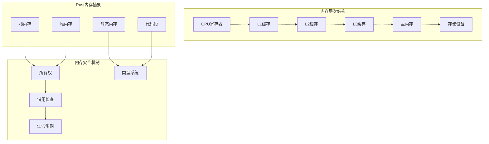
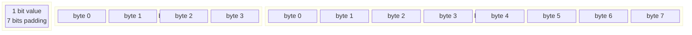
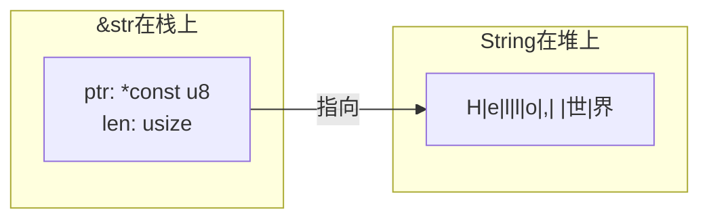
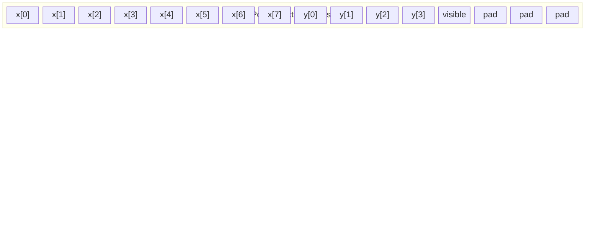
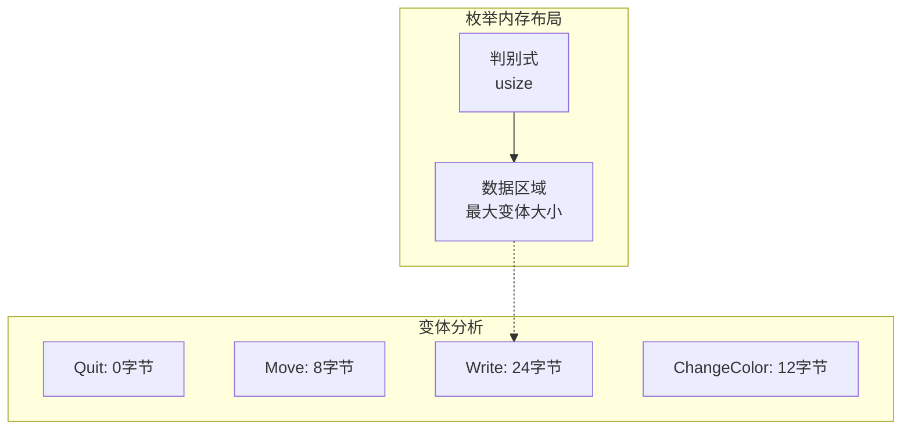
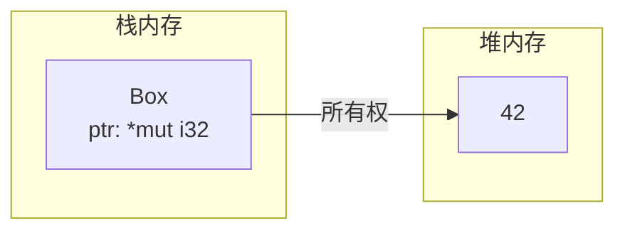
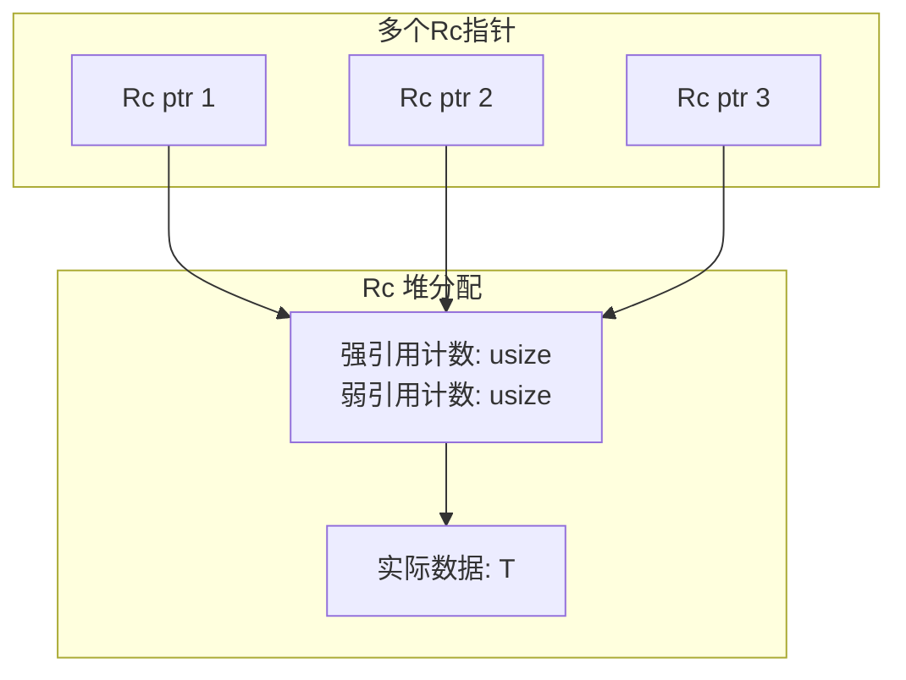

# 1.3.1 Rust内存布局语义模型深度分析

**文档版本**: V1.0  
**创建日期**: 2025-01-27  
**所属层**: 基础语义层 (Foundation Semantics Layer)  
**父模块**: [1.3 内存模型语义](../00_memory_model_index.md)  
**交叉引用**: [1.1.1 原始类型语义](../01_type_system_semantics/01_primitive_types_semantics.md), [1.4.1 所有权规则语义](../04_ownership_system_semantics/01_ownership_rules_semantics.md)

---

## 1.3.1.1 内存布局理论基础

### 1.3.1.1.1 内存语义域的形式化定义

**定义 1.3.1.1** (内存布局语义域)
Rust的内存布局可形式化为地址空间上的类型化内存模型：

$$\text{MemoryLayout} = \langle \text{Address}, \text{Size}, \text{Alignment}, \text{Repr}, \text{Lifetime} \rangle$$

其中：

- $\text{Address} : \text{usize}$ - 内存地址
- $\text{Size} : \text{usize}$ - 字节大小
- $\text{Alignment} : \text{usize}$ - 内存对齐要求
- $\text{Repr} : \text{Representation}$ - 数据表示方式
- $\text{Lifetime} : \text{Region}$ - 内存有效期

**内存语义函数**：
$$\text{layout} : \text{Type} \to \text{MemoryLayout}$$
$$\text{layout}(T) = (\text{size\_of}(T), \text{align\_of}(T), \text{repr}(T))$$

### 1.3.1.1.2 内存模型的范畴论视角



### 1.3.1.1.3 内存对齐的数学模型

**定义 1.3.1.2** (内存对齐约束)
对于类型 $T$ 和地址 $addr$，对齐约束定义为：
$$\text{aligned}(addr, T) \equiv addr \bmod \text{align\_of}(T) = 0$$

**对齐计算函数**：
$$\text{align\_of}(T) = \begin{cases}
1 & \text{if } T = \text{u8, i8, bool} \\
2 & \text{if } T = \text{u16, i16} \\
4 & \text{if } T = \text{u32, i32, f32} \\
8 & \text{if } T = \text{u64, i64, f64, usize, isize} \\
\max(\text{align\_of}(T_i)) & \text{if } T = \text{struct } \{T_1, T_2, \ldots\} \\
\text{align\_of}(T_0) & \text{if } T = \text{enum}(T_0, T_1, \ldots)
\end{cases}$$

---

## 1.3.1.2 原始类型内存布局

### 1.3.1.2.1 数值类型布局分析

```rust
// 原始类型的内存布局特性
assert_eq!(std::mem::size_of::<bool>(), 1);    // 1字节
assert_eq!(std::mem::size_of::<char>(), 4);    // 4字节 (UTF-32)
assert_eq!(std::mem::size_of::<i32>(), 4);     // 4字节
assert_eq!(std::mem::size_of::<f64>(), 8);     // 8字节
assert_eq!(std::mem::size_of::<usize>(), 8);   // 64位系统上8字节
```

**内存布局可视化**：



### 1.3.1.2.2 字符和字符串布局

```rust
// Unicode字符的内存表示
let char_value: char = '🦀';  // Rust吉祥物
assert_eq!(std::mem::size_of_val(&char_value), 4);

// 字符串切片的内存布局
let string_slice: &str = "Hello, 世界";
// &str = { ptr: *const u8, len: usize }
assert_eq!(std::mem::size_of_val(&string_slice), 16); // 64位系统
```

**字符串内存模型**：


---

## 1.3.1.3 复合类型内存布局

### 1.3.1.3.1 结构体布局分析

```rust
// 默认结构体布局 (repr(Rust))
# [derive(Debug)]
struct Point {
    x: f64,    // 8字节, 对齐8
    y: f32,    // 4字节, 对齐4
    visible: bool,  // 1字节, 对齐1
}

// 编译器可能的布局优化
assert_eq!(std::mem::size_of::<Point>(), 16);  // 包含填充
```

**结构体内存布局**：


### 1.3.1.3.2 枚举类型布局

```rust
// 枚举的内存表示
# [derive(Debug)]
enum Message {
    Quit,                       // 无数据变体
    Move { x: i32, y: i32 },    // 结构体变体
    Write(String),              // 元组变体
    ChangeColor(i32, i32, i32), // 多字段元组
}

// 枚举使用判别式 + 最大变体大小
assert!(std::mem::size_of::<Message>() >=
        std::mem::size_of::<String>() + std::mem::size_of::<usize>());
```

**枚举内存模型**：


---

## 1.3.1.4 智能指针内存语义

### 1.3.1.4.1 Box<T> 堆分配语义

```rust
// Box的内存模型
let boxed_value: Box<i32> = Box::new(42);

// Box<T> 在栈上存储指针，数据在堆上
assert_eq!(std::mem::size_of::<Box<i32>>(), 8);  // 64位系统指针大小
```

**Box内存语义**：


### 1.3.1.4.2 引用计数指针语义

```rust
use std::rc::Rc;
use std::sync::Arc;

// Rc<T> 单线程引用计数
let rc_value: Rc<String> = Rc::new("shared".to_string());
assert_eq!(std::mem::size_of::<Rc<String>>(), 8);

// Arc<T> 原子引用计数
let arc_value: Arc<String> = Arc::new("thread-safe".to_string());
assert_eq!(std::mem::size_of::<Arc<String>>(), 8);
```

**引用计数内存模型**：


---

## 1.3.1.5 内存布局优化

### 1.3.1.5.1 结构体字段重排序

```rust
// 次优布局
# [repr(C)]  // 禁止重排序
struct SubOptimal {
    a: u8,      // 1字节
    b: u64,     // 8字节 -> 需要7字节填充
    c: u8,      // 1字节
}
assert_eq!(std::mem::size_of::<SubOptimal>(), 24);

// 优化布局
struct Optimized {
    b: u64,     // 8字节
    a: u8,      // 1字节
    c: u8,      // 1字节
    // 6字节填充到16字节边界
}
assert_eq!(std::mem::size_of::<Optimized>(), 16);
```

### 1.3.1.5.2 枚举优化策略

```rust
// 空指针优化 (Null Pointer Optimization)
enum OptionalBox {
    Some(Box<i32>),
    None,
}
// Box<i32>永远非空，所以None可以表示为空指针
assert_eq!(std::mem::size_of::<OptionalBox>(),
           std::mem::size_of::<Box<i32>>());

// 判别式优化
enum SmallEnum {
    A,
    B,
    C,
}
// 只需要2位表示3种状态，但仍占用1字节
assert_eq!(std::mem::size_of::<SmallEnum>(), 1);
```

---

## 1.3.1.6 跨平台内存语义

### 1.3.1.6.1 目标平台抽象

```rust
// 平台相关的类型大小
cfg_if::cfg_if! {
    if #[cfg(target_pointer_width = "64")] {
        type PlatformWord = u64;
        const WORD_SIZE: usize = 8;
    } else if #[cfg(target_pointer_width = "32")] {
        type PlatformWord = u32;
        const WORD_SIZE: usize = 4;
    } else {
        compile_error!("Unsupported platform");
    }
}
```

### 1.3.1.6.2 字节序处理

```rust
// 字节序的内存语义影响
let value: u32 = 0x12345678;

# [cfg(target_endian = "little")]
let bytes = value.to_le_bytes();  // [0x78, 0x56, 0x34, 0x12]

# [cfg(target_endian = "big")]
let bytes = value.to_be_bytes();  // [0x12, 0x34, 0x56, 0x78]
```

---

## 1.3.1.7 性能优化语义

### 1.3.1.7.1 缓存局部性优化

```rust
// 数据布局对缓存性能的影响
# [repr(C)]
struct CacheFriendly {
    // 热数据放在一起
    frequently_accessed_a: u32,
    frequently_accessed_b: u32,
    // 冷数据分离
    rarely_accessed: [u8; 1000],
}
```

### 1.3.1.7.2 内存预取语义

```rust
use std::hint;

// 内存预取提示
fn prefetch_data(data: &[u8]) {
    for chunk in data.chunks(64) {  // 缓存行大小
        hint::black_box(chunk);  // 防止编译器优化
        // 实际应用中会有预取指令
    }
}
```

---

## 1.3.1.8 内存安全保证

### 1.3.1.8.1 边界检查语义

**定理 1.3.1.1** (数组边界安全)
对于数组访问 `arr[index]`，Rust保证：
$$\forall \text{index} : \text{if } \text{index} \geq \text{len}(\text{arr}) \text{ then panic}$$

```rust
// 编译期已知的边界检查可能被优化掉
fn safe_access(arr: &[i32], index: usize) -> Option<i32> {
    arr.get(index).copied()  // 安全访问，返回Option
}
```

### 1.3.1.8.2 内存对齐安全

**定理 1.3.1.2** (对齐安全保证)
Rust类型系统保证所有内存访问都满足对齐要求：
$$\forall T, \text{ptr} : T \Rightarrow \text{aligned}(\text{ptr}, T)$$

---

## 1.3.1.9 底层内存操作

### 1.3.1.9.1 unsafe内存操作语义

```rust
// 原始指针操作 (unsafe)
unsafe fn raw_memory_operations() {
    let mut data = [1u8, 2, 3, 4];
    let ptr = data.as_mut_ptr();

    // 直接内存读写
    *ptr = 42;
    let value = *ptr.add(1);  // 指针算术

    // 内存复制
    std::ptr::copy_nonoverlapping(ptr, ptr.add(2), 2);
}
```

### 1.3.1.9.2 内存映射语义

```rust
use std::slice;

// 从原始指针创建切片 (需要保证安全性)
unsafe fn slice_from_raw_parts(ptr: *const u8, len: usize) -> &'static [u8] {
    slice::from_raw_parts(ptr, len)
}
```

---

## 1.3.1.10 与其他系统集成

### 1.3.1.10.1 C语言互操作内存语义

```rust
// C兼容的内存布局
# [repr(C)]
struct CCompatible {
    field1: i32,
    field2: f64,
}

extern "C" {
    fn c_function(data: *const CCompatible);
}

// 确保与C语言的内存布局兼容
static_assertions::assert_eq_size!(CCompatible, [u8; 16]);
```

### 1.3.1.10.2 垃圾回收语言互操作

```rust
// 与GC语言的互操作考虑
# [no_mangle]
pub extern "C" fn rust_to_gc_boundary(
    data: *const u8,
    len: usize,
) -> *mut u8 {
    // 在GC边界复制数据
    let slice = unsafe { slice::from_raw_parts(data, len) };
    let mut vec = slice.to_vec();
    let ptr = vec.as_mut_ptr();
    std::mem::forget(vec);  // 防止析构
    ptr
}
```

---

## 1.3.1.11 实验性内存特性

### 1.3.1.11.1 自定义分配器语义

```rust
use std::alloc::{GlobalAlloc, Layout};

// 自定义内存分配器
struct CustomAllocator;

unsafe impl GlobalAlloc for CustomAllocator {
    unsafe fn alloc(&self, layout: Layout) -> *mut u8 {
        // 自定义分配逻辑
        std::alloc::System.alloc(layout)
    }

    unsafe fn dealloc(&self, ptr: *mut u8, layout: Layout) {
        std::alloc::System.dealloc(ptr, layout)
    }
}
```

### 1.3.1.11.2 内存标记和着色

```rust
// 实验性：内存标记用于调试
# [cfg(feature = "memory_tagging")]
mod memory_tagging {
    // 内存标记可以帮助检测use-after-free等问题
    // 这是未来可能的Rust特性
}
```

---

## 1.3.1.12 性能分析和基准测试

### 1.3.1.12.1 内存布局性能基准

```rust
# [cfg(test)]
mod benchmarks {
    use criterion::{black_box, Criterion};

    fn benchmark_layout_performance() {
        // 测试不同内存布局的性能影响
    }

    fn cache_performance_test(c: &mut Criterion) {
        c.bench_function("cache_friendly", |b| {
            b.iter(|| {
                // 缓存友好的数据访问模式
            });
        });
    }
}
```

### 1.3.1.12.2 内存使用分析

```rust
// 内存使用情况分析工具
fn analyze_memory_usage() {
    #[cfg(feature = "jemalloc")]
    {
        // 使用jemalloc进行详细的内存分析
    }

    // 编译期内存布局分析
    const_assert!(std::mem::size_of::<MyStruct>() <= 64);
}
```

---

## 1.3.1.13 相关引用与扩展阅读

### 1.3.1.13.1 内部交叉引用
- [1.1.1 原始类型语义](../01_type_system_semantics/01_primitive_types_semantics.md) - 类型系统基础
- [1.1.2 复合类型语义](../01_type_system_semantics/02_composite_types_semantics.md) - 复合类型内存布局
- [1.4.1 所有权规则语义](../04_ownership_system_semantics/01_ownership_rules_semantics.md) - 内存安全机制

### 1.3.1.13.2 外部参考文献
1. Drepper, U. *What Every Programmer Should Know About Memory*. 2007.
2. Hennessy, J.L. & Patterson, D.A. *Computer Architecture: A Quantitative Approach*. 6th Edition.
3. Rust Nomicon: [Data Layout](https://doc.rust-lang.org/nomicon/data.html)

### 1.3.1.13.3 实现参考
- [rustc_middle::ty::layout](https://doc.rust-lang.org/nightly/nightly-rustc/rustc_middle/ty/layout/index.html) - 编译器内存布局计算
- [std::alloc](https://doc.rust-lang.org/std/alloc/index.html) - 标准库内存分配接口

---

**文档元数据**:
- **复杂度级别**: ⭐⭐⭐⭐⭐ (专家级)
- **前置知识**: 计算机体系结构、内存管理、Rust类型系统
- **相关工具**: valgrind, perf, cachegrind, rustc -Z print-type-sizes
- **更新频率**: 与Rust编译器内存模型同步
- **维护者**: Rust内存模型工作组
