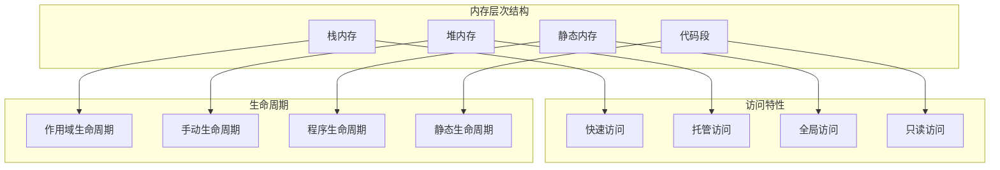

# 3.1.1 Rust内存布局语义模型深度分析

## 3.1.1.1 内存布局理论基础

### 3.1.1.1.1 内存模型的数学抽象

**定义 3.1.1.1** (内存布局语义域)
Rust的内存布局可建模为有序元组：
$$\text{MemoryLayout} = \langle \text{Address}, \text{Size}, \text{Alignment}, \text{Padding} \rangle$$

其中：
- $\text{Address} : \mathbb{N}$ - 内存地址空间
- $\text{Size} : \mathbb{N}$ - 类型大小（字节）
- $\text{Alignment} : 2^k, k \in \mathbb{N}$ - 对齐要求
- $\text{Padding} : \mathbb{N}$ - 填充字节数

**内存布局约束**：
$$\forall T: \text{Type}, \text{addr}(T) \equiv 0 \pmod{\text{align}(T)}$$

### 3.1.1.1.2 内存层次语义模型



---

## 3.1.1.2 基础类型内存布局

### 3.1.1.2.1 原始类型内存表示

**定理 3.1.1.1** (原始类型布局确定性)
Rust原始类型具有确定的内存布局：

| 类型 | 大小(字节) | 对齐(字节) | 表示方式 |
|------|-----------|-----------|----------|
| `i8`/`u8` | 1 | 1 | 8位整数 |
| `i16`/`u16` | 2 | 2 | 16位整数 |
| `i32`/`u32` | 4 | 4 | 32位整数 |
| `i64`/`u64` | 8 | 8 | 64位整数 |
| `i128`/`u128` | 16 | 16 | 128位整数 |
| `f32` | 4 | 4 | IEEE 754单精度 |
| `f64` | 8 | 8 | IEEE 754双精度 |
| `bool` | 1 | 1 | 0或1 |
| `char` | 4 | 4 | Unicode标量值 |

```rust
// 原始类型内存布局验证
fn primitive_memory_layout() {
    use std::mem;
    
    // 1. 验证大小和对齐
    assert_eq!(mem::size_of::<i32>(), 4);
    assert_eq!(mem::align_of::<i32>(), 4);
    
    assert_eq!(mem::size_of::<f64>(), 8);
    assert_eq!(mem::align_of::<f64>(), 8);
    
    assert_eq!(mem::size_of::<char>(), 4);
    assert_eq!(mem::align_of::<char>(), 4);
    
    // 2. 内存布局分析
    let value: i32 = 0x12345678;
    let bytes = unsafe {
        std::slice::from_raw_parts(
            &value as *const i32 as *const u8,
            mem::size_of::<i32>()
        )
    };
    
    // 小端序系统上的字节表示
    println!("i32 bytes: {:02X?}", bytes);
    
    // 3. 对齐验证
    let ptr = &value as *const i32 as usize;
    assert_eq!(ptr % mem::align_of::<i32>(), 0);
}
```

### 3.1.1.2.2 复合类型内存布局

**定义 3.1.1.2** (结构体布局规则)
结构体布局遵循以下规则：
1. **字段顺序**: 默认情况下保持声明顺序
2. **对齐填充**: 在字段间插入填充字节
3. **尾部填充**: 在结构体末尾添加填充以满足对齐

```rust
// 结构体内存布局示例
#[repr(C)]
struct ExampleStruct {
    a: u8,     // 偏移: 0, 大小: 1
    // 填充: 3字节
    b: u32,    // 偏移: 4, 大小: 4
    c: u16,    // 偏移: 8, 大小: 2
    // 填充: 2字节（为了整体对齐到4字节）
}

fn struct_memory_layout() {
    use std::mem;
    
    // 验证结构体布局
    assert_eq!(mem::size_of::<ExampleStruct>(), 12); // 包含填充
    assert_eq!(mem::align_of::<ExampleStruct>(), 4);  // 最大字段对齐
    
    // 字段偏移分析
    let example = ExampleStruct { a: 1, b: 2, c: 3 };
    let base_ptr = &example as *const ExampleStruct as usize;
    
    let a_offset = &example.a as *const u8 as usize - base_ptr;
    let b_offset = &example.b as *const u32 as usize - base_ptr;
    let c_offset = &example.c as *const u16 as usize - base_ptr;
    
    assert_eq!(a_offset, 0);
    assert_eq!(b_offset, 4);  // 包含3字节填充
    assert_eq!(c_offset, 8);
    
    println!("Struct layout: a@{}, b@{}, c@{}", a_offset, b_offset, c_offset);
}
```

---

## 3.1.1.3 内存表示属性 (repr)

### 3.1.1.3.1 repr(C) 语义

**定义 3.1.1.3** (C兼容布局)
`#[repr(C)]` 保证与C语言兼容的内存布局：
- 字段按声明顺序排列
- 使用C语言的对齐和填充规则
- 禁用Rust的布局优化

```rust
// C兼容布局示例
#[repr(C)]
struct CCompatible {
    x: i32,
    y: i8,
    z: i32,
}

#[repr(C)]
union CUnion {
    int_value: i32,
    float_value: f32,
    bytes: [u8; 4],
}

fn c_compatible_layout() {
    use std::mem;
    
    // C兼容结构体
    let c_struct = CCompatible { x: 1, y: 2, z: 3 };
    
    // 验证C布局特性
    assert_eq!(mem::size_of::<CCompatible>(), 12); // 4 + 1 + 3(填充) + 4
    
    // C兼容联合体
    let mut c_union = CUnion { int_value: 0x12345678 };
    
    unsafe {
        println!("Union as int: 0x{:08X}", c_union.int_value);
        println!("Union as float: {}", c_union.float_value);
        println!("Union as bytes: {:02X?}", c_union.bytes);
    }
}
```

### 3.1.1.3.2 repr(packed) 语义

**定义 3.1.1.4** (紧凑布局)
`#[repr(packed)]` 移除所有填充，实现最紧凑的内存布局：

```rust
// 紧凑布局示例
#[repr(packed)]
struct PackedStruct {
    a: u8,     // 偏移: 0
    b: u32,    // 偏移: 1 (无填充)
    c: u16,    // 偏移: 5 (无填充)
}

fn packed_layout() {
    use std::mem;
    
    let packed = PackedStruct { a: 1, b: 2, c: 3 };
    
    // 紧凑布局特性
    assert_eq!(mem::size_of::<PackedStruct>(), 7); // 1 + 4 + 2, 无填充
    assert_eq!(mem::align_of::<PackedStruct>(), 1); // 最小对齐
    
    // 注意：访问未对齐字段可能导致性能问题
    unsafe {
        let base_ptr = &packed as *const PackedStruct as *const u8;
        let b_ptr = base_ptr.add(1) as *const u32;
        
        // 在某些架构上，这可能需要特殊处理
        let b_value = std::ptr::read_unaligned(b_ptr);
        assert_eq!(b_value, 2);
    }
}
```

### 3.1.1.3.3 repr(align) 语义

**定义 3.1.1.5** (强制对齐)
`#[repr(align(N))]` 强制类型使用指定的对齐：

```rust
// 强制对齐示例
#[repr(align(16))]
struct AlignedStruct {
    data: [u8; 12],
}

#[repr(align(64))]
struct CacheLineAligned {
    counter: u64,
    data: [u8; 56], // 填充到64字节
}

fn alignment_semantics() {
    use std::mem;
    
    // 验证强制对齐
    assert_eq!(mem::align_of::<AlignedStruct>(), 16);
    assert_eq!(mem::size_of::<AlignedStruct>(), 16); // 填充到对齐边界
    
    // 缓存行对齐
    assert_eq!(mem::align_of::<CacheLineAligned>(), 64);
    assert_eq!(mem::size_of::<CacheLineAligned>(), 64);
    
    // 验证实际对齐
    let aligned = AlignedStruct { data: [0; 12] };
    let ptr = &aligned as *const AlignedStruct as usize;
    assert_eq!(ptr % 16, 0);
    
    let cache_aligned = CacheLineAligned { counter: 0, data: [0; 56] };
    let cache_ptr = &cache_aligned as *const CacheLineAligned as usize;
    assert_eq!(cache_ptr % 64, 0);
}
```

---

## 3.1.1.4 枚举类型内存布局

### 3.1.1.4.1 判别式布局

**定义 3.1.1.6** (枚举内存布局)
枚举的内存布局包含判别式和数据部分：
$$\text{EnumLayout} = \text{Discriminant} + \max(\text{VariantSizes}) + \text{Padding}$$

```rust
// 枚举内存布局示例
#[derive(Debug)]
enum ExampleEnum {
    Unit,                           // 无数据
    Single(i32),                    // 4字节数据
    Tuple(i32, i16),               // 6字节数据
    Struct { x: i64, y: i8 },      // 9字节数据
}

fn enum_memory_layout() {
    use std::mem;
    
    // 枚举大小分析
    println!("Enum size: {}", mem::size_of::<ExampleEnum>());
    println!("Enum alignment: {}", mem::align_of::<ExampleEnum>());
    
    // 不同变体的内存使用
    let variants = [
        ExampleEnum::Unit,
        ExampleEnum::Single(42),
        ExampleEnum::Tuple(1, 2),
        ExampleEnum::Struct { x: 100, y: 1 },
    ];
    
    for variant in &variants {
        unsafe {
            let discriminant = std::ptr::read(variant as *const _ as *const u8);
            println!("Variant {:?}: discriminant = {}", variant, discriminant);
        }
    }
}
```

### 3.1.1.4.2 空指针优化

**定理 3.1.1.2** (空指针优化)
对于 `Option<&T>` 和 `Option<Box<T>>`，Rust进行空指针优化：
$$\text{size}(\text{Option}\langle\&T\rangle) = \text{size}(\&T)$$

```rust
// 空指针优化示例
fn null_pointer_optimization() {
    use std::mem;
    
    // Option<&T> 优化
    assert_eq!(
        mem::size_of::<Option<&i32>>(),
        mem::size_of::<&i32>()
    );
    
    // Option<Box<T>> 优化
    assert_eq!(
        mem::size_of::<Option<Box<i32>>>(),
        mem::size_of::<Box<i32>>()
    );
    
    // Option<NonZeroU32> 优化
    use std::num::NonZeroU32;
    assert_eq!(
        mem::size_of::<Option<NonZeroU32>>(),
        mem::size_of::<NonZeroU32>()
    );
    
    // 验证优化机制
    let some_ref: Option<&i32> = Some(&42);
    let none_ref: Option<&i32> = None;
    
    println!("Some ref: {:p}", some_ref.as_ref().unwrap());
    println!("None ref represents null pointer");
}
```

---

## 3.1.1.5 动态大小类型 (DST)

### 3.1.1.5.1 切片内存布局

**定义 3.1.1.7** (切片布局语义)
切片 `[T]` 是动态大小类型，其引用包含指针和长度：
$$\&[T] = \langle \text{data\_ptr} : *\text{const } T, \text{len} : \text{usize} \rangle$$

```rust
// 切片内存布局示例
fn slice_memory_layout() {
    use std::mem;
    
    let array = [1, 2, 3, 4, 5];
    let slice: &[i32] = &array[1..4];
    
    // 切片引用的大小
    assert_eq!(mem::size_of_val(&slice), 2 * mem::size_of::<usize>());
    
    // 解构切片引用
    let slice_ptr = slice.as_ptr();
    let slice_len = slice.len();
    
    println!("Slice ptr: {:p}", slice_ptr);
    println!("Slice len: {}", slice_len);
    
    // 重建切片
    let reconstructed = unsafe {
        std::slice::from_raw_parts(slice_ptr, slice_len)
    };
    
    assert_eq!(slice, reconstructed);
}
```

### 3.1.1.5.2 trait对象内存布局

**定义 3.1.1.8** (trait对象布局)
trait对象包含数据指针和虚函数表指针：
$$\&\text{dyn Trait} = \langle \text{data\_ptr} : *\text{mut } (), \text{vtable\_ptr} : *\text{const VTable} \rangle$$

```rust
// trait对象内存布局示例
trait Display {
    fn display(&self) -> String;
}

impl Display for i32 {
    fn display(&self) -> String {
        format!("i32: {}", self)
    }
}

impl Display for String {
    fn display(&self) -> String {
        format!("String: {}", self)
    }
}

fn trait_object_layout() {
    use std::mem;
    
    let int_value = 42i32;
    let string_value = "hello".to_string();
    
    // trait对象大小
    let trait_obj1: &dyn Display = &int_value;
    let trait_obj2: &dyn Display = &string_value;
    
    assert_eq!(mem::size_of_val(&trait_obj1), 2 * mem::size_of::<usize>());
    assert_eq!(mem::size_of_val(&trait_obj2), 2 * mem::size_of::<usize>());
    
    // 虚函数表信息
    println!("TraitObj1 display: {}", trait_obj1.display());
    println!("TraitObj2 display: {}", trait_obj2.display());
    
    // 内存布局分析
    unsafe {
        let raw_trait_obj = std::mem::transmute::<&dyn Display, (usize, usize)>(trait_obj1);
        println!("Data ptr: 0x{:x}, VTable ptr: 0x{:x}", raw_trait_obj.0, raw_trait_obj.1);
    }
}
```

---

## 3.1.1.6 内存对齐优化

### 3.1.1.6.1 字段重排序

**定理 3.1.1.3** (最优字段排序)
编译器可以重排字段以最小化结构体大小：

```rust
// 字段重排序示例
struct Unoptimized {
    a: u8,    // 1字节
    b: u64,   // 8字节，需要7字节填充
    c: u8,    // 1字节
    d: u32,   // 4字节，需要3字节填充
}

// 手动优化的布局
struct Optimized {
    b: u64,   // 8字节
    d: u32,   // 4字节
    a: u8,    // 1字节
    c: u8,    // 1字节，共2字节，需要2字节填充
}

fn field_reordering_optimization() {
    use std::mem;
    
    println!("Unoptimized size: {}", mem::size_of::<Unoptimized>()); // 24字节
    println!("Optimized size: {}", mem::size_of::<Optimized>());     // 16字节
    
    // 空间节省
    let savings = mem::size_of::<Unoptimized>() - mem::size_of::<Optimized>();
    println!("Space saved: {} bytes ({:.1}%)", 
             savings, 
             savings as f64 / mem::size_of::<Unoptimized>() as f64 * 100.0);
}
```

### 3.1.1.6.2 缓存友好布局

```rust
// 缓存友好布局示例
#[repr(align(64))] // CPU缓存行大小
struct CacheFriendlyStruct {
    // 热数据：经常访问的字段
    hot_counter: u64,
    hot_flag: bool,
    _padding1: [u8; 7],
    
    // 中等热度数据
    medium_data: [u32; 4],
    _padding2: [u8; 32],
    
    // 冷数据：很少访问的字段
    // (放在另一个缓存行)
}

fn cache_friendly_layout() {
    use std::mem;
    
    let cache_struct = CacheFriendlyStruct {
        hot_counter: 0,
        hot_flag: false,
        _padding1: [0; 7],
        medium_data: [0; 4],
        _padding2: [0; 32],
    };
    
    // 验证缓存行对齐
    let ptr = &cache_struct as *const _ as usize;
    assert_eq!(ptr % 64, 0);
    
    // 热数据在同一缓存行
    let hot_counter_ptr = &cache_struct.hot_counter as *const _ as usize;
    let hot_flag_ptr = &cache_struct.hot_flag as *const _ as usize;
    
    assert_eq!(hot_counter_ptr / 64, hot_flag_ptr / 64); // 同一缓存行
}
```

---

## 3.1.1.7 内存布局分析工具

### 3.1.1.7.1 编译时布局检查

```rust
// 编译时布局验证宏
macro_rules! assert_layout {
    ($type:ty, size: $size:expr, align: $align:expr) => {
        const _: () = {
            use std::mem;
            assert!(mem::size_of::<$type>() == $size);
            assert!(mem::align_of::<$type>() == $align);
        };
    };
}

// 使用布局检查
struct TestStruct {
    a: u32,
    b: u16,
}

assert_layout!(TestStruct, size: 8, align: 4);
assert_layout!(i64, size: 8, align: 8);
```

### 3.1.1.7.2 运行时布局分析

```rust
// 运行时布局分析工具
fn analyze_layout<T>() {
    use std::mem;
    
    println!("Type: {}", std::any::type_name::<T>());
    println!("Size: {} bytes", mem::size_of::<T>());
    println!("Alignment: {} bytes", mem::align_of::<T>());
    
    // 计算浪费的空间
    let efficiency = mem::size_of::<T>() as f64 / 
                    (mem::size_of::<T>() + mem::align_of::<T>() - 1) as f64;
    println!("Space efficiency: {:.1}%", efficiency * 100.0);
}

fn layout_analysis_examples() {
    analyze_layout::<u8>();
    analyze_layout::<(u8, u32)>();
    analyze_layout::<[u8; 3]>();
    analyze_layout::<Option<&i32>>();
}
```

---

## 3.1.1.8 跨引用网络

### 3.1.1.8.1 内部引用
- [类型系统语义](../01_type_system_semantics/01_primitive_types_semantics.md) - 基础类型内存表示
- [栈堆语义](./02_stack_heap_semantics.md) - 内存分配机制
- [所有权系统语义](../04_ownership_system_semantics/01_ownership_rules_semantics.md) - 内存安全保证

### 3.1.1.8.2 外部引用
- [并发内存模型](../../03_concurrency_semantics/01_concurrency_model_semantics/04_memory_ordering_semantics.md) - 并发内存语义
- [性能语义](../../07_cross_layer_analysis/02_performance_semantic_analysis/01_memory_performance_semantics.md) - 内存性能分析
- [安全语义](../../07_cross_layer_analysis/03_safety_semantic_analysis/01_memory_safety_semantics.md) - 内存安全验证

---

## 3.1.1.9 理论前沿与发展方向

### 3.1.1.9.1 高级内存优化
1. **自适应布局**: 根据使用模式动态优化布局
2. **NUMA感知**: 针对NUMA架构的内存布局优化
3. **压缩指针**: 在64位系统上使用32位指针

### 3.1.1.9.2 形式化验证
1. **布局不变式**: 自动验证内存布局不变式
2. **对齐证明**: 编译时证明内存对齐正确性
3. **缓存模型**: 形式化缓存行为模型

---

## 3.1.1.10 实际应用案例

### 3.1.1.10.1 高性能数据结构

```rust
// 高性能数组布局
#[repr(C)]
struct SoALayout {
    // Structure of Arrays - 缓存友好
    xs: Vec<f32>,
    ys: Vec<f32>,
    zs: Vec<f32>,
}

#[repr(C)]
struct AoSLayout {
    // Array of Structures - 传统布局
    points: Vec<Point3D>,
}

#[repr(C)]
struct Point3D {
    x: f32,
    y: f32,
    z: f32,
}

fn performance_layout_comparison() {
    const N: usize = 1_000_000;
    
    // SoA布局：对于向量化操作更友好
    let soa = SoALayout {
        xs: vec![1.0; N],
        ys: vec![2.0; N], 
        zs: vec![3.0; N],
    };
    
    // AoS布局：对于单点操作更友好
    let aos = AoSLayout {
        points: vec![Point3D { x: 1.0, y: 2.0, z: 3.0 }; N],
    };
    
    // 性能测试框架
    println!("SoA memory usage: {} bytes", 
             std::mem::size_of_val(&soa.xs) * 3);
    println!("AoS memory usage: {} bytes", 
             std::mem::size_of_val(&aos.points));
}
```

### 3.1.1.10.2 内存池分配器

```rust
// 自定义内存布局的分配器
use std::alloc::{Layout, alloc, dealloc};
use std::ptr::NonNull;

struct MemoryPool {
    memory: NonNull<u8>,
    layout: Layout,
    capacity: usize,
    used: usize,
}

impl MemoryPool {
    fn new(size: usize, align: usize) -> Result<Self, std::alloc::AllocError> {
        let layout = Layout::from_size_align(size, align).unwrap();
        
        unsafe {
            let memory = NonNull::new(alloc(layout))
                .ok_or(std::alloc::AllocError)?;
            
            Ok(MemoryPool {
                memory,
                layout,
                capacity: size,
                used: 0,
            })
        }
    }
    
    fn allocate<T>(&mut self) -> Option<NonNull<T>> {
        let type_layout = Layout::new::<T>();
        
        // 检查对齐和大小
        if self.used + type_layout.size() <= self.capacity {
            unsafe {
                let ptr = self.memory.as_ptr().add(self.used) as *mut T;
                self.used += type_layout.size();
                
                // 确保对齐
                let aligned_ptr = ((ptr as usize + type_layout.align() - 1) 
                                  & !(type_layout.align() - 1)) as *mut T;
                NonNull::new(aligned_ptr)
            }
        } else {
            None
        }
    }
}

impl Drop for MemoryPool {
    fn drop(&mut self) {
        unsafe {
            dealloc(self.memory.as_ptr(), self.layout);
        }
    }
}
```

---

## 3.1.1.11 持续改进与版本追踪

### 3.1.1.11.1 文档版本
- **版本**: v1.0.0
- **创建日期**: 2024-12-30
- **最后更新**: 2024-12-30
- **状态**: 核心内容完成

### 3.1.1.11.2 改进计划
- [ ] 添加更多repr属性分析
- [ ] 深化SIMD类型布局研究
- [ ] 完善动态大小类型处理
- [ ] 增加跨平台布局差异分析

---

> **链接网络**: [内存模型语义索引](./00_memory_model_semantics_index.md) | [基础语义层总览](../00_foundation_semantics_index.md) | [核心理论框架](../../00_core_theory_index.md) 