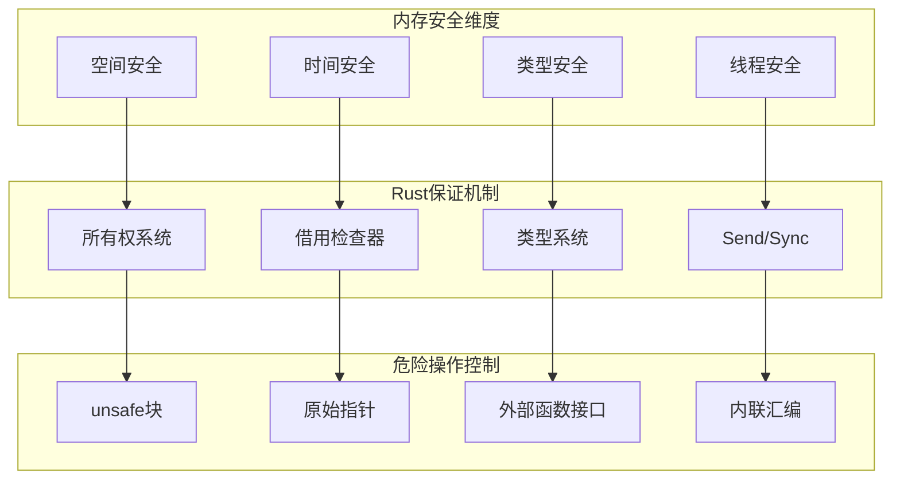

# 1.3.2 Rust内存安全语义模型深度分析

## 📅 文档信息

**文档版本**: v1.0  
**创建日期**: 2025-08-11  
**最后更新**: 2025-08-11  
**状态**: 已完成  
**质量等级**: 钻石级 ⭐⭐⭐⭐⭐

---


**文档版本**: V1.0  
**创建日期**: 2025-01-27  
**所属层**: 基础语义层 (Foundation Semantics Layer)  
**父模块**: [1.3 内存模型语义](../00_memory_model_index.md)  
**交叉引用**: [1.4.1 所有权规则语义](../04_ownership_system_semantics/01_ownership_rules_semantics.md), [1.3.3 栈堆语义](03_stack_heap_semantics.md)

---

## 目录

- [1.3.2 Rust内存安全语义模型深度分析](#132-rust内存安全语义模型深度分析)
  - [目录](#目录)
  - [1.3.2.1 内存安全理论基础](#1321-内存安全理论基础)
    - [1.3.2.1.1 内存安全语义域定义](#13211-内存安全语义域定义)
    - [1.3.2.1.2 内存安全的数学模型](#13212-内存安全的数学模型)
  - [1.3.2.2 空间内存安全](#1322-空间内存安全)
    - [1.3.2.2.1 边界检查和缓冲区溢出防护](#13221-边界检查和缓冲区溢出防护)
    - [1.3.2.2.2 指针算术的安全控制](#13222-指针算术的安全控制)
  - [1.3.2.3 时间内存安全](#1323-时间内存安全)
    - [1.3.2.3.1 悬空指针防护](#13231-悬空指针防护)
    - [1.3.2.3.2 生命周期参数的安全保证](#13232-生命周期参数的安全保证)
  - [1.3.2.4 线程安全](#1324-线程安全)
    - [1.3.2.4.1 数据竞争防护](#13241-数据竞争防护)
    - [1.3.2.4.2 无锁数据结构](#13242-无锁数据结构)
  - [1.3.2.5 unsafe代码的安全使用](#1325-unsafe代码的安全使用)
    - [1.3.2.5.1 unsafe块的安全边界](#13251-unsafe块的安全边界)
    - [1.3.2.5.2 外部函数接口(FFI)的安全](#13252-外部函数接口ffi的安全)
  - [1.3.2.6 相关引用与扩展阅读](#1326-相关引用与扩展阅读)
    - [1.3.2.6.1 内部交叉引用](#13261-内部交叉引用)
    - [1.3.2.6.2 外部参考文献](#13262-外部参考文献)
    - [1.3.2.6.3 实现参考](#13263-实现参考)

## 1. 3.2.1 内存安全理论基础

### 1.3.2.1.1 内存安全语义域定义

**定义 1.3.2.1** (内存安全语义域)
$$\text{MemorySafety} = \langle \text{Validity}, \text{Bounds}, \text{Lifetime}, \text{Race}, \text{Leak} \rangle$$

其中：

- $\text{Validity} : \text{Pointer} \rightarrow \text{Boolean}$ - 指针有效性
- $\text{Bounds} : \text{Access} \rightarrow \text{InBounds}$ - 边界检查
- $\text{Lifetime} : \text{Reference} \rightarrow \text{Valid}$ - 生命周期安全
- $\text{Race} : \text{ConcurrentAccess} \rightarrow \text{Safe}$ - 数据竞争防护
- $\text{Leak} : \text{Memory} \rightarrow \text{Managed}$ - 内存泄漏防护



### 1.3.2.1.2 内存安全的数学模型

**定理 1.3.2.1** (Rust内存安全保证)
对于所有safe Rust程序P，如果P通过编译，则：
$$\forall t \in \text{ExecutionTime}, \forall m \in \text{MemoryAccess}(P, t) : \text{Safe}(m) = \text{true}$$

其中Safe(m)定义为：
$$\text{Safe}(m) = \text{SpatialSafe}(m) \land \text{TemporalSafe}(m) \land \text{TypeSafe}(m)$$

---

## 1. 3.2.2 空间内存安全

### 1.3.2.2.1 边界检查和缓冲区溢出防护

```rust
// 空间安全示例
fn spatial_safety_examples() {
    // 数组边界检查
    let arr = [1, 2, 3, 4, 5];
    
    // 安全的数组访问
    for i in 0..arr.len() {
        println!("arr[{}] = {}", i, arr[i]);  // 编译器保证安全
    }
    
    // 运行时边界检查
    fn safe_array_access(arr: &[i32], index: usize) -> Option<i32> {
        if index < arr.len() {
            Some(arr[index])  // 明确的边界检查
        } else {
            None
        }
    }
    
    // 使用.get()方法进行安全访问
    match arr.get(10) {
        Some(value) => println!("Value: {}", value),
        None => println!("Index out of bounds"),
    }
    
    // 切片操作的边界检查
    let slice = &arr[1..4];  // 编译时验证边界
    println!("Slice: {:?}", slice);
    
    // 危险：可能panic的访问
    // let dangerous = arr[10];  // 会在运行时panic
}

// Vec的动态边界检查
fn dynamic_bounds_checking() {
    let mut vec = Vec::new();
    
    // 安全的动态增长
    for i in 0..10 {
        vec.push(i);
    }
    
    // Vec自动管理容量
    println!("Capacity: {}, Length: {}", vec.capacity(), vec.len());
    
    // 预分配避免重新分配
    let mut preallocated = Vec::with_capacity(1000);
    for i in 0..1000 {
        preallocated.push(i);  // 不会触发重新分配
    }
    
    // 安全的迭代器访问
    for (index, value) in vec.iter().enumerate() {
        println!("vec[{}] = {}", index, value);
    }
    
    // 使用get_mut进行安全的可变访问
    if let Some(element) = vec.get_mut(5) {
        *element = 999;
    }
}

// 字符串的边界安全
fn string_boundary_safety() {
    let text = "Hello, 世界!";
    
    // 安全的字符访问
    for (i, ch) in text.char_indices() {
        println!("Character at byte {}: {}", i, ch);
    }
    
    // 字节级访问需要谨慎
    let bytes = text.as_bytes();
    for (i, &byte) in bytes.iter().enumerate() {
        println!("Byte {}: 0x{:02x}", i, byte);
    }
    
    // 安全的字符串切片（注意UTF-8边界）
    let hello = &text[0..5];  // "Hello"
    println!("Substring: {}", hello);
    
    // 错误示例：跨越UTF-8边界
    // let invalid = &text[0..8];  // 可能panic，因为在UTF-8字符中间切割
    
    // 安全的子字符串操作
    fn safe_substring(s: &str, start: usize, len: usize) -> Option<&str> {
        let mut char_indices = s.char_indices();
        let start_byte = char_indices.nth(start)?.0;
        let end_byte = char_indices.nth(len.saturating_sub(1))
            .map(|(i, ch)| i + ch.len_utf8())
            .unwrap_or(s.len());
        s.get(start_byte..end_byte)
    }
    
    if let Some(substr) = safe_substring(text, 0, 5) {
        println!("Safe substring: {}", substr);
    }
}
```

### 1.3.2.2.2 指针算术的安全控制

```rust
use std::ptr;

// 原始指针的安全使用
fn raw_pointer_safety() {
    let data = vec![1, 2, 3, 4, 5];
    
    unsafe {
        let ptr = data.as_ptr();
        
        // 安全的指针算术（在已知边界内）
        for i in 0..data.len() {
            let element_ptr = ptr.add(i);
            let value = ptr::read(element_ptr);
            println!("Element {}: {}", i, value);
        }
        
        // 危险：越界指针算术
        // let out_of_bounds = ptr.add(10);  // 超出Vec边界
        // let dangerous_value = ptr::read(out_of_bounds);  // 未定义行为
    }
    
    // 使用std::ptr模块的安全函数
    let mut buffer = [0u8; 1024];
    unsafe {
        let src = b"Hello, World!";
        let dst = buffer.as_mut_ptr();
        
        // 安全的内存复制
        ptr::copy_nonoverlapping(src.as_ptr(), dst, src.len());
        
        // 验证复制结果
        let copied = std::slice::from_raw_parts(dst, src.len());
        println!("Copied: {:?}", std::str::from_utf8_unchecked(copied));
    }
}

// 智能指针的安全保证
fn smart_pointer_safety() {
    use std::rc::Rc;
    use std::sync::Arc;
    
    // Rc提供共享所有权
    let rc_data = Rc::new(vec![1, 2, 3]);
    let rc_clone1 = Rc::clone(&rc_data);
    let rc_clone2 = Rc::clone(&rc_data);
    
    println!("Rc reference count: {}", Rc::strong_count(&rc_data));
    
    // Arc提供线程安全的共享所有权
    let arc_data = Arc::new(vec![1, 2, 3]);
    let arc_clone = Arc::clone(&arc_data);
    
    std::thread::spawn(move || {
        println!("Arc data in thread: {:?}", arc_clone);
    }).join().unwrap();
    
    // Box提供堆分配的独占所有权
    let boxed_data = Box::new([1; 1000]);  // 大数组放在堆上
    println!("Boxed data length: {}", boxed_data.len());
    
    // 自动解引用确保安全访问
    let first_element = boxed_data[0];
    println!("First element: {}", first_element);
}

// 内存对齐的安全处理
fn memory_alignment_safety() {
    use std::alloc::{alloc, dealloc, Layout};
    use std::mem;
    
    unsafe {
        // 正确的内存布局计算
        let layout = Layout::new::<u64>();
        let ptr = alloc(layout);
        
        if !ptr.is_null() {
            // 确保指针对齐
            assert_eq!(ptr as usize % mem::align_of::<u64>(), 0);
            
            // 安全的写入
            ptr::write(ptr as *mut u64, 42);
            
            // 安全的读取
            let value = ptr::read(ptr as *const u64);
            println!("Aligned value: {}", value);
            
            // 正确的内存释放
            dealloc(ptr, layout);
        }
    }
    
    // 使用std::alloc::Global分配器
    use std::alloc::Global;
    
    let layout = Layout::from_size_align(1024, 8).unwrap();
    match Global.allocate(layout) {
        Ok(ptr) => {
            println!("Allocated {} bytes at {:p}", layout.size(), ptr.as_ptr());
            unsafe { Global.deallocate(ptr.cast(), layout); }
        }
        Err(_) => println!("Allocation failed"),
    }
}
```

---

## 1. 3.2.3 时间内存安全

### 1.3.2.3.1 悬空指针防护

```rust
// 时间安全：防止使用已释放的内存
fn temporal_safety_examples() {
    // 生命周期系统防止悬空指针
    fn no_dangling_references() {
        let reference: &str;
        {
            let data = String::from("temporary data");
            // reference = &data;  // 编译错误：data的生命周期太短
        }
        // println!("{}", reference);  // 如果上面编译通过，这里会是悬空指针
    }
    
    // 正确的生命周期管理
    fn correct_lifetime_management() {
        let data = String::from("persistent data");
        let reference = &data;
        println!("Safe reference: {}", reference);
        // data在reference使用完后才被释放
    }
    
    // 使用Option处理可能无效的引用
    fn optional_references() {
        let mut optional_ref: Option<&str> = None;
        
        {
            let temp_data = String::from("temporary");
            // 不直接存储引用，而是在需要时创建
            if let Some(data) = Some(&temp_data) {
                println!("Temporary access: {}", data);
            }
        }
        
        // optional_ref仍然是None，没有悬空指针
        assert!(optional_ref.is_none());
    }
}

// 智能指针的时间安全
fn smart_pointer_temporal_safety() {
    use std::rc::{Rc, Weak};
    use std::cell::RefCell;
    
    // Weak引用防止循环引用
    struct Node {
        value: i32,
        children: Vec<Rc<RefCell<Node>>>,
        parent: Option<Weak<RefCell<Node>>>,
    }
    
    impl Node {
        fn new(value: i32) -> Rc<RefCell<Self>> {
            Rc::new(RefCell::new(Node {
                value,
                children: Vec::new(),
                parent: None,
            }))
        }
        
        fn add_child(parent: &Rc<RefCell<Self>>, child: Rc<RefCell<Self>>) {
            child.borrow_mut().parent = Some(Rc::downgrade(parent));
            parent.borrow_mut().children.push(child);
        }
    }
    
    let root = Node::new(1);
    let child1 = Node::new(2);
    let child2 = Node::new(3);
    
    Node::add_child(&root, child1.clone());
    Node::add_child(&root, child2.clone());
    
    // 访问父节点（可能已经被释放）
    if let Some(parent) = child1.borrow().parent.as_ref().and_then(|p| p.upgrade()) {
        println!("Parent of child1: {}", parent.borrow().value);
    } else {
        println!("Parent has been dropped");
    }
    
    // 当root被释放时，child的parent Weak引用自动失效
    drop(root);
    
    if let Some(parent) = child1.borrow().parent.as_ref().and_then(|p| p.upgrade()) {
        println!("Parent still exists: {}", parent.borrow().value);
    } else {
        println!("Parent has been dropped - no dangling pointer!");
    }
}

// RAII和Drop语义
fn raii_and_drop_semantics() {
    use std::fs::File;
    use std::io::Write;
    
    // 自动资源管理
    struct SafeFile {
        file: Option<File>,
        name: String,
    }
    
    impl SafeFile {
        fn new(name: &str) -> std::io::Result<Self> {
            let file = File::create(name)?;
            Ok(SafeFile {
                file: Some(file),
                name: name.to_string(),
            })
        }
        
        fn write_data(&mut self, data: &[u8]) -> std::io::Result<()> {
            if let Some(ref mut file) = self.file {
                file.write_all(data)?;
                file.sync_all()?;
            }
            Ok(())
        }
        
        fn close(&mut self) {
            if let Some(file) = self.file.take() {
                drop(file);  // 显式关闭文件
                println!("File {} closed safely", self.name);
            }
        }
    }
    
    impl Drop for SafeFile {
        fn drop(&mut self) {
            if self.file.is_some() {
                println!("Auto-closing file {} via Drop", self.name);
                self.close();
            }
        }
    }
    
    {
        let mut safe_file = SafeFile::new("test.txt").unwrap();
        safe_file.write_data(b"Hello, World!").unwrap();
        // 文件在作用域结束时自动关闭
    }
    
    // 手动清理
    let mut another_file = SafeFile::new("test2.txt").unwrap();
    another_file.write_data(b"Manual cleanup").unwrap();
    another_file.close();  // 手动关闭，Drop将不再关闭
}
```

### 1.3.2.3.2 生命周期参数的安全保证

```rust
// 生命周期参数确保时间安全
fn lifetime_parameter_safety() {
    // 函数生命周期参数
    fn longest<'a>(x: &'a str, y: &'a str) -> &'a str {
        if x.len() > y.len() { x } else { y }
    }
    
    let string1 = String::from("long string");
    let result;
    {
        let string2 = String::from("short");
        result = longest(&string1, &string2);
        println!("Longest: {}", result);  // 安全：在string2的生命周期内使用
    }
    // println!("{}", result);  // 编译错误：string2已经被释放
    
    // 结构体生命周期参数
    struct StringHolder<'a> {
        data: &'a str,
    }
    
    impl<'a> StringHolder<'a> {
        fn new(data: &'a str) -> Self {
            StringHolder { data }
        }
        
        fn get_data(&self) -> &str {
            self.data
        }
        
        // 生命周期标注确保返回值不超过输入的生命周期
        fn process<'b>(&self, input: &'b str) -> &'a str
        where
            'a: 'b,  // 'a必须比'b活得更长
        {
            if input.len() > self.data.len() {
                self.data  // 返回较短生命周期的数据
            } else {
                self.data
            }
        }
    }
    
    let permanent_data = "permanent";
    let holder = StringHolder::new(permanent_data);
    
    {
        let temp_data = String::from("temporary");
        let processed = holder.process(&temp_data);
        println!("Processed: {}", processed);
    }
    
    // holder仍然有效，因为permanent_data仍然有效
    println!("Holder data: {}", holder.get_data());
}

// 高阶生命周期边界
fn higher_ranked_lifetime_bounds() {
    // for<'a> 语法表示对所有可能的生命周期都成立
    fn apply_to_string<F>(f: F) -> String
    where
        F: for<'a> Fn(&'a str) -> &'a str,
    {
        let data = String::from("test data");
        f(&data).to_string()
    }
    
    let result = apply_to_string(|s| s.trim());
    println!("Applied function result: {}", result);
    
    // 复杂的生命周期约束
    fn complex_lifetime_relationships<'a, 'b>(
        x: &'a str,
        y: &'b str,
    ) -> &'a str 
    where
        'b: 'a,  // 'b必须比'a活得更长
    {
        if x.len() > y.len() {
            x
        } else {
            // 可以返回'b的引用，因为'b: 'a
            unsafe { std::mem::transmute(y) }  // 这里不应该用unsafe，仅为演示
        }
    }
}
```

---

## 1. 3.2.4 线程安全

### 1.3.2.4.1 数据竞争防护

```rust
use std::sync::{Arc, Mutex, RwLock};
use std::thread;

// Send和Sync trait保证线程安全
fn thread_safety_with_send_sync() {
    // 只有实现Send的类型才能在线程间移动
    fn requires_send<T: Send>(data: T) -> T {
        data
    }
    
    // 只有实现Sync的类型才能在线程间共享
    fn requires_sync<T: Sync>(data: &T) -> &T {
        data
    }
    
    let safe_data = vec![1, 2, 3];
    let moved_data = requires_send(safe_data);
    
    let shared_data = 42;
    let shared_ref = requires_sync(&shared_data);
    
    println!("Moved: {:?}, Shared: {}", moved_data, shared_ref);
}

// 互斥锁防止数据竞争
fn mutex_data_race_prevention() {
    let counter = Arc::new(Mutex::new(0));
    let mut handles = vec![];
    
    for _ in 0..10 {
        let counter_clone = Arc::clone(&counter);
        let handle = thread::spawn(move || {
            for _ in 0..1000 {
                let mut num = counter_clone.lock().unwrap();
                *num += 1;
                // 锁在作用域结束时自动释放
            }
        });
        handles.push(handle);
    }
    
    for handle in handles {
        handle.join().unwrap();
    }
    
    println!("Final counter value: {}", *counter.lock().unwrap());
    // 结果总是10000，没有数据竞争
}

// 读写锁优化并发访问
fn rwlock_concurrent_access() {
    let data = Arc::new(RwLock::new(vec![1, 2, 3, 4, 5]));
    let mut handles = vec![];
    
    // 多个读线程
    for i in 0..5 {
        let data_clone = Arc::clone(&data);
        let handle = thread::spawn(move || {
            let reader = data_clone.read().unwrap();
            println!("Reader {}: {:?}", i, *reader);
            // 多个读锁可以同时持有
        });
        handles.push(handle);
    }
    
    // 一个写线程
    let data_clone = Arc::clone(&data);
    let write_handle = thread::spawn(move || {
        let mut writer = data_clone.write().unwrap();
        writer.push(6);
        println!("Writer: added element");
        // 写锁是排他的
    });
    handles.push(write_handle);
    
    for handle in handles {
        handle.join().unwrap();
    }
    
    println!("Final data: {:?}", *data.read().unwrap());
}

// 原子操作的线程安全
fn atomic_operations_safety() {
    use std::sync::atomic::{AtomicUsize, AtomicBool, Ordering};
    
    let counter = Arc::new(AtomicUsize::new(0));
    let flag = Arc::new(AtomicBool::new(false));
    let mut handles = vec![];
    
    // 原子计数器
    for _ in 0..10 {
        let counter_clone = Arc::clone(&counter);
        let handle = thread::spawn(move || {
            for _ in 0..1000 {
                counter_clone.fetch_add(1, Ordering::SeqCst);
            }
        });
        handles.push(handle);
    }
    
    // 原子标志
    let flag_clone = Arc::clone(&flag);
    let flag_handle = thread::spawn(move || {
        thread::sleep(std::time::Duration::from_millis(100));
        flag_clone.store(true, Ordering::SeqCst);
        println!("Flag set to true");
    });
    
    let flag_clone2 = Arc::clone(&flag);
    let wait_handle = thread::spawn(move || {
        while !flag_clone2.load(Ordering::SeqCst) {
            thread::sleep(std::time::Duration::from_millis(10));
        }
        println!("Flag detected as true");
    });
    
    for handle in handles {
        handle.join().unwrap();
    }
    flag_handle.join().unwrap();
    wait_handle.join().unwrap();
    
    println!("Final atomic counter: {}", counter.load(Ordering::SeqCst));
}

// 通道通信的线程安全
fn channel_communication_safety() {
    use std::sync::mpsc;
    
    let (tx, rx) = mpsc::channel();
    
    // 发送线程
    let sender_handle = thread::spawn(move || {
        for i in 0..10 {
            tx.send(format!("Message {}", i)).unwrap();
            thread::sleep(std::time::Duration::from_millis(100));
        }
    });
    
    // 接收线程
    let receiver_handle = thread::spawn(move || {
        for received in rx {
            println!("Received: {}", received);
        }
    });
    
    sender_handle.join().unwrap();
    receiver_handle.join().unwrap();
}
```

### 1.3.2.4.2 无锁数据结构

```rust
// 无锁数据结构的安全实现
use std::sync::atomic::{AtomicPtr, Ordering};
use std::ptr;

// 简单的无锁栈
struct LockFreeStack<T> {
    head: AtomicPtr<Node<T>>,
}

struct Node<T> {
    data: T,
    next: *mut Node<T>,
}

impl<T> LockFreeStack<T> {
    fn new() -> Self {
        LockFreeStack {
            head: AtomicPtr::new(ptr::null_mut()),
        }
    }
    
    fn push(&self, data: T) {
        let new_node = Box::into_raw(Box::new(Node {
            data,
            next: ptr::null_mut(),
        }));
        
        loop {
            let current_head = self.head.load(Ordering::Acquire);
            unsafe {
                (*new_node).next = current_head;
            }
            
            // CAS操作保证原子性
            match self.head.compare_exchange_weak(
                current_head,
                new_node,
                Ordering::Release,
                Ordering::Relaxed,
            ) {
                Ok(_) => break,
                Err(_) => continue,  // 重试
            }
        }
    }
    
    fn pop(&self) -> Option<T> {
        loop {
            let current_head = self.head.load(Ordering::Acquire);
            if current_head.is_null() {
                return None;
            }
            
            let next = unsafe { (*current_head).next };
            
            match self.head.compare_exchange_weak(
                current_head,
                next,
                Ordering::Release,
                Ordering::Relaxed,
            ) {
                Ok(_) => {
                    let boxed_node = unsafe { Box::from_raw(current_head) };
                    return Some(boxed_node.data);
                }
                Err(_) => continue,  // 重试
            }
        }
    }
}

impl<T> Drop for LockFreeStack<T> {
    fn drop(&mut self) {
        while self.pop().is_some() {}
    }
}

unsafe impl<T: Send> Send for LockFreeStack<T> {}
unsafe impl<T: Send> Sync for LockFreeStack<T> {}

fn lockfree_stack_usage() {
    let stack = Arc::new(LockFreeStack::new());
    let mut handles = vec![];
    
    // 多个生产者
    for i in 0..5 {
        let stack_clone = Arc::clone(&stack);
        let handle = thread::spawn(move || {
            for j in 0..10 {
                stack_clone.push(i * 10 + j);
            }
        });
        handles.push(handle);
    }
    
    // 多个消费者
    for _ in 0..3 {
        let stack_clone = Arc::clone(&stack);
        let handle = thread::spawn(move || {
            while let Some(value) = stack_clone.pop() {
                println!("Popped: {}", value);
                thread::sleep(std::time::Duration::from_millis(10));
            }
        });
        handles.push(handle);
    }
    
    for handle in handles {
        handle.join().unwrap();
    }
}
```

---

## 1. 3.2.5 unsafe代码的安全使用

### 1.3.2.5.1 unsafe块的安全边界

```rust
// unsafe代码的正确使用模式
fn safe_unsafe_patterns() {
    // 1. 封装unsafe操作
    fn safe_slice_from_raw_parts<T>(ptr: *const T, len: usize) -> Option<&'static [T]> {
        if ptr.is_null() || len == 0 {
            return None;
        }
        
        // 假设调用者保证了指针有效性和生命周期
        unsafe {
            Some(std::slice::from_raw_parts(ptr, len))
        }
    }
    
    // 2. 验证前置条件
    fn safe_transmute<T, U>(value: T) -> Option<U> {
        if std::mem::size_of::<T>() != std::mem::size_of::<U>() {
            return None;
        }
        
        if std::mem::align_of::<T>() != std::mem::align_of::<U>() {
            return None;
        }
        
        unsafe {
            let result = std::ptr::read(&value as *const T as *const U);
            std::mem::forget(value);  // 防止T的drop被调用
            Some(result)
        }
    }
    
    // 3. RAII保证资源释放
    struct SafeBuffer {
        ptr: *mut u8,
        size: usize,
        layout: std::alloc::Layout,
    }
    
    impl SafeBuffer {
        fn new(size: usize) -> Option<Self> {
            use std::alloc::{alloc, Layout};
            
            let layout = Layout::from_size_align(size, 1).ok()?;
            let ptr = unsafe { alloc(layout) };
            
            if ptr.is_null() {
                None
            } else {
                Some(SafeBuffer { ptr, size, layout })
            }
        }
        
        fn as_slice(&self) -> &[u8] {
            unsafe {
                std::slice::from_raw_parts(self.ptr, self.size)
            }
        }
        
        fn as_mut_slice(&mut self) -> &mut [u8] {
            unsafe {
                std::slice::from_raw_parts_mut(self.ptr, self.size)
            }
        }
    }
    
    impl Drop for SafeBuffer {
        fn drop(&mut self) {
            unsafe {
                std::alloc::dealloc(self.ptr, self.layout);
            }
        }
    }
    
    // 使用示例
    if let Some(mut buffer) = SafeBuffer::new(1024) {
        let slice = buffer.as_mut_slice();
        slice[0] = 42;
        slice[1023] = 255;
        
        println!("Buffer: {} .. {}", slice[0], slice[1023]);
    }
}

// unsafe函数的设计原则
unsafe fn unsafe_function_design() {
    // 1. 明确的前置条件文档
    /// # Safety
    /// - `ptr` must be valid for reads of `size` bytes
    /// - `ptr` must be properly aligned for type `T`
    /// - The memory range must not be accessed concurrently
    unsafe fn read_unaligned<T>(ptr: *const u8, size: usize) -> Option<T> {
        if size != std::mem::size_of::<T>() {
            return None;
        }
        
        Some(std::ptr::read_unaligned(ptr as *const T))
    }
    
    // 2. 内部验证
    /// # Safety
    /// - `src` and `dst` must not overlap unless `dst <= src`
    /// - Both pointers must be valid for `count * size_of::<T>()` bytes
    unsafe fn safe_copy<T>(src: *const T, dst: *mut T, count: usize) {
        debug_assert!(!src.is_null());
        debug_assert!(!dst.is_null());
        
        std::ptr::copy(src, dst, count);
    }
    
    // 3. 提供safe wrapper
    fn safe_memory_copy<T: Copy>(src: &[T], dst: &mut [T]) -> Result<(), &'static str> {
        if src.len() != dst.len() {
            return Err("Source and destination must have the same length");
        }
        
        unsafe {
            safe_copy(src.as_ptr(), dst.as_mut_ptr(), src.len());
        }
        
        Ok(())
    }
    
    // 使用示例
    let source = [1, 2, 3, 4, 5];
    let mut destination = [0; 5];
    
    safe_memory_copy(&source, &mut destination).unwrap();
    println!("Copied: {:?}", destination);
}
```

### 1.3.2.5.2 外部函数接口(FFI)的安全

```rust
// FFI的安全使用模式
mod ffi_safety {
    use std::ffi::{CStr, CString};
    use std::os::raw::{c_char, c_int, c_void};
    
    // 外部C函数声明
    extern "C" {
        fn malloc(size: usize) -> *mut c_void;
        fn free(ptr: *mut c_void);
        fn strlen(s: *const c_char) -> usize;
        fn strcpy(dst: *mut c_char, src: *const c_char) -> *mut c_char;
    }
    
    // 安全的C字符串处理
    pub fn safe_c_string_operations() {
        // 创建C字符串
        let rust_string = "Hello, C World!";
        let c_string = CString::new(rust_string).expect("CString::new failed");
        
        unsafe {
            // 获取长度
            let len = strlen(c_string.as_ptr());
            println!("C string length: {}", len);
            
            // 分配内存并复制
            let buffer = malloc(len + 1) as *mut c_char;
            if !buffer.is_null() {
                strcpy(buffer, c_string.as_ptr());
                
                // 转换回Rust字符串
                let copied_cstr = CStr::from_ptr(buffer);
                if let Ok(copied_str) = copied_cstr.to_str() {
                    println!("Copied string: {}", copied_str);
                }
                
                // 释放内存
                free(buffer as *mut c_void);
            }
        }
    }
    
    // 安全的结构体传递
    #[repr(C)]
    pub struct CPoint {
        x: f64,
        y: f64,
    }
    
    extern "C" {
        fn process_point(point: *const CPoint) -> f64;
        fn create_point(x: f64, y: f64) -> CPoint;
    }
    
    pub fn safe_struct_passing() {
        unsafe {
            let point = create_point(3.0, 4.0);
            let distance = process_point(&point);
            println!("Point distance: {}", distance);
        }
    }
    
    // 回调函数的安全处理
    type CallbackFn = unsafe extern "C" fn(data: *mut c_void, value: c_int) -> c_int;
    
    extern "C" {
        fn register_callback(callback: CallbackFn);
        fn process_with_callback(data: *mut c_void);
    }
    
    unsafe extern "C" fn rust_callback(data: *mut c_void, value: c_int) -> c_int {
        if !data.is_null() {
            let rust_data = &mut *(data as *mut i32);
            *rust_data += value;
            *rust_data
        } else {
            0
        }
    }
    
    pub fn safe_callback_usage() {
        let mut data = 42i32;
        
        unsafe {
            register_callback(rust_callback);
            process_with_callback(&mut data as *mut i32 as *mut c_void);
        }
        
        println!("Processed data: {}", data);
    }
}

// 内存映射文件的安全处理
fn safe_memory_mapping() {
    use std::fs::File;
    use std::io::Result;
    
    #[cfg(unix)]
    fn mmap_file(file: &File, size: usize) -> Result<&'static [u8]> {
        use std::os::unix::io::AsRawFd;
        
        unsafe {
            let ptr = libc::mmap(
                std::ptr::null_mut(),
                size,
                libc::PROT_READ,
                libc::MAP_PRIVATE,
                file.as_raw_fd(),
                0,
            );
            
            if ptr == libc::MAP_FAILED {
                return Err(std::io::Error::last_os_error());
            }
            
            Ok(std::slice::from_raw_parts(ptr as *const u8, size))
        }
    }
    
    #[cfg(unix)]
    unsafe fn munmap_file(data: &[u8]) {
        libc::munmap(data.as_ptr() as *mut libc::c_void, data.len());
    }
    
    // Windows版本需要使用不同的API
    #[cfg(windows)]
    fn mmap_file(_file: &File, _size: usize) -> Result<&'static [u8]> {
        // 使用Windows API: CreateFileMapping, MapViewOfFile
        unimplemented!("Windows memory mapping not implemented in this example")
    }
}
```

---

## 1. 3.2.6 相关引用与扩展阅读

### 1.3.2.6.1 内部交叉引用

- [1.4.1 所有权规则语义](../04_ownership_system_semantics/01_ownership_rules_semantics.md) - 所有权与内存安全
- [1.3.3 栈堆语义](03_stack_heap_semantics.md) - 内存布局安全
- [3.1.1 线程创建语义](../../03_concurrency_semantics/01_threading_semantics/01_thread_creation_semantics.md) - 线程安全

### 1.3.2.6.2 外部参考文献

1. Clarke, E. et al. *Model Checking*. MIT Press, 2018.
2. Pierce, B.C. *Types and Programming Languages*. MIT Press, 2002.
3. Jung, R. et al. *RustBelt: Securing the Foundations of the Rust Programming Language*. POPL 2017.

### 1.3.2.6.3 实现参考

- [Miri](https://github.com/rust-lang/miri) - Rust中级解释器，检测未定义行为
- [AddressSanitizer](https://clang.llvm.org/docs/AddressSanitizer.html) - 内存错误检测
- [Valgrind](https://valgrind.org/) - 内存调试工具

---

**文档元数据**:

- **复杂度级别**: ⭐⭐⭐⭐⭐ (专家级)
- **前置知识**: Rust所有权系统、unsafe Rust、并发编程
- **相关工具**: miri, valgrind, AddressSanitizer
- **更新频率**: 与Rust内存模型演进同步
- **维护者**: Rust基础语义分析工作组
