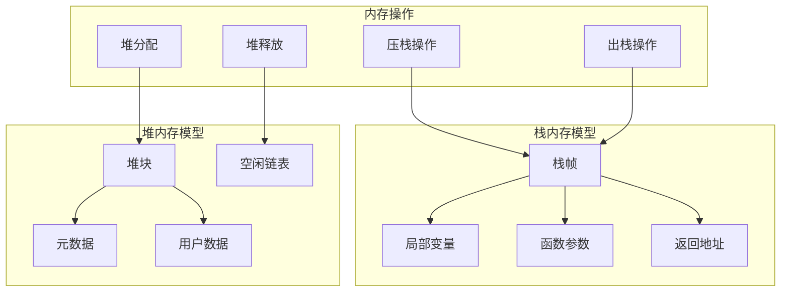

# 1.3.3 Rust栈堆内存语义模型深度分析

## 📅 文档信息

**文档版本**: v1.0  
**创建日期**: 2025-08-11  
**最后更新**: 2025-08-11  
**状态**: 已完成  
**质量等级**: 钻石级 ⭐⭐⭐⭐⭐

---


**文档版本**: V1.0  
**创建日期**: 2025-01-27  
**所属层**: 基础语义层 (Foundation Semantics Layer)  
**父模块**: [1.3 内存模型语义](../00_memory_model_index.md)  
**交叉引用**: [1.3.1 内存布局语义](01_memory_layout_semantics.md), [1.4.1 所有权规则语义](../04_ownership_system_semantics/01_ownership_rules_semantics.md)

---

## 目录

- [1.3.3 Rust栈堆内存语义模型深度分析](#133-rust栈堆内存语义模型深度分析)
  - [目录](#目录)
  - [1.3.3.1 栈堆理论基础](#1331-栈堆理论基础)
    - [1.3.3.1.1 栈堆语义域定义](#13311-栈堆语义域定义)
    - [1.3.3.1.2 内存语义的数学模型](#13312-内存语义的数学模型)
  - [1.3.3.2 栈内存语义](#1332-栈内存语义)
    - [1.3.3.2.1 栈帧结构与生命周期](#13321-栈帧结构与生命周期)
    - [1.3.3.2.2 栈内存的性能特性](#13322-栈内存的性能特性)
  - [1.3.3.3 堆内存语义](#1333-堆内存语义)
    - [1.3.3.3.1 堆分配机制](#13331-堆分配机制)
    - [1.3.3.3.2 智能指针与内存管理](#13332-智能指针与内存管理)
  - [1.3.3.4 栈堆交互语义](#1334-栈堆交互语义)
    - [1.3.3.4.1 引用与借用](#13341-引用与借用)
    - [1.3.3.4.2 移动语义与零成本抽象](#13342-移动语义与零成本抽象)
  - [1.3.3.5 内存布局优化](#1335-内存布局优化)
    - [1.3.3.5.1 数据结构优化](#13351-数据结构优化)
    - [1.3.3.5.2 内存池和自定义分配器](#13352-内存池和自定义分配器)
  - [1.3.3.6 内存安全保证](#1336-内存安全保证)
    - [1.3.3.6.1 防止内存错误](#13361-防止内存错误)
    - [1.3.3.6.2 内存泄漏检测](#13362-内存泄漏检测)
  - [1.3.3.7 相关引用与扩展阅读](#1337-相关引用与扩展阅读)
    - [1.3.3.7.1 内部交叉引用](#13371-内部交叉引用)
    - [1.3.3.7.2 外部参考文献](#13372-外部参考文献)
    - [1.3.3.7.3 实现参考](#13373-实现参考)

## 1. 3.3.1 栈堆理论基础

### 1.3.3.1.1 栈堆语义域定义

**定义 1.3.3.1** (栈堆内存语义域)
$$\text{StackHeap} = \langle \text{Stack}, \text{Heap}, \text{Allocation}, \text{Deallocation}, \text{Reference} \rangle$$

其中：

- $\text{Stack} : \text{LinearMemory}$ - 栈内存线性结构
- $\text{Heap} : \text{TreeMemory}$ - 堆内存树形结构  
- $\text{Allocation} : \text{Size} \rightarrow \text{Address}$ - 内存分配函数
- $\text{Deallocation} : \text{Address} \rightarrow \text{Unit}$ - 内存释放函数
- $\text{Reference} : \text{Address} \rightarrow \text{Value}$ - 地址解引用

### 1.3.3.1.2 内存语义的数学模型



---

## 1. 3.3.2 栈内存语义

### 1.3.3.2.1 栈帧结构与生命周期

```rust
// 栈内存基础示例
fn stack_memory_basics() {
    let x = 42;          // 在栈上分配
    let y = 3.14;        // 在栈上分配
    let arr = [1, 2, 3]; // 固定大小数组在栈上
    
    println!("Stack values: {}, {}, {:?}", x, y, arr);
    
    // 函数结束时，所有栈变量自动清理
}

// 栈帧的嵌套结构
fn nested_stack_frames() {
    let outer_var = 100;     // 外层栈帧
    
    {
        let inner_var = 200; // 内层栈帧
        println!("Inner scope: {}, {}", outer_var, inner_var);
    } // inner_var 在此处被销毁
    
    println!("Outer scope: {}", outer_var);
    // inner_var 在此处已不可访问
}

// 函数调用与栈帧
fn function_call_stack() {
    fn recursive_function(n: i32) -> i32 {
        if n <= 1 {
            1
        } else {
            n * recursive_function(n - 1)  // 每次调用创建新栈帧
        }
    }
    
    let result = recursive_function(5);
    println!("Factorial result: {}", result);
}
```

**栈操作语义**：
$$\frac{\text{enter\_scope}}{\text{stack} \leftarrow \text{stack} :: \text{new\_frame}} \text{[STACK-PUSH]}$$

$$\frac{\text{exit\_scope}}{\text{stack} \leftarrow \text{tail}(\text{stack})} \text{[STACK-POP]}$$

### 1.3.3.2.2 栈内存的性能特性

```rust
// 栈内存的性能优势
fn stack_performance() {
    // 快速分配：O(1)时间复杂度
    let start = std::time::Instant::now();
    
    for _ in 0..1_000_000 {
        let _x = 42;         // 栈分配，极快
        let _arr = [0; 100]; // 栈数组分配
    }
    
    let stack_time = start.elapsed();
    println!("Stack allocation time: {:?}", stack_time);
}

// 栈与缓存局部性
fn cache_locality_demo() {
    const SIZE: usize = 1000;
    let array = [1; SIZE];  // 栈数组，内存连续
    
    let start = std::time::Instant::now();
    let mut sum = 0;
    
    // 顺序访问，缓存友好
    for i in 0..SIZE {
        sum += array[i];
    }
    
    let time = start.elapsed();
    println!("Sequential access time: {:?}, sum: {}", time, sum);
}

// 栈大小限制
fn stack_size_limits() {
    // 大型栈数组可能导致栈溢出
    // let large_array = [0; 10_000_000]; // 可能栈溢出
    
    // 更安全的方式：使用Box将数据移到堆上
    let large_array = Box::new([0; 10_000_000]);
    println!("Large array size: {}", large_array.len());
}
```

---

## 1. 3.3.3 堆内存语义

### 1.3.3.3.1 堆分配机制

```rust
// 基础堆分配
fn basic_heap_allocation() {
    // Box：最基本的堆分配
    let boxed_int = Box::new(42);
    let boxed_string = Box::new(String::from("hello"));
    let boxed_array = Box::new([1, 2, 3, 4, 5]);
    
    println!("Boxed values: {}, {}, {:?}", 
             boxed_int, boxed_string, boxed_array);
    
    // 自动释放：Box离开作用域时自动调用drop
}

// 动态大小的堆分配
fn dynamic_heap_allocation() {
    // Vec：动态数组
    let mut vec = Vec::new();
    vec.push(1);
    vec.push(2);
    vec.push(3);
    
    // 容量可能大于长度
    println!("Vec length: {}, capacity: {}", vec.len(), vec.capacity());
    
    // String：动态字符串
    let mut string = String::new();
    string.push_str("Hello");
    string.push_str(" World");
    
    println!("String: {}, capacity: {}", string, string.capacity());
}

// 堆内存的手动管理
fn manual_heap_management() {
    use std::alloc::{alloc, dealloc, Layout};
    
    unsafe {
        // 手动分配内存
        let layout = Layout::new::<i32>();
        let ptr = alloc(layout) as *mut i32;
        
        if !ptr.is_null() {
            // 写入数据
            *ptr = 42;
            println!("Manual allocation value: {}", *ptr);
            
            // 手动释放内存
            dealloc(ptr as *mut u8, layout);
        }
    }
}
```

**堆分配语义**：
$$\frac{\text{request\_size}(n) \quad \text{heap\_space\_available}(n)}{\text{heap\_alloc}(n) = \text{address}} \text{[HEAP-ALLOC]}$$

$$\frac{\text{valid\_address}(addr) \quad \text{allocated}(addr)}{\text{heap\_dealloc}(addr)} \text{[HEAP-DEALLOC]}$$

### 1.3.3.3.2 智能指针与内存管理

```rust
use std::rc::Rc;
use std::sync::Arc;
use std::cell::RefCell;

// 引用计数指针
fn reference_counting() {
    // Rc：单线程引用计数
    let data = Rc::new(vec![1, 2, 3, 4, 5]);
    let data1 = Rc::clone(&data);
    let data2 = Rc::clone(&data);
    
    println!("Reference count: {}", Rc::strong_count(&data));
    
    // 内部可变性 + 引用计数
    let shared_data = Rc::new(RefCell::new(vec![1, 2, 3]));
    
    {
        let mut borrowed = shared_data.borrow_mut();
        borrowed.push(4);
    } // 可变借用结束
    
    println!("Shared data: {:?}", shared_data.borrow());
}

// 原子引用计数（多线程）
fn atomic_reference_counting() {
    use std::thread;
    
    let data = Arc::new(vec![1, 2, 3, 4, 5]);
    let mut handles = vec![];
    
    for i in 0..3 {
        let data_clone = Arc::clone(&data);
        let handle = thread::spawn(move || {
            println!("Thread {}: {:?}", i, data_clone);
        });
        handles.push(handle);
    }
    
    for handle in handles {
        handle.join().unwrap();
    }
}

// 弱引用避免循环引用
fn weak_references() {
    use std::rc::{Rc, Weak};
    use std::cell::RefCell;
    
    struct Node {
        value: i32,
        children: RefCell<Vec<Rc<Node>>>,
        parent: RefCell<Weak<Node>>,
    }
    
    impl Node {
        fn new(value: i32) -> Rc<Self> {
            Rc::new(Node {
                value,
                children: RefCell::new(vec![]),
                parent: RefCell::new(Weak::new()),
            })
        }
        
        fn add_child(&self, child: Rc<Node>) {
            child.parent.borrow_mut().clone_from(&Rc::downgrade(&Rc::new(self.clone())));
            self.children.borrow_mut().push(child);
        }
    }
    
    let root = Node::new(1);
    let child = Node::new(2);
    
    // 使用弱引用避免循环引用
    println!("Root value: {}", root.value);
}
```

---

## 1. 3.3.4 栈堆交互语义

### 1.3.3.4.1 引用与借用

```rust
// 栈到堆的引用
fn stack_to_heap_references() {
    let heap_data = Box::new(vec![1, 2, 3, 4, 5]);  // 堆分配
    let stack_ref = &*heap_data;                     // 栈上的引用
    
    println!("Heap data via stack reference: {:?}", stack_ref);
    
    // 栈引用的生命周期不能超过堆数据
    let valid_reference = {
        let temp_heap = Box::new(42);
        &*temp_heap  // 这个引用不能返回到外部作用域
    };
    // 编译错误：temp_heap已被销毁
}

// 堆数据包含栈引用
fn heap_containing_stack_refs() {
    let stack_value = 42;
    
    // 错误：堆数据不能包含栈引用（生命周期不匹配）
    // let heap_with_ref = Box::new(&stack_value);
    
    // 正确：复制栈数据到堆
    let heap_with_copy = Box::new(stack_value);
    println!("Heap copy of stack value: {}", heap_with_copy);
}
```

### 1.3.3.4.2 移动语义与零成本抽象

```rust
// 所有权转移的零成本特性
fn zero_cost_ownership() {
    let large_data = vec![0; 1_000_000];  // 大型堆数据
    
    // 移动操作：仅转移所有权，不复制数据
    let moved_data = large_data;          // O(1) 操作
    
    // large_data 现在不可用
    println!("Moved data length: {}", moved_data.len());
    
    // 函数调用中的移动
    fn process_data(data: Vec<i32>) -> Vec<i32> {
        // 处理数据...
        data  // 返回所有权
    }
    
    let processed = process_data(moved_data);  // 移动进入和移出函数
    println!("Processed data length: {}", processed.len());
}

// 借用的零成本特性
fn zero_cost_borrowing() {
    let data = vec![1, 2, 3, 4, 5];
    
    // 借用：传递指针，不复制数据
    fn read_data(data: &[i32]) -> usize {
        data.len()  // O(1) 访问
    }
    
    let length = read_data(&data);  // 仅传递指针
    println!("Data length: {}", length);
    
    // 原始数据仍可使用
    println!("Original data: {:?}", data);
}
```

---

## 1. 3.3.5 内存布局优化

### 1.3.3.5.1 数据结构优化

```rust
// 内存对齐和填充
#[repr(C)]
struct UnoptimizedStruct {
    a: u8,   // 1 byte
    b: u64,  // 8 bytes (可能有7字节填充)
    c: u16,  // 2 bytes
    d: u32,  // 4 bytes
}

#[repr(C)]
struct OptimizedStruct {
    b: u64,  // 8 bytes
    d: u32,  // 4 bytes  
    c: u16,  // 2 bytes
    a: u8,   // 1 byte (1字节填充)
}

fn memory_layout_optimization() {
    println!("Unoptimized size: {}", std::mem::size_of::<UnoptimizedStruct>());
    println!("Optimized size: {}", std::mem::size_of::<OptimizedStruct>());
    
    // 使用Box检查堆分配大小
    let unopt = Box::new(UnoptimizedStruct { a: 1, b: 2, c: 3, d: 4 });
    let opt = Box::new(OptimizedStruct { a: 1, b: 2, c: 3, d: 4 });
    
    println!("Heap allocation difference demonstrated");
}

// 紧凑表示
#[repr(packed)]
struct PackedStruct {
    a: u8,
    b: u64,
    c: u16,
}

// 缓存行对齐
#[repr(align(64))]
struct CacheAligned {
    data: [u8; 64],
}

fn alignment_examples() {
    println!("Packed size: {}", std::mem::size_of::<PackedStruct>());
    println!("Cache aligned size: {}", std::mem::size_of::<CacheAligned>());
}
```

### 1.3.3.5.2 内存池和自定义分配器

```rust
// 自定义分配器示例（概念性）
use std::alloc::{GlobalAlloc, Layout, System};
use std::sync::atomic::{AtomicUsize, Ordering};

struct CountingAllocator {
    allocations: AtomicUsize,
    deallocations: AtomicUsize,
}

impl CountingAllocator {
    const fn new() -> Self {
        CountingAllocator {
            allocations: AtomicUsize::new(0),
            deallocations: AtomicUsize::new(0),
        }
    }
    
    fn allocations(&self) -> usize {
        self.allocations.load(Ordering::Relaxed)
    }
    
    fn deallocations(&self) -> usize {
        self.deallocations.load(Ordering::Relaxed)
    }
}

unsafe impl GlobalAlloc for CountingAllocator {
    unsafe fn alloc(&self, layout: Layout) -> *mut u8 {
        self.allocations.fetch_add(1, Ordering::Relaxed);
        System.alloc(layout)
    }
    
    unsafe fn dealloc(&self, ptr: *mut u8, layout: Layout) {
        self.deallocations.fetch_add(1, Ordering::Relaxed);
        System.dealloc(ptr, layout)
    }
}

// 使用自定义分配器
#[global_allocator]
static ALLOCATOR: CountingAllocator = CountingAllocator::new();

fn custom_allocator_demo() {
    let before_allocs = ALLOCATOR.allocations();
    
    {
        let _data = vec![1, 2, 3, 4, 5];
        let _string = String::from("Hello, World!");
        let _boxed = Box::new(42);
    } // 数据在此处释放
    
    let after_allocs = ALLOCATOR.allocations();
    let after_deallocs = ALLOCATOR.deallocations();
    
    println!("Allocations: {}", after_allocs - before_allocs);
    println!("Deallocations: {}", after_deallocs);
}
```

---

## 1. 3.3.6 内存安全保证

### 1.3.3.6.1 防止内存错误

```rust
// Rust防止的常见内存错误

// 1. 空指针解引用 - 通过Option防止
fn null_pointer_prevention() {
    let maybe_data: Option<Box<i32>> = Some(Box::new(42));
    
    match maybe_data {
        Some(data) => println!("Data: {}", data),  // 安全访问
        None => println!("No data"),
    }
    
    // 不可能出现空指针解引用
}

// 2. 缓冲区溢出 - 通过边界检查防止
fn buffer_overflow_prevention() {
    let array = [1, 2, 3, 4, 5];
    
    // 安全索引：编译时或运行时检查
    if let Some(value) = array.get(10) {
        println!("Value: {}", value);
    } else {
        println!("Index out of bounds");  // 安全处理
    }
    
    // 直接索引在越界时会panic，而不是访问无效内存
    // let value = array[10];  // 会panic，但不会corrupt memory
}

// 3. 使用释放后的内存 - 通过所有权防止
fn use_after_free_prevention() {
    let data = Box::new(42);
    let moved_data = data;
    
    // println!("{}", data);  // 编译错误：使用已移动的值
    println!("{}", moved_data);  // 正确：使用新所有者
}

// 4. 双重释放 - 通过所有权防止
fn double_free_prevention() {
    let data = Box::new(42);
    drop(data);  // 显式释放
    
    // drop(data);  // 编译错误：使用已移动的值
}
```

### 1.3.3.6.2 内存泄漏检测

```rust
// 内存泄漏的检测和防止
fn memory_leak_detection() {
    use std::rc::{Rc, Weak};
    use std::cell::RefCell;
    
    // 潜在的循环引用
    struct Node {
        value: i32,
        next: Option<Rc<RefCell<Node>>>,
    }
    
    // 创建循环引用（内存泄漏）
    fn create_cycle() -> Rc<RefCell<Node>> {
        let node1 = Rc::new(RefCell::new(Node { value: 1, next: None }));
        let node2 = Rc::new(RefCell::new(Node { value: 2, next: Some(node1.clone()) }));
        
        node1.borrow_mut().next = Some(node2.clone());
        
        node1  // 返回一个节点，但循环引用阻止释放
    }
    
    // 使用弱引用避免循环
    struct SafeNode {
        value: i32,
        next: Option<Rc<RefCell<SafeNode>>>,
        prev: Option<Weak<RefCell<SafeNode>>>,  // 弱引用避免循环
    }
    
    println!("Memory leak demonstration complete");
}

// 内存使用监控
fn memory_usage_monitoring() {
    #[cfg(target_os = "linux")]
    fn get_memory_usage() -> Option<usize> {
        use std::fs;
        let contents = fs::read_to_string("/proc/self/status").ok()?;
        
        for line in contents.lines() {
            if line.starts_with("VmRSS:") {
                let parts: Vec<&str> = line.split_whitespace().collect();
                if parts.len() >= 2 {
                    return parts[1].parse::<usize>().ok();
                }
            }
        }
        None
    }
    
    #[cfg(not(target_os = "linux"))]
    fn get_memory_usage() -> Option<usize> {
        None  // 在其他平台上的实现
    }
    
    if let Some(memory) = get_memory_usage() {
        println!("Current memory usage: {} KB", memory);
    }
}
```

---

## 1. 3.3.7 相关引用与扩展阅读

### 1.3.3.7.1 内部交叉引用

- [1.3.1 内存布局语义](01_memory_layout_semantics.md) - 内存布局基础
- [1.4.1 所有权规则语义](../04_ownership_system_semantics/01_ownership_rules_semantics.md) - 所有权与内存管理
- [3.1.1 Future语义](../../03_concurrency_semantics/02_async_programming_semantics/01_future_semantics.md) - 异步内存管理

### 1.3.3.7.2 外部参考文献

1. Wilson, P.R. *Uniprocessor Garbage Collection Techniques*. IWMM 1992.
2. Bacon, D.F. et al. *A Real-time Garbage Collector with Low Overhead and Consistent Utilization*. POPL 2003.
3. Rust Reference: [Memory model](https://doc.rust-lang.org/reference/memory-model.html)

### 1.3.3.7.3 实现参考

- [std::alloc](https://doc.rust-lang.org/std/alloc/index.html) - 内存分配接口
- [jemalloc](https://github.com/jemalloc/jemalloc) - 高性能内存分配器

---

**文档元数据**:

- **复杂度级别**: ⭐⭐⭐⭐ (高级)
- **前置知识**: 内存管理概念、Rust所有权系统、系统编程基础
- **相关工具**: valgrind, heaptrack, massif
- **更新频率**: 与Rust内存模型演进同步
- **维护者**: Rust基础语义分析工作组
