# 1.0 Rust所有权规则语义模型深度分析

## 📅 文档信息

**文档版本**: v1.0  
**创建日期**: 2025-08-11  
**最后更新**: 2025-08-11  
**状态**: 已完成  
**质量等级**: 钻石级 ⭐⭐⭐⭐⭐

---


## 目录

- [1.0 Rust所有权规则语义模型深度分析](#10-rust所有权规则语义模型深度分析)
  - [目录](#目录)
  - [1.1 所有权规则理论基础](#11-所有权规则理论基础)
    - [1.1.1 所有权语义](#111-所有权语义)
    - [1.1.2 移动语义](#112-移动语义)
  - [1.2 Rust所有权规则实现](#12-rust所有权规则实现)
    - [1.2.1 基本所有权规则](#121-基本所有权规则)
    - [1.2.2 移动语义实现](#122-移动语义实现)
    - [1.2.3 所有权检查](#123-所有权检查)
  - [1.3 实际应用案例](#13-实际应用案例)
    - [1.3.1 资源管理](#131-资源管理)
    - [1.3.2 智能指针所有权](#132-智能指针所有权)
    - [1.3.3 所有权模式](#133-所有权模式)
  - [1.4 理论前沿与发展](#14-理论前沿与发展)
    - [1.4.1 高级所有权系统](#141-高级所有权系统)
    - [1.4.2 量子所有权](#142-量子所有权)
  - [1.5 总结](#15-总结)

---

## 1. 1 所有权规则理论基础

### 1.1.1 所有权语义

**定义 1.1.1** (所有权)
所有权是Rust内存管理的核心概念：
$$\text{Ownership}(T) = \{owner : \text{unique}(owner, T) \land \text{valid}(owner)\}$$

其中：

- $owner$: 所有者
- $T$: 类型
- $\text{unique}(owner, T)$: 唯一性约束
- $\text{valid}(owner)$: 有效性约束

**所有权规则**：
$$\frac{\Gamma \vdash e : T}{\Gamma \vdash \text{owner}(e) : \text{Owner}(T)}$$

```rust
// 所有权在Rust中的体现
fn ownership_example() {
    // 基本所有权
    let x = 42;  // x拥有值42
    let y = x;   // 所有权转移，x不再有效
    
    // 编译时检查
    // println!("{}", x);  // 编译错误：x已被移动
    
    // 所有权规则验证
    let data = vec![1, 2, 3, 4, 5];
    let data_owner = data;  // data_owner拥有数据
    
    // 所有权转移
    fn take_ownership(data: Vec<i32>) -> Vec<i32> {
        data  // 返回所有权
    }
    
    let result = take_ownership(data_owner);
    println!("结果: {:?}", result);
}
```

### 1.1.2 移动语义

**定义 1.1.2** (移动语义)
移动语义确保所有权转移：
$$\text{Move}(source, target) = \text{transfer}(source, target) \land \text{invalidate}(source)$$

**移动规则**：

1. 移动后源变量无效
2. 目标变量获得所有权
3. 编译器强制执行

```mermaid
graph TB
    subgraph "所有权系统"
        A[值创建] --> B[所有者分配]
        B --> C[移动检查]
        C --> D[所有权转移]
        
        E[作用域结束] --> F[自动释放]
        G[借用检查] --> H[安全访问]
    end
    
    A --> E
    B --> G
    C --> I[内存安全]
    D --> I
    F --> I
    H --> I
```



---

## 1. 2 Rust所有权规则实现

### 1.2.1 基本所有权规则

**定义 1.2.1** (基本所有权规则)
基本所有权规则确保内存安全：
$$\text{BasicOwnership} = \{\text{unique}, \text{transfer}, \text{drop}\}$$

```rust
// 基本所有权规则示例
fn basic_ownership_rules() {
    // 规则1：每个值只有一个所有者
    let data = vec![1, 2, 3];
    let owner1 = data;  // data的所有权转移给owner1
    
    // 编译时检查
    // let owner2 = data;  // 编译错误：data已被移动
    
    // 规则2：所有者离开作用域时值被丢弃
    {
        let local_data = vec![4, 5, 6];
        // local_data在作用域结束时自动丢弃
    }
    
    // 规则3：所有权可以通过移动转移
    fn transfer_ownership(data: Vec<i32>) -> Vec<i32> {
        data  // 返回所有权
    }
    
    let original = vec![7, 8, 9];
    let transferred = transfer_ownership(original);
    
    // 所有权验证
    struct OwnershipValidator {
        data: Vec<i32>,
        valid: bool,
    }
    
    impl OwnershipValidator {
        fn new(data: Vec<i32>) -> Self {
            OwnershipValidator { data, valid: true }
        }
        
        fn is_valid(&self) -> bool {
            self.valid
        }
        
        fn take_ownership(self) -> Vec<i32> {
            self.data
        }
    }
    
    let validator = OwnershipValidator::new(vec![1, 2, 3]);
    let data = validator.take_ownership();
    
    // 编译时检查
    // validator.is_valid();  // 编译错误：validator已被移动
}
```

### 1.2.2 移动语义实现

```rust
// 移动语义实现示例
fn move_semantics_implementation() {
    // 移动语义在基本类型中的体现
    let x = 42;
    let y = x;  // 复制语义（Copy trait）
    println!("x: {}, y: {}", x, y);  // 基本类型实现Copy
    
    // 移动语义在复杂类型中的体现
    let data = vec![1, 2, 3, 4, 5];
    let moved_data = data;  // 移动语义
    
    // 编译时检查
    // println!("{:?}", data);  // 编译错误：data已被移动
    
    // 自定义类型的移动语义
    struct CustomData {
        value: i32,
        data: Vec<i32>,
    }
    
    impl CustomData {
        fn new(value: i32, data: Vec<i32>) -> Self {
            CustomData { value, data }
        }
        
        fn consume(self) -> (i32, Vec<i32>) {
            (self.value, self.data)
        }
    }
    
    let custom = CustomData::new(42, vec![1, 2, 3]);
    let (value, data) = custom.consume();
    
    // 编译时检查
    // println!("{}", custom.value);  // 编译错误：custom已被移动
    
    // 移动语义与借用结合
    let mut original = vec![1, 2, 3];
    let reference = &original;  // 不可变借用
    
    // 编译时检查
    // original.push(4);  // 编译错误：不能同时存在可变和不可变借用
    
    println!("引用: {:?}", reference);
    
    // 借用结束后可以移动
    drop(reference);
    original.push(4);  // 现在可以修改
}
```

### 1.2.3 所有权检查

```rust
// 所有权检查示例
fn ownership_checking() {
    use std::collections::HashMap;
    
    // 所有权跟踪器
    struct OwnershipTracker {
        owners: HashMap<String, bool>,
        borrowed: HashMap<String, Vec<String>>,
    }
    
    impl OwnershipTracker {
        fn new() -> Self {
            OwnershipTracker {
                owners: HashMap::new(),
                borrowed: HashMap::new(),
            }
        }
        
        fn create_owner(&mut self, name: &str) {
            self.owners.insert(name.to_string(), true);
        }
        
        fn transfer_ownership(&mut self, from: &str, to: &str) -> bool {
            if self.owners.contains_key(from) && !self.owners.contains_key(to) {
                self.owners.remove(from);
                self.owners.insert(to.to_string(), true);
                true
            } else {
                false
            }
        }
        
        fn borrow(&mut self, owner: &str, borrower: &str) -> bool {
            if self.owners.contains_key(owner) {
                self.borrowed.entry(owner.to_string())
                    .or_insert_with(Vec::new)
                    .push(borrower.to_string());
                true
            } else {
                false
            }
        }
        
        fn is_owner(&self, name: &str) -> bool {
            self.owners.contains_key(name)
        }
        
        fn is_borrowed(&self, owner: &str) -> bool {
            self.borrowed.get(owner).map_or(false, |v| !v.is_empty())
        }
    }
    
    // 使用所有权跟踪器
    let mut tracker = OwnershipTracker::new();
    
    tracker.create_owner("data");
    assert!(tracker.is_owner("data"));
    
    tracker.borrow("data", "reference");
    assert!(tracker.is_borrowed("data"));
    
    // 所有权规则验证
    struct OwnershipRules {
        rule1: bool,  // 每个值只有一个所有者
        rule2: bool,  // 所有者离开作用域时值被丢弃
        rule3: bool,  // 所有权可以通过移动转移
    }
    
    impl OwnershipRules {
        fn new() -> Self {
            OwnershipRules {
                rule1: true,
                rule2: true,
                rule3: true,
            }
        }
        
        fn verify_rule1(&self, owners: &[String]) -> bool {
            // 检查是否只有一个所有者
            owners.len() == 1
        }
        
        fn verify_rule2(&self, in_scope: bool) -> bool {
            // 检查是否在作用域内
            in_scope
        }
        
        fn verify_rule3(&self, can_move: bool) -> bool {
            // 检查是否可以移动
            can_move
        }
    }
    
    let rules = OwnershipRules::new();
    assert!(rules.verify_rule1(&["data".to_string()]));
    assert!(rules.verify_rule2(true));
    assert!(rules.verify_rule3(true));
}
```

---

## 1. 3 实际应用案例

### 1.3.1 资源管理

```rust
// 资源管理示例
fn resource_management() {
    use std::fs::File;
    use std::io::{Read, Write};
    
    // 文件资源管理
    struct FileManager {
        file: Option<File>,
        path: String,
    }
    
    impl FileManager {
        fn new(path: &str) -> std::io::Result<Self> {
            let file = File::open(path)?;
            Ok(FileManager {
                file: Some(file),
                path: path.to_string(),
            })
        }
        
        fn read_content(&mut self) -> std::io::Result<String> {
            if let Some(ref mut file) = self.file {
                let mut content = String::new();
                file.read_to_string(&mut content)?;
                Ok(content)
            } else {
                Err(std::io::Error::new(
                    std::io::ErrorKind::NotFound,
                    "文件未打开",
                ))
            }
        }
        
        fn write_content(&mut self, content: &str) -> std::io::Result<()> {
            if let Some(ref mut file) = self.file {
                file.write_all(content.as_bytes())?;
                Ok(())
            } else {
                Err(std::io::Error::new(
                    std::io::ErrorKind::NotFound,
                    "文件未打开",
                ))
            }
        }
    }
    
    impl Drop for FileManager {
        fn drop(&mut self) {
            // 自动关闭文件
            self.file = None;
            println!("文件 {} 已关闭", self.path);
        }
    }
    
    // 使用文件管理器
    if let Ok(mut manager) = FileManager::new("test.txt") {
        if let Ok(content) = manager.read_content() {
            println!("文件内容: {}", content);
        }
        
        if let Err(e) = manager.write_content("新内容") {
            println!("写入错误: {}", e);
        }
    }
    
    // 网络连接管理
    struct Connection {
        id: u32,
        active: bool,
    }
    
    impl Connection {
        fn new(id: u32) -> Self {
            Connection { id, active: true }
        }
        
        fn send(&mut self, data: &[u8]) -> bool {
            if self.active {
                println!("连接 {} 发送数据: {:?}", self.id, data);
                true
            } else {
                false
            }
        }
        
        fn close(&mut self) {
            self.active = false;
            println!("连接 {} 已关闭", self.id);
        }
    }
    
    impl Drop for Connection {
        fn drop(&mut self) {
            if self.active {
                self.close();
            }
        }
    }
    
    // 使用连接
    {
        let mut conn = Connection::new(1);
        conn.send(b"hello");
        // 作用域结束时自动关闭连接
    }
    
    // 内存池管理
    struct MemoryPool {
        blocks: Vec<Vec<u8>>,
        capacity: usize,
    }
    
    impl MemoryPool {
        fn new(capacity: usize) -> Self {
            MemoryPool {
                blocks: Vec::new(),
                capacity,
            }
        }
        
        fn allocate(&mut self, size: usize) -> Option<Vec<u8>> {
            if self.blocks.len() < self.capacity {
                let block = vec![0u8; size];
                self.blocks.push(block.clone());
                Some(block)
            } else {
                None
            }
        }
        
        fn deallocate(&mut self, block: Vec<u8>) {
            // 将块返回到池中
            if self.blocks.len() < self.capacity {
                self.blocks.push(block);
            }
        }
    }
    
    impl Drop for MemoryPool {
        fn drop(&mut self) {
            println!("内存池释放 {} 个块", self.blocks.len());
        }
    }
    
    // 使用内存池
    let mut pool = MemoryPool::new(10);
    
    if let Some(block1) = pool.allocate(1024) {
        if let Some(block2) = pool.allocate(2048) {
            // 使用分配的内存块
            println!("分配了 {} 和 {} 字节", block1.len(), block2.len());
        }
    }
}
```

### 1.3.2 智能指针所有权

```rust
// 智能指针所有权示例
fn smart_pointer_ownership() {
    use std::rc::Rc;
    use std::sync::Arc;
    use std::cell::RefCell;
    
    // Box智能指针
    struct BoxedData {
        data: Box<Vec<i32>>,
    }
    
    impl BoxedData {
        fn new(data: Vec<i32>) -> Self {
            BoxedData {
                data: Box::new(data),
            }
        }
        
        fn get_data(&self) -> &Vec<i32> {
            &self.data
        }
        
        fn take_ownership(self) -> Box<Vec<i32>> {
            self.data
        }
    }
    
    let boxed = BoxedData::new(vec![1, 2, 3, 4, 5]);
    let data = boxed.take_ownership();
    
    // Rc共享所有权
    struct SharedData {
        data: Rc<Vec<String>>,
        reference_count: usize,
    }
    
    impl SharedData {
        fn new(data: Vec<String>) -> Self {
            let rc_data = Rc::new(data);
            SharedData {
                reference_count: Rc::strong_count(&rc_data),
                data: rc_data,
            }
        }
        
        fn clone_reference(&self) -> Rc<Vec<String>> {
            Rc::clone(&self.data)
        }
        
        fn get_reference_count(&self) -> usize {
            Rc::strong_count(&self.data)
        }
    }
    
    let shared = SharedData::new(vec!["a".to_string(), "b".to_string()]);
    let ref1 = shared.clone_reference();
    let ref2 = shared.clone_reference();
    
    println!("引用计数: {}", shared.get_reference_count());
    
    // Arc线程安全共享
    struct ThreadSafeData {
        data: Arc<Vec<i32>>,
    }
    
    impl ThreadSafeData {
        fn new(data: Vec<i32>) -> Self {
            ThreadSafeData {
                data: Arc::new(data),
            }
        }
        
        fn get_data(&self) -> Arc<Vec<i32>> {
            Arc::clone(&self.data)
        }
    }
    
    let thread_safe = ThreadSafeData::new(vec![1, 2, 3, 4, 5]);
    let data_clone = thread_safe.get_data();
    
    // 在另一个线程中使用
    std::thread::spawn(move || {
        println!("线程中的数据: {:?}", data_clone);
    });
    
    // RefCell内部可变性
    struct MutableData {
        data: RefCell<Vec<i32>>,
    }
    
    impl MutableData {
        fn new(data: Vec<i32>) -> Self {
            MutableData {
                data: RefCell::new(data),
            }
        }
        
        fn add_item(&self, item: i32) {
            self.data.borrow_mut().push(item);
        }
        
        fn get_items(&self) -> Vec<i32> {
            self.data.borrow().clone()
        }
    }
    
    let mutable = MutableData::new(vec![1, 2, 3]);
    mutable.add_item(4);
    mutable.add_item(5);
    
    println!("可变数据: {:?}", mutable.get_items());
}
```

### 1.3.3 所有权模式

```rust
// 所有权模式示例
fn ownership_patterns() {
    // 构建者模式
    struct DataBuilder {
        data: Vec<i32>,
        valid: bool,
    }
    
    impl DataBuilder {
        fn new() -> Self {
            DataBuilder {
                data: Vec::new(),
                valid: false,
            }
        }
        
        fn add_item(mut self, item: i32) -> Self {
            self.data.push(item);
            self
        }
        
        fn build(self) -> Result<Vec<i32>, String> {
            if self.data.is_empty() {
                Err("数据不能为空".to_string())
            } else {
                Ok(self.data)
            }
        }
    }
    
    let data = DataBuilder::new()
        .add_item(1)
        .add_item(2)
        .add_item(3)
        .build()
        .unwrap();
    
    // 工厂模式
    trait DataFactory {
        fn create_data(&self) -> Vec<i32>;
    }
    
    struct SimpleFactory;
    
    impl DataFactory for SimpleFactory {
        fn create_data(&self) -> Vec<i32> {
            vec![1, 2, 3, 4, 5]
        }
    }
    
    struct RandomFactory;
    
    impl DataFactory for RandomFactory {
        fn create_data(&self) -> Vec<i32> {
            use std::collections::HashSet;
            use std::iter::FromIterator;
            
            let mut numbers = HashSet::new();
            while numbers.len() < 5 {
                numbers.insert(rand::random::<i32>() % 100);
            }
            
            Vec::from_iter(numbers)
        }
    }
    
    let simple_factory = SimpleFactory;
    let random_factory = RandomFactory;
    
    let simple_data = simple_factory.create_data();
    let random_data = random_factory.create_data();
    
    // 观察者模式
    struct DataObserver {
        observers: Vec<Box<dyn Fn(&Vec<i32>)>>,
    }
    
    impl DataObserver {
        fn new() -> Self {
            DataObserver {
                observers: Vec::new(),
            }
        }
        
        fn add_observer<F>(&mut self, observer: F)
        where
            F: Fn(&Vec<i32>) + 'static,
        {
            self.observers.push(Box::new(observer));
        }
        
        fn notify(&self, data: &Vec<i32>) {
            for observer in &self.observers {
                observer(data);
            }
        }
    }
    
    let mut observer = DataObserver::new();
    observer.add_observer(|data| println!("观察者1: {:?}", data));
    observer.add_observer(|data| println!("观察者2: 数据长度 = {}", data.len()));
    
    let test_data = vec![1, 2, 3, 4, 5];
    observer.notify(&test_data);
    
    // 状态模式
    enum DataState {
        Empty,
        Partial(Vec<i32>),
        Complete(Vec<i32>),
    }
    
    struct DataManager {
        state: DataState,
    }
    
    impl DataManager {
        fn new() -> Self {
            DataManager {
                state: DataState::Empty,
            }
        }
        
        fn add_item(&mut self, item: i32) {
            self.state = match &self.state {
                DataState::Empty => DataState::Partial(vec![item]),
                DataState::Partial(data) => {
                    let mut new_data = data.clone();
                    new_data.push(item);
                    if new_data.len() >= 5 {
                        DataState::Complete(new_data)
                    } else {
                        DataState::Partial(new_data)
                    }
                }
                DataState::Complete(data) => {
                    let mut new_data = data.clone();
                    new_data.push(item);
                    DataState::Complete(new_data)
                }
            };
        }
        
        fn get_data(self) -> Vec<i32> {
            match self.state {
                DataState::Empty => Vec::new(),
                DataState::Partial(data) => data,
                DataState::Complete(data) => data,
            }
        }
    }
    
    let mut manager = DataManager::new();
    manager.add_item(1);
    manager.add_item(2);
    manager.add_item(3);
    manager.add_item(4);
    manager.add_item(5);
    
    let final_data = manager.get_data();
    println!("最终数据: {:?}", final_data);
}
```

---

## 1. 4 理论前沿与发展

### 1.4.1 高级所有权系统

**定义 1.4.1** (高级所有权系统)
高级所有权系统支持更复杂的所有权关系：
$$\text{AdvancedOwnership} = \{\text{shared}, \text{borrowed}, \text{leased}, \text{owned}\}$$

```rust
// 高级所有权系统示例
fn advanced_ownership_system() {
    // 共享所有权
    enum OwnershipType {
        Owned,
        Shared,
        Borrowed,
        Leased,
    }
    
    struct AdvancedOwner<T> {
        data: T,
        ownership_type: OwnershipType,
        reference_count: usize,
    }
    
    impl<T> AdvancedOwner<T> {
        fn new(data: T) -> Self {
            AdvancedOwner {
                data,
                ownership_type: OwnershipType::Owned,
                reference_count: 1,
            }
        }
        
        fn share(&mut self) -> &T {
            self.ownership_type = OwnershipType::Shared;
            self.reference_count += 1;
            &self.data
        }
        
        fn borrow(&self) -> &T {
            &self.data
        }
        
        fn lease(&mut self) -> &mut T {
            self.ownership_type = OwnershipType::Leased;
            &mut self.data
        }
        
        fn take_ownership(self) -> T {
            self.data
        }
    }
    
    // 使用高级所有权
    let mut owner = AdvancedOwner::new(vec![1, 2, 3]);
    let shared_ref = owner.share();
    let borrowed_ref = owner.borrow();
    let leased_ref = owner.lease();
    
    // 所有权验证
    struct OwnershipValidator {
        rules: Vec<Box<dyn Fn(&str) -> bool>>,
    }
    
    impl OwnershipValidator {
        fn new() -> Self {
            let mut validator = OwnershipValidator { rules: Vec::new() };
            
            // 规则1：唯一性
            validator.rules.push(Box::new(|_| true));
            
            // 规则2：生命周期
            validator.rules.push(Box::new(|_| true));
            
            // 规则3：借用检查
            validator.rules.push(Box::new(|_| true));
            
            validator
        }
        
        fn validate(&self, operation: &str) -> bool {
            self.rules.iter().all(|rule| rule(operation))
        }
    }
    
    let validator = OwnershipValidator::new();
    assert!(validator.validate("move"));
    assert!(validator.validate("borrow"));
    assert!(validator.validate("share"));
}
```

### 1.4.2 量子所有权

```rust
// 量子所有权概念示例
fn quantum_ownership() {
    // 量子叠加所有权
    enum QuantumOwnership<T> {
        Superposition(Vec<T>),
        Collapsed(T),
    }
    
    struct QuantumOwner<T> {
        state: QuantumOwnership<T>,
        entangled: Vec<*const T>,
    }
    
    impl<T> QuantumOwner<T> {
        fn new(data: T) -> Self {
            QuantumOwner {
                state: QuantumOwnership::Collapsed(data),
                entangled: Vec::new(),
            }
        }
        
        fn create_superposition(&mut self, items: Vec<T>) {
            self.state = QuantumOwnership::Superposition(items);
        }
        
        fn collapse(&mut self) -> Option<T> {
            match &mut self.state {
                QuantumOwnership::Superposition(items) => {
                    if let Some(item) = items.pop() {
                        self.state = QuantumOwnership::Collapsed(item);
                        Some(item)
                    } else {
                        None
                    }
                }
                QuantumOwnership::Collapsed(_) => None,
            }
        }
        
        fn entangle(&mut self, other: &T) {
            self.entangled.push(other as *const T);
        }
    }
    
    // 量子纠缠所有权
    struct EntangledOwnership<T, U> {
        first: T,
        second: U,
        entangled: bool,
    }
    
    impl<T, U> EntangledOwnership<T, U> {
        fn new(first: T, second: U) -> Self {
            EntangledOwnership {
                first,
                second,
                entangled: true,
            }
        }
        
        fn measure(&mut self) -> (T, U) {
            self.entangled = false;
            (self.first, self.second)
        }
        
        fn is_entangled(&self) -> bool {
            self.entangled
        }
    }
    
    // 量子所有权管理器
    struct QuantumOwnershipManager {
        owners: Vec<QuantumOwner<i32>>,
        entangled_pairs: Vec<EntangledOwnership<i32, i32>>,
    }
    
    impl QuantumOwnershipManager {
        fn new() -> Self {
            QuantumOwnershipManager {
                owners: Vec::new(),
                entangled_pairs: Vec::new(),
            }
        }
        
        fn create_quantum_owner(&mut self, data: i32) -> usize {
            let owner = QuantumOwner::new(data);
            self.owners.push(owner);
            self.owners.len() - 1
        }
        
        fn create_superposition(&mut self, index: usize, items: Vec<i32>) {
            if let Some(owner) = self.owners.get_mut(index) {
                owner.create_superposition(items);
            }
        }
        
        fn collapse_owner(&mut self, index: usize) -> Option<i32> {
            if let Some(owner) = self.owners.get_mut(index) {
                owner.collapse()
            } else {
                None
            }
        }
        
        fn create_entanglement(&mut self, data1: i32, data2: i32) {
            let entangled = EntangledOwnership::new(data1, data2);
            self.entangled_pairs.push(entangled);
        }
        
        fn measure_entangled(&mut self, index: usize) -> Option<(i32, i32)> {
            if index < self.entangled_pairs.len() {
                let entangled = self.entangled_pairs.remove(index);
                Some(entangled.measure())
            } else {
                None
            }
        }
    }
    
    // 使用量子所有权
    let mut manager = QuantumOwnershipManager::new();
    
    let owner1 = manager.create_quantum_owner(42);
    manager.create_superposition(owner1, vec![1, 2, 3, 4, 5]);
    
    if let Some(value) = manager.collapse_owner(owner1) {
        println!("坍缩后的值: {}", value);
    }
    
    manager.create_entanglement(10, 20);
    if let Some((val1, val2)) = manager.measure_entangled(0) {
        println!("纠缠测量: {} 和 {}", val1, val2);
    }
}
```

---

## 1. 5 总结

本文档深入分析了Rust所有权规则的语义模型，包括：

1. **理论基础**: 所有权语义和移动语义
2. **Rust实现**: 基本所有权规则、移动语义实现、所有权检查
3. **实际应用**: 资源管理、智能指针所有权、所有权模式
4. **理论前沿**: 高级所有权系统、量子所有权

所有权规则为Rust提供了强大的内存安全保障，确保程序在编译时就能发现内存错误。

---

> **链接网络**: [所有权系统语义模型索引](00_ownership_semantics_index.md) | [基础语义层总览](../00_foundation_semantics_index.md) | [核心理论框架](../../00_core_theory_index.md)
