# 2.0 Rust借用语义模型深度分析

## 📅 文档信息

**文档版本**: v1.0  
**创建日期**: 2025-08-11  
**最后更新**: 2025-08-11  
**状态**: 已完成  
**质量等级**: 钻石级 ⭐⭐⭐⭐⭐

---


## 目录

- [2.0 Rust借用语义模型深度分析](#20-rust借用语义模型深度分析)
  - [目录](#目录)
  - [2.1 借用理论基础](#21-借用理论基础)
    - [2.1.1 借用语义](#211-借用语义)
    - [2.1.2 借用检查语义](#212-借用检查语义)
  - [2.2 Rust借用实现](#22-rust借用实现)
    - [2.2.1 不可变借用](#221-不可变借用)
    - [2.2.2 可变借用](#222-可变借用)
    - [2.2.3 借用生命周期](#223-借用生命周期)
  - [2.3 实际应用案例](#23-实际应用案例)
    - [2.3.1 数据结构借用](#231-数据结构借用)
    - [2.3.2 迭代器借用](#232-迭代器借用)
    - [2.3.3 并发借用](#233-并发借用)
  - [2.4 理论前沿与发展](#24-理论前沿与发展)
    - [2.4.1 高级借用系统](#241-高级借用系统)
    - [2.4.2 量子借用](#242-量子借用)
  - [2.5 总结](#25-总结)

---

## 2. 1 借用理论基础

### 2.1.1 借用语义

**定义 2.1.1** (借用)
借用是临时获取值的引用而不获取所有权：
$$\text{Borrow}(T) = \{ref : \text{reference}(ref, T) \land \text{temporary}(ref)\}$$

其中：

- $ref$: 引用
- $T$: 类型
- $\text{reference}(ref, T)$: 引用关系
- $\text{temporary}(ref)$: 临时性约束

**借用规则**：
$$\frac{\Gamma \vdash e : T}{\Gamma \vdash \text{borrow}(e) : \text{ref}(T)}$$

```rust
// 借用在Rust中的体现
fn borrowing_example() {
    // 基本借用
    let x = 42;
    let y = &x;  // y借用x的值
    
    // 编译时检查
    println!("x: {}, y: {}", x, y);  // 借用后原值仍可用
    
    // 借用规则验证
    let data = vec![1, 2, 3, 4, 5];
    let data_ref = &data;  // 不可变借用
    
    // 借用期间不能移动原值
    // let moved_data = data;  // 编译错误：data被借用
    
    println!("借用数据: {:?}", data_ref);
    
    // 借用结束后可以移动
    drop(data_ref);
    let moved_data = data;  // 现在可以移动
}
```

### 2.1.2 借用检查语义

**定义 2.1.2** (借用检查)
借用检查确保引用安全：
$$\text{BorrowCheck}(ref) = \text{valid\_borrow}(ref) \land \text{no\_conflict}(ref)$$

**借用检查规则**：

1. 不能同时存在可变和不可变借用
2. 不能同时存在多个可变借用
3. 借用不能超过所有者生命周期

```mermaid
graph TB
    subgraph "借用系统"
        A[值创建] --> B[借用请求]
        B --> C[借用检查]
        C --> D[借用批准]
        
        E[借用使用] --> F[借用结束]
        G[冲突检测] --> H[借用拒绝]
    end
    
    A --> E
    B --> G
    C --> I[内存安全]
    D --> I
    F --> I
    H --> I
```



---

## 2. 2 Rust借用实现

### 2.2.1 不可变借用

**定义 2.2.1** (不可变借用)
不可变借用允许多个同时引用：
$$\text{ImmutableBorrow}(T) = \{refs : \forall ref \in refs. \text{immutable}(ref)\}$$

```rust
// 不可变借用示例
fn immutable_borrowing() {
    // 基本不可变借用
    let data = vec![1, 2, 3, 4, 5];
    let ref1 = &data;
    let ref2 = &data;  // 多个不可变借用
    
    println!("引用1: {:?}", ref1);
    println!("引用2: {:?}", ref2);
    
    // 不可变借用与所有权
    let owner = data;  // 借用结束后可以移动
    println!("所有者: {:?}", owner);
    
    // 不可变借用检查
    struct BorrowChecker {
        borrowed: bool,
        mutable_borrowed: bool,
    }
    
    impl BorrowChecker {
        fn new() -> Self {
            BorrowChecker {
                borrowed: false,
                mutable_borrowed: false,
            }
        }
        
        fn immutable_borrow(&mut self) -> bool {
            if !self.mutable_borrowed {
                self.borrowed = true;
                true
            } else {
                false
            }
        }
        
        fn mutable_borrow(&mut self) -> bool {
            if !self.borrowed && !self.mutable_borrowed {
                self.mutable_borrowed = true;
                true
            } else {
                false
            }
        }
        
        fn release_immutable(&mut self) {
            self.borrowed = false;
        }
        
        fn release_mutable(&mut self) {
            self.mutable_borrowed = false;
        }
    }
    
    let mut checker = BorrowChecker::new();
    assert!(checker.immutable_borrow());
    assert!(checker.immutable_borrow());  // 多个不可变借用
    assert!(!checker.mutable_borrow());   // 不能同时存在可变借用
    
    checker.release_immutable();
    checker.release_immutable();
    assert!(checker.mutable_borrow());    // 现在可以可变借用
}
```

### 2.2.2 可变借用

```rust
// 可变借用示例
fn mutable_borrowing() {
    // 基本可变借用
    let mut data = vec![1, 2, 3, 4, 5];
    let ref_mut = &mut data;
    
    // 可变借用允许修改
    ref_mut.push(6);
    ref_mut[0] = 10;
    
    println!("修改后: {:?}", ref_mut);
    
    // 可变借用限制
    let mut data = vec![1, 2, 3];
    
    // 编译时检查
    // let ref1 = &mut data;
    // let ref2 = &mut data;  // 编译错误：不能同时存在多个可变借用
    
    // 可变借用与不可变借用冲突
    // let ref1 = &data;
    // let ref2 = &mut data;  // 编译错误：不能同时存在可变和不可变借用
    
    // 可变借用实现
    struct MutableBorrowManager {
        data: Vec<i32>,
        mutable_borrowed: bool,
        immutable_borrowed: usize,
    }
    
    impl MutableBorrowManager {
        fn new(data: Vec<i32>) -> Self {
            MutableBorrowManager {
                data,
                mutable_borrowed: false,
                immutable_borrowed: 0,
            }
        }
        
        fn borrow_mut(&mut self) -> Option<&mut Vec<i32>> {
            if !self.mutable_borrowed && self.immutable_borrowed == 0 {
                self.mutable_borrowed = true;
                Some(&mut self.data)
            } else {
                None
            }
        }
        
        fn borrow(&mut self) -> Option<&Vec<i32>> {
            if !self.mutable_borrowed {
                self.immutable_borrowed += 1;
                Some(&self.data)
            } else {
                None
            }
        }
        
        fn release_mut(&mut self) {
            self.mutable_borrowed = false;
        }
        
        fn release(&mut self) {
            if self.immutable_borrowed > 0 {
                self.immutable_borrowed -= 1;
            }
        }
    }
    
    let mut manager = MutableBorrowManager::new(vec![1, 2, 3]);
    
    // 测试借用规则
    if let Some(ref_mut) = manager.borrow_mut() {
        ref_mut.push(4);
        manager.release_mut();
    }
    
    if let Some(ref_imm) = manager.borrow() {
        println!("不可变借用: {:?}", ref_imm);
        manager.release();
    }
}
```

### 2.2.3 借用生命周期

```rust
// 借用生命周期示例
fn borrowing_lifetime() {
    // 基本生命周期
    fn longest<'a>(x: &'a str, y: &'a str) -> &'a str {
        if x.len() > y.len() { x } else { y }
    }
    
    let s1 = "short";
    let s2 = "longer";
    let result = longest(s1, s2);
    
    // 生命周期推断
    fn first_word(s: &str) -> &str {
        s.split_whitespace().next().unwrap_or("")
    }
    
    let text = "hello world";
    let word = first_word(text);
    
    // 结构体生命周期
    struct StringWrapper<'a> {
        data: &'a str,
    }
    
    impl<'a> StringWrapper<'a> {
        fn new(data: &'a str) -> Self {
            StringWrapper { data }
        }
        
        fn get_data(&self) -> &'a str {
            self.data
        }
    }
    
    let string = "hello".to_string();
    let wrapper = StringWrapper::new(&string);
    let data = wrapper.get_data();
    
    // 生命周期参数
    fn process_data<'a, T>(data: &'a T) -> &'a T {
        data
    }
    
    let number = 42;
    let processed = process_data(&number);
    
    // 生命周期检查
    struct LifetimeChecker {
        valid_lifetimes: Vec<String>,
    }
    
    impl LifetimeChecker {
        fn new() -> Self {
            LifetimeChecker {
                valid_lifetimes: Vec::new(),
            }
        }
        
        fn check_lifetime<'a>(&mut self, name: &'a str) -> &'a str {
            self.valid_lifetimes.push(name.to_string());
            name
        }
        
        fn is_valid_lifetime(&self, name: &str) -> bool {
            self.valid_lifetimes.contains(&name.to_string())
        }
    }
    
    let mut checker = LifetimeChecker::new();
    let result = checker.check_lifetime("test");
    assert!(checker.is_valid_lifetime("test"));
}
```

---

## 2. 3 实际应用案例

### 2.3.1 数据结构借用

```rust
// 数据结构借用示例
fn data_structure_borrowing() {
    use std::collections::HashMap;
    
    // 链表借用
    struct ListNode<T> {
        data: T,
        next: Option<Box<ListNode<T>>>,
    }
    
    impl<T> ListNode<T> {
        fn new(data: T) -> Self {
            ListNode { data, next: None }
        }
        
        fn add_next(&mut self, data: T) {
            let new_node = Box::new(ListNode::new(data));
            self.next = Some(new_node);
        }
        
        fn get_data(&self) -> &T {
            &self.data
        }
        
        fn get_next(&self) -> Option<&ListNode<T>> {
            self.next.as_ref().map(|node| node.as_ref())
        }
        
        fn get_next_mut(&mut self) -> Option<&mut ListNode<T>> {
            self.next.as_mut().map(|node| node.as_mut())
        }
    }
    
    // 使用链表借用
    let mut head = ListNode::new(1);
    head.add_next(2);
    head.add_next(3);
    
    // 不可变遍历
    let mut current = &head;
    while let Some(next) = current.get_next() {
        println!("节点: {}", current.get_data());
        current = next;
    }
    
    // 可变遍历
    let mut current_mut = &mut head;
    while let Some(next) = current_mut.get_next_mut() {
        *current_mut.get_data() = *current_mut.get_data() * 2;
        current_mut = next;
    }
    
    // 树结构借用
    struct TreeNode<T> {
        data: T,
        left: Option<Box<TreeNode<T>>>,
        right: Option<Box<TreeNode<T>>>,
    }
    
    impl<T> TreeNode<T> {
        fn new(data: T) -> Self {
            TreeNode {
                data,
                left: None,
                right: None,
            }
        }
        
        fn add_left(&mut self, data: T) {
            self.left = Some(Box::new(TreeNode::new(data)));
        }
        
        fn add_right(&mut self, data: T) {
            self.right = Some(Box::new(TreeNode::new(data)));
        }
        
        fn get_data(&self) -> &T {
            &self.data
        }
        
        fn get_left(&self) -> Option<&TreeNode<T>> {
            self.left.as_ref().map(|node| node.as_ref())
        }
        
        fn get_right(&self) -> Option<&TreeNode<T>> {
            self.right.as_ref().map(|node| node.as_ref())
        }
        
        fn get_left_mut(&mut self) -> Option<&mut TreeNode<T>> {
            self.left.as_mut().map(|node| node.as_mut())
        }
        
        fn get_right_mut(&mut self) -> Option<&mut TreeNode<T>> {
            self.right.as_mut().map(|node| node.as_mut())
        }
    }
    
    // 使用树结构借用
    let mut root = TreeNode::new(1);
    root.add_left(2);
    root.add_right(3);
    
    if let Some(left) = root.get_left() {
        println!("左子树: {}", left.get_data());
    }
    
    if let Some(right) = root.get_right() {
        println!("右子树: {}", right.get_data());
    }
    
    // 图结构借用
    struct GraphNode<T> {
        data: T,
        neighbors: Vec<usize>,  // 邻接表
    }
    
    struct Graph<T> {
        nodes: Vec<GraphNode<T>>,
    }
    
    impl<T> Graph<T> {
        fn new() -> Self {
            Graph { nodes: Vec::new() }
        }
        
        fn add_node(&mut self, data: T) -> usize {
            let id = self.nodes.len();
            self.nodes.push(GraphNode {
                data,
                neighbors: Vec::new(),
            });
            id
        }
        
        fn add_edge(&mut self, from: usize, to: usize) {
            if from < self.nodes.len() && to < self.nodes.len() {
                self.nodes[from].neighbors.push(to);
            }
        }
        
        fn get_node(&self, id: usize) -> Option<&GraphNode<T>> {
            self.nodes.get(id)
        }
        
        fn get_node_mut(&mut self, id: usize) -> Option<&mut GraphNode<T>> {
            self.nodes.get_mut(id)
        }
        
        fn get_neighbors(&self, id: usize) -> Vec<&GraphNode<T>> {
            if let Some(node) = self.get_node(id) {
                node.neighbors.iter()
                    .filter_map(|&neighbor_id| self.get_node(neighbor_id))
                    .collect()
            } else {
                Vec::new()
            }
        }
    }
    
    // 使用图结构借用
    let mut graph = Graph::new();
    let node1 = graph.add_node("A");
    let node2 = graph.add_node("B");
    let node3 = graph.add_node("C");
    
    graph.add_edge(node1, node2);
    graph.add_edge(node1, node3);
    graph.add_edge(node2, node3);
    
    if let Some(node) = graph.get_node(node1) {
        println!("节点 {} 的邻居: {:?}", node.data, node.neighbors);
    }
    
    let neighbors = graph.get_neighbors(node1);
    for neighbor in neighbors {
        println!("邻居: {}", neighbor.data);
    }
}
```

### 2.3.2 迭代器借用

```rust
// 迭代器借用示例
fn iterator_borrowing() {
    // 基本迭代器借用
    let data = vec![1, 2, 3, 4, 5];
    let iter = data.iter();  // 不可变借用
    
    for item in iter {
        println!("项目: {}", item);
    }
    
    // 可变迭代器借用
    let mut data = vec![1, 2, 3, 4, 5];
    let iter_mut = data.iter_mut();  // 可变借用
    
    for item in iter_mut {
        *item *= 2;
    }
    
    println!("修改后: {:?}", data);
    
    // 自定义迭代器
    struct CustomIterator<'a, T> {
        data: &'a [T],
        index: usize,
    }
    
    impl<'a, T> CustomIterator<'a, T> {
        fn new(data: &'a [T]) -> Self {
            CustomIterator { data, index: 0 }
        }
    }
    
    impl<'a, T> Iterator for CustomIterator<'a, T> {
        type Item = &'a T;
        
        fn next(&mut self) -> Option<Self::Item> {
            if self.index < self.data.len() {
                let item = &self.data[self.index];
                self.index += 1;
                Some(item)
            } else {
                None
            }
        }
    }
    
    // 使用自定义迭代器
    let data = vec![1, 2, 3, 4, 5];
    let custom_iter = CustomIterator::new(&data);
    
    for item in custom_iter {
        println!("自定义迭代器: {}", item);
    }
    
    // 链式迭代器
    let data = vec![1, 2, 3, 4, 5, 6, 7, 8, 9, 10];
    let result: Vec<i32> = data.iter()
        .filter(|&&x| x % 2 == 0)  // 借用检查
        .map(|&x| x * 2)           // 借用检查
        .collect();
    
    println!("链式结果: {:?}", result);
    
    // 借用检查迭代器
    struct BorrowCheckingIterator<'a, T> {
        data: &'a [T],
        borrowed_indices: Vec<usize>,
        current_index: usize,
    }
    
    impl<'a, T> BorrowCheckingIterator<'a, T> {
        fn new(data: &'a [T]) -> Self {
            BorrowCheckingIterator {
                data,
                borrowed_indices: Vec::new(),
                current_index: 0,
            }
        }
        
        fn borrow_item(&mut self, index: usize) -> Option<&'a T> {
            if index < self.data.len() && !self.borrowed_indices.contains(&index) {
                self.borrowed_indices.push(index);
                Some(&self.data[index])
            } else {
                None
            }
        }
        
        fn release_item(&mut self, index: usize) {
            self.borrowed_indices.retain(|&i| i != index);
        }
    }
    
    impl<'a, T> Iterator for BorrowCheckingIterator<'a, T> {
        type Item = &'a T;
        
        fn next(&mut self) -> Option<Self::Item> {
            while self.current_index < self.data.len() {
                if let Some(item) = self.borrow_item(self.current_index) {
                    self.current_index += 1;
                    return Some(item);
                }
                self.current_index += 1;
            }
            None
        }
    }
    
    // 使用借用检查迭代器
    let data = vec![1, 2, 3, 4, 5];
    let mut borrow_iter = BorrowCheckingIterator::new(&data);
    
    for item in &mut borrow_iter {
        println!("借用检查迭代器: {}", item);
    }
}
```

### 2.3.3 并发借用

```rust
// 并发借用示例
fn concurrent_borrowing() {
    use std::sync::{Arc, Mutex, RwLock};
    use std::thread;
    
    // 互斥锁借用
    struct SafeData {
        data: Mutex<Vec<i32>>,
    }
    
    impl SafeData {
        fn new() -> Self {
            SafeData {
                data: Mutex::new(Vec::new()),
            }
        }
        
        fn add_item(&self, item: i32) {
            if let Ok(mut data) = self.data.lock() {
                data.push(item);
            }
        }
        
        fn get_items(&self) -> Vec<i32> {
            if let Ok(data) = self.data.lock() {
                data.clone()
            } else {
                Vec::new()
            }
        }
    }
    
    // 使用互斥锁借用
    let safe_data = Arc::new(SafeData::new());
    let data_clone = Arc::clone(&safe_data);
    
    let handle = thread::spawn(move || {
        for i in 0..10 {
            data_clone.add_item(i);
        }
    });
    
    handle.join().unwrap();
    println!("安全数据: {:?}", safe_data.get_items());
    
    // 读写锁借用
    struct ReadWriteData {
        data: RwLock<Vec<String>>,
    }
    
    impl ReadWriteData {
        fn new() -> Self {
            ReadWriteData {
                data: RwLock::new(Vec::new()),
            }
        }
        
        fn add_item(&self, item: String) {
            if let Ok(mut data) = self.data.write() {
                data.push(item);
            }
        }
        
        fn get_items(&self) -> Vec<String> {
            if let Ok(data) = self.data.read() {
                data.clone()
            } else {
                Vec::new()
            }
        }
        
        fn get_item_count(&self) -> usize {
            if let Ok(data) = self.data.read() {
                data.len()
            } else {
                0
            }
        }
    }
    
    // 使用读写锁借用
    let rw_data = Arc::new(ReadWriteData::new());
    
    // 多个读取线程
    let mut read_handles = vec![];
    for i in 0..5 {
        let data_clone = Arc::clone(&rw_data);
        let handle = thread::spawn(move || {
            for j in 0..10 {
                data_clone.add_item(format!("项目 {}-{}", i, j));
                thread::sleep(std::time::Duration::from_millis(10));
            }
        });
        read_handles.push(handle);
    }
    
    // 读取线程
    let reader_clone = Arc::clone(&rw_data);
    let reader_handle = thread::spawn(move || {
        for _ in 0..10 {
            let count = reader_clone.get_item_count();
            println!("当前项目数: {}", count);
            thread::sleep(std::time::Duration::from_millis(50));
        }
    });
    
    for handle in read_handles {
        handle.join().unwrap();
    }
    reader_handle.join().unwrap();
    
    println!("最终项目: {:?}", rw_data.get_items());
    
    // 原子借用
    use std::sync::atomic::{AtomicUsize, Ordering};
    
    struct AtomicData {
        counter: AtomicUsize,
        data: Vec<AtomicUsize>,
    }
    
    impl AtomicData {
        fn new(size: usize) -> Self {
            let mut data = Vec::new();
            for _ in 0..size {
                data.push(AtomicUsize::new(0));
            }
            
            AtomicData {
                counter: AtomicUsize::new(0),
                data,
            }
        }
        
        fn increment(&self) {
            self.counter.fetch_add(1, Ordering::SeqCst);
        }
        
        fn get_count(&self) -> usize {
            self.counter.load(Ordering::SeqCst)
        }
        
        fn set_item(&self, index: usize, value: usize) {
            if index < self.data.len() {
                self.data[index].store(value, Ordering::SeqCst);
            }
        }
        
        fn get_item(&self, index: usize) -> usize {
            if index < self.data.len() {
                self.data[index].load(Ordering::SeqCst)
            } else {
                0
            }
        }
    }
    
    // 使用原子借用
    let atomic_data = Arc::new(AtomicData::new(10));
    let data_clone = Arc::clone(&atomic_data);
    
    let atomic_handle = thread::spawn(move || {
        for i in 0..100 {
            data_clone.increment();
            data_clone.set_item(i % 10, i);
            thread::sleep(std::time::Duration::from_millis(1));
        }
    });
    
    atomic_handle.join().unwrap();
    println!("原子计数器: {}", atomic_data.get_count());
    
    for i in 0..10 {
        println!("原子数据[{}]: {}", i, atomic_data.get_item(i));
    }
}
```

---

## 2. 4 理论前沿与发展

### 2.4.1 高级借用系统

**定义 2.4.1** (高级借用系统)
高级借用系统支持更复杂的借用关系：
$$\text{AdvancedBorrowing} = \{\text{shared}, \text{exclusive}, \text{conditional}, \text{quantum}\}$$

```rust
// 高级借用系统示例
fn advanced_borrowing_system() {
    // 条件借用
    enum BorrowCondition {
        ReadOnly,
        WriteOnly,
        ReadWrite,
        Conditional(bool),
    }
    
    struct ConditionalBorrower<T> {
        data: T,
        condition: BorrowCondition,
        borrowed: bool,
    }
    
    impl<T> ConditionalBorrower<T> {
        fn new(data: T) -> Self {
            ConditionalBorrower {
                data,
                condition: BorrowCondition::ReadWrite,
                borrowed: false,
            }
        }
        
        fn borrow_if(&mut self, condition: bool) -> Option<&T> {
            if condition && !self.borrowed {
                self.borrowed = true;
                Some(&self.data)
            } else {
                None
            }
        }
        
        fn borrow_mut_if(&mut self, condition: bool) -> Option<&mut T> {
            if condition && !self.borrowed {
                self.borrowed = true;
                Some(&mut self.data)
            } else {
                None
            }
        }
        
        fn release(&mut self) {
            self.borrowed = false;
        }
    }
    
    // 使用条件借用
    let mut borrower = ConditionalBorrower::new(vec![1, 2, 3]);
    
    if let Some(data) = borrower.borrow_if(true) {
        println!("条件借用: {:?}", data);
        borrower.release();
    }
    
    // 量子借用
    enum QuantumBorrowState {
        Superposition,
        Collapsed,
        Entangled,
    }
    
    struct QuantumBorrower<T> {
        data: T,
        state: QuantumBorrowState,
        entangled_refs: Vec<*const T>,
    }
    
    impl<T> QuantumBorrower<T> {
        fn new(data: T) -> Self {
            QuantumBorrower {
                data,
                state: QuantumBorrowState::Collapsed,
                entangled_refs: Vec::new(),
            }
        }
        
        fn create_superposition(&mut self) {
            self.state = QuantumBorrowState::Superposition;
        }
        
        fn collapse(&mut self) -> &T {
            self.state = QuantumBorrowState::Collapsed;
            &self.data
        }
        
        fn entangle(&mut self, other: &T) {
            self.state = QuantumBorrowState::Entangled;
            self.entangled_refs.push(other as *const T);
        }
        
        fn measure(&self) -> &T {
            &self.data
        }
    }
    
    // 使用量子借用
    let mut quantum_borrower = QuantumBorrower::new(42);
    quantum_borrower.create_superposition();
    
    let measured = quantum_borrower.collapse();
    println!("量子测量: {}", measured);
    
    // 借用验证器
    struct BorrowValidator {
        rules: Vec<Box<dyn Fn(&str) -> bool>>,
        violations: Vec<String>,
    }
    
    impl BorrowValidator {
        fn new() -> Self {
            let mut validator = BorrowValidator {
                rules: Vec::new(),
                violations: Vec::new(),
            };
            
            // 规则1：不能同时存在可变和不可变借用
            validator.rules.push(Box::new(|operation| {
                !operation.contains("conflict")
            }));
            
            // 规则2：借用不能超过所有者生命周期
            validator.rules.push(Box::new(|operation| {
                !operation.contains("dangling")
            }));
            
            // 规则3：借用必须有效
            validator.rules.push(Box::new(|operation| {
                operation.contains("valid")
            }));
            
            validator
        }
        
        fn validate(&mut self, operation: &str) -> bool {
            let is_valid = self.rules.iter().all(|rule| rule(operation));
            if !is_valid {
                self.violations.push(operation.to_string());
            }
            is_valid
        }
        
        fn get_violations(&self) -> &[String] {
            &self.violations
        }
    }
    
    // 使用借用验证器
    let mut validator = BorrowValidator::new();
    assert!(validator.validate("valid_borrow"));
    assert!(!validator.validate("conflict_borrow"));
    assert!(!validator.validate("dangling_borrow"));
    
    println!("借用违规: {:?}", validator.get_violations());
}
```

### 2.4.2 量子借用

```rust
// 量子借用概念示例
fn quantum_borrowing() {
    // 量子叠加借用
    enum QuantumBorrow<T> {
        Superposition(Vec<&'static T>),
        Collapsed(&'static T),
    }
    
    struct QuantumBorrowManager {
        borrows: Vec<QuantumBorrow<i32>>,
        entangled_pairs: Vec<(*const i32, *const i32)>,
    }
    
    impl QuantumBorrowManager {
        fn new() -> Self {
            QuantumBorrowManager {
                borrows: Vec::new(),
                entangled_pairs: Vec::new(),
            }
        }
        
        fn create_superposition_borrow(&mut self, refs: Vec<&'static i32>) {
            self.borrows.push(QuantumBorrow::Superposition(refs));
        }
        
        fn collapse_borrow(&mut self, index: usize) -> Option<&'static i32> {
            if let Some(QuantumBorrow::Superposition(refs)) = self.borrows.get_mut(index) {
                if let Some(reference) = refs.pop() {
                    self.borrows[index] = QuantumBorrow::Collapsed(reference);
                    return Some(reference);
                }
            }
            None
        }
        
        fn create_entanglement(&mut self, ref1: *const i32, ref2: *const i32) {
            self.entangled_pairs.push((ref1, ref2));
        }
        
        fn measure_entangled(&mut self, index: usize) -> Option<(*const i32, *const i32)> {
            if index < self.entangled_pairs.len() {
                Some(self.entangled_pairs.remove(index))
            } else {
                None
            }
        }
    }
    
    // 量子借用安全检查
    struct QuantumBorrowSafety {
        manager: QuantumBorrowManager,
        valid_regions: Vec<(*const i32, *const i32)>, // (start, end)
    }
    
    impl QuantumBorrowSafety {
        fn new() -> Self {
            QuantumBorrowSafety {
                manager: QuantumBorrowManager::new(),
                valid_regions: Vec::new(),
            }
        }
        
        fn safe_borrow(&mut self, data: &i32) -> bool {
            let ptr = data as *const i32;
            
            // 检查是否在有效区域内
            self.valid_regions.iter().any(|(start, end)| {
                ptr >= *start && ptr < *end
            })
        }
        
        fn add_valid_region(&mut self, start: *const i32, end: *const i32) {
            self.valid_regions.push((start, end));
        }
        
        fn remove_valid_region(&mut self, start: *const i32) {
            self.valid_regions.retain(|(s, _)| s != &start);
        }
    }
    
    // 使用量子借用
    let mut quantum_safety = QuantumBorrowSafety::new();
    
    static DATA1: i32 = 42;
    static DATA2: i32 = 100;
    
    quantum_safety.add_valid_region(&DATA1, (&DATA1 as *const i32).wrapping_add(1));
    quantum_safety.add_valid_region(&DATA2, (&DATA2 as *const i32).wrapping_add(1));
    
    assert!(quantum_safety.safe_borrow(&DATA1));
    assert!(quantum_safety.safe_borrow(&DATA2));
    
    // 量子借用管理器
    let mut manager = QuantumBorrowManager::new();
    
    static SUPER_DATA: [i32; 3] = [1, 2, 3];
    let refs: Vec<&'static i32> = SUPER_DATA.iter().collect();
    
    manager.create_superposition_borrow(refs);
    
    if let Some(collapsed_ref) = manager.collapse_borrow(0) {
        println!("坍缩借用: {}", collapsed_ref);
    }
    
    manager.create_entanglement(&DATA1, &DATA2);
    
    if let Some((ptr1, ptr2)) = manager.measure_entangled(0) {
        println!("纠缠借用: {} 和 {}", unsafe { *ptr1 }, unsafe { *ptr2 });
    }
}
```

---

## 2. 5 总结

本文档深入分析了Rust借用语义模型，包括：

1. **理论基础**: 借用语义和借用检查语义
2. **Rust实现**: 不可变借用、可变借用、借用生命周期
3. **实际应用**: 数据结构借用、迭代器借用、并发借用
4. **理论前沿**: 高级借用系统、量子借用

借用系统为Rust提供了安全的内存访问机制，确保程序在编译时就能发现内存错误。

---

> **链接网络**: [所有权系统语义模型索引](00_ownership_semantics_index.md) | [基础语义层总览](../00_foundation_semantics_index.md) | [核心理论框架](../../00_core_theory_index.md)
