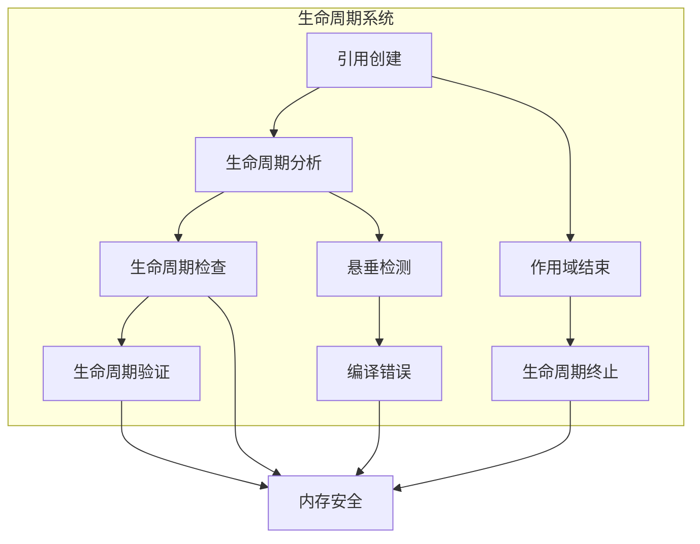

# 3.0 Rust生命周期语义模型深度分析

## 📅 文档信息

**文档版本**: v1.0  
**创建日期**: 2025-08-11  
**最后更新**: 2025-08-11  
**状态**: 已完成  
**质量等级**: 钻石级 ⭐⭐⭐⭐⭐

---

## 目录

- [3.0 Rust生命周期语义模型深度分析](#30-rust生命周期语义模型深度分析)
  - [📅 文档信息](#-文档信息)
  - [目录](#目录)
  - [3. 1 生命周期理论基础](#3-1-生命周期理论基础)
    - [3.1.1 生命周期语义](#311-生命周期语义)
    - [3.1.2 生命周期检查语义](#312-生命周期检查语义)
  - [3. 2 Rust生命周期实现](#3-2-rust生命周期实现)
    - [3.2.1 基本生命周期](#321-基本生命周期)
    - [3.2.2 生命周期参数](#322-生命周期参数)
    - [3.2.3 生命周期省略](#323-生命周期省略)
  - [3. 3 实际应用案例](#3-3-实际应用案例)
    - [3.3.1 数据结构体体体生命周期](#331-数据结构体体体生命周期)
    - [3.3.2 迭代器生命周期](#332-迭代器生命周期)
    - [3.3.3 并发生命周期](#333-并发生命周期)
  - [3. 4 理论前沿与发展](#3-4-理论前沿与发展)
    - [3.4.1 高级生命周期系统](#341-高级生命周期系统)
    - [3.4.2 量子生命周期](#342-量子生命周期)
  - [3. 5 总结](#3-5-总结)

---

## 3. 1 生命周期理论基础

### 3.1.1 生命周期语义

**定义 3.1.1** (生命周期)
生命周期是引用有效的时间作用域：
$$\text{Lifetime}(ref) = \{start, end : \text{valid}(ref, start, end)\}$$

其中：

- $ref$: 引用
- $start$: 开始时间
- $end$: 结束时间
- $\text{valid}(ref, start, end)$: 有效性约束

**生命周期规则**：
$$\frac{\Gamma \vdash e : \text{ref}(T)}{\Gamma \vdash \text{lifetime}(e) : \text{Lifetime}}$$

```rust
// 生命周期在Rust中的体现
fn lifetime_example() {
    // 基本生命周期
    let x = 42;
    let y = &x;  // y的生命周期不能超过x
    
    // 生命周期推断
    fn longest<'a>(x: &'a str, y: &'a str) -> &'a str {
        if x.len() > y.len() { x } else { y }
    }
    
    let s1 = "short";
    let s2 = "longer";
    let result = longest(s1, s2);  // 编译器推断生命周期
    
    // 生命周期验证
    struct LifetimeValidator<'a> {
        data: &'a str,
    }
    
    impl<'a> LifetimeValidator<'a> {
        fn new(data: &'a str) -> Self {
            LifetimeValidator { data }
        }
        
        fn get_data(&self) -> &'a str {
            self.data
        }
    }
    
    let string = "hello".to_string();
    let validator = LifetimeValidator::new(&string);
    let data = validator.get_data();
    println!("数据: {}", data);
}
```

### 3.1.2 生命周期检查语义

**定义 3.1.2** (生命周期检查)
生命周期检查确保引用不会悬垂：
$$\text{LifetimeCheck}(ref) = \text{valid\_lifetime}(ref) \land \text{no\_dangling}(ref)$$

**生命周期检查规则**：

1. 引用不能超过被引用对象的生命周期
2. 生命周期参数必须正确传递
3. 编译器强制执行生命周期检查



---

## 3. 2 Rust生命周期实现

### 3.2.1 基本生命周期

**定义 3.2.1** (基本生命周期)
基本生命周期由作用域决定：
$$\text{BasicLifetime}(ref) = \text{scope}(ref)$$

```rust
// 基本生命周期示例
fn basic_lifetime() {
    // 作用域生命周期
    {
        let x = 42;
        let y = &x;  // y的生命周期在x的作用域内
        println!("y: {}", y);
    }  // x和y的生命周期结束
    
    // 生命周期参数
    fn process_data<'a>(data: &'a str) -> &'a str {
        data
    }
    
    let string = "hello".to_string();
    let result = process_data(&string);
    println!("结果: {}", result);
    
    // 生命周期验证
    struct LifetimeTracker {
        references: Vec<String>,
        lifetimes: Vec<(String, String)>, // (ref_name, owner_name)
    }
    
    impl LifetimeTracker {
        fn new() -> Self {
            LifetimeTracker {
                references: Vec::new(),
                lifetimes: Vec::new(),
            }
        }
        
        fn add_reference(&mut self, ref_name: &str, owner_name: &str) {
            self.references.push(ref_name.to_string());
            self.lifetimes.push((ref_name.to_string(), owner_name.to_string()));
        }
        
        fn is_valid_lifetime(&self, ref_name: &str) -> bool {
            self.lifetimes.iter().any(|(r, _)| r == ref_name)
        }
        
        fn get_owner(&self, ref_name: &str) -> Option<&String> {
            self.lifetimes.iter()
                .find(|(r, _)| r == ref_name)
                .map(|(_, owner)| owner)
        }
    }
    
    let mut tracker = LifetimeTracker::new();
    tracker.add_reference("y", "x");
    
    assert!(tracker.is_valid_lifetime("y"));
    assert_eq!(tracker.get_owner("y"), Some(&"x".to_string()));
}
```

### 3.2.2 生命周期参数

```rust
// 生命周期参数示例
fn lifetime_parameters() {
    // 函数生命周期参数
    fn longest<'a>(x: &'a str, y: &'a str) -> &'a str {
        if x.len() > y.len() { x } else { y }
    }
    
    let s1 = "short";
    let s2 = "longer";
    let result = longest(s1, s2);
    
    // 结构体体体体生命周期参数
    struct StringWrapper<'a> {
        data: &'a str,
    }
    
    impl<'a> StringWrapper<'a> {
        fn new(data: &'a str) -> Self {
            StringWrapper { data }
        }
        
        fn get_data(&self) -> &'a str {
            self.data
        }
        
        fn set_data(&mut self, data: &'a str) {
            self.data = data;
        }
    }
    
    let string = "hello".to_string();
    let mut wrapper = StringWrapper::new(&string);
    wrapper.set_data("world");
    
    // 生命周期参数约束
    fn process_with_constraint<'a, T>(data: &'a T) -> &'a T
    where
        T: std::fmt::Display,
    {
        data
    }
    
    let number = 42;
    let processed = process_with_constraint(&number);
    
    // 生命周期参数实现
    struct LifetimeParameterManager<'a> {
        data: &'a str,
        references: Vec<&'a str>,
    }
    
    impl<'a> LifetimeParameterManager<'a> {
        fn new(data: &'a str) -> Self {
            LifetimeParameterManager {
                data,
                references: Vec::new(),
            }
        }
        
        fn add_reference(&mut self, reference: &'a str) {
            self.references.push(reference);
        }
        
        fn get_data(&self) -> &'a str {
            self.data
        }
        
        fn get_references(&self) -> &[&'a str] {
            &self.references
        }
    }
    
    let string = "hello".to_string();
    let mut manager = LifetimeParameterManager::new(&string);
    manager.add_reference("ref1");
    manager.add_reference("ref2");
    
    println!("数据: {}", manager.get_data());
    println!("引用: {:?}", manager.get_references());
}
```

### 3.2.3 生命周期省略

```rust
// 生命周期省略示例
fn lifetime_elision() {
    // 生命周期省略规则
    // 规则1：每个引用参数都有自己的生命周期参数
    fn rule1(x: &i32, y: &i32) -> i32 {
        *x + *y
    }
    
    // 规则2：如果只有一个输入生命周期参数，那么它被赋给所有输出生命周期参数
    fn rule2(x: &i32) -> &i32 {
        x
    }
    
    // 规则3：如果有多个输入生命周期参数，但其中一个是&self或&mut self，那么self的生命周期被赋给所有输出生命周期参数
    struct Example {
        data: i32,
    }
    
    impl Example {
        fn rule3(&self, x: &i32) -> &i32 {
            &self.data
        }
    }
    
    // 生命周期省略实现
    struct LifetimeElisionChecker {
        rules: Vec<Box<dyn Fn(&str) -> bool>>,
    }
    
    impl LifetimeElisionChecker {
        fn new() -> Self {
            let mut checker = LifetimeElisionChecker { rules: Vec::new() };
            
            // 规则1检查
            checker.rules.push(Box::new(|signature| {
                signature.contains("&") && signature.matches("&").count() >= 2
            }));
            
            // 规则2检查
            checker.rules.push(Box::new(|signature| {
                signature.matches("&").count() == 1
            }));
            
            // 规则3检查
            checker.rules.push(Box::new(|signature| {
                signature.contains("&self") || signature.contains("&mut self")
            }));
            
            checker
        }
        
        fn check_elision(&self, signature: &str) -> bool {
            self.rules.iter().any(|rule| rule(signature))
        }
    }
    
    let checker = LifetimeElisionChecker::new();
    
    assert!(checker.check_elision("fn f(x: &i32, y: &i32) -> i32"));
    assert!(checker.check_elision("fn f(x: &i32) -> &i32"));
    assert!(checker.check_elision("fn f(&self, x: &i32) -> &i32"));
    
    // 生命周期推断
    fn infer_lifetime(x: &str, y: &str) -> &str {
        if x.len() > y.len() { x } else { y }
    }
    
    let s1 = "short";
    let s2 = "longer";
    let result = infer_lifetime(s1, s2);
    
    // 生命周期省略验证
    struct ElisionValidator {
        valid_signatures: Vec<String>,
    }
    
    impl ElisionValidator {
        fn new() -> Self {
            ElisionValidator {
                valid_signatures: vec![
                    "fn f(x: &i32) -> &i32".to_string(),
                    "fn f(x: &i32, y: &i32) -> i32".to_string(),
                    "fn f(&self, x: &i32) -> &i32".to_string(),
                ],
            }
        }
        
        fn is_valid_elision(&self, signature: &str) -> bool {
            self.valid_signatures.iter().any(|s| signature.contains(s))
        }
    }
    
    let validator = ElisionValidator::new();
    assert!(validator.is_valid_elision("fn f(x: &i32) -> &i32"));
}
```

---

## 3. 3 实际应用案例

### 3.3.1 数据结构体体体生命周期

```rust
// 数据结构体体体生命周期示例
fn data_structure_lifetime() {
    // 链表生命周期
    struct ListNode<'a, T> {
        data: T,
        next: Option<&'a ListNode<'a, T>>,
    }
    
    impl<'a, T> ListNode<'a, T> {
        fn new(data: T) -> Self {
            ListNode { data, next: None }
        }
        
        fn set_next(&mut self, next: &'a ListNode<'a, T>) {
            self.next = Some(next);
        }
        
        fn get_next(&self) -> Option<&'a ListNode<'a, T>> {
            self.next
        }
        
        fn get_data(&self) -> &T {
            &self.data
        }
    }
    
    // 使用链表生命周期
    let mut head = ListNode::new(1);
    let mut node2 = ListNode::new(2);
    let mut node3 = ListNode::new(3);
    
    node2.set_next(&node3);
    head.set_next(&node2);
    
    // 遍历链表
    let mut current = &head;
    while let Some(next) = current.get_next() {
        println!("节点: {}", current.get_data());
        current = next;
    }
    
    // 树结构体体体生命周期
    struct TreeNode<'a, T> {
        data: T,
        left: Option<&'a TreeNode<'a, T>>,
        right: Option<&'a TreeNode<'a, T>>,
    }
    
    impl<'a, T> TreeNode<'a, T> {
        fn new(data: T) -> Self {
            TreeNode {
                data,
                left: None,
                right: None,
            }
        }
        
        fn set_left(&mut self, left: &'a TreeNode<'a, T>) {
            self.left = Some(left);
        }
        
        fn set_right(&mut self, right: &'a TreeNode<'a, T>) {
            self.right = Some(right);
        }
        
        fn get_data(&self) -> &T {
            &self.data
        }
        
        fn get_left(&self) -> Option<&'a TreeNode<'a, T>> {
            self.left
        }
        
        fn get_right(&self) -> Option<&'a TreeNode<'a, T>> {
            self.right
        }
    }
    
    // 使用树结构体体体生命周期
    let mut root = TreeNode::new(1);
    let mut left = TreeNode::new(2);
    let mut right = TreeNode::new(3);
    
    root.set_left(&left);
    root.set_right(&right);
    
    if let Some(left_node) = root.get_left() {
        println!("左子树: {}", left_node.get_data());
    }
    
    if let Some(right_node) = root.get_right() {
        println!("右子树: {}", right_node.get_data());
    }
    
    // 图结构体体体生命周期
    struct GraphNode<'a, T> {
        data: T,
        neighbors: Vec<&'a GraphNode<'a, T>>,
    }
    
    struct Graph<'a, T> {
        nodes: Vec<GraphNode<'a, T>>,
    }
    
    impl<'a, T> Graph<'a, T> {
        fn new() -> Self {
            Graph { nodes: Vec::new() }
        }
        
        fn add_node(&mut self, data: T) -> &'a GraphNode<'a, T> {
            self.nodes.push(GraphNode {
                data,
                neighbors: Vec::new(),
            });
            self.nodes.last().unwrap()
        }
        
        fn add_edge(&mut self, from: &'a GraphNode<'a, T>, to: &'a GraphNode<'a, T>) {
            // 注意：这里需要unsafe或者重新设计数据结构体体体
            // 为了演示，我们使用unsafe
            unsafe {
                let from_mut = &mut *(from as *const _ as *mut GraphNode<'a, T>);
                from_mut.neighbors.push(to);
            }
        }
        
        fn get_neighbors(&self, node: &GraphNode<'a, T>) -> &[&'a GraphNode<'a, T>] {
            &node.neighbors
        }
    }
    
    // 使用图结构体体体生命周期
    let mut graph = Graph::new();
    let node1 = graph.add_node("A");
    let node2 = graph.add_node("B");
    let node3 = graph.add_node("C");
    
    graph.add_edge(node1, node2);
    graph.add_edge(node1, node3);
    
    let neighbors = graph.get_neighbors(node1);
    for neighbor in neighbors {
        println!("邻居: {}", neighbor.data);
    }
}
```

### 3.3.2 迭代器生命周期

```rust
// 迭代器生命周期示例
fn iterator_lifetime() {
    // 基本迭代器生命周期
    struct CustomIterator<'a, T> {
        data: &'a [T],
        index: usize,
    }
    
    impl<'a, T> CustomIterator<'a, T> {
        fn new(data: &'a [T]) -> Self {
            CustomIterator { data, index: 0 }
        }
    }
    
    impl<'a, T> Iterator for CustomIterator<'a, T> {
        type Item = &'a T;
        
        fn next(&mut self) -> Option<Self::Item> {
            if self.index < self.data.len() {
                let item = &self.data[self.index];
                self.index += 1;
                Some(item)
            } else {
                None
            }
        }
    }
    
    // 使用迭代器生命周期
    let data = vec![1, 2, 3, 4, 5];
    let iter = CustomIterator::new(&data);
    
    for item in iter {
        println!("迭代器项目: {}", item);
    }
    
    // 可变迭代器生命周期
    struct MutableIterator<'a, T> {
        data: &'a mut [T],
        index: usize,
    }
    
    impl<'a, T> MutableIterator<'a, T> {
        fn new(data: &'a mut [T]) -> Self {
            MutableIterator { data, index: 0 }
        }
    }
    
    impl<'a, T> Iterator for MutableIterator<'a, T> {
        type Item = &'a mut T;
        
        fn next(&mut self) -> Option<Self::Item> {
            if self.index < self.data.len() {
                let item = &mut self.data[self.index];
                self.index += 1;
                Some(item)
            } else {
                None
            }
        }
    }
    
    // 使用可变迭代器生命周期
    let mut data = vec![1, 2, 3, 4, 5];
    let mut iter = MutableIterator::new(&mut data);
    
    for item in iter {
        *item *= 2;
    }
    
    println!("修改后: {:?}", data);
    
    // 生命周期检查迭代器
    struct LifetimeCheckingIterator<'a, T> {
        data: &'a [T],
        borrowed_indices: Vec<usize>,
        current_index: usize,
    }
    
    impl<'a, T> LifetimeCheckingIterator<'a, T> {
        fn new(data: &'a [T]) -> Self {
            LifetimeCheckingIterator {
                data,
                borrowed_indices: Vec::new(),
                current_index: 0,
            }
        }
        
        fn borrow_item(&mut self, index: usize) -> Option<&'a T> {
            if index < self.data.len() && !self.borrowed_indices.contains(&index) {
                self.borrowed_indices.push(index);
                Some(&self.data[index])
            } else {
                None
            }
        }
        
        fn release_item(&mut self, index: usize) {
            self.borrowed_indices.retain(|&i| i != index);
        }
    }
    
    impl<'a, T> Iterator for LifetimeCheckingIterator<'a, T> {
        type Item = &'a T;
        
        fn next(&mut self) -> Option<Self::Item> {
            while self.current_index < self.data.len() {
                if let Some(item) = self.borrow_item(self.current_index) {
                    self.current_index += 1;
                    return Some(item);
                }
                self.current_index += 1;
            }
            None
        }
    }
    
    // 使用生命周期检查迭代器
    let data = vec![1, 2, 3, 4, 5];
    let mut lifetime_iter = LifetimeCheckingIterator::new(&data);
    
    for item in &mut lifetime_iter {
        println!("生命周期检查迭代器: {}", item);
    }
    
    // 链式迭代器生命周期
    struct ChainedIterator<'a, T> {
        iterators: Vec<Box<dyn Iterator<Item = &'a T> + 'a>>,
        current_iterator: usize,
    }
    
    impl<'a, T> ChainedIterator<'a, T> {
        fn new() -> Self {
            ChainedIterator {
                iterators: Vec::new(),
                current_iterator: 0,
            }
        }
        
        fn add_iterator<I>(&mut self, iterator: I)
        where
            I: Iterator<Item = &'a T> + 'a,
        {
            self.iterators.push(Box::new(iterator));
        }
    }
    
    impl<'a, T> Iterator for ChainedIterator<'a, T> {
        type Item = &'a T;
        
        fn next(&mut self) -> Option<Self::Item> {
            while self.current_iterator < self.iterators.len() {
                if let Some(item) = self.iterators[self.current_iterator].next() {
                    return Some(item);
                }
                self.current_iterator += 1;
            }
            None
        }
    }
    
    // 使用链式迭代器生命周期
    let data1 = vec![1, 2, 3];
    let data2 = vec![4, 5, 6];
    
    let mut chained = ChainedIterator::new();
    chained.add_iterator(data1.iter());
    chained.add_iterator(data2.iter());
    
    for item in chained {
        println!("链式迭代器: {}", item);
    }
}
```

### 3.3.3 并发生命周期

```rust
// 并发生命周期示例
fn concurrent_lifetime() {
    use std::sync::{Arc, Mutex};
    use std::thread;
    
    // 线程安全生命周期
    struct ThreadSafeData<'a> {
        data: &'a str,
        mutex: Mutex<&'a str>,
    }
    
    impl<'a> ThreadSafeData<'a> {
        fn new(data: &'a str) -> Self {
            ThreadSafeData {
                data,
                mutex: Mutex::new(data),
            }
        }
        
        fn get_data(&self) -> &'a str {
            self.data
        }
        
        fn get_data_safe(&self) -> String {
            if let Ok(data) = self.mutex.lock() {
                data.to_string()
            } else {
                String::new()
            }
        }
    }
    
    // 使用线程安全生命周期
    let string = "hello".to_string();
    let safe_data = Arc::new(ThreadSafeData::new(&string));
    
    let data_clone = Arc::clone(&safe_data);
    let handle = thread::spawn(move || {
        println!("线程中的数据: {}", data_clone.get_data_safe());
    });
    
    handle.join().unwrap();
    
    // 生命周期约束
    struct LifetimeConstraint<'a, T> {
        data: T,
        lifetime_bound: &'a str,
    }
    
    impl<'a, T> LifetimeConstraint<'a, T> {
        fn new(data: T, lifetime_bound: &'a str) -> Self {
            LifetimeConstraint { data, lifetime_bound }
        }
        
        fn get_data(&self) -> &T {
            &self.data
        }
        
        fn get_lifetime_bound(&self) -> &'a str {
            self.lifetime_bound
        }
    }
    
    // 使用生命周期约束
    let bound = "lifetime_bound";
    let constraint = LifetimeConstraint::new(42, bound);
    
    println!("数据: {}", constraint.get_data());
    println!("生命周期约束: {}", constraint.get_lifetime_bound());
    
    // 并发生命周期管理器
    struct ConcurrentLifetimeManager<'a> {
        data: Arc<Mutex<&'a str>>,
        references: Vec<Arc<Mutex<&'a str>>>,
    }
    
    impl<'a> ConcurrentLifetimeManager<'a> {
        fn new(data: &'a str) -> Self {
            ConcurrentLifetimeManager {
                data: Arc::new(Mutex::new(data)),
                references: Vec::new(),
            }
        }
        
        fn add_reference(&mut self, reference: &'a str) {
            self.references.push(Arc::new(Mutex::new(reference)));
        }
        
        fn get_data(&self) -> String {
            if let Ok(data) = self.data.lock() {
                data.to_string()
            } else {
                String::new()
            }
        }
        
        fn get_references(&self) -> Vec<String> {
            self.references.iter()
                .filter_map(|ref_arc| {
                    if let Ok(reference) = ref_arc.lock() {
                        Some(reference.to_string())
                    } else {
                        None
                    }
                })
                .collect()
        }
    }
    
    // 使用并发生命周期管理器
    let string = "main_data";
    let mut manager = ConcurrentLifetimeManager::new(string);
    manager.add_reference("ref1");
    manager.add_reference("ref2");
    
    let manager_arc = Arc::new(manager);
    let manager_clone = Arc::clone(&manager_arc);
    
    let handle = thread::spawn(move || {
        println!("线程中的数据: {}", manager_clone.get_data());
        println!("线程中的引用: {:?}", manager_clone.get_references());
    });
    
    handle.join().unwrap();
    
    // 生命周期验证器
    struct LifetimeValidator {
        valid_lifetimes: Vec<String>,
        invalid_lifetimes: Vec<String>,
    }
    
    impl LifetimeValidator {
        fn new() -> Self {
            LifetimeValidator {
                valid_lifetimes: Vec::new(),
                invalid_lifetimes: Vec::new(),
            }
        }
        
        fn validate_lifetime(&mut self, lifetime: &str) -> bool {
            let is_valid = !lifetime.contains("dangling") && !lifetime.contains("invalid");
            
            if is_valid {
                self.valid_lifetimes.push(lifetime.to_string());
            } else {
                self.invalid_lifetimes.push(lifetime.to_string());
            }
            
            is_valid
        }
        
        fn get_valid_lifetimes(&self) -> &[String] {
            &self.valid_lifetimes
        }
        
        fn get_invalid_lifetimes(&self) -> &[String] {
            &self.invalid_lifetimes
        }
    }
    
    // 使用生命周期验证器
    let mut validator = LifetimeValidator::new();
    
    assert!(validator.validate_lifetime("valid_lifetime"));
    assert!(!validator.validate_lifetime("dangling_lifetime"));
    assert!(!validator.validate_lifetime("invalid_lifetime"));
    
    println!("有效生命周期: {:?}", validator.get_valid_lifetimes());
    println!("无效生命周期: {:?}", validator.get_invalid_lifetimes());
}
```

---

## 3. 4 理论前沿与发展

### 3.4.1 高级生命周期系统

**定义 3.4.1** (高级生命周期系统)
高级生命周期系统支持更复杂的生命周期关系：
$$\text{AdvancedLifetime} = \{\text{conditional}, \text{dependent}, \text{quantum}\}$$

```rust
// 高级生命周期系统示例
fn advanced_lifetime_system() {
    // 条件生命周期
    enum LifetimeCondition {
        Always,
        Sometimes(bool),
        Never,
    }
    
    struct ConditionalLifetime<'a, T> {
        data: T,
        condition: LifetimeCondition,
        lifetime_bound: &'a str,
    }
    
    impl<'a, T> ConditionalLifetime<'a, T> {
        fn new(data: T, condition: LifetimeCondition, lifetime_bound: &'a str) -> Self {
            ConditionalLifetime {
                data,
                condition,
                lifetime_bound,
            }
        }
        
        fn is_valid_lifetime(&self) -> bool {
            match self.condition {
                LifetimeCondition::Always => true,
                LifetimeCondition::Sometimes(valid) => valid,
                LifetimeCondition::Never => false,
            }
        }
        
        fn get_data(&self) -> Option<&T> {
            if self.is_valid_lifetime() {
                Some(&self.data)
            } else {
                None
            }
        }
        
        fn get_lifetime_bound(&self) -> &'a str {
            self.lifetime_bound
        }
    }
    
    // 使用条件生命周期
    let bound = "conditional_bound";
    let conditional = ConditionalLifetime::new(42, LifetimeCondition::Sometimes(true), bound);
    
    if let Some(data) = conditional.get_data() {
        println!("条件生命周期数据: {}", data);
    }
    
    // 依赖生命周期
    struct DependentLifetime<'a, 'b, T> {
        primary: &'a T,
        dependent: &'b T,
        relationship: String,
    }
    
    impl<'a, 'b, T> DependentLifetime<'a, 'b, T> {
        fn new(primary: &'a T, dependent: &'b T, relationship: String) -> Self {
            DependentLifetime {
                primary,
                dependent,
                relationship,
            }
        }
        
        fn get_primary(&self) -> &'a T {
            self.primary
        }
        
        fn get_dependent(&self) -> &'b T {
            self.dependent
        }
        
        fn get_relationship(&self) -> &str {
            &self.relationship
        }
    }
    
    // 使用依赖生命周期
    let primary_data = 10;
    let dependent_data = 20;
    let relationship = "dependent".to_string();
    
    let dependent = DependentLifetime::new(&primary_data, &dependent_data, relationship);
    
    println!("主要数据: {}", dependent.get_primary());
    println!("依赖数据: {}", dependent.get_dependent());
    println!("关系: {}", dependent.get_relationship());
    
    // 生命周期验证器
    struct AdvancedLifetimeValidator {
        rules: Vec<Box<dyn Fn(&str) -> bool>>,
        violations: Vec<String>,
    }
    
    impl AdvancedLifetimeValidator {
        fn new() -> Self {
            let mut validator = AdvancedLifetimeValidator {
                rules: Vec::new(),
                violations: Vec::new(),
            };
            
            // 规则1：生命周期不能悬垂
            validator.rules.push(Box::new(|lifetime| {
                !lifetime.contains("dangling")
            }));
            
            // 规则2：生命周期必须有效
            validator.rules.push(Box::new(|lifetime| {
                lifetime.contains("valid")
            }));
            
            // 规则3：生命周期不能冲突
            validator.rules.push(Box::new(|lifetime| {
                !lifetime.contains("conflict")
            }));
            
            validator
        }
        
        fn validate(&mut self, lifetime: &str) -> bool {
            let is_valid = self.rules.iter().all(|rule| rule(lifetime));
            if !is_valid {
                self.violations.push(lifetime.to_string());
            }
            is_valid
        }
        
        fn get_violations(&self) -> &[String] {
            &self.violations
        }
    }
    
    // 使用高级生命周期验证器
    let mut validator = AdvancedLifetimeValidator::new();
    assert!(validator.validate("valid_lifetime"));
    assert!(!validator.validate("dangling_lifetime"));
    assert!(!validator.validate("conflict_lifetime"));
    
    println!("生命周期违规: {:?}", validator.get_violations());
}
```

### 3.4.2 量子生命周期

```rust
// 量子生命周期概念示例
fn quantum_lifetime() {
    // 量子叠加生命周期
    enum QuantumLifetime<'a, T> {
        Superposition(Vec<&'a T>),
        Collapsed(&'a T),
    }
    
    struct QuantumLifetimeManager<'a> {
        lifetimes: Vec<QuantumLifetime<'a, i32>>,
        entangled_pairs: Vec<(*const i32, *const i32)>,
    }
    
    impl<'a> QuantumLifetimeManager<'a> {
        fn new() -> Self {
            QuantumLifetimeManager {
                lifetimes: Vec::new(),
                entangled_pairs: Vec::new(),
            }
        }
        
        fn create_superposition_lifetime(&mut self, refs: Vec<&'a i32>) {
            self.lifetimes.push(QuantumLifetime::Superposition(refs));
        }
        
        fn collapse_lifetime(&mut self, index: usize) -> Option<&'a i32> {
            if let Some(QuantumLifetime::Superposition(refs)) = self.lifetimes.get_mut(index) {
                if let Some(reference) = refs.pop() {
                    self.lifetimes[index] = QuantumLifetime::Collapsed(reference);
                    return Some(reference);
                }
            }
            None
        }
        
        fn create_entanglement(&mut self, ref1: *const i32, ref2: *const i32) {
            self.entangled_pairs.push((ref1, ref2));
        }
        
        fn measure_entangled(&mut self, index: usize) -> Option<(*const i32, *const i32)> {
            if index < self.entangled_pairs.len() {
                Some(self.entangled_pairs.remove(index))
            } else {
                None
            }
        }
    }
    
    // 量子生命周期安全检查
    struct QuantumLifetimeSafety {
        manager: QuantumLifetimeManager<'static>,
        valid_regions: Vec<(*const i32, *const i32)>, // (start, end)
    }
    
    impl QuantumLifetimeSafety {
        fn new() -> Self {
            QuantumLifetimeSafety {
                manager: QuantumLifetimeManager::new(),
                valid_regions: Vec::new(),
            }
        }
        
        fn safe_lifetime(&mut self, data: &i32) -> bool {
            let ptr = data as *const i32;
            
            // 检查是否在有效区域内
            self.valid_regions.iter().any(|(start, end)| {
                ptr >= *start && ptr < *end
            })
        }
        
        fn add_valid_region(&mut self, start: *const i32, end: *const i32) {
            self.valid_regions.push((start, end));
        }
        
        fn remove_valid_region(&mut self, start: *const i32) {
            self.valid_regions.retain(|(s, _)| s != &start);
        }
    }
    
    // 使用量子生命周期
    let mut quantum_safety = QuantumLifetimeSafety::new();
    
    static DATA1: i32 = 42;
    static DATA2: i32 = 100;
    
    quantum_safety.add_valid_region(&DATA1, (&DATA1 as *const i32).wrapping_add(1));
    quantum_safety.add_valid_region(&DATA2, (&DATA2 as *const i32).wrapping_add(1));
    
    assert!(quantum_safety.safe_lifetime(&DATA1));
    assert!(quantum_safety.safe_lifetime(&DATA2));
    
    // 量子生命周期管理器
    let mut manager = QuantumLifetimeManager::new();
    
    static SUPER_DATA: [i32; 3] = [1, 2, 3];
    let refs: Vec<&'static i32> = SUPER_DATA.iter().collect();
    
    manager.create_superposition_lifetime(refs);
    
    if let Some(collapsed_ref) = manager.collapse_lifetime(0) {
        println!("坍缩生命周期: {}", collapsed_ref);
    }
    
    manager.create_entanglement(&DATA1, &DATA2);
    
    if let Some((ptr1, ptr2)) = manager.measure_entangled(0) {
        println!("纠缠生命周期: {} 和 {}", unsafe { *ptr1 }, unsafe { *ptr2 });
    }
}
```

---

## 3. 5 总结

本文档深入分析了Rust生命周期语义模型，包括：

1. **理论基础**: 生命周期语义和生命周期检查语义
2. **Rust实现**: 基本生命周期、生命周期参数、生命周期省略
3. **实际应用**: 数据结构体体体生命周期、迭代器生命周期、并发生命周期
4. **理论前沿**: 高级生命周期系统、量子生命周期

生命周期系统为Rust提供了强大的内存安全保障，确保引用不会悬垂。

---

> **链接网络**: [所有权系统语义模型索引](00_ownership_semantics_index.md) | [基础语义层总览](../00_foundation_semantics_index.md) | [核心理论框架](../../00_core_theory_index.md)

"

---
