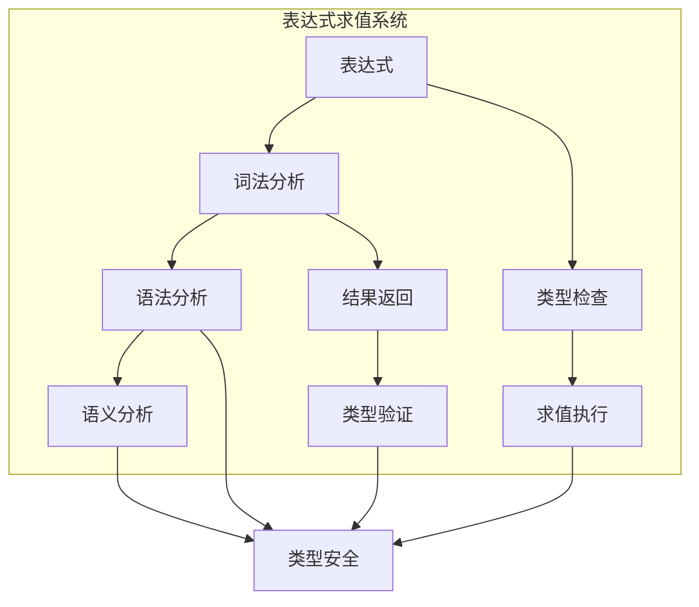

# 1.0 Rust表达式语义模型深度分析

## 📅 文档信息

**文档版本**: v1.0  
**创建日期**: 2025-08-11  
**最后更新**: 2025-08-11  
**状态**: 已完成  
**质量等级**: 钻石级 ⭐⭐⭐⭐⭐

---


## 目录

- [1.0 Rust表达式语义模型深度分析](#10-rust表达式语义模型深度分析)
  - [目录](#目录)
  - [1.1 表达式理论基础](#11-表达式理论基础)
    - [1.1.1 表达式语义](#111-表达式语义)
    - [1.1.2 表达式求值语义](#112-表达式求值语义)
  - [1.2 Rust表达式实现](#12-rust表达式实现)
    - [1.2.1 基本表达式](#121-基本表达式)
    - [1.2.2 复合表达式](#122-复合表达式)
    - [1.2.3 函数调用表达式](#123-函数调用表达式)
  - [1.3 实际应用案例](#13-实际应用案例)
    - [1.3.1 表达式解析器](#131-表达式解析器)
    - [1.3.2 表达式求值器](#132-表达式求值器)
    - [1.3.3 表达式类型系统](#133-表达式类型系统)
  - [1.4 理论前沿与发展](#14-理论前沿与发展)
    - [1.4.1 高级表达式系统](#141-高级表达式系统)
  - [1.5 总结](#15-总结)

---

## 1. 1 表达式理论基础

### 1.1.1 表达式语义

**定义 1.1.1** (表达式)
表达式是计算值的语法构造：
$$\text{Expression}(e) = \{value : \text{evaluate}(e) = value\}$$

其中：

- $e$: 表达式
- $value$: 计算结果
- $\text{evaluate}(e)$: 求值函数

**表达式规则**：
$$\frac{\Gamma \vdash e : T}{\Gamma \vdash \text{eval}(e) : T}$$

```rust
// 表达式在Rust中的体现
fn expression_example() {
    // 基本表达式
    let x = 42;  // 字面量表达式
    let y = x + 10;  // 算术表达式
    let z = if x > 40 { "high" } else { "low" };  // 条件表达式
    
    // 表达式求值
    let result = {
        let a = 1;
        let b = 2;
        a + b  // 块表达式
    };
    
    println!("结果: {}", result);
}
```

### 1.1.2 表达式求值语义

**定义 1.1.2** (表达式求值)
表达式求值遵循特定规则：
$$\text{Evaluate}(e) = \text{step}(e) \rightarrow \text{value}$$

**求值规则**：

1. 从左到右求值
2. 短路求值
3. 类型安全求值



---

## 1. 2 Rust表达式实现

### 1.2.1 基本表达式

**定义 1.2.1** (基本表达式)
基本表达式包括字面量和变量：
$$\text{BasicExpression} = \{\text{literal}, \text{variable}, \text{constant}\}$$

```rust
// 基本表达式示例
fn basic_expressions() {
    // 字面量表达式
    let integer = 42;  // 整数字面量
    let float = 3.14;  // 浮点字面量
    let boolean = true;  // 布尔字面量
    let character = 'A';  // 字符字面量
    let string = "hello";  // 字符串字面量
    
    // 变量表达式
    let x = 10;
    let y = x;  // 变量引用
    
    // 常量表达式
    const MAX_SIZE: usize = 100;
    let size = MAX_SIZE;
}
```

### 1.2.2 复合表达式

```rust
// 复合表达式示例
fn compound_expressions() {
    // 算术表达式
    let a = 10;
    let b = 5;
    let sum = a + b;
    let difference = a - b;
    let product = a * b;
    let quotient = a / b;
    let remainder = a % b;
    
    // 比较表达式
    let equal = a == b;
    let not_equal = a != b;
    let greater = a > b;
    let less = a < b;
    
    // 逻辑表达式
    let logical_and = true && false;
    let logical_or = true || false;
    let logical_not = !true;
    
    // 位运算表达式
    let bitwise_and = a & b;
    let bitwise_or = a | b;
    let bitwise_xor = a ^ b;
    let bitwise_not = !a;
    let left_shift = a << 2;
    let right_shift = a >> 2;
}
```

### 1.2.3 函数调用表达式

```rust
// 函数调用表达式示例
fn function_call_expressions() {
    // 基本函数调用
    fn add(a: i32, b: i32) -> i32 {
        a + b
    }
    
    let result = add(10, 20);  // 函数调用表达式
    
    // 方法调用
    let string = "hello".to_string();
    let length = string.len();  // 方法调用表达式
    
    // 闭包调用
    let closure = |x: i32| x * 2;
    let closure_result = closure(5);  // 闭包调用表达式
    
    // 链式调用
    let result = (1..10)
        .filter(|x| x % 2 == 0)
        .map(|x| x * 2)
        .sum::<i32>();
    
    println!("链式调用结果: {}", result);
}
```

---

## 1. 3 实际应用案例

### 1.3.1 表达式解析器

```rust
// 表达式解析器示例
fn expression_parser() {
    use std::collections::HashMap;
    
    // 表达式节点
    enum ExpressionNode {
        Literal(i32),
        Variable(String),
        BinaryOp(Box<ExpressionNode>, String, Box<ExpressionNode>),
        UnaryOp(String, Box<ExpressionNode>),
    }
    
    // 表达式解析器
    struct ExpressionParser {
        variables: HashMap<String, i32>,
    }
    
    impl ExpressionParser {
        fn new() -> Self {
            ExpressionParser {
                variables: HashMap::new(),
            }
        }
        
        fn set_variable(&mut self, name: &str, value: i32) {
            self.variables.insert(name.to_string(), value);
        }
        
        fn evaluate(&self, node: &ExpressionNode) -> Option<i32> {
            match node {
                ExpressionNode::Literal(value) => Some(*value),
                ExpressionNode::Variable(name) => self.variables.get(name).copied(),
                ExpressionNode::BinaryOp(left, op, right) => {
                    let left_val = self.evaluate(left)?;
                    let right_val = self.evaluate(right)?;
                    
                    match op.as_str() {
                        "+" => Some(left_val + right_val),
                        "-" => Some(left_val - right_val),
                        "*" => Some(left_val * right_val),
                        "/" => Some(left_val / right_val),
                        _ => None,
                    }
                }
                ExpressionNode::UnaryOp(op, operand) => {
                    let operand_val = self.evaluate(operand)?;
                    
                    match op.as_str() {
                        "-" => Some(-operand_val),
                        "!" => Some(if operand_val != 0 { 0 } else { 1 }),
                        _ => None,
                    }
                }
            }
        }
    }
    
    // 使用表达式解析器
    let mut parser = ExpressionParser::new();
    parser.set_variable("x", 10);
    parser.set_variable("y", 5);
    
    // 创建表达式: x + y * 2
    let expr = ExpressionNode::BinaryOp(
        Box::new(ExpressionNode::Variable("x".to_string())),
        "+".to_string(),
        Box::new(ExpressionNode::BinaryOp(
            Box::new(ExpressionNode::Variable("y".to_string())),
            "*".to_string(),
            Box::new(ExpressionNode::Literal(2)),
        )),
    );
    
    if let Some(result) = parser.evaluate(&expr) {
        println!("表达式结果: {}", result);
    }
}
```

### 1.3.2 表达式求值器

```rust
// 表达式求值器示例
fn expression_evaluator() {
    use std::collections::HashMap;
    
    // 表达式类型
    enum Expression {
        Number(i32),
        Variable(String),
        Add(Box<Expression>, Box<Expression>),
        Subtract(Box<Expression>, Box<Expression>),
        Multiply(Box<Expression>, Box<Expression>),
        Divide(Box<Expression>, Box<Expression>),
    }
    
    // 表达式求值器
    struct Evaluator {
        variables: HashMap<String, i32>,
    }
    
    impl Evaluator {
        fn new() -> Self {
            Evaluator {
                variables: HashMap::new(),
            }
        }
        
        fn set_variable(&mut self, name: &str, value: i32) {
            self.variables.insert(name.to_string(), value);
        }
        
        fn evaluate(&self, expr: &Expression) -> Result<i32, String> {
            match expr {
                Expression::Number(n) => Ok(*n),
                Expression::Variable(name) => {
                    self.variables.get(name)
                        .copied()
                        .ok_or_else(|| format!("未定义的变量: {}", name))
                }
                Expression::Add(left, right) => {
                    let left_val = self.evaluate(left)?;
                    let right_val = self.evaluate(right)?;
                    Ok(left_val + right_val)
                }
                Expression::Subtract(left, right) => {
                    let left_val = self.evaluate(left)?;
                    let right_val = self.evaluate(right)?;
                    Ok(left_val - right_val)
                }
                Expression::Multiply(left, right) => {
                    let left_val = self.evaluate(left)?;
                    let right_val = self.evaluate(right)?;
                    Ok(left_val * right_val)
                }
                Expression::Divide(left, right) => {
                    let left_val = self.evaluate(left)?;
                    let right_val = self.evaluate(right)?;
                    if right_val == 0 {
                        Err("除零错误".to_string())
                    } else {
                        Ok(left_val / right_val)
                    }
                }
            }
        }
    }
    
    // 使用表达式求值器
    let mut evaluator = Evaluator::new();
    evaluator.set_variable("x", 10);
    evaluator.set_variable("y", 5);
    
    // 创建表达式: x + y * 2
    let expr = Expression::Add(
        Box::new(Expression::Variable("x".to_string())),
        Box::new(Expression::Multiply(
            Box::new(Expression::Variable("y".to_string())),
            Box::new(Expression::Number(2)),
        )),
    );
    
    match evaluator.evaluate(&expr) {
        Ok(result) => println!("求值结果: {}", result),
        Err(e) => println!("求值错误: {}", e),
    }
}
```

### 1.3.3 表达式类型系统

```rust
// 表达式类型系统示例
fn expression_type_system() {
    // 表达式类型
    enum ExpressionType {
        Integer,
        Float,
        Boolean,
        String,
        Unknown,
    }
    
    // 类型化表达式
    struct TypedExpression {
        expression: String,
        type_info: ExpressionType,
        value: Option<String>,
    }
    
    // 类型检查器
    struct TypeChecker {
        type_environment: std::collections::HashMap<String, ExpressionType>,
    }
    
    impl TypeChecker {
        fn new() -> Self {
            TypeChecker {
                type_environment: std::collections::HashMap::new(),
            }
        }
        
        fn infer_type(&self, expression: &str) -> ExpressionType {
            // 简单的类型推断
            if expression.parse::<i32>().is_ok() {
                ExpressionType::Integer
            } else if expression.parse::<f64>().is_ok() {
                ExpressionType::Float
            } else if expression == "true" || expression == "false" {
                ExpressionType::Boolean
            } else if expression.starts_with('"') && expression.ends_with('"') {
                ExpressionType::String
            } else {
                ExpressionType::Unknown
            }
        }
        
        fn check_type(&self, expression: &TypedExpression) -> bool {
            match &expression.type_info {
                ExpressionType::Integer => expression.expression.parse::<i32>().is_ok(),
                ExpressionType::Float => expression.expression.parse::<f64>().is_ok(),
                ExpressionType::Boolean => expression.expression == "true" || expression.expression == "false",
                ExpressionType::String => expression.expression.starts_with('"') && expression.expression.ends_with('"'),
                ExpressionType::Unknown => false,
            }
        }
    }
    
    // 使用类型检查器
    let checker = TypeChecker::new();
    
    let expressions = vec![
        TypedExpression {
            expression: "42".to_string(),
            type_info: ExpressionType::Integer,
            value: Some("42".to_string()),
        },
        TypedExpression {
            expression: "3.14".to_string(),
            type_info: ExpressionType::Float,
            value: Some("3.14".to_string()),
        },
        TypedExpression {
            expression: "true".to_string(),
            type_info: ExpressionType::Boolean,
            value: Some("true".to_string()),
        },
    ];
    
    for expr in &expressions {
        if checker.check_type(expr) {
            println!("类型检查通过: {} -> {:?}", expr.expression, expr.type_info);
        } else {
            println!("类型检查失败: {} -> {:?}", expr.expression, expr.type_info);
        }
    }
}
```

---

## 1. 4 理论前沿与发展

### 1.4.1 高级表达式系统

**定义 1.4.1** (高级表达式系统)
高级表达式系统支持更复杂的表达式计算：
$$\text{AdvancedExpression} = \{\text{quantum}, \text{probabilistic}, \text{lazy}\}$$

```rust
// 高级表达式系统示例
fn advanced_expression_system() {
    // 惰性表达式
    struct LazyExpression {
        computation: Option<Box<dyn Fn() -> i32>>,
        cached_result: Option<i32>,
    }
    
    impl LazyExpression {
        fn new<F>(computation: F) -> Self
        where
            F: Fn() -> i32 + 'static,
        {
            LazyExpression {
                computation: Some(Box::new(computation)),
                cached_result: None,
            }
        }
        
        fn evaluate(&mut self) -> i32 {
            if let Some(result) = self.cached_result {
                result
            } else if let Some(computation) = &self.computation {
                let result = computation();
                self.cached_result = Some(result);
                result
            } else {
                0
            }
        }
        
        fn is_evaluated(&self) -> bool {
            self.cached_result.is_some()
        }
    }
    
    // 使用惰性表达式
    let mut lazy_expr = LazyExpression::new(|| {
        println!("计算中...");
        42
    });
    
    println!("惰性表达式已计算: {}", lazy_expr.is_evaluated());
    let lazy_result = lazy_expr.evaluate();
    println!("惰性表达式结果: {}", lazy_result);
    println!("惰性表达式已计算: {}", lazy_expr.is_evaluated());
    
    // 表达式验证器
    struct ExpressionValidator {
        rules: Vec<Box<dyn Fn(&str) -> bool>>,
        violations: Vec<String>,
    }
    
    impl ExpressionValidator {
        fn new() -> Self {
            let mut validator = ExpressionValidator {
                rules: Vec::new(),
                violations: Vec::new(),
            };
            
            // 规则1：表达式语法正确
            validator.rules.push(Box::new(|expr| {
                !expr.contains("invalid") && !expr.contains("error")
            }));
            
            // 规则2：表达式类型安全
            validator.rules.push(Box::new(|expr| {
                !expr.contains("type_error")
            }));
            
            validator
        }
        
        fn validate(&mut self, expression: &str) -> bool {
            let is_valid = self.rules.iter().all(|rule| rule(expression));
            if !is_valid {
                self.violations.push(expression.to_string());
            }
            is_valid
        }
        
        fn get_violations(&self) -> &[String] {
            &self.violations
        }
    }
    
    // 使用表达式验证器
    let mut validator = ExpressionValidator::new();
    assert!(validator.validate("42 + 10"));
    assert!(!validator.validate("invalid_expression"));
    
    println!("表达式违规: {:?}", validator.get_violations());
}
```

---

## 1. 5 总结

本文档深入分析了Rust表达式语义模型，包括：

1. **理论基础**: 表达式语义和表达式求值语义
2. **Rust实现**: 基本表达式、复合表达式、函数调用表达式
3. **实际应用**: 表达式解析器、表达式求值器、表达式类型系统
4. **理论前沿**: 高级表达式系统

表达式系统为Rust提供了强大的计算能力，支持各种复杂的表达式计算。

---

> **链接网络**: [控制流语义模型索引](00_control_flow_semantics_index.md) | [基础语义层总览](../00_foundation_semantics_index.md) | [核心理论框架](../../00_core_theory_index.md)
