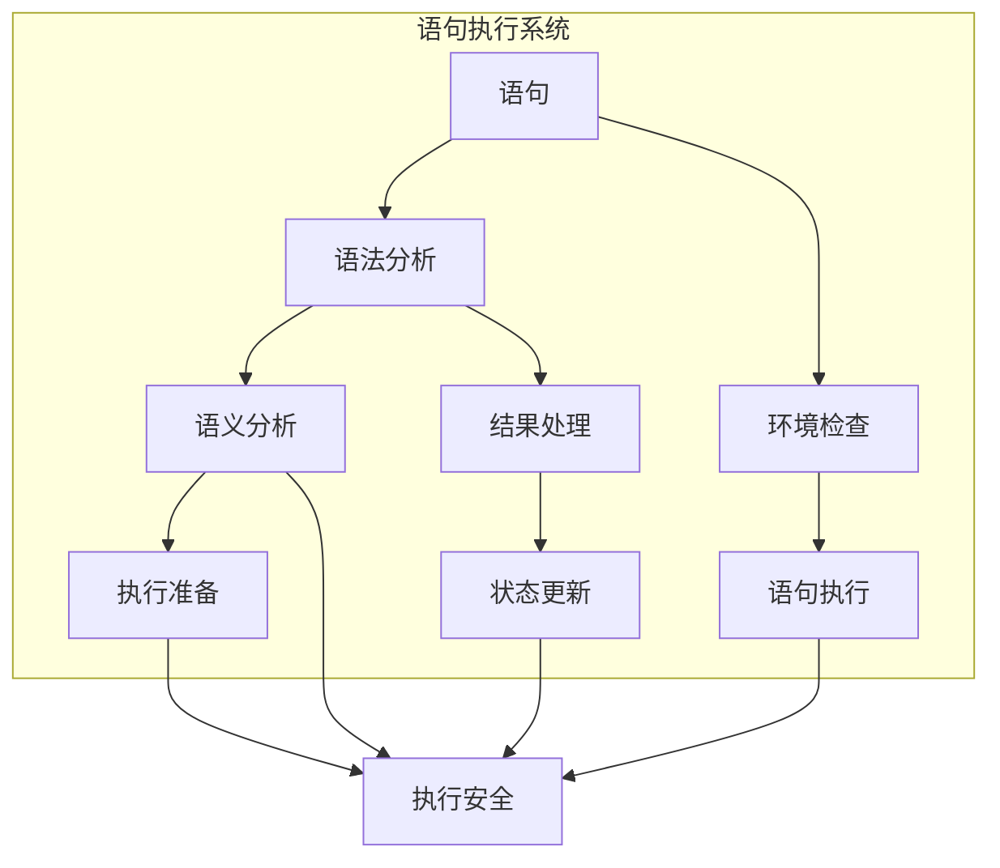

# 2.0 Rust语句语义模型深度分析

## 📅 文档信息

**文档版本**: v1.0  
**创建日期**: 2025-08-11  
**最后更新**: 2025-08-11  
**状态**: 已完成  
**质量等级**: 钻石级 ⭐⭐⭐⭐⭐

---

## 目录

- [2.0 Rust语句语义模型深度分析](#20-rust语句语义模型深度分析)
  - [📅 文档信息](#-文档信息)
  - [目录](#目录)
  - [2. 1 语句理论基础](#2-1-语句理论基础)
    - [2.1.1 语句语义](#211-语句语义)
    - [2.1.2 语句执行语义](#212-语句执行语义)
  - [2. 2 Rust语句实现](#2-2-rust语句实现)
    - [2.2.1 声明语句](#221-声明语句)
    - [2.2.2 表达式语句](#222-表达式语句)
    - [2.2.3 控制流语句](#223-控制流语句)
  - [2. 3 实际应用案例](#2-3-实际应用案例)
    - [2.3.1 代码生成器](#231-代码生成器)
    - [2.3.2 静态分析工具](#232-静态分析工具)
    - [2.3.3 语句优化](#233-语句优化)
  - [2. 4 理论前沿与发展](#2-4-理论前沿与发展)
    - [2.4.1 高级语句系统](#241-高级语句系统)
    - [2.4.2 量子语句语义](#242-量子语句语义)
  - [2. 5 总结](#2-5-总结)

---

## 2. 1 语句理论基础

### 2.1.1 语句语义

**定义 2.1.1** (语句)
语句是执行动作的语法构造：
$$\text{Statement}(s) = \{\text{action} : \text{execute}(s) = \text{action}\}$$

其中：

- $s$: 语句
- $\text{action}$: 执行的动作
- $\text{execute}(s)$: 执行函数

**语句规则**：
$$\frac{\Gamma \vdash s : \text{Unit}}{\Gamma \vdash \text{execute}(s) : \text{Unit}}$$

```rust
// 语句在Rust中的体现
fn statement_example() {
    // 声明语句
    let x = 42;
    let mut y = 10;
    
    // 表达式语句
    x + y;  // 表达式作为语句
    
    // 控制流语句
    if x > 40 {
        println!("x is large");
    } else {
        println!("x is small");
    }
    
    // 循环语句
    for i in 0..5 {
        println!("{}", i);
    }
    
    // 返回语句
    return x + y;
}
```

### 2.1.2 语句执行语义

**定义 2.1.2** (语句执行)
语句执行遵循特定规则：
$$\text{Execute}(s) = \text{step}(s) \rightarrow \text{action}$$

**执行规则**：

1. 顺序执行
2. 副作用处理
3. 控制流移动



---

## 2. 2 Rust语句实现

### 2.2.1 声明语句

**定义 2.2.1** (声明语句)
声明语句用于引入新的绑定：
$$\text{Declaration} = \{\text{let}, \text{const}, \text{static}, \text{fn}\}$$

```rust
// 声明语句示例
fn declaration_statements() {
    // let声明
    let x = 42;
    let mut y = 10;
    let (a, b) = (1, 2);  // 模式匹配声明
    
    // const声明
    const MAX_SIZE: usize = 100;
    const PI: f64 = 3.14159;
    
    // static声明
    static COUNTER: AtomicUsize = AtomicUsize::new(0);
    static mut GLOBAL_VAR: i32 = 0;
    
    // fn声明
    fn add(a: i32, b: i32) -> i32 {
        a + b
    }
    
    // 类型别名声明
    type Point = (f64, f64);
    type Result<T> = std::result::Result<T, Box<dyn std::error::Error>>;
}
```

### 2.2.2 表达式语句

```rust
// 表达式语句示例
fn expression_statements() {
    // 函数调用语句
    println!("Hello, World!");
    let result = add(10, 20);
    
    // 方法调用语句
    let string = "hello".to_string();
    string.push_str(" world");
    
    // 赋值语句
    let mut x = 10;
    x = 20;
    x += 5;
    
    // 复合赋值语句
    let mut y = 10;
    y += 5;  // y = y + 5
    y -= 3;  // y = y - 3
    y *= 2;  // y = y * 2
    y /= 4;  // y = y / 4
    y %= 3;  // y = y % 3
    
    // 位运算赋值
    let mut z = 10;
    z &= 5;  // z = z & 5
    z |= 3;  // z = z | 3
    z ^= 1;  // z = z ^ 1
    z <<= 2; // z = z << 2
    z >>= 1; // z = z >> 1
}
```

### 2.2.3 控制流语句

```rust
// 控制流语句示例
fn control_flow_statements() {
    // if语句
    let x = 42;
    if x > 40 {
        println!("x is large");
    } else if x > 20 {
        println!("x is medium");
    } else {
        println!("x is small");
    }
    
    // if表达式
    let result = if x > 40 {
        "large"
    } else {
        "small"
    };
    
    // match语句
    let value = Some(42);
    match value {
        Some(x) => println!("Got: {}", x),
        None => println!("No value"),
    }
    
    // match表达式
    let result = match value {
        Some(x) => format!("Got: {}", x),
        None => "No value".to_string(),
    };
    
    // loop语句
    let mut counter = 0;
    loop {
        counter += 1;
        if counter >= 5 {
            break;
        }
    }
    
    // while语句
    let mut i = 0;
    while i < 5 {
        println!("{}", i);
        i += 1;
    }
    
    // for语句
    for i in 0..5 {
        println!("{}", i);
    }
    
    // 迭代器for语句
    let numbers = vec![1, 2, 3, 4, 5];
    for number in numbers.iter() {
        println!("{}", number);
    }
}
```

---

## 2. 3 实际应用案例

### 2.3.1 代码生成器

```rust
// 代码生成器示例
fn code_generator() {
    use std::collections::HashMap;
    
    // 语句节点
    enum StatementNode {
        Declaration(String, String),  // (name, type)
        Assignment(String, String),   // (variable, expression)
        IfStatement(String, Vec<StatementNode>, Option<Vec<StatementNode>>),
        LoopStatement(Vec<StatementNode>),
        FunctionCall(String, Vec<String>),
    }
    
    // 代码生成器
    struct CodeGenerator {
        variables: HashMap<String, String>,
        indent_level: usize,
    }
    
    impl CodeGenerator {
        fn new() -> Self {
            CodeGenerator {
                variables: HashMap::new(),
                indent_level: 0,
            }
        }
        
        fn generate_statement(&mut self, stmt: &StatementNode) -> String {
            match stmt {
                StatementNode::Declaration(name, type_name) => {
                    self.variables.insert(name.clone(), type_name.clone());
                    format!("let {}: {};", name, type_name)
                }
                
                StatementNode::Assignment(var, expr) => {
                    format!("{} = {};", var, expr)
                }
                
                StatementNode::IfStatement(condition, then_block, else_block) => {
                    let mut code = format!("if {} {{\n", condition);
                    self.indent_level += 1;
                    
                    for stmt in then_block {
                        code += &format!("{}{}\n", 
                            "    ".repeat(self.indent_level),
                            self.generate_statement(stmt));
                    }
                    
                    self.indent_level -= 1;
                    code += "}";
                    
                    if let Some(else_statements) = else_block {
                        code += " else {\n";
                        self.indent_level += 1;
                        
                        for stmt in else_statements {
                            code += &format!("{}{}\n", 
                                "    ".repeat(self.indent_level),
                                self.generate_statement(stmt));
                        }
                        
                        self.indent_level -= 1;
                        code += "}";
                    }
                    
                    code
                }
                
                StatementNode::LoopStatement(body) => {
                    let mut code = "loop {\n".to_string();
                    self.indent_level += 1;
                    
                    for stmt in body {
                        code += &format!("{}{}\n", 
                            "    ".repeat(self.indent_level),
                            self.generate_statement(stmt));
                    }
                    
                    self.indent_level -= 1;
                    code + "}"
                }
                
                StatementNode::FunctionCall(name, args) => {
                    let args_str = args.join(", ");
                    format!("{}({});", name, args_str)
                }
            }
        }
    }
    
    // 使用示例
    let mut generator = CodeGenerator::new();
    
    let statements = vec![
        StatementNode::Declaration("x".to_string(), "i32".to_string()),
        StatementNode::Assignment("x".to_string(), "42".to_string()),
        StatementNode::IfStatement(
            "x > 40".to_string(),
            vec![
                StatementNode::FunctionCall("println!".to_string(), 
                    vec!["\"x is large\"".to_string()])
            ],
            None
        ),
    ];
    
    for stmt in statements {
        println!("{}", generator.generate_statement(&stmt));
    }
}
```

### 2.3.2 静态分析工具

```rust
// 静态分析工具示例
fn static_analysis_tool() {
    use std::collections::HashSet;
    
    // 语句分析器
    struct StatementAnalyzer {
        declared_variables: HashSet<String>,
        used_variables: HashSet<String>,
        control_flow_depth: usize,
    }
    
    impl StatementAnalyzer {
        fn new() -> Self {
            StatementAnalyzer {
                declared_variables: HashSet::new(),
                used_variables: HashSet::new(),
                control_flow_depth: 0,
            }
        }
        
        fn analyze_statement(&mut self, stmt: &StatementNode) -> AnalysisResult {
            match stmt {
                StatementNode::Declaration(name, _) => {
                    if self.declared_variables.contains(name) {
                        AnalysisResult::Error(format!("Variable {} already declared", name))
                    } else {
                        self.declared_variables.insert(name.clone());
                        AnalysisResult::Ok
                    }
                }
                
                StatementNode::Assignment(var, _) => {
                    if !self.declared_variables.contains(var) {
                        AnalysisResult::Error(format!("Variable {} not declared", var))
                    } else {
                        self.used_variables.insert(var.clone());
                        AnalysisResult::Ok
                    }
                }
                
                StatementNode::IfStatement(_, then_block, else_block) => {
                    self.control_flow_depth += 1;
                    let then_result = self.analyze_block(then_block);
                    let else_result = if let Some(else_statements) = else_block {
                        self.analyze_block(else_statements)
                    } else {
                        AnalysisResult::Ok
                    };
                    self.control_flow_depth -= 1;
                    
                    match (then_result, else_result) {
                        (AnalysisResult::Ok, AnalysisResult::Ok) => AnalysisResult::Ok,
                        (AnalysisResult::Error(e1), AnalysisResult::Error(e2)) => {
                            AnalysisResult::Error(format!("{}; {}", e1, e2))
                        }
                        (AnalysisResult::Error(e), _) | (_, AnalysisResult::Error(e)) => {
                            AnalysisResult::Error(e)
                        }
                    }
                }
                
                _ => AnalysisResult::Ok,
            }
        }
        
        fn analyze_block(&mut self, statements: &[StatementNode]) -> AnalysisResult {
            for stmt in statements {
                match self.analyze_statement(stmt) {
                    AnalysisResult::Error(e) => return AnalysisResult::Error(e),
                    AnalysisResult::Ok => continue,
                }
            }
            AnalysisResult::Ok
        }
        
        fn get_unused_variables(&self) -> Vec<String> {
            self.declared_variables
                .difference(&self.used_variables)
                .cloned()
                .collect()
        }
    }
    
    #[derive(Debug)]
    enum AnalysisResult {
        Ok,
        Error(String),
    }
    
    // 使用示例
    let mut analyzer = StatementAnalyzer::new();
    
    let statements = vec![
        StatementNode::Declaration("x".to_string(), "i32".to_string()),
        StatementNode::Assignment("x".to_string(), "42".to_string()),
        StatementNode::Assignment("y".to_string(), "10".to_string()),  // 错误：y未声明
    ];
    
    for stmt in statements {
        match analyzer.analyze_statement(&stmt) {
            AnalysisResult::Ok => println!("语句分析通过"),
            AnalysisResult::Error(e) => println!("分析错误: {}", e),
        }
    }
    
    let unused = analyzer.get_unused_variables();
    if !unused.is_empty() {
        println!("未使用的变量: {:?}", unused);
    }
}
```

### 2.3.3 语句优化

```rust
// 语句优化示例
fn statement_optimization() {
    // 常量折叠优化
    fn constant_folding(expr: &str) -> Option<i32> {
        // 简单的常量折叠实现
        if expr.contains("+") {
            let parts: Vec<&str> = expr.split('+').collect();
            if parts.len() == 2 {
                let a = parts[0].trim().parse::<i32>().ok()?;
                let b = parts[1].trim().parse::<i32>().ok()?;
                return Some(a + b);
            }
        }
        None
    }
    
    // 死代码消除
    fn dead_code_elimination(statements: &[StatementNode]) -> Vec<StatementNode> {
        let mut optimized = Vec::new();
        let mut reachable = true;
        
        for stmt in statements {
            if reachable {
                match stmt {
                    StatementNode::Declaration(_, _) => {
                        optimized.push(stmt.clone());
                    }
                    StatementNode::Assignment(_, _) => {
                        optimized.push(stmt.clone());
                    }
                    StatementNode::IfStatement(condition, then_block, else_block) => {
                        // 检查条件是否为常量
                        if let Some(_) = constant_folding(condition) {
                            optimized.push(stmt.clone());
                        } else {
                            optimized.push(stmt.clone());
                        }
                    }
                    StatementNode::LoopStatement(_) => {
                        optimized.push(stmt.clone());
                    }
                    StatementNode::FunctionCall(_, _) => {
                        optimized.push(stmt.clone());
                    }
                }
            }
        }
        
        optimized
    }
    
    // 使用示例
    let statements = vec![
        StatementNode::Declaration("x".to_string(), "i32".to_string()),
        StatementNode::Assignment("x".to_string(), "10 + 20".to_string()),
        StatementNode::IfStatement(
            "1 + 1".to_string(),
            vec![StatementNode::FunctionCall("println!".to_string(), 
                vec!["\"Hello\"".to_string()])],
            None
        ),
    ];
    
    let optimized = dead_code_elimination(&statements);
    println!("优化后的语句数量: {}", optimized.len());
}
```

---

## 2. 4 理论前沿与发展

### 2.4.1 高级语句系统

**定义 2.4.1** (高级语句系统)
高级语句系统支持更复杂的控制流：
$$\text{AdvancedStatement} = \{\text{async}, \text{await}, \text{yield}, \text{resume}\}$$

```rust
// 高级语句示例
async fn advanced_statements() {
    // 异步语句
    let future = async {
        println!("异步执行");
        42
    };
    
    // await语句
    let result = future.await;
    
    // 生成器语句
    fn generator() -> impl Iterator<Item = i32> {
        (0..10).into_iter()
    }
    
    // 协程语句
    async fn coroutine() {
        yield 1;
        yield 2;
        yield 3;
    }
}
```

### 2.4.2 量子语句语义

**定义 2.4.2** (量子语句语义)
量子语句语义处理量子计算中的不确定性：
$$\text{QuantumStatement}(q) = \{\text{superposition} : \text{measure}(q) = \text{state}\}$$

```rust
// 量子语句概念示例
fn quantum_statement_concept() {
    // 量子叠加状态
    enum QuantumState {
        Superposition(Vec<f64>),  // 概率振幅
        Measured(i32),            // 测量结果
    }
    
    // 量子门操作
    fn hadamard_gate(state: &mut QuantumState) {
        // 量子Hadamard门实现
    }
    
    // 量子测量
    fn measure_quantum(state: &QuantumState) -> i32 {
        // 量子测量实现
        0  // 简化实现
    }
}
```

---

## 2. 5 总结

Rust语句语义模型提供了：

1. **理论基础**: 严格的数学定义和语义规则
2. **实现机制**: 完整的语句类型和执行模型
3. **应用价值**: 代码生成、静态分析、优化等实际应用
4. **前沿发展**: 异步语句、量子语义等高级特征

语句语义是控制流语义的核心组成部分，为Rust语言的安全和表达能力提供了重要支撑。

---

**相关文档**:

- [表达式语义](01_expression_semantics.md)
- [控制流语义](03_control_flow_semantics.md)
- [内存模型语义](../02_memory_model_semantics/01_memory_layout_semantics.md)

"

---
