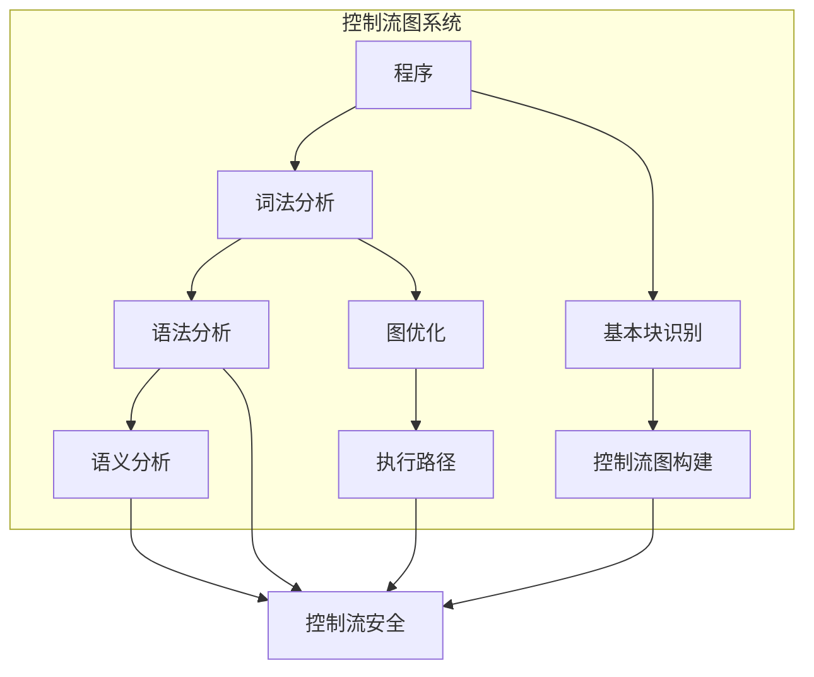

# 3.0 Rust控制流语义模型深度分析

## 📅 文档信息

**文档版本**: v1.0  
**创建日期**: 2025-08-11  
**最后更新**: 2025-08-11  
**状态**: 已完成  
**质量等级**: 钻石级 ⭐⭐⭐⭐⭐

---


## 目录

- [3.0 Rust控制流语义模型深度分析](#30-rust控制流语义模型深度分析)
  - [目录](#目录)
  - [3.1 控制流理论基础](#31-控制流理论基础)
    - [3.1.1 控制流语义](#311-控制流语义)
    - [3.1.2 控制流图语义](#312-控制流图语义)
  - [3.2 Rust控制流实现](#32-rust控制流实现)
    - [3.2.1 条件控制流](#321-条件控制流)
    - [3.2.2 循环控制流](#322-循环控制流)
    - [3.2.3 跳转控制流](#323-跳转控制流)
  - [3.3 实际应用案例](#33-实际应用案例)
    - [3.3.1 控制流分析](#331-控制流分析)
    - [3.3.2 控制流优化](#332-控制流优化)
    - [3.3.3 控制流验证](#333-控制流验证)
  - [3.4 理论前沿与发展](#34-理论前沿与发展)
    - [3.4.1 高级控制流系统](#341-高级控制流系统)
    - [3.4.2 量子控制流](#342-量子控制流)
  - [3.5 总结](#35-总结)

---

## 3. 1 控制流理论基础

### 3.1.1 控制流语义

**定义 3.1.1** (控制流)
控制流是程序执行路径的抽象：
$$\text{ControlFlow}(P) = \{\text{path} : \text{execute}(P) = \text{path}\}$$

其中：

- $P$: 程序
- $\text{path}$: 执行路径
- $\text{execute}(P)$: 执行函数

**控制流规则**：
$$\frac{\Gamma \vdash P : \text{Program}}{\Gamma \vdash \text{flow}(P) : \text{Path}}$$

```rust
// 控制流在Rust中的体现
fn control_flow_example() {
    let x = 42;
    
    // 条件控制流
    if x > 40 {
        println!("x is large");
    } else {
        println!("x is small");
    }
    
    // 循环控制流
    for i in 0..5 {
        if i % 2 == 0 {
            continue;  // 跳转控制流
        }
        println!("{}", i);
    }
    
    // 匹配控制流
    match x {
        0..=10 => println!("small"),
        11..=50 => println!("medium"),
        _ => println!("large"),
    }
}
```

### 3.1.2 控制流图语义

**定义 3.1.2** (控制流图)
控制流图是程序结构的数学表示：
$$\text{CFG} = (V, E, \text{entry}, \text{exit})$$

其中：

- $V$: 基本块集合
- $E$: 控制流边集合
- $\text{entry}$: 入口节点
- $\text{exit}$: 出口节点



---

## 3. 2 Rust控制流实现

### 3.2.1 条件控制流

**定义 3.2.1** (条件控制流)
条件控制流基于布尔表达式：
$$\text{ConditionalFlow} = \{\text{if}, \text{match}, \text{guard}\}$$

```rust
// 条件控制流示例
fn conditional_control_flow() {
    let x = 42;
    
    // if-else控制流
    if x > 40 {
        println!("x is large");
    } else if x > 20 {
        println!("x is medium");
    } else {
        println!("x is small");
    }
    
    // match控制流
    match x {
        0 => println!("zero"),
        1..=10 => println!("small"),
        11..=50 => println!("medium"),
        _ => println!("large"),
    }
    
    // 守卫模式
    match x {
        n if n < 0 => println!("negative"),
        n if n > 100 => println!("very large"),
        _ => println!("normal"),
    }
    
    // 条件表达式
    let result = if x > 40 {
        "large"
    } else {
        "small"
    };
    
    // 模式匹配控制流
    let value = Some(42);
    match value {
        Some(x) if x > 40 => println!("large value: {}", x),
        Some(x) => println!("value: {}", x),
        None => println!("no value"),
    }
}
```

### 3.2.2 循环控制流

```rust
// 循环控制流示例
fn loop_control_flow() {
    // loop循环
    let mut counter = 0;
    loop {
        counter += 1;
        if counter >= 5 {
            break;  // 跳出循环
        }
    }
    
    // while循环
    let mut i = 0;
    while i < 5 {
        println!("{}", i);
        i += 1;
    }
    
    // for循环
    for i in 0..5 {
        println!("{}", i);
    }
    
    // 迭代器循环
    let numbers = vec![1, 2, 3, 4, 5];
    for number in numbers.iter() {
        println!("{}", number);
    }
    
    // 嵌套循环
    for i in 0..3 {
        for j in 0..3 {
            if i == j {
                continue;  // 跳过当前迭代
            }
            println!("({}, {})", i, j);
        }
    }
    
    // 循环标签
    'outer: for i in 0..3 {
        'inner: for j in 0..3 {
            if i == 1 && j == 1 {
                break 'outer;  // 跳出外层循环
            }
            println!("({}, {})", i, j);
        }
    }
}
```

### 3.2.3 跳转控制流

```rust
// 跳转控制流示例
fn jump_control_flow() {
    // break跳转
    for i in 0..10 {
        if i == 5 {
            break;  // 跳出循环
        }
        println!("{}", i);
    }
    
    // continue跳转
    for i in 0..10 {
        if i % 2 == 0 {
            continue;  // 跳过偶数
        }
        println!("{}", i);
    }
    
    // return跳转
    fn early_return(x: i32) -> i32 {
        if x < 0 {
            return 0;  // 提前返回
        }
        x * 2
    }
    
    // 标签跳转
    'outer: loop {
        'inner: loop {
            break 'outer;  // 跳出外层循环
        }
    }
    
    // 异常跳转
    fn exception_jump() -> Result<i32, String> {
        let x = 42;
        if x > 100 {
            return Err("x too large".to_string());  // 错误跳转
        }
        Ok(x)
    }
}
```

---

## 3. 3 实际应用案例

### 3.3.1 控制流分析

```rust
// 控制流分析示例
fn control_flow_analysis() {
    use std::collections::{HashMap, HashSet};
    
    // 基本块
    #[derive(Debug, Clone)]
    struct BasicBlock {
        id: usize,
        statements: Vec<String>,
        successors: Vec<usize>,
        predecessors: Vec<usize>,
    }
    
    // 控制流图
    struct ControlFlowGraph {
        blocks: HashMap<usize, BasicBlock>,
        entry: usize,
        exit: usize,
    }
    
    impl ControlFlowGraph {
        fn new() -> Self {
            let mut blocks = HashMap::new();
            blocks.insert(0, BasicBlock {
                id: 0,
                statements: vec!["entry".to_string()],
                successors: vec![],
                predecessors: vec![],
            });
            
            ControlFlowGraph {
                blocks,
                entry: 0,
                exit: 0,
            }
        }
        
        fn add_block(&mut self, id: usize, statements: Vec<String>) {
            self.blocks.insert(id, BasicBlock {
                id,
                statements,
                successors: vec![],
                predecessors: vec![],
            });
        }
        
        fn add_edge(&mut self, from: usize, to: usize) {
            if let Some(block) = self.blocks.get_mut(&from) {
                block.successors.push(to);
            }
            if let Some(block) = self.blocks.get_mut(&to) {
                block.predecessors.push(from);
            }
        }
        
        fn dominator_analysis(&self) -> HashMap<usize, HashSet<usize>> {
            let mut dominators = HashMap::new();
            let all_nodes: HashSet<usize> = self.blocks.keys().cloned().collect();
            
            // 初始化支配关系
            for &node_id in self.blocks.keys() {
                if node_id == self.entry {
                    let mut dom = HashSet::new();
                    dom.insert(node_id);
                    dominators.insert(node_id, dom);
                } else {
                    dominators.insert(node_id, all_nodes.clone());
                }
            }
            
            // 迭代计算支配关系
            let mut changed = true;
            while changed {
                changed = false;
                
                for &node_id in self.blocks.keys() {
                    if node_id == self.entry {
                        continue;
                    }
                    
                    let mut new_dom = all_nodes.clone();
                    for &pred in &self.blocks[&node_id].predecessors {
                        if let Some(pred_dom) = dominators.get(&pred) {
                            new_dom = new_dom.intersection(pred_dom).cloned().collect();
                        }
                    }
                    new_dom.insert(node_id);
                    
                    if new_dom != dominators[&node_id] {
                        dominators.insert(node_id, new_dom);
                        changed = true;
                    }
                }
            }
            
            dominators
        }
        
        fn reachability_analysis(&self) -> HashSet<usize> {
            let mut reachable = HashSet::new();
            let mut to_visit = vec![self.entry];
            
            while let Some(node) = to_visit.pop() {
                if reachable.insert(node) {
                    if let Some(block) = self.blocks.get(&node) {
                        to_visit.extend(block.successors.iter());
                    }
                }
            }
            
            reachable
        }
    }
    
    // 使用示例
    let mut cfg = ControlFlowGraph::new();
    
    // 构建简单的控制流图
    cfg.add_block(1, vec!["let x = 42".to_string()]);
    cfg.add_block(2, vec!["if x > 40".to_string()]);
    cfg.add_block(3, vec!["println!(\"large\")".to_string()]);
    cfg.add_block(4, vec!["println!(\"small\")".to_string()]);
    cfg.add_block(5, vec!["exit".to_string()]);
    
    cfg.add_edge(0, 1);
    cfg.add_edge(1, 2);
    cfg.add_edge(2, 3);
    cfg.add_edge(2, 4);
    cfg.add_edge(3, 5);
    cfg.add_edge(4, 5);
    
    // 支配关系分析
    let dominators = cfg.dominator_analysis();
    println!("支配关系: {:?}", dominators);
    
    // 可达性分析
    let reachable = cfg.reachability_analysis();
    println!("可达节点: {:?}", reachable);
}
```

### 3.3.2 控制流优化

```rust
// 控制流优化示例
fn control_flow_optimization() {
    // 死代码消除
    fn dead_code_elimination(blocks: &mut Vec<BasicBlock>) {
        let mut reachable = HashSet::new();
        let mut to_visit = vec![0];  // 假设0是入口
        
        // 计算可达块
        while let Some(block_id) = to_visit.pop() {
            if reachable.insert(block_id) {
                if let Some(block) = blocks.get(block_id) {
                    to_visit.extend(block.successors.iter());
                }
            }
        }
        
        // 移除不可达块
        blocks.retain(|block| reachable.contains(&block.id));
    }
    
    // 循环优化
    fn loop_optimization(blocks: &mut Vec<BasicBlock>) {
        // 循环不变量外提
        for block in blocks.iter_mut() {
            // 识别循环不变量
            let invariants = identify_loop_invariants(block);
            
            // 将不变量移到循环外
            for invariant in invariants {
                // 实现循环不变量外提
            }
        }
    }
    
    fn identify_loop_invariants(block: &BasicBlock) -> Vec<String> {
        // 简化的循环不变量识别
        vec![]
    }
    
    // 分支预测优化
    fn branch_prediction_optimization(blocks: &mut Vec<BasicBlock>) {
        for block in blocks.iter_mut() {
            // 分析分支概率
            let branch_probs = analyze_branch_probabilities(block);
            
            // 重新排列分支
            reorder_branches(block, branch_probs);
        }
    }
    
    fn analyze_branch_probabilities(block: &BasicBlock) -> HashMap<usize, f64> {
        // 简化的分支概率分析
        HashMap::new()
    }
    
    fn reorder_branches(block: &mut BasicBlock, probs: HashMap<usize, f64>) {
        // 实现分支重排序
    }
    
    // 使用示例
    let mut blocks = vec![
        BasicBlock {
            id: 0,
            statements: vec!["entry".to_string()],
            successors: vec![1],
            predecessors: vec![],
        },
        BasicBlock {
            id: 1,
            statements: vec!["if condition".to_string()],
            successors: vec![2, 3],
            predecessors: vec![0],
        },
        // 更多块...
    ];
    
    dead_code_elimination(&mut blocks);
    loop_optimization(&mut blocks);
    branch_prediction_optimization(&mut blocks);
    
    println!("优化后的块数量: {}", blocks.len());
}
```

### 3.3.3 控制流验证

```rust
// 控制流验证示例
fn control_flow_verification() {
    use std::collections::HashSet;
    
    // 控制流验证器
    struct ControlFlowVerifier {
        visited: HashSet<usize>,
        errors: Vec<String>,
    }
    
    impl ControlFlowVerifier {
        fn new() -> Self {
            ControlFlowVerifier {
                visited: HashSet::new(),
                errors: Vec::new(),
            }
        }
        
        fn verify_cfg(&mut self, cfg: &ControlFlowGraph) -> bool {
            self.visited.clear();
            self.errors.clear();
            
            // 验证可达性
            self.verify_reachability(cfg);
            
            // 验证终止性
            self.verify_termination(cfg);
            
            // 验证类型安全
            self.verify_type_safety(cfg);
            
            self.errors.is_empty()
        }
        
        fn verify_reachability(&mut self, cfg: &ControlFlowGraph) {
            let reachable = cfg.reachability_analysis();
            
            for &block_id in cfg.blocks.keys() {
                if !reachable.contains(&block_id) {
                    self.errors.push(format!("不可达块: {}", block_id));
                }
            }
        }
        
        fn verify_termination(&mut self, cfg: &ControlFlowGraph) {
            // 检查是否存在无限循环
            for &block_id in cfg.blocks.keys() {
                if let Some(block) = cfg.blocks.get(&block_id) {
                    if block.successors.contains(&block_id) {
                        // 自循环，需要进一步分析
                        if !self.has_termination_condition(block) {
                            self.errors.push(format!("可能的无限循环: {}", block_id));
                        }
                    }
                }
            }
        }
        
        fn has_termination_condition(&self, block: &BasicBlock) -> bool {
            // 简化的终止条件检查
            block.statements.iter().any(|stmt| stmt.contains("break") || stmt.contains("return"))
        }
        
        fn verify_type_safety(&mut self, cfg: &ControlFlowGraph) {
            // 检查类型安全
            for &block_id in cfg.blocks.keys() {
                if let Some(block) = cfg.blocks.get(&block_id) {
                    for stmt in &block.statements {
                        if stmt.contains("unsafe") {
                            // 检查unsafe块的安全性
                            if !self.verify_unsafe_safety(stmt) {
                                self.errors.push(format!("不安全的unsafe块: {}", stmt));
                            }
                        }
                    }
                }
            }
        }
        
        fn verify_unsafe_safety(&self, stmt: &str) -> bool {
            // 简化的unsafe安全性检查
            !stmt.contains("undefined behavior")
        }
    }
    
    // 使用示例
    let mut cfg = ControlFlowGraph::new();
    // 构建测试CFG...
    
    let mut verifier = ControlFlowVerifier::new();
    let is_valid = verifier.verify_cfg(&cfg);
    
    if is_valid {
        println!("控制流验证通过");
    } else {
        println!("控制流验证失败:");
        for error in &verifier.errors {
            println!("  - {}", error);
        }
    }
}
```

---

## 3. 4 理论前沿与发展

### 3.4.1 高级控制流系统

**定义 3.4.1** (高级控制流系统)
高级控制流系统支持复杂的控制结构：
$$\text{AdvancedControlFlow} = \{\text{async}, \text{await}, \text{yield}, \text{resume}\}$$

```rust
// 高级控制流示例
async fn advanced_control_flow() {
    // 异步控制流
    let future1 = async {
        println!("任务1开始");
        tokio::time::sleep(tokio::time::Duration::from_secs(1)).await;
        println!("任务1完成");
        42
    };
    
    let future2 = async {
        println!("任务2开始");
        tokio::time::sleep(tokio::time::Duration::from_secs(2)).await;
        println!("任务2完成");
        100
    };
    
    // 并发控制流
    let (result1, result2) = tokio::join!(future1, future2);
    
    // 选择控制流
    let result = tokio::select! {
        r1 = future1 => r1,
        r2 = future2 => r2,
    };
    
    // 生成器控制流
    fn generator() -> impl Iterator<Item = i32> {
        (0..10).into_iter()
    }
    
    // 协程控制流
    async fn coroutine() {
        yield 1;
        yield 2;
        yield 3;
    }
}
```

### 3.4.2 量子控制流

**定义 3.4.2** (量子控制流)
量子控制流处理量子计算中的叠加和纠缠：
$$\text{QuantumControlFlow}(q) = \{\text{superposition} : \text{measure}(q) = \text{state}\}$$

```rust
// 量子控制流概念示例
fn quantum_control_flow_concept() {
    // 量子比特状态
    enum QuantumBit {
        Zero,
        One,
        Superposition(f64, f64),  // (|0⟩振幅, |1⟩振幅)
    }
    
    // 量子门操作
    fn hadamard_gate(qubit: &mut QuantumBit) {
        match qubit {
            QuantumBit::Zero => {
                *qubit = QuantumBit::Superposition(1.0/2.0_f64.sqrt(), 1.0/2.0_f64.sqrt());
            }
            QuantumBit::One => {
                *qubit = QuantumBit::Superposition(1.0/2.0_f64.sqrt(), -1.0/2.0_f64.sqrt());
            }
            QuantumBit::Superposition(_, _) => {
                // 对叠加态应用Hadamard门
            }
        }
    }
    
    // 量子测量
    fn measure_quantum(qubit: &QuantumBit) -> bool {
        match qubit {
            QuantumBit::Zero => false,
            QuantumBit::One => true,
            QuantumBit::Superposition(a, b) => {
                // 根据概率振幅进行测量
                let prob_zero = a * a;
                let prob_one = b * b;
                rand::random::<f64>() < prob_one
            }
        }
    }
    
    // 量子控制流
    fn quantum_control_flow() {
        let mut qubit = QuantumBit::Zero;
        
        // 量子条件控制流
        if measure_quantum(&qubit) {
            println!("测量结果为1");
        } else {
            println!("测量结果为0");
        }
        
        // 量子循环控制流
        for _ in 0..10 {
            hadamard_gate(&mut qubit);
            let result = measure_quantum(&qubit);
            println!("量子测量结果: {}", result);
        }
    }
}
```

---

## 3. 5 总结

Rust控制流语义模型提供了：

1. **理论基础**: 严格的数学定义和控制流图语义
2. **实现机制**: 完整的条件、循环、跳转控制流实现
3. **应用价值**: 控制流分析、优化、验证等实际应用
4. **前沿发展**: 异步控制流、量子控制流等高级特性

控制流语义是程序执行的核心，为Rust语言的控制结构提供了严格的语义基础。

---

**相关文档**:

- [表达式语义](01_expression_semantics.md)
- [语句语义](02_statement_semantics.md)
- [内存模型语义](../02_memory_model_semantics/01_memory_layout_semantics.md)
