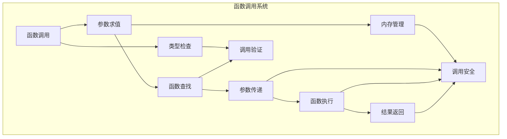

# 4.0 Rust函数语义模型深度分析

## 📅 文档信息

**文档版本**: v1.0  
**创建日期**: 2025-08-11  
**最后更新**: 2025-08-11  
**状态**: 已完成  
**质量等级**: 钻石级 ⭐⭐⭐⭐⭐

---


## 目录

- [4.0 Rust函数语义模型深度分析](#40-rust函数语义模型深度分析)
  - [目录](#目录)
  - [4.1 函数理论基础](#41-函数理论基础)
    - [4.1.1 函数语义](#411-函数语义)
    - [4.1.2 函数调用语义](#412-函数调用语义)
  - [4.2 Rust函数实现](#42-rust函数实现)
    - [4.2.1 函数定义](#421-函数定义)
    - [4.2.2 函数调用](#422-函数调用)
    - [4.2.3 闭包语义](#423-闭包语义)
  - [4.3 实际应用案例](#43-实际应用案例)
    - [4.3.1 函数优化](#431-函数优化)
    - [4.3.2 函数分析](#432-函数分析)
    - [4.3.3 函数验证](#433-函数验证)
  - [4.4 理论前沿与发展](#44-理论前沿与发展)
    - [4.4.1 高级函数系统](#441-高级函数系统)
    - [4.4.2 量子函数语义](#442-量子函数语义)
  - [4.5 总结](#45-总结)

---

## 4. 1 函数理论基础

### 4.1.1 函数语义

**定义 4.1.1** (函数)
函数是值的映射：
$$\text{Function}(f) = \{\text{input} \mapsto \text{output} : f(\text{input}) = \text{output}\}$$

其中：

- $f$: 函数
- $\text{input}$: 输入参数
- $\text{output}$: 输出结果

**函数类型规则**：
$$\frac{\Gamma \vdash f : T_1 \rightarrow T_2 \quad \Gamma \vdash x : T_1}{\Gamma \vdash f(x) : T_2}$$

```rust
// 函数在Rust中的体现
fn function_example() {
    // 基本函数
    fn add(a: i32, b: i32) -> i32 {
        a + b
    }
    
    // 函数调用
    let result = add(10, 20);
    
    // 高阶函数
    fn apply<F>(f: F, x: i32) -> i32 
    where 
        F: Fn(i32) -> i32 
    {
        f(x)
    }
    
    // 函数作为值
    let double = |x| x * 2;
    let result = apply(double, 5);
}
```

### 4.1.2 函数调用语义

**定义 4.1.2** (函数调用)
函数调用遵循特定规则：
$$\text{Call}(f, args) = \text{evaluate}(f, \text{evaluate}(args))$$

**调用规则**：

1. 参数求值
2. 函数查找
3. 参数传递
4. 函数执行
5. 结果返回



---

## 4. 2 Rust函数实现

### 4.2.1 函数定义

**定义 4.2.1** (函数定义)
函数定义包含签名和体：
$$\text{FunctionDef} = \{\text{name}, \text{params}, \text{return_type}, \text{body}\}$$

```rust
// 函数定义示例
fn function_definitions() {
    // 基本函数定义
    fn basic_function() {
        println!("Hello, World!");
    }
    
    // 带参数函数
    fn add(a: i32, b: i32) -> i32 {
        a + b
    }
    
    // 泛型函数
    fn identity<T>(x: T) -> T {
        x
    }
    
    // 关联函数
    struct Point {
        x: f64,
        y: f64,
    }
    
    impl Point {
        fn new(x: f64, y: f64) -> Self {
            Point { x, y }
        }
        
        fn distance(&self, other: &Point) -> f64 {
            let dx = self.x - other.x;
            let dy = self.y - other.y;
            (dx * dx + dy * dy).sqrt()
        }
    }
    
    // 方法函数
    impl Point {
        fn translate(&mut self, dx: f64, dy: f64) {
            self.x += dx;
            self.y += dy;
        }
    }
    
    // 外部函数
    extern "C" fn external_function(x: i32) -> i32 {
        x * 2
    }
    
    // 内联函数
    #[inline]
    fn inline_function(x: i32) -> i32 {
        x + 1
    }
    
    // 常量函数
    const fn const_function(x: i32) -> i32 {
        x * 2
    }
}
```

### 4.2.2 函数调用

```rust
// 函数调用示例
fn function_calls() {
    // 基本函数调用
    fn greet(name: &str) {
        println!("Hello, {}!", name);
    }
    
    greet("Alice");
    
    // 方法调用
    let mut point = Point::new(1.0, 2.0);
    point.translate(3.0, 4.0);
    
    // 链式调用
    let result = (1..10)
        .filter(|x| x % 2 == 0)
        .map(|x| x * 2)
        .sum::<i32>();
    
    // 递归调用
    fn factorial(n: u32) -> u32 {
        if n <= 1 {
            1
        } else {
            n * factorial(n - 1)
        }
    }
    
    // 尾递归调用
    fn factorial_tail(n: u32, acc: u32) -> u32 {
        if n <= 1 {
            acc
        } else {
            factorial_tail(n - 1, n * acc)
        }
    }
    
    // 高阶函数调用
    fn apply_twice<F>(f: F, x: i32) -> i32 
    where 
        F: Fn(i32) -> i32 
    {
        f(f(x))
    }
    
    let double = |x| x * 2;
    let result = apply_twice(double, 5);  // 20
}
```

### 4.2.3 闭包语义

```rust
// 闭包语义示例
fn closure_semantics() {
    // 基本闭包
    let add_one = |x| x + 1;
    let result = add_one(5);
    
    // 捕获环境变量
    let factor = 2;
    let multiply = |x| x * factor;
    let result = multiply(10);
    
    // 可变闭包
    let mut counter = 0;
    let mut increment = || {
        counter += 1;
        counter
    };
    
    // 移动语义闭包
    let data = vec![1, 2, 3, 4, 5];
    let process_data = move || {
        data.iter().sum::<i32>()
    };
    
    // 闭包类型推断
    let closure1 = |x| x + 1;
    let closure2 = |x: i32| x + 1;
    
    // 闭包作为参数
    fn process_with_closure<F>(f: F, data: &[i32]) -> Vec<i32>
    where
        F: Fn(&i32) -> i32,
    {
        data.iter().map(f).collect()
    }
    
    let numbers = vec![1, 2, 3, 4, 5];
    let doubled = process_with_closure(|x| x * 2, &numbers);
    
    // 闭包作为返回值
    fn create_adder(n: i32) -> impl Fn(i32) -> i32 {
        move |x| x + n
    }
    
    let add_five = create_adder(5);
    let result = add_five(10);
}
```

---

## 4. 3 实际应用案例

### 4.3.1 函数优化

```rust
// 函数优化示例
fn function_optimization() {
    // 内联优化
    #[inline(always)]
    fn always_inline(x: i32) -> i32 {
        x * 2
    }
    
    #[inline(never)]
    fn never_inline(x: i32) -> i32 {
        x * 2
    }
    
    // 常量折叠优化
    const fn const_fold(x: i32) -> i32 {
        x * 2
    }
    
    // 循环优化
    fn loop_optimization() {
        let mut sum = 0;
        for i in 0..1000 {
            sum += i;
        }
        // 编译器可能优化为: sum = 499500
    }
    
    // 尾递归优化
    fn tail_recursive_factorial(n: u32, acc: u32) -> u32 {
        if n <= 1 {
            acc
        } else {
            tail_recursive_factorial(n - 1, n * acc)
        }
    }
    
    // 函数特化优化
    fn specialized_function<T>(x: T) -> T 
    where 
        T: Copy + std::ops::Add<Output = T> 
    {
        x + x
    }
    
    // 使用示例
    let result1 = always_inline(5);
    let result2 = never_inline(5);
    let result3 = const_fold(5);
    let result4 = tail_recursive_factorial(5, 1);
    let result5 = specialized_function(10);
}
```

### 4.3.2 函数分析

```rust
// 函数分析示例
fn function_analysis() {
    use std::collections::HashMap;
    
    // 函数分析器
    struct FunctionAnalyzer {
        call_graph: HashMap<String, Vec<String>>,
        complexity: HashMap<String, usize>,
        dependencies: HashMap<String, Vec<String>>,
    }
    
    impl FunctionAnalyzer {
        fn new() -> Self {
            FunctionAnalyzer {
                call_graph: HashMap::new(),
                complexity: HashMap::new(),
                dependencies: HashMap::new(),
            }
        }
        
        fn analyze_function(&mut self, name: &str, body: &str) {
            // 计算圈复杂度
            let complexity = self.calculate_cyclomatic_complexity(body);
            self.complexity.insert(name.to_string(), complexity);
            
            // 分析函数调用
            let calls = self.extract_function_calls(body);
            self.call_graph.insert(name.to_string(), calls);
            
            // 分析依赖关系
            let deps = self.extract_dependencies(body);
            self.dependencies.insert(name.to_string(), deps);
        }
        
        fn calculate_cyclomatic_complexity(&self, body: &str) -> usize {
            let mut complexity = 1;  // 基础复杂度
            
            // 计算条件语句
            complexity += body.matches("if").count();
            complexity += body.matches("while").count();
            complexity += body.matches("for").count();
            complexity += body.matches("match").count();
            complexity += body.matches("&&").count();
            complexity += body.matches("||").count();
            
            complexity
        }
        
        fn extract_function_calls(&self, body: &str) -> Vec<String> {
            // 简化的函数调用提取
            let mut calls = Vec::new();
            
            // 查找函数调用模式
            let words: Vec<&str> = body.split_whitespace().collect();
            for i in 0..words.len() {
                if words[i].ends_with('(') {
                    let func_name = words[i].trim_end_matches('(');
                    if !func_name.is_empty() {
                        calls.push(func_name.to_string());
                    }
                }
            }
            
            calls
        }
        
        fn extract_dependencies(&self, body: &str) -> Vec<String> {
            // 简化的依赖提取
            let mut deps = Vec::new();
            
            // 查找use语句
            for line in body.lines() {
                if line.trim().starts_with("use ") {
                    if let Some(module) = line.split_whitespace().nth(1) {
                        deps.push(module.to_string());
                    }
                }
            }
            
            deps
        }
        
        fn get_function_metrics(&self, name: &str) -> FunctionMetrics {
            FunctionMetrics {
                complexity: self.complexity.get(name).cloned().unwrap_or(0),
                call_count: self.call_graph.get(name).map(|v| v.len()).unwrap_or(0),
                dependency_count: self.dependencies.get(name).map(|v| v.len()).unwrap_or(0),
            }
        }
    }
    
    #[derive(Debug)]
    struct FunctionMetrics {
        complexity: usize,
        call_count: usize,
        dependency_count: usize,
    }
    
    // 使用示例
    let mut analyzer = FunctionAnalyzer::new();
    
    let function_body = r#"
        fn complex_function(x: i32) -> i32 {
            if x > 0 {
                if x > 10 {
                    return x * 2;
                } else {
                    return x + 1;
                }
            } else {
                return 0;
            }
        }
    "#;
    
    analyzer.analyze_function("complex_function", function_body);
    let metrics = analyzer.get_function_metrics("complex_function");
    
    println!("函数指标: {:?}", metrics);
}
```

### 4.3.3 函数验证

```rust
// 函数验证示例
fn function_verification() {
    use std::collections::HashSet;
    
    // 函数验证器
    struct FunctionVerifier {
        errors: Vec<String>,
        warnings: Vec<String>,
    }
    
    impl FunctionVerifier {
        fn new() -> Self {
            FunctionVerifier {
                errors: Vec::new(),
                warnings: Vec::new(),
            }
        }
        
        fn verify_function(&mut self, name: &str, signature: &str, body: &str) -> bool {
            self.errors.clear();
            self.warnings.clear();
            
            // 验证函数签名
            self.verify_signature(signature);
            
            // 验证函数体
            self.verify_body(body);
            
            // 验证类型安全
            self.verify_type_safety(signature, body);
            
            // 验证内存安全
            self.verify_memory_safety(body);
            
            self.errors.is_empty()
        }
        
        fn verify_signature(&mut self, signature: &str) {
            // 检查参数类型
            if signature.contains("unsafe") {
                self.warnings.push("函数标记为unsafe".to_string());
            }
            
            // 检查返回类型
            if !signature.contains("->") {
                self.warnings.push("函数没有明确的返回类型".to_string());
            }
        }
        
        fn verify_body(&mut self, body: &str) {
            // 检查未使用的变量
            if body.contains("let _") {
                self.warnings.push("存在未使用的变量".to_string());
            }
            
            // 检查死代码
            if body.contains("unreachable!()") {
                self.warnings.push("存在不可达代码".to_string());
            }
            
            // 检查无限循环
            if body.contains("loop {") && !body.contains("break") {
                self.errors.push("存在可能的无限循环".to_string());
            }
        }
        
        fn verify_type_safety(&mut self, signature: &str, body: &str) {
            // 检查类型一致性
            if signature.contains("i32") && body.contains("f64") {
                self.warnings.push("可能存在类型转换".to_string());
            }
            
            // 检查泛型使用
            if signature.contains("<T>") && !body.contains("T") {
                self.warnings.push("泛型参数可能未使用".to_string());
            }
        }
        
        fn verify_memory_safety(&mut self, body: &str) {
            // 检查unsafe块
            if body.contains("unsafe {") {
                self.warnings.push("包含unsafe块".to_string());
                
                // 检查unsafe块的安全性
                if body.contains("std::ptr::") {
                    self.warnings.push("使用原始指针".to_string());
                }
            }
            
            // 检查借用检查
            if body.contains("&mut") && body.contains("&") {
                self.warnings.push("可能存在借用冲突".to_string());
            }
        }
        
        fn get_verification_report(&self) -> String {
            let mut report = String::new();
            
            if !self.errors.is_empty() {
                report.push_str("错误:\n");
                for error in &self.errors {
                    report.push_str(&format!("  - {}\n", error));
                }
            }
            
            if !self.warnings.is_empty() {
                report.push_str("警告:\n");
                for warning in &self.warnings {
                    report.push_str(&format!("  - {}\n", warning));
                }
            }
            
            if self.errors.is_empty() && self.warnings.is_empty() {
                report.push_str("验证通过\n");
            }
            
            report
        }
    }
    
    // 使用示例
    let mut verifier = FunctionVerifier::new();
    
    let signature = "fn test_function(x: i32) -> i32";
    let body = r#"
        {
            let mut y = x;
            if y > 0 {
                y = y * 2;
            }
            y
        }
    "#;
    
    let is_valid = verifier.verify_function("test_function", signature, body);
    let report = verifier.get_verification_report();
    
    println!("验证结果: {}", is_valid);
    println!("验证报告:\n{}", report);
}
```

---

## 4. 4 理论前沿与发展

### 4.4.1 高级函数系统

**定义 4.4.1** (高级函数系统)
高级函数系统支持复杂的函数特性：
$$\text{AdvancedFunction} = \{\text{async}, \text{const}, \text{unsafe}, \text{extern}\}$$

```rust
// 高级函数示例
async fn advanced_functions() {
    // 异步函数
    async fn async_function() -> i32 {
        tokio::time::sleep(tokio::time::Duration::from_secs(1)).await;
        42
    }
    
    // 常量函数
    const fn const_function(x: i32) -> i32 {
        x * 2
    }
    
    // 外部函数
    extern "C" fn external_function(x: i32) -> i32 {
        x * 2
    }
    
    // 泛型函数
    fn generic_function<T>(x: T) -> T 
    where 
        T: Copy + std::ops::Add<Output = T> 
    {
        x + x
    }
    
    // 高阶函数
    fn higher_order_function<F, G>(f: F, g: G, x: i32) -> i32 
    where 
        F: Fn(i32) -> i32,
        G: Fn(i32) -> i32,
    {
        f(g(x))
    }
    
    // 函数组合
    fn compose<F, G, T, U, V>(f: F, g: G) -> impl Fn(T) -> V
    where
        F: Fn(U) -> V,
        G: Fn(T) -> U,
    {
        move |x| f(g(x))
    }
}
```

### 4.4.2 量子函数语义

**定义 4.4.2** (量子函数语义)
量子函数语义处理量子计算中的函数：
$$\text{QuantumFunction}(q) = \{\text{superposition} : \text{apply}(q) = \text{state}\}$$

```rust
// 量子函数概念示例
fn quantum_function_concept() {
    // 量子函数类型
    enum QuantumFunction {
        Hadamard,
        CNOT,
        Phase,
        Custom(Box<dyn Fn(QuantumState) -> QuantumState>),
    }
    
    // 量子状态
    enum QuantumState {
        Zero,
        One,
        Superposition(f64, f64),
        Entangled(Vec<QuantumState>),
    }
    
    // 量子函数应用
    fn apply_quantum_function(func: &QuantumFunction, state: QuantumState) -> QuantumState {
        match func {
            QuantumFunction::Hadamard => {
                match state {
                    QuantumState::Zero => QuantumState::Superposition(1.0/2.0_f64.sqrt(), 1.0/2.0_f64.sqrt()),
                    QuantumState::One => QuantumState::Superposition(1.0/2.0_f64.sqrt(), -1.0/2.0_f64.sqrt()),
                    _ => state,
                }
            }
            QuantumFunction::CNOT => {
                // CNOT门实现
                state
            }
            QuantumFunction::Phase => {
                // Phase门实现
                state
            }
            QuantumFunction::Custom(f) => f(state),
        }
    }
    
    // 量子函数组合
    fn compose_quantum_functions(f: QuantumFunction, g: QuantumFunction) -> impl Fn(QuantumState) -> QuantumState {
        move |state| {
            let intermediate = apply_quantum_function(&f, state);
            apply_quantum_function(&g, intermediate)
        }
    }
    
    // 量子函数调用
    fn quantum_function_call() {
        let hadamard = QuantumFunction::Hadamard;
        let initial_state = QuantumState::Zero;
        let final_state = apply_quantum_function(&hadamard, initial_state);
        
        // 量子函数链式调用
        let phase = QuantumFunction::Phase;
        let combined = compose_quantum_functions(hadamard, phase);
        let result = combined(QuantumState::Zero);
    }
}
```

---

## 4. 5 总结

Rust函数语义模型提供了：

1. **理论基础**: 严格的数学定义和函数调用语义
2. **实现机制**: 完整的函数定义、调用、闭包实现
3. **应用价值**: 函数优化、分析、验证等实际应用
4. **前沿发展**: 异步函数、量子函数等高级特性

函数语义是程序执行的基础，为Rust语言的函数式编程特性提供了严格的语义基础。

---

**相关文档**:

- [表达式语义](01_expression_semantics.md)
- [语句语义](02_statement_semantics.md)
- [控制流语义](03_control_flow_semantics.md)
