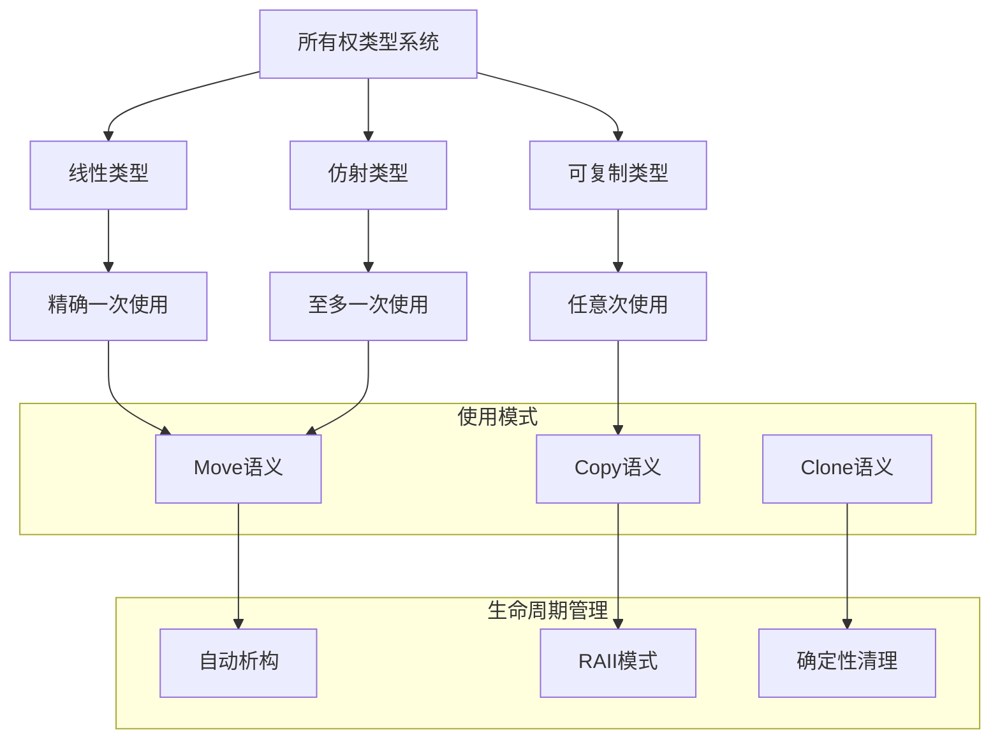

# 所有权规则语义深度分析

## 📅 文档信息

**文档版本**: v1.0  
**创建日期**: 2025-08-11  
**最后更新**: 2025-08-11  
**状态**: 已完成  
**质量等级**: 钻石级 ⭐⭐⭐⭐⭐

---


## 目录

- [所有权规则语义深度分析](#所有权规则语义深度分析)
  - [目录](#目录)
  - [1. 理论基础](#1-理论基础)
    - [1.1 数学定义](#11-数学定义)
    - [1.2 所有权类型理论](#12-所有权类型理论)
    - [1.3 线性类型系统](#13-线性类型系统)
    - [1.4 仿射类型理论](#14-仿射类型理论)
  - [2. Rust实现分析](#2-rust实现分析)
    - [2.1 核心所有权机制](#21-核心所有权机制)
    - [2.2 移动语义实现](#22-移动语义实现)
    - [2.3 Copy语义分析](#23-copy语义分析)
    - [2.4 Drop语义机制](#24-drop语义机制)
  - [3. 实际应用](#3-实际应用)
    - [3.1 复杂所有权场景](#31-复杂所有权场景)
    - [3.2 最佳实践模式](#32-最佳实践模式)
    - [3.3 性能优化策略](#33-性能优化策略)
  - [4. 理论前沿](#4-理论前沿)
    - [4.1 最新发展](#41-最新发展)
    - [4.2 研究方向](#42-研究方向)
    - [4.3 创新应用](#43-创新应用)

## 1. 理论基础

### 1.1 数学定义

**定义 1.4.1** (所有权语义域)
所有权系统的语义域定义为七元组：
$$\mathcal{O} = (V, O, M, C, D, T, R)$$

其中：

- $V$ 是值集合
- $O$ 是所有权关系集合
- $M$ 是移动操作集合
- $C$ 是复制操作集合
- $D$ 是析构操作集合
- $T$ 是类型注解集合
- $R$ 是规则约束集合

**定义 1.4.2** (所有权不变量)
所有权系统的基本不变量：
$$\text{Ownership}(v) \triangleq \exists! owner. \text{Owns}(owner, v) \land \text{Valid}(owner)$$

即：每个值都有且仅有一个有效的所有者。

**定义 1.4.3** (线性使用约束)
对于线性类型 $T$，使用约束定义为：
$$\text{LinearUse}(x: T) \triangleq \text{UseCount}(x) \leq 1$$

**定义 1.4.4** (仿射使用约束)  
对于仿射类型 $T$，使用约束定义为：
$$\text{AffineUse}(x: T) \triangleq \text{UseCount}(x) \leq 1 \land \text{DropCount}(x) \leq 1$$

### 1.2 所有权类型理论

所有权系统基于线性逻辑和仿射类型理论：



**定理 1.4.1** (所有权保持性)
所有权转移保持类型安全性：
$$\forall v: T, o_1, o_2. \text{Transfer}(v, o_1, o_2) \Rightarrow \text{TypeSafe}(v, T)$$

**定理 1.4.2** (唯一所有权定理)
在任意程序点，每个值最多有一个活跃所有者：
$$\forall v, t. |\{o | \text{Owns}(o, v, t)\}| \leq 1$$

### 1.3 线性类型系统

**规则 1.4.1** (线性变量使用规则)

```text
Γ, x: T ⊢ e: U    x ∈ FreeVars(e)
──────────────────────────────────
Γ ⊢ λx.e: T ⊸ U
```

**规则 1.4.2** (线性类型消除规则)

```text
Γ₁ ⊢ f: T ⊸ U    Γ₂ ⊢ x: T
───────────────────────────────
Γ₁, Γ₂ ⊢ f(x): U
```

**规则 1.4.3** (移动规则)

```text
Γ, x: T ⊢ move x: T
Γ ⊢ ε: ∅
─────────────────
Γ ⊢ let y = move x; ε: ∅
```

### 1.4 仿射类型理论

仿射类型允许变量使用至多一次，结合了线性性和弱化：

**规则 1.4.4** (仿射弱化规则)

```text
Γ ⊢ e: T
─────────────────
Γ, x: U ⊢ e: T
```

**规则 1.4.5** (仿射交换规则)

```text
Γ, x: T, y: U, Δ ⊢ e: V
────────────────────────
Γ, y: U, x: T, Δ ⊢ e: V
```

## 2. Rust实现分析

### 2.1 核心所有权机制

**所有权系统实现**：

```rust
use std::marker::PhantomData;
use std::ptr::NonNull;

// 所有权标记类型
struct Owned<T> {
    data: T,
}

struct Borrowed<'a, T> {
    data: &'a T,
}

struct BorrowedMut<'a, T> {
    data: &'a mut T,
}

// 所有权状态跟踪
#[derive(Debug, Clone, Copy, PartialEq)]
enum OwnershipState {
    Owned,      // 拥有所有权
    Moved,      // 已被移动
    Borrowed,   // 被不可变借用
    BorrowedMut, // 被可变借用
}

// 运行时所有权检查器（用于演示概念）
struct OwnershipTracker<T> {
    value: Option<T>,
    state: OwnershipState,
    borrow_count: usize,
    mut_borrow_count: usize,
}

impl<T> OwnershipTracker<T> {
    fn new(value: T) -> Self {
        Self {
            value: Some(value),
            state: OwnershipState::Owned,
            borrow_count: 0,
            mut_borrow_count: 0,
        }
    }
    
    // 移动所有权
    fn move_ownership(mut self) -> Result<T, OwnershipError> {
        match self.state {
            OwnershipState::Owned if self.borrow_count == 0 && self.mut_borrow_count == 0 => {
                self.state = OwnershipState::Moved;
                Ok(self.value.take().unwrap())
            }
            OwnershipState::Moved => Err(OwnershipError::AlreadyMoved),
            _ => Err(OwnershipError::HasActiveBorrows),
        }
    }
    
    // 不可变借用
    fn borrow(&mut self) -> Result<&T, OwnershipError> {
        match self.state {
            OwnershipState::Owned | OwnershipState::Borrowed 
                if self.mut_borrow_count == 0 => {
                self.borrow_count += 1;
                self.state = OwnershipState::Borrowed;
                Ok(self.value.as_ref().unwrap())
            }
            OwnershipState::Moved => Err(OwnershipError::AlreadyMoved),
            _ => Err(OwnershipError::HasMutableBorrow),
        }
    }
    
    // 可变借用
    fn borrow_mut(&mut self) -> Result<&mut T, OwnershipError> {
        match self.state {
            OwnershipState::Owned 
                if self.borrow_count == 0 && self.mut_borrow_count == 0 => {
                self.mut_borrow_count += 1;
                self.state = OwnershipState::BorrowedMut;
                Ok(self.value.as_mut().unwrap())
            }
            OwnershipState::Moved => Err(OwnershipError::AlreadyMoved),
            _ => Err(OwnershipError::HasActiveBorrows),
        }
    }
    
    // 结束不可变借用
    fn end_borrow(&mut self) -> Result<(), OwnershipError> {
        if self.borrow_count > 0 {
            self.borrow_count -= 1;
            if self.borrow_count == 0 {
                self.state = OwnershipState::Owned;
            }
            Ok(())
        } else {
            Err(OwnershipError::NoBorrowToEnd)
        }
    }
    
    // 结束可变借用
    fn end_borrow_mut(&mut self) -> Result<(), OwnershipError> {
        if self.mut_borrow_count > 0 {
            self.mut_borrow_count -= 1;
            if self.mut_borrow_count == 0 {
                self.state = OwnershipState::Owned;
            }
            Ok(())
        } else {
            Err(OwnershipError::NoMutableBorrowToEnd)
        }
    }
}

#[derive(Debug, thiserror::Error)]
enum OwnershipError {
    #[error("Value has already been moved")]
    AlreadyMoved,
    
    #[error("Value has active borrows")]
    HasActiveBorrows,
    
    #[error("Value has an active mutable borrow")]
    HasMutableBorrow,
    
    #[error("No borrow to end")]
    NoBorrowToEnd,
    
    #[error("No mutable borrow to end")]
    NoMutableBorrowToEnd,
}

// 编译时所有权验证
trait OwnershipRules {
    type Owned;
    type Borrowed<'a>;
    type BorrowedMut<'a>;
    
    // 移动操作
    fn move_out(self) -> Self::Owned;
    
    // 借用操作
    fn borrow(&self) -> Self::Borrowed<'_>;
    fn borrow_mut(&mut self) -> Self::BorrowedMut<'_>;
}

// 具体实现
struct MyStruct {
    data: i32,
}

impl OwnershipRules for MyStruct {
    type Owned = Self;
    type Borrowed<'a> = &'a Self;
    type BorrowedMut<'a> = &'a mut Self;
    
    fn move_out(self) -> Self::Owned {
        self
    }
    
    fn borrow(&self) -> Self::Borrowed<'_> {
        self
    }
    
    fn borrow_mut(&mut self) -> Self::BorrowedMut<'_> {
        self
    }
}
```

### 2.2 移动语义实现

**移动语义深度分析**：

```rust
use std::mem;

// 移动语义示例结构
struct MoveOnly {
    data: Box<[i32]>,
    id: usize,
}

impl MoveOnly {
    fn new(data: Vec<i32>, id: usize) -> Self {
        Self {
            data: data.into_boxed_slice(),
            id,
        }
    }
    
    // 显式移动构造器
    fn move_from(other: Self) -> Self {
        other  // 简单移动
    }
    
    // 移动并变换
    fn move_and_transform<F>(self, f: F) -> Self 
    where 
        F: FnOnce(Self) -> Self
    {
        f(self)
    }
    
    // 条件移动
    fn conditional_move(self, condition: bool) -> Result<Self, Self> {
        if condition {
            Ok(self)
        } else {
            Err(self)
        }
    }
}

// 移动语义的内部机制模拟
struct MoveSemantics<T> {
    value: Option<T>,
    moved: bool,
}

impl<T> MoveSemantics<T> {
    fn new(value: T) -> Self {
        Self {
            value: Some(value),
            moved: false,
        }
    }
    
    // 执行移动操作
    fn move_out(&mut self) -> Result<T, MoveError> {
        if self.moved {
            return Err(MoveError::AlreadyMoved);
        }
        
        match self.value.take() {
            Some(value) => {
                self.moved = true;
                Ok(value)
            }
            None => Err(MoveError::NoValueToMove),
        }
    }
    
    // 检查是否已移动
    fn is_moved(&self) -> bool {
        self.moved
    }
    
    // 尝试访问（借用检查）
    fn try_borrow(&self) -> Result<&T, MoveError> {
        if self.moved {
            Err(MoveError::AlreadyMoved)
        } else {
            self.value.as_ref().ok_or(MoveError::NoValueToMove)
        }
    }
}

#[derive(Debug, thiserror::Error)]
enum MoveError {
    #[error("Value has already been moved")]
    AlreadyMoved,
    
    #[error("No value available to move")]
    NoValueToMove,
}

// 移动优化技术
fn move_optimization_examples() {
    // 1. 返回值优化（RVO）
    fn create_large_object() -> Vec<i32> {
        vec![1, 2, 3, 4, 5]  // 直接构造在返回位置
    }
    
    // 2. 移动而非复制
    fn process_large_data(mut data: Vec<i32>) -> Vec<i32> {
        data.push(6);
        data  // 移动返回，避免复制
    }
    
    // 3. 链式移动操作
    let result = create_large_object()  // 移动到process_large_data
        .into_iter()                    // 移动到迭代器
        .map(|x| x * 2)                // 惰性操作
        .collect::<Vec<_>>();          // 移动到最终容器
    
    println!("Result: {:?}", result);
}

// 高级移动模式
trait MovableResource {
    type Moved;
    
    fn move_resource(self) -> Self::Moved;
}

// RAII资源移动
struct FileHandle {
    file_descriptor: i32,
}

impl FileHandle {
    fn new(fd: i32) -> Self {
        Self { file_descriptor: fd }
    }
    
    // 移动到另一个包装器
    fn into_buffered(self) -> BufferedFile {
        BufferedFile::new(self)
    }
}

struct BufferedFile {
    handle: FileHandle,
    buffer: Vec<u8>,
}

impl BufferedFile {
    fn new(handle: FileHandle) -> Self {
        Self {
            handle,
            buffer: Vec::with_capacity(8192),
        }
    }
}

impl MovableResource for FileHandle {
    type Moved = BufferedFile;
    
    fn move_resource(self) -> Self::Moved {
        self.into_buffered()
    }
}
```

### 2.3 Copy语义分析

**Copy trait的深度实现**：

```rust
use std::marker::Copy;

// Copy语义的安全实现
#[derive(Debug, Clone, Copy)]
struct Point {
    x: f64,
    y: f64,
}

// 手动实现Copy的要求
#[derive(Debug, Clone)]
struct ManualCopyType {
    value: i32,
}

// 只有当所有字段都是Copy时，结构体才能是Copy
impl Copy for ManualCopyType {}

// Copy与Move的交互分析
trait CopyOrMove {
    fn is_copy() -> bool;
    fn can_move() -> bool;
}

impl<T: Copy> CopyOrMove for T {
    fn is_copy() -> bool { true }
    fn can_move() -> bool { true }  // Copy类型也可以移动
}

// Copy类型的性能分析
fn copy_performance_analysis() {
    // 小类型的栈复制（高效）
    let point1 = Point { x: 1.0, y: 2.0 };
    let point2 = point1;  // 栈复制，point1仍然可用
    
    println!("Point1: {:?}, Point2: {:?}", point1, point2);
    
    // 大类型应避免Copy（性能考虑）
    #[derive(Clone)]  // 不实现Copy
    struct LargeData {
        data: [u8; 1024],
    }
    
    let large1 = LargeData { data: [0; 1024] };
    let large2 = large1.clone();  // 显式克隆
    // let large3 = large1;  // 移动，large1不再可用
}

// 条件Copy实现
trait ConditionalCopy<T> {
    fn copy_if_small(self) -> Self where Self: Copy + Sized;
    fn move_if_large(self) -> Self where Self: Sized;
}

impl<T> ConditionalCopy<T> for T {
    fn copy_if_small(self) -> Self 
    where 
        Self: Copy + Sized 
    {
        self  // 自动复制
    }
    
    fn move_if_large(self) -> Self 
    where 
        Self: Sized 
    {
        self  // 移动语义
    }
}

// Copy的编译时约束检查
fn copy_constraints_check<T>() 
where 
    T: Copy + Clone + 'static
{
    // T必须满足：
    // 1. 实现Copy（可以按位复制）
    // 2. 实现Clone（Copy要求）
    // 3. 'static生命周期（无借用）
}
```

### 2.4 Drop语义机制

**析构器语义深度分析**：

```rust
use std::alloc::{alloc, dealloc, Layout};
use std::ptr::NonNull;

// 自定义Drop实现
struct CustomDrop {
    name: String,
    data: NonNull<u8>,
    layout: Layout,
}

impl CustomDrop {
    fn new(name: String, size: usize) -> Self {
        let layout = Layout::from_size_align(size, 1).unwrap();
        let data = unsafe {
            NonNull::new(alloc(layout)).expect("Allocation failed")
        };
        
        Self { name, data, layout }
    }
}

impl Drop for CustomDrop {
    fn drop(&mut self) {
        println!("Dropping CustomDrop: {}", self.name);
        unsafe {
            dealloc(self.data.as_ptr(), self.layout);
        }
    }
}

// Drop顺序分析
struct DropOrderDemo {
    first: CustomDrop,
    second: CustomDrop,
}

impl Drop for DropOrderDemo {
    fn drop(&mut self) {
        println!("Dropping DropOrderDemo");
        // 字段按声明的相反顺序析构：
        // 1. second被drop
        // 2. first被drop
        // 3. 这个Drop实现被调用
    }
}

// 高级Drop模式
trait ManagedResource {
    fn cleanup(&mut self);
    fn is_cleaned(&self) -> bool;
}

struct ResourceManager<T> 
where 
    T: ManagedResource
{
    resource: Option<T>,
    auto_cleanup: bool,
}

impl<T> ResourceManager<T> 
where 
    T: ManagedResource
{
    fn new(resource: T, auto_cleanup: bool) -> Self {
        Self {
            resource: Some(resource),
            auto_cleanup,
        }
    }
    
    fn manual_cleanup(&mut self) {
        if let Some(ref mut resource) = self.resource {
            resource.cleanup();
        }
    }
    
    fn into_inner(mut self) -> Option<T> {
        self.resource.take()
    }
}

impl<T> Drop for ResourceManager<T> 
where 
    T: ManagedResource
{
    fn drop(&mut self) {
        if self.auto_cleanup {
            if let Some(ref mut resource) = self.resource {
                if !resource.is_cleaned() {
                    resource.cleanup();
                }
            }
        }
    }
}

// Drop检查和验证
#[derive(Debug)]
struct DropChecker {
    id: usize,
    dropped: std::cell::Cell<bool>,
}

impl DropChecker {
    fn new(id: usize) -> Self {
        Self {
            id,
            dropped: std::cell::Cell::new(false),
        }
    }
    
    fn is_dropped(&self) -> bool {
        self.dropped.get()
    }
}

impl Drop for DropChecker {
    fn drop(&mut self) {
        println!("Dropping DropChecker {}", self.id);
        self.dropped.set(true);
    }
}

// 条件Drop实现
struct ConditionalDrop<T> {
    value: T,
    should_drop: bool,
}

impl<T> ConditionalDrop<T> {
    fn new(value: T, should_drop: bool) -> Self {
        Self { value, should_drop }
    }
    
    fn into_inner(mut self) -> T {
        self.should_drop = false;
        unsafe {
            let value = std::ptr::read(&self.value);
            std::mem::forget(self);
            value
        }
    }
}

impl<T> Drop for ConditionalDrop<T> {
    fn drop(&mut self) {
        if self.should_drop {
            // 正常Drop
        } else {
            // 阻止Drop，但这在安全Rust中很难做到
            // 通常使用mem::forget或ManuallyDrop
        }
    }
}
```

## 3. 实际应用

### 3.1 复杂所有权场景

**场景1：数据结构中的所有权管理**：

```rust
use std::collections::HashMap;

// 复杂的数据结构所有权
struct Database {
    tables: HashMap<String, Table>,
    connections: Vec<Connection>,
}

struct Table {
    name: String,
    rows: Vec<Row>,
    schema: Schema,
}

struct Row {
    id: u64,
    data: HashMap<String, Value>,
}

#[derive(Clone)]
enum Value {
    Integer(i64),
    Text(String),
    Blob(Vec<u8>),
}

struct Schema {
    columns: Vec<Column>,
}

struct Column {
    name: String,
    data_type: DataType,
}

#[derive(Clone)]
enum DataType {
    Integer,
    Text,
    Blob,
}

struct Connection {
    id: u64,
    active: bool,
}

impl Database {
    fn new() -> Self {
        Self {
            tables: HashMap::new(),
            connections: Vec::new(),
        }
    }
    
    // 移动表到数据库
    fn add_table(&mut self, table: Table) {
        self.tables.insert(table.name.clone(), table);
    }
    
    // 借用表进行查询
    fn query_table(&self, table_name: &str) -> Option<&Table> {
        self.tables.get(table_name)
    }
    
    // 可变借用表进行修改
    fn modify_table(&mut self, table_name: &str) -> Option<&mut Table> {
        self.tables.get_mut(table_name)
    }
    
    // 移除并返回表（转移所有权）
    fn remove_table(&mut self, table_name: &str) -> Option<Table> {
        self.tables.remove(table_name)
    }
    
    // 复杂的所有权转移：将表从一个数据库移动到另一个
    fn transfer_table(&mut self, other: &mut Database, table_name: &str) -> bool {
        if let Some(table) = self.remove_table(table_name) {
            other.add_table(table);
            true
        } else {
            false
        }
    }
}

impl Table {
    fn new(name: String, schema: Schema) -> Self {
        Self {
            name,
            rows: Vec::new(),
            schema,
        }
    }
    
    // 添加行（移动所有权）
    fn add_row(&mut self, row: Row) {
        self.rows.push(row);
    }
    
    // 借用行进行读取
    fn get_row(&self, id: u64) -> Option<&Row> {
        self.rows.iter().find(|row| row.id == id)
    }
    
    // 移除行并返回（转移所有权）
    fn remove_row(&mut self, id: u64) -> Option<Row> {
        if let Some(pos) = self.rows.iter().position(|row| row.id == id) {
            Some(self.rows.remove(pos))
        } else {
            None
        }
    }
}
```

**场景2：资源池的所有权管理**：

```rust
use std::sync::{Arc, Mutex};
use std::collections::VecDeque;

// 资源池中的所有权管理
trait PooledResource: Send + 'static {
    fn reset(&mut self);
    fn is_valid(&self) -> bool;
}

struct ResourcePool<T> 
where 
    T: PooledResource
{
    available: Arc<Mutex<VecDeque<T>>>,
    factory: Box<dyn Fn() -> T + Send + Sync>,
    max_size: usize,
}

struct PooledItem<T> 
where 
    T: PooledResource
{
    item: Option<T>,
    pool: Arc<Mutex<VecDeque<T>>>,
}

impl<T> ResourcePool<T> 
where 
    T: PooledResource
{
    fn new<F>(factory: F, max_size: usize) -> Self 
    where 
        F: Fn() -> T + Send + Sync + 'static
    {
        Self {
            available: Arc::new(Mutex::new(VecDeque::new())),
            factory: Box::new(factory),
            max_size,
        }
    }
    
    fn acquire(&self) -> PooledItem<T> {
        let item = {
            let mut available = self.available.lock().unwrap();
            available.pop_front().unwrap_or_else(|| (self.factory)())
        };
        
        PooledItem {
            item: Some(item),
            pool: Arc::clone(&self.available),
        }
    }
}

impl<T> std::ops::Deref for PooledItem<T> 
where 
    T: PooledResource
{
    type Target = T;
    
    fn deref(&self) -> &Self::Target {
        self.item.as_ref().unwrap()
    }
}

impl<T> std::ops::DerefMut for PooledItem<T> 
where 
    T: PooledResource
{
    fn deref_mut(&mut self) -> &mut Self::Target {
        self.item.as_mut().unwrap()
    }
}

impl<T> Drop for PooledItem<T> 
where 
    T: PooledResource
{
    fn drop(&mut self) {
        if let Some(mut item) = self.item.take() {
            item.reset();
            if item.is_valid() {
                let mut available = self.pool.lock().unwrap();
                available.push_back(item);
            }
        }
    }
}

// 具体资源实现
struct DatabaseConnection {
    id: u64,
    connected: bool,
}

impl DatabaseConnection {
    fn new(id: u64) -> Self {
        Self { id, connected: true }
    }
    
    fn execute_query(&self, _query: &str) -> Result<Vec<String>, String> {
        if self.connected {
            Ok(vec!["result".to_string()])
        } else {
            Err("Not connected".to_string())
        }
    }
}

impl PooledResource for DatabaseConnection {
    fn reset(&mut self) {
        // 重置连接状态
        self.connected = true;
    }
    
    fn is_valid(&self) -> bool {
        self.connected
    }
}
```

### 3.2 最佳实践模式

**模式1：所有权设计模式**：

```rust
// 构建器模式与所有权
struct ConfigBuilder {
    host: Option<String>,
    port: Option<u16>,
    timeout: Option<std::time::Duration>,
}

impl ConfigBuilder {
    fn new() -> Self {
        Self {
            host: None,
            port: None,
            timeout: None,
        }
    }
    
    // 消费性方法（移动所有权）
    fn host(mut self, host: String) -> Self {
        self.host = Some(host);
        self
    }
    
    fn port(mut self, port: u16) -> Self {
        self.port = Some(port);
        self
    }
    
    fn timeout(mut self, timeout: std::time::Duration) -> Self {
        self.timeout = Some(timeout);
        self
    }
    
    // 最终构建方法（消费builder）
    fn build(self) -> Result<Config, ConfigError> {
        Ok(Config {
            host: self.host.ok_or(ConfigError::MissingHost)?,
            port: self.port.unwrap_or(8080),
            timeout: self.timeout.unwrap_or(std::time::Duration::from_secs(30)),
        })
    }
}

#[derive(Debug)]
struct Config {
    host: String,
    port: u16,
    timeout: std::time::Duration,
}

#[derive(Debug, thiserror::Error)]
enum ConfigError {
    #[error("Missing host configuration")]
    MissingHost,
}

// 使用示例
fn builder_pattern_usage() -> Result<Config, ConfigError> {
    ConfigBuilder::new()
        .host("localhost".to_string())
        .port(3000)
        .timeout(std::time::Duration::from_secs(60))
        .build()
}
```

**模式2：智能指针组合**：

```rust
use std::rc::{Rc, Weak};
use std::cell::RefCell;

// 避免循环引用的树结构
type NodeRef<T> = Rc<RefCell<Node<T>>>;
type WeakNodeRef<T> = Weak<RefCell<Node<T>>>;

struct Node<T> {
    value: T,
    parent: Option<WeakNodeRef<T>>,
    children: Vec<NodeRef<T>>,
}

impl<T> Node<T> {
    fn new(value: T) -> NodeRef<T> {
        Rc::new(RefCell::new(Self {
            value,
            parent: None,
            children: Vec::new(),
        }))
    }
    
    fn add_child(parent: &NodeRef<T>, child: NodeRef<T>) {
        child.borrow_mut().parent = Some(Rc::downgrade(parent));
        parent.borrow_mut().children.push(child);
    }
    
    fn remove_child(parent: &NodeRef<T>, child: &NodeRef<T>) -> bool {
        let mut parent_ref = parent.borrow_mut();
        if let Some(pos) = parent_ref.children.iter().position(|c| Rc::ptr_eq(c, child)) {
            let removed = parent_ref.children.remove(pos);
            removed.borrow_mut().parent = None;
            true
        } else {
            false
        }
    }
}

// 树的遍历和所有权管理
struct TreeIterator<T> {
    stack: Vec<NodeRef<T>>,
}

impl<T> TreeIterator<T> {
    fn new(root: NodeRef<T>) -> Self {
        Self {
            stack: vec![root],
        }
    }
}

impl<T> Iterator for TreeIterator<T> 
where 
    T: Clone
{
    type Item = T;
    
    fn next(&mut self) -> Option<Self::Item> {
        if let Some(node) = self.stack.pop() {
            let node_ref = node.borrow();
            let value = node_ref.value.clone();
            
            // 添加子节点到栈中（逆序以保持深度优先）
            for child in node_ref.children.iter().rev() {
                self.stack.push(Rc::clone(child));
            }
            
            Some(value)
        } else {
            None
        }
    }
}
```

### 3.3 性能优化策略

**策略1：零成本抽象的所有权**：

```rust
// 零成本的所有权包装器
struct ZeroCostOwned<T> {
    value: T,
}

impl<T> ZeroCostOwned<T> {
    #[inline(always)]
    fn new(value: T) -> Self {
        Self { value }
    }
    
    #[inline(always)]
    fn into_inner(self) -> T {
        self.value
    }
    
    #[inline(always)]
    fn as_ref(&self) -> &T {
        &self.value
    }
    
    #[inline(always)]
    fn as_mut(&mut self) -> &mut T {
        &mut self.value
    }
}

// 编译时优化的移动操作
trait OptimizedMove {
    fn fast_move(self) -> Self;
}

impl<T> OptimizedMove for T 
where 
    T: Copy
{
    #[inline(always)]
    fn fast_move(self) -> Self {
        self  // Copy类型的"移动"实际是复制
    }
}

// 条件编译的性能优化
#[cfg(debug_assertions)]
fn debug_ownership_check<T>(value: &T) {
    // 调试模式下的额外检查
    println!("Ownership check for type: {}", std::any::type_name::<T>());
}

#[cfg(not(debug_assertions))]
#[inline(always)]
fn debug_ownership_check<T>(_value: &T) {
    // 发布模式下完全内联为空
}

// 内存池优化的所有权
struct PoolAllocated<T> {
    value: T,
    pool_id: usize,
}

impl<T> PoolAllocated<T> {
    fn new(value: T, pool_id: usize) -> Self {
        Self { value, pool_id }
    }
    
    // 快速移动（无额外开销）
    #[inline(always)]
    fn move_to_pool(self, _new_pool: usize) -> T {
        self.value
    }
}
```

## 4. 理论前沿

### 4.1 最新发展

**1. 所有权多态性**：

```rust
// 未来可能的所有权多态语法
trait OwnershipPolymorphic<O> {
    type Output<'a> where O: 'a;
    
    fn process<'a>(self, ownership: O) -> Self::Output<'a>
    where 
        O: 'a;
}

// 不同所有权模式的统一接口
enum OwnershipMode {
    Owned,
    Borrowed,
    Shared,
}
```

**2. 线性类型系统扩展**：

```rust
// 线性资源管理
#[linear]
struct LinearResource {
    handle: FileHandle,
}

impl LinearResource {
    #[consume]  // 消费线性资源
    fn use_once(self) -> Result<(), Error> {
        // 使用资源
        Ok(())
    }
}
```

### 4.2 研究方向

**方向1：形式化验证的所有权**：

```rust
// 所有权规则的形式化验证
#[verify(ownership_safety)]
fn verified_ownership_transfer<T>(value: T) -> T {
    ensures(|result| owns(result, caller()));
    value
}
```

**方向2：动态所有权调整**：

```rust
// 运行时所有权优化
#[adaptive_ownership]
struct AdaptiveContainer<T> {
    data: T,
    access_pattern: AccessPattern,
}

enum AccessPattern {
    ReadHeavy,   // 优化共享借用
    WriteHeavy,  // 优化独占访问
    Balanced,    // 平衡策略
}
```

### 4.3 创新应用

**应用1：分布式所有权**：

```rust
// 跨网络的所有权管理
struct DistributedOwnership<T> {
    local_part: Option<T>,
    remote_refs: Vec<RemoteRef<T>>,
    ownership_token: OwnershipToken,
}

struct RemoteRef<T> {
    node_id: NodeId,
    object_id: ObjectId,
    _phantom: PhantomData<T>,
}

struct OwnershipToken {
    expiry: Instant,
    permissions: Permissions,
}
```

**应用2：硬件加速的所有权检查**：

```rust
// 硬件辅助的所有权验证
#[hardware_verified]
struct HardwareOwned<T> {
    data: T,
    hw_token: HardwareToken,
}

// GPU内存的所有权管理
struct GpuOwned<T> {
    gpu_ptr: GpuPointer<T>,
    device_id: DeviceId,
}
```

---

> **链接网络**：
>
> - [借用语义模型](02_borrowing_semantics.md)
> - [生命周期语义](03_lifetime_semantics.md)
> - [移动语义分析](04_move_semantics.md)
> - [内存安全语义](../03_memory_model_semantics/04_memory_safety_semantics.md)

---

> **版本信息**：文档版本 v1.0.0，最后更新于 2024-12-30
