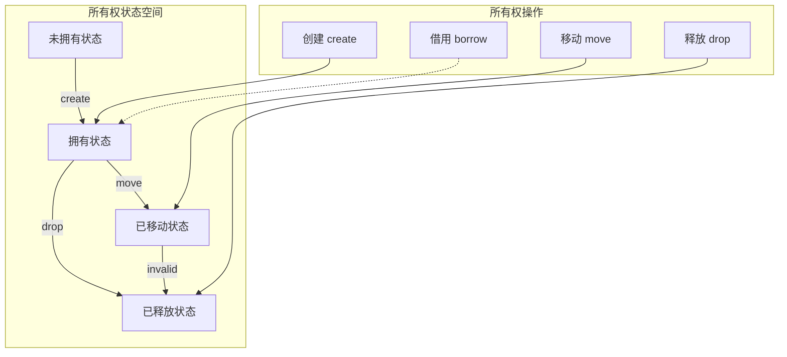
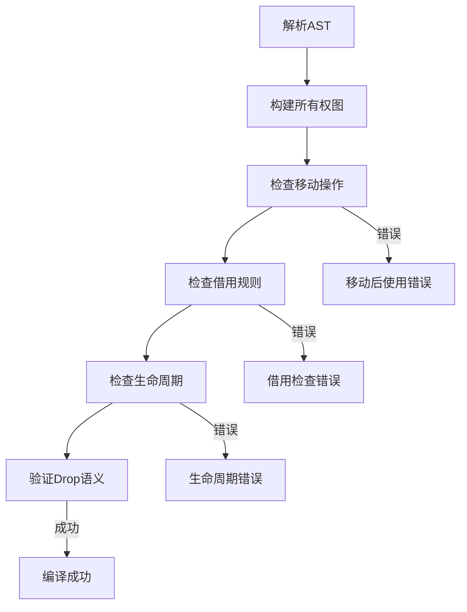

# 1.4.1 Rust所有权规则语义模型深度分析

**文档版本**: V1.0  
**创建日期**: 2025-01-27  
**所属层**: 基础语义层 (Foundation Semantics Layer)  
**父模块**: [1.4 所有权系统语义](../00_ownership_system_index.md)  
**交叉引用**: [1.3.1 内存布局语义](../03_memory_model_semantics/01_memory_layout_semantics.md), [1.1.3 引用类型语义](../01_type_system_semantics/03_reference_types_semantics.md)

---

## 目录

- [1.4.1 Rust所有权规则语义模型深度分析](#141-rust所有权规则语义模型深度分析)
  - [目录](#目录)
  - [1.4.1.1 所有权理论基础](#1411-所有权理论基础)
    - [1.4.1.1.1 所有权语义域的形式化定义](#14111-所有权语义域的形式化定义)
    - [1.4.1.1.2 所有权的核心不变式](#14112-所有权的核心不变式)
    - [1.4.1.1.3 所有权转移的操作语义](#14113-所有权转移的操作语义)
  - [1.4.1.2 所有权规则的数学建模](#1412-所有权规则的数学建模)
    - [1.4.1.2.1 规则1: 唯一所有权](#14121-规则1-唯一所有权)
    - [1.4.1.2.2 规则2: 作用域生命周期](#14122-规则2-作用域生命周期)
    - [1.4.1.2.3 规则3: 移动语义与Copy trait](#14123-规则3-移动语义与copy-trait)
  - [1.4.1.3 函数调用中的所有权语义](#1413-函数调用中的所有权语义)
    - [1.4.1.3.1 值传递所有权转移](#14131-值传递所有权转移)
    - [1.4.1.3.2 借用避免所有权转移](#14132-借用避免所有权转移)
  - [1.4.1.4 所有权与数据结构](#1414-所有权与数据结构)
    - [1.4.1.4.1 结构体字段所有权](#14141-结构体字段所有权)
    - [1.4.1.4.2 集合类型所有权](#14142-集合类型所有权)
  - [1.4.1.5 智能指针与所有权](#1415-智能指针与所有权)
    - [1.4.1.5.1 `Box<T>`的独占所有权](#14151-boxt的独占所有权)
    - [1.4.1.5.2 `Rc<T>`的共享所有权](#14152-rct的共享所有权)
  - [1.4.1.6 所有权检查算法](#1416-所有权检查算法)
    - [1.4.1.6.1 编译期所有权验证](#14161-编译期所有权验证)
    - [1.4.1.6.2 运行时Drop语义](#14162-运行时drop语义)
  - [1.4.1.7 所有权与性能语义](#1417-所有权与性能语义)
    - [1.4.1.7.1 零成本移动语义](#14171-零成本移动语义)
    - [1.4.1.7.2 内存安全保证](#14172-内存安全保证)
  - [1.4.1.8 高级所有权模式](#1418-高级所有权模式)
    - [1.4.1.8.1 所有权包装模式](#14181-所有权包装模式)
    - [1.4.1.8.2 Builder模式与所有权](#14182-builder模式与所有权)
  - [1.4.1.9 错误处理与所有权](#1419-错误处理与所有权)
    - [1.4.1.9.1 Result\<T, E\>与所有权](#14191-resultt-e与所有权)
    - [1.4.1.9.2 `Option<T>`与所有权转移](#14192-optiont与所有权转移)
  - [1.4.1.10 相关引用与扩展阅读](#14110-相关引用与扩展阅读)
    - [1.4.1.10.1 内部交叉引用](#141101-内部交叉引用)
    - [1.4.1.10.2 外部参考文献](#141102-外部参考文献)
    - [1.4.1.10.3 实现参考](#141103-实现参考)

## 1.4.1.1 所有权理论基础

### 1.4.1.1.1 所有权语义域的形式化定义

**定义 1.4.1.1** (所有权语义域)
Rust的所有权系统可形式化为资源管理的代数结构：

$$\text{Ownership} = \langle \text{Resource}, \text{Owner}, \text{Scope}, \text{Transfer}, \text{Drop} \rangle$$

其中：

- $\text{Resource} : \text{Type} \times \text{Value}$ - 被管理的资源
- $\text{Owner} : \text{Variable} \rightarrow \text{Option}(\text{Resource})$ - 所有权映射
- $\text{Scope} : \text{Owner} \rightarrow \text{Lifetime}$ - 作用域边界
- $\text{Transfer} : \text{Owner} \times \text{Owner} \rightarrow \text{Owner}$ - 所有权转移
- $\text{Drop} : \text{Resource} \rightarrow \text{Unit}$ - 资源释放

### 1.4.1.1.2 所有权的核心不变式

**定理 1.4.1.1** (唯一所有权不变式)
对于任意资源 $r$，在任意时刻 $t$，最多存在一个所有者：
$$\forall r \in \text{Resource}, t \in \text{Time} : |\{o \in \text{Owner} | \text{owns}(o, r, t)\}| \leq 1$$

**证明**: 通过归纳法证明所有权操作保持此不变式...



### 1.4.1.1.3 所有权转移的操作语义

**移动语义规则**：
$$\frac{\text{owns}(x, v) \quad \text{assign}(y, x)}{\text{owns}(y, v) \land \neg\text{owns}(x, v)} \text{[MOVE]}$$

$$\frac{\text{owns}(x, v) \quad \text{copy\_trait}(\text{type}(v))}{\text{owns}(x, v) \land \text{owns}(y, \text{copy}(v))} \text{[COPY]}$$

---

## 1.4.1.2 所有权规则的数学建模

### 1.4.1.2.1 规则1: 唯一所有权

每个值都有且仅有一个所有者：

```rust
// 所有权转移示例
fn ownership_transfer() {
    let s1 = String::from("hello");  // s1拥有字符串
    let s2 = s1;                     // 所有权转移到s2
    // println!("{}", s1);           // 编译错误：s1不再有效
    println!("{}", s2);              // 正确：s2现在拥有字符串
}
```

**形式化表示**：
$$\text{owns}(s1, \text{string}) \overset{\text{move}}{\rightarrow} \text{owns}(s2, \text{string}) \land \neg\text{owns}(s1, \text{string})$$

### 1.4.1.2.2 规则2: 作用域生命周期

所有者离开作用域时，值被自动释放：

```rust
fn scope_lifetime() {
    {
        let x = String::from("scope test");
        // x在此作用域内有效
    } // x在此处被drop，内存被释放
    
    // println!("{}", x); // 编译错误：x已超出作用域
}
```

**生命周期语义**：
$$\forall v \in \text{Value}, o \in \text{Owner} : \text{owns}(o, v) \Rightarrow \text{lifetime}(v) \subseteq \text{scope}(o)$$

### 1.4.1.2.3 规则3: 移动语义与Copy trait

```rust
fn move_vs_copy() {
    // 基础类型实现了Copy trait
    let x = 5;
    let y = x;  // 复制，不是移动
    println!("x: {}, y: {}", x, y);  // 两者都有效
    
    // String没有实现Copy trait
    let s1 = String::from("hello");
    let s2 = s1;  // 移动，不是复制
    // println!("{}", s1);  // 编译错误
}
```

**Copy语义条件**：
$$\frac{\text{Copy}(\tau) \quad x : \tau}{\text{assign}(y, x) \Rightarrow \text{owns}(x, v) \land \text{owns}(y, \text{copy}(v))} \text{[COPY-SEMANTICS]}$$

---

## 1.4.1.3 函数调用中的所有权语义

### 1.4.1.3.1 值传递所有权转移

```rust
fn take_ownership(s: String) -> String {
    println!("Taking ownership of: {}", s);
    s  // 返回所有权
}

fn ownership_in_functions() {
    let s1 = String::from("function test");
    let s2 = take_ownership(s1);  // s1的所有权转移到函数
    // println!("{}", s1);        // 编译错误：s1已被移动
    println!("{}", s2);           // s2接收返回的所有权
}
```

**函数调用所有权转移语义**：
$$\frac{\text{owns}(arg, v) \quad \text{call}(f, arg) \quad \text{param}(f, p)}{\text{owns}(p, v) \land \neg\text{owns}(arg, v)} \text{[FUNCTION-MOVE]}$$

### 1.4.1.3.2 借用避免所有权转移

```rust
fn borrow_string(s: &String) -> usize {
    s.len()  // 只是借用，不获取所有权
}

fn borrowing_example() {
    let s1 = String::from("borrowing test");
    let length = borrow_string(&s1);  // 借用s1
    println!("Length: {}, String: {}", length, s1);  // s1仍然有效
}
```

**借用语义**：
$$\frac{\text{owns}(x, v) \quad \text{borrow}(\&x)}{\text{owns}(x, v) \land \text{borrowed}(\&x, v)} \text{[BORROW]}$$

---

## 1.4.1.4 所有权与数据结构

### 1.4.1.4.1 结构体字段所有权

```rust
struct Person {
    name: String,
    age: u32,
}

fn struct_ownership() {
    let person = Person {
        name: String::from("Alice"),
        age: 30,
    };
    
    // 部分移动
    let name = person.name;  // name字段被移动
    // let age = person.age;    // age可以复制，但整个struct已经部分无效
    // println!("{:?}", person); // 编译错误：person部分已被移动
    
    println!("Name: {}", name);
}
```

**结构体所有权规则**：
$$\frac{\text{struct } S \{ f_1: \tau_1, \ldots, f_n: \tau_n \} \quad \text{move}(s.f_i)}{\neg\text{valid}(s) \text{ if } \neg\text{Copy}(\tau_i)} \text{[STRUCT-PARTIAL-MOVE]}$$

### 1.4.1.4.2 集合类型所有权

```rust
fn vector_ownership() {
    let mut v = vec![
        String::from("one"),
        String::from("two"),
        String::from("three"),
    ];
    
    // 移动vector中的元素
    let first = v.remove(0);  // 移动第一个元素
    println!("First: {}", first);
    
    // vector仍然拥有剩余元素
    for item in v {  // 消费v，移动所有剩余元素
        println!("Item: {}", item);
    }
    // v在此处不再有效
}
```

**集合所有权语义**：
$$\frac{\text{Vec}\langle T \rangle \quad \text{owns}(v, \text{vec}) \quad \text{remove}(v, i)}{\text{owns}(\text{result}, v[i]) \land \text{owns}(v, v \setminus \{v[i]\})} \text{[VEC-REMOVE]}$$

---

## 1.4.1.5 智能指针与所有权

### 1.4.1.5.1 `Box<T>`的独占所有权

```rust
fn box_ownership() {
    let boxed = Box::new(String::from("boxed value"));
    let moved_box = boxed;  // Box的所有权转移
    // println!("{}", boxed);  // 编译错误
    println!("{}", moved_box);
    
    // Box在离开作用域时自动释放堆内存
}
```

**Box所有权语义**：
$$\frac{\text{Box}\langle T \rangle \quad \text{owns}(b, \text{box}(v))}{\text{owns}(b, v) \land \text{heap\_allocated}(v)} \text{[BOX-OWNERSHIP]}$$

### 1.4.1.5.2 `Rc<T>`的共享所有权

```rust
use std::rc::Rc;

fn rc_ownership() {
    let shared = Rc::new(String::from("shared value"));
    let clone1 = Rc::clone(&shared);  // 增加引用计数
    let clone2 = Rc::clone(&shared);  // 再次增加引用计数
    
    println!("Reference count: {}", Rc::strong_count(&shared)); // 3
    
    drop(clone1);  // 减少引用计数
    println!("Reference count: {}", Rc::strong_count(&shared)); // 2
    
    // 当最后一个Rc被drop时，值才被释放
}
```

**Rc共享所有权语义**：
$$\frac{\text{Rc}\langle T \rangle \quad \text{clone}(rc)}{\text{ref\_count}(rc) := \text{ref\_count}(rc) + 1} \text{[RC-CLONE]}$$

$$\frac{\text{drop}(rc) \quad \text{ref\_count}(rc) = 1}{\text{deallocate}(\text{value}(rc))} \text{[RC-DROP]}$$

---

## 1.4.1.6 所有权检查算法

### 1.4.1.6.1 编译期所有权验证



**所有权检查算法**：

```text
algorithm OwnershipCheck(ast: AST) -> Result<(), Error> {
    ownership_graph = build_ownership_graph(ast)
    
    for statement in ast.statements {
        match statement {
            Assignment(lhs, rhs) => {
                if !Copy(type(rhs)) {
                    ownership_graph.transfer(rhs, lhs)
                    ownership_graph.invalidate(rhs)
                }
            }
            
            FunctionCall(func, args) => {
                for arg in args {
                    if !is_borrow(arg) && !Copy(type(arg)) {
                        ownership_graph.transfer(arg, func.params[i])
                        ownership_graph.invalidate(arg)
                    }
                }
            }
            
            ScopeEnd(vars) => {
                for var in vars {
                    ownership_graph.drop(var)
                }
            }
        }
        
        validate_ownership_invariants(ownership_graph)?
    }
    
    Ok(())
}
```

### 1.4.1.6.2 运行时Drop语义

```rust
struct CustomDrop {
    data: String,
}

impl Drop for CustomDrop {
    fn drop(&mut self) {
        println!("Dropping CustomDrop with data: {}", self.data);
    }
}

fn drop_semantics() {
    let _custom = CustomDrop {
        data: String::from("custom data"),
    };
    // Drop trait的drop方法在作用域结束时自动调用
}
```

**Drop trait语义**：
$$\frac{\text{Drop}(\tau) \quad x : \tau \quad \text{scope\_end}(x)}{\text{call}(x.\text{drop}()) \land \text{deallocate}(x)} \text{[DROP-TRAIT]}$$

---

## 1.4.1.7 所有权与性能语义

### 1.4.1.7.1 零成本移动语义

```rust
fn zero_cost_moves() {
    let large_vec = vec![0; 1_000_000];  // 大型vector
    let moved_vec = large_vec;           // 零成本移动：只转移指针所有权
    
    // 没有实际的内存复制发生
    println!("Vector length: {}", moved_vec.len());
}
```

**零成本移动定理**：
$$\forall v \in \text{Value} : \text{cost}(\text{move}(v)) = O(1)$$

### 1.4.1.7.2 内存安全保证

**内存安全定理 1.4.1.2** (Use-after-free Prevention)
所有权系统保证不会发生释放后使用错误：
$$\forall v \in \text{Value}, t_1, t_2 \in \text{Time} : \text{dropped}(v, t_1) \land t_2 > t_1 \Rightarrow \neg\text{accessible}(v, t_2)$$

**双重释放预防定理 1.4.1.3**：
$$\forall v \in \text{Value} : |\{\text{drop\_call}(v)\}| \leq 1$$

---

## 1.4.1.8 高级所有权模式

### 1.4.1.8.1 所有权包装模式

```rust
struct Wrapper<T> {
    inner: T,
}

impl<T> Wrapper<T> {
    fn new(value: T) -> Self {
        Wrapper { inner: value }
    }
    
    fn into_inner(self) -> T {  // 消费self，返回内部值
        self.inner
    }
    
    fn get_ref(&self) -> &T {   // 借用内部值
        &self.inner
    }
}

fn wrapper_ownership() {
    let wrapped = Wrapper::new(String::from("wrapped"));
    let reference = wrapped.get_ref();  // 借用
    println!("Reference: {}", reference);
    
    let inner = wrapped.into_inner();   // 消费包装器
    println!("Inner: {}", inner);
}
```

### 1.4.1.8.2 Builder模式与所有权

```rust
struct ConfigBuilder {
    host: Option<String>,
    port: Option<u16>,
    secure: bool,
}

impl ConfigBuilder {
    fn new() -> Self {
        ConfigBuilder {
            host: None,
            port: None,
            secure: false,
        }
    }
    
    fn host(mut self, host: String) -> Self {  // 消费并返回self
        self.host = Some(host);
        self
    }
    
    fn port(mut self, port: u16) -> Self {
        self.port = Some(port);
        self
    }
    
    fn secure(mut self) -> Self {
        self.secure = true;
        self
    }
    
    fn build(self) -> Result<Config, String> {  // 最终消费self
        Config::new(
            self.host.ok_or("Host is required")?,
            self.port.unwrap_or(80),
            self.secure,
        )
    }
}

struct Config {
    host: String,
    port: u16,
    secure: bool,
}

impl Config {
    fn new(host: String, port: u16, secure: bool) -> Result<Self, String> {
        Ok(Config { host, port, secure })
    }
}

fn builder_ownership() -> Result<(), String> {
    let config = ConfigBuilder::new()
        .host("localhost".to_string())
        .port(8080)
        .secure()
        .build()?;
    
    println!("Config: {}:{} (secure: {})", config.host, config.port, config.secure);
    Ok(())
}
```

---

## 1.4.1.9 错误处理与所有权

### 1.4.1.9.1 Result<T, E>与所有权

```rust
fn parse_number(s: String) -> Result<i32, String> {
    s.parse().map_err(|_| format!("Failed to parse: {}", s))
}

fn result_ownership() {
    let input = String::from("42");
    
    match parse_number(input) {  // input的所有权转移到函数
        Ok(num) => println!("Parsed number: {}", num),
        Err(err) => println!("Error: {}", err),
    }
    
    // println!("{}", input);  // 编译错误：input已被移动
}
```

### 1.4.1.9.2 `Option<T>`与所有权转移

```rust
fn option_ownership() {
    let mut opt = Some(String::from("value"));
    
    // take()移动Option内部的值，留下None
    if let Some(value) = opt.take() {
        println!("Taken value: {}", value);
    }
    
    assert_eq!(opt, None);  // opt现在是None
}
```

---

## 1.4.1.10 相关引用与扩展阅读

### 1.4.1.10.1 内部交叉引用

- [1.4.2 借用语义模型](02_borrowing_semantics.md) - 借用系统详细分析
- [1.4.3 生命周期语义](03_lifetime_semantics.md) - 生命周期系统
- [1.3.1 内存布局语义](../03_memory_model_semantics/01_memory_layout_semantics.md) - 内存管理基础

### 1.4.1.10.2 外部参考文献

1. Klabnik, S. & Nichols, C. *The Rust Programming Language*. Chapter 4: Understanding Ownership.
2. Jung, R. et al. *RustBelt: Securing the Foundations of the Rust Programming Language*. POPL 2018.
3. Reed, E. *Patina: A Formalization of the Rust Programming Language*. Technical Report, 2015.

### 1.4.1.10.3 实现参考

- [rustc_borrowck](https://doc.rust-lang.org/nightly/nightly-rustc/rustc_borrowck/index.html) - 借用检查器实现
- [MIR](https://rustc-dev-guide.rust-lang.org/mir/index.html) - 中级表示中的所有权

---

**文档元数据**:

- **复杂度级别**: ⭐⭐⭐⭐⭐ (专家级)
- **前置知识**: Rust基础语法、内存管理概念、类型系统理论
- **相关工具**: rustc, rust-analyzer, miri
- **更新频率**: 与Rust所有权系统演进同步
- **维护者**: Rust基础语义分析工作组
