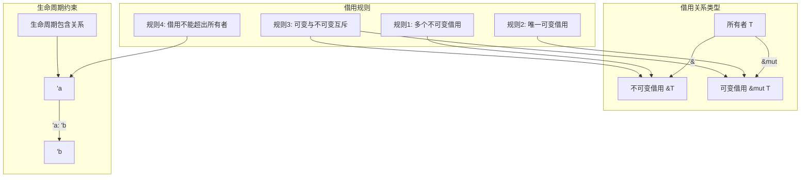
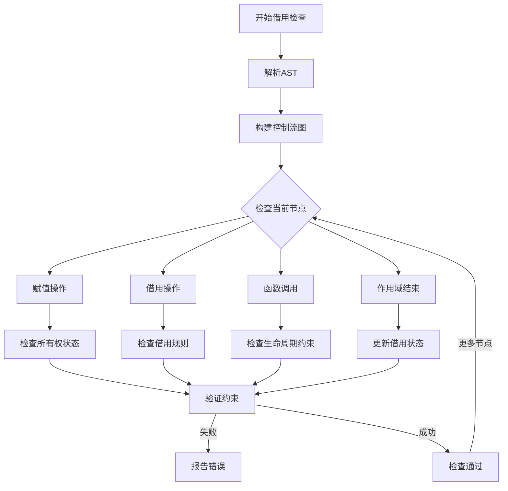

# 1.4.2 Rust借用语义模型深度分析

**文档版本**: V1.0  
**创建日期**: 2025-01-27  
**所属层**: 基础语义层 (Foundation Semantics Layer)  
**父模块**: [1.4 所有权系统语义](../00_ownership_system_index.md)  
**交叉引用**: [1.4.1 所有权规则语义](01_ownership_rules_semantics.md), [1.4.3 生命周期语义](03_lifetime_semantics.md)

---

## 1.4.2.1 借用理论基础

### 1.4.2.1.1 借用语义域的形式化定义

**定义 1.4.2.1** (借用语义域)
Rust的借用系统可形式化为资源访问控制的代数结构：

$$\text{Borrowing} = \langle \text{Reference}, \text{Mutability}, \text{Lifetime}, \text{Constraints}, \text{Checker} \rangle$$

其中：

- $\text{Reference} : \text{Type} \rightarrow \text{BorrowedType}$ - 引用类型构造
- $\text{Mutability} : \{\text{Immutable}, \text{Mutable}\}$ - 可变性标记
- $\text{Lifetime} : \text{Scope} \rightarrow \text{LifetimeParam}$ - 生命周期映射
- $\text{Constraints} : \text{Set}(\text{BorrowRule})$ - 借用约束集合
- $\text{Checker} : \text{Program} \rightarrow \text{Result}(\text{Valid}, \text{BorrowError})$ - 借用检查器

### 1.4.2.1.2 借用关系的数学建模



### 1.4.2.1.3 借用检查的操作语义

**不可变借用规则**：
$$\frac{\text{owns}(x, v) \quad \text{immut\_borrow}(\&x)}{\text{can\_read}(\&x, v) \land \text{owns}(x, v)} \text{[IMMUT-BORROW]}$$

**可变借用规则**：
$$\frac{\text{owns}(x, v) \quad \text{mut\_borrow}(\&\text{mut } x) \quad \text{no\_other\_borrows}(x)}{\text{can\_read\_write}(\&\text{mut } x, v) \land \text{suspended}(\text{owns}(x, v))} \text{[MUT-BORROW]}$$

---

## 1.4.2.2 不可变借用语义

### 1.4.2.2.1 基础不可变借用

```rust
// 基础不可变借用
fn immutable_borrowing() {
    let s = String::from("hello");
    
    // 创建不可变借用
    let r1 = &s;  // 第一个不可变借用
    let r2 = &s;  // 第二个不可变借用，合法
    let r3 = &s;  // 第三个不可变借用，合法
    
    // 同时使用多个不可变借用
    println!("r1: {}, r2: {}, r3: {}", r1, r2, r3);
    
    // 原始所有者仍然可读
    println!("Original: {}", s);
    
    // 但不能修改原始值（如果它是可变的话）
}

// 多个不可变借用的作用域
fn multiple_immutable_scopes() {
    let data = vec![1, 2, 3, 4, 5];
    
    {
        let slice1 = &data[0..2];  // 借用前两个元素
        let slice2 = &data[2..4];  // 借用中间两个元素
        println!("slice1: {:?}, slice2: {:?}", slice1, slice2);
    } // 借用在此结束
    
    // 可以创建新的借用
    let full_slice = &data[..];
    println!("full_slice: {:?}", full_slice);
}
```

**不可变借用语义特性**：

- **共享访问**: 多个不可变引用可以同时存在
- **只读保证**: 通过不可变引用无法修改数据
- **所有权保留**: 原始所有者保持所有权，但暂时不能修改

### 1.4.2.2.2 不可变借用与方法调用

```rust
struct Book {
    title: String,
    author: String,
    pages: u32,
}

impl Book {
    // 不可变方法，接受&self
    fn get_title(&self) -> &str {
        &self.title
    }
    
    fn get_info(&self) -> String {
        format!("{} by {} ({} pages)", self.title, self.author, self.pages)
    }
    
    // 静态方法，不涉及借用
    fn new(title: String, author: String, pages: u32) -> Book {
        Book { title, author, pages }
    }
}

fn immutable_method_calls() {
    let book = Book::new(
        "The Rust Programming Language".to_string(),
        "Steve Klabnik".to_string(),
        552,
    );
    
    // 不可变方法调用自动创建不可变借用
    let title = book.get_title();        // &book 自动创建
    let info = book.get_info();          // &book 自动创建
    
    println!("Title: {}", title);
    println!("Info: {}", info);
    
    // 可以同时存在多个不可变借用
    let title2 = book.get_title();
    println!("Title again: {}", title2);
}
```

### 1.4.2.2.3 不可变借用的生命周期

```rust
// 借用的生命周期必须短于被借用值
fn borrow_lifetime_basic() {
    let string = String::from("hello world");
    
    let borrowed: &str;
    {
        let temp = String::from("temporary");
        // borrowed = &temp;  // 编译错误：temp的生命周期太短
    }
    
    borrowed = &string;  // 正确：string活得足够长
    println!("Borrowed: {}", borrowed);
}

// 函数参数中的借用生命周期
fn longest<'a>(x: &'a str, y: &'a str) -> &'a str {
    if x.len() > y.len() {
        x
    } else {
        y
    }
}

fn borrow_in_functions() {
    let string1 = String::from("long string");
    let string2 = String::from("short");
    
    // 函数调用中的借用
    let result = longest(&string1, &string2);
    println!("Longest: {}", result);
}
```

---

## 1.4.2.3 可变借用语义

### 1.4.2.3.1 基础可变借用

```rust
// 基础可变借用
fn mutable_borrowing() {
    let mut s = String::from("hello");
    
    // 创建可变借用
    let r = &mut s;
    
    // 通过可变借用修改数据
    r.push_str(", world");
    
    println!("Modified: {}", r);
    
    // 可变借用结束后，所有权恢复
} // r的作用域结束

fn ownership_after_mutable_borrow() {
    let mut s = String::from("hello");
    
    {
        let r = &mut s;
        r.push_str(" world");
        println!("In borrow scope: {}", r);
    } // 可变借用结束
    
    // 所有权恢复，可以直接使用s
    println!("After borrow: {}", s);
    s.push_str("!");
    println!("Final: {}", s);
}
```

**可变借用语义特性**：

- **独占访问**: 同时只能存在一个可变借用
- **读写权限**: 可以通过可变借用读取和修改数据
- **所有权暂停**: 所有者在借用期间不能使用

### 1.4.2.3.2 可变借用的排他性

```rust
// 可变借用的排他性规则
fn exclusive_mutable_borrow() {
    let mut s = String::from("hello");
    
    let r1 = &mut s;  // 第一个可变借用
    // let r2 = &mut s;  // 编译错误：不能同时存在两个可变借用
    // let r3 = &s;      // 编译错误：可变借用期间不能创建不可变借用
    
    r1.push_str(" world");
    println!("r1: {}", r1);
    
    // r1使用完毕后，可以创建新的借用
} // r1作用域结束

fn sequential_mutable_borrows() {
    let mut data = vec![1, 2, 3];
    
    {
        let r1 = &mut data;
        r1.push(4);
        println!("r1: {:?}", r1);
    } // r1结束
    
    {
        let r2 = &mut data;
        r2.push(5);
        println!("r2: {:?}", r2);
    } // r2结束
    
    println!("Final data: {:?}", data);
}
```

### 1.4.2.3.3 可变借用与方法调用

```rust
struct Counter {
    value: i32,
}

impl Counter {
    fn new() -> Counter {
        Counter { value: 0 }
    }
    
    // 可变方法，接受&mut self
    fn increment(&mut self) {
        self.value += 1;
    }
    
    fn add(&mut self, amount: i32) {
        self.value += amount;
    }
    
    fn reset(&mut self) {
        self.value = 0;
    }
    
    // 不可变方法
    fn get_value(&self) -> i32 {
        self.value
    }
}

fn mutable_method_calls() {
    let mut counter = Counter::new();
    
    // 可变方法调用自动创建可变借用
    counter.increment();     // &mut counter 自动创建
    counter.add(5);          // &mut counter 自动创建
    
    // 在可变借用之间可以调用不可变方法
    println!("Current value: {}", counter.get_value());
    
    counter.reset();
    println!("After reset: {}", counter.get_value());
}
```

---

## 1.4.2.4 借用规则的完整语义

### 1.4.2.4.1 借用规则总结

```rust
// 借用规则的完整演示
fn borrowing_rules_demo() {
    let mut data = String::from("hello");
    
    // 规则1：可以有多个不可变借用
    {
        let r1 = &data;
        let r2 = &data;
        let r3 = &data;
        println!("Multiple immutable borrows: {}, {}, {}", r1, r2, r3);
    } // 不可变借用结束
    
    // 规则2：只能有一个可变借用
    {
        let r = &mut data;
        r.push_str(" world");
        println!("Mutable borrow: {}", r);
        // 在r的作用域内，不能创建其他借用
    } // 可变借用结束
    
    // 规则3：可变借用和不可变借用不能同时存在
    {
        let r1 = &data;           // 不可变借用
        // let r2 = &mut data;    // 编译错误：冲突
        println!("Immutable: {}", r1);
    }
    
    // 规则4：借用的生命周期不能超过被借用值
    let borrowed: &str;
    {
        let temp = String::from("temporary");
        // borrowed = &temp;      // 编译错误：temp生命周期太短
    }
    
    borrowed = &data;            // 正确
    println!("Valid borrow: {}", borrowed);
}
```

### 1.4.2.4.2 Non-Lexical Lifetimes (NLL)

```rust
// NLL允许更精确的借用作用域分析
fn nll_example() {
    let mut data = vec![1, 2, 3];
    
    let r = &data;               // 不可变借用开始
    println!("Immutable: {:?}", r);  // 最后一次使用r
    // NLL：r的借用在此处实际结束，而不是在作用域结束时
    
    data.push(4);                // 现在可以修改data了
    println!("Modified: {:?}", data);
}

fn nll_complex_example() {
    let mut map = std::collections::HashMap::new();
    map.insert("key1", "value1");
    map.insert("key2", "value2");
    
    // 传统借用检查器会拒绝这段代码，但NLL允许它
    if let Some(value) = map.get("key1") {
        println!("Found: {}", value);
        // value的借用在此处结束
    }
    
    // 现在可以修改map
    map.insert("key3", "value3");
}
```

### 1.4.2.4.3 借用检查的错误模式

```rust
// 常见的借用检查错误及其解决方案

// 错误1：使用已被移动的值
fn use_after_move_error() {
    let s = String::from("hello");
    let moved = s;               // s被移动
    // println!("{}", s);        // 编译错误：使用已移动的值
    
    // 解决方案：使用借用而不是移动
    let s2 = String::from("hello");
    let borrowed = &s2;          // 借用而不是移动
    println!("{}", s2);          // 原始值仍然可用
    println!("{}", borrowed);    // 借用也可用
}

// 错误2：返回局部变量的引用
fn dangling_reference_error() -> &str {
    let s = String::from("hello");
    // &s                        // 编译错误：返回悬垂引用
    
    // 解决方案：返回拥有的值
    "hello"                      // 字符串字面量有'static生命周期
}

// 错误3：可变和不可变借用冲突
fn borrow_conflict_error() {
    let mut data = vec![1, 2, 3];
    
    let immutable = &data;       // 不可变借用
    // data.push(4);             // 编译错误：在不可变借用期间修改
    println!("{:?}", immutable);
    
    // 解决方案：确保借用不重叠
    drop(immutable);             // 显式结束借用
    data.push(4);                // 现在可以修改
}
```

---

## 1.4.2.5 高级借用模式

### 1.4.2.5.1 借用分离 (Borrow Splitting)

```rust
// 结构体字段的借用分离
struct Point {
    x: f64,
    y: f64,
}

impl Point {
    fn get_x_mut(&mut self) -> &mut f64 {
        &mut self.x
    }
    
    fn get_y_mut(&mut self) -> &mut f64 {
        &mut self.y
    }
}

fn borrow_splitting() {
    let mut point = Point { x: 1.0, y: 2.0 };
    
    // 可以同时可变借用不同的字段
    let x_ref = &mut point.x;
    let y_ref = &mut point.y;
    
    *x_ref = 3.0;
    *y_ref = 4.0;
    
    println!("Point: ({}, {})", point.x, point.y);
}

// 数组/切片的借用分离
fn slice_borrow_splitting() {
    let mut array = [1, 2, 3, 4, 5];
    
    // 分离借用数组的不同部分
    let (left, right) = array.split_at_mut(2);
    
    left[0] = 10;
    right[0] = 30;
    
    println!("Array: {:?}", array);
}
```

### 1.4.2.5.2 内部可变性模式

```rust
use std::cell::{Cell, RefCell};
use std::rc::Rc;

// Cell：Copy类型的内部可变性
fn cell_example() {
    let data = Cell::new(5);
    
    let borrowed = &data;        // 不可变借用Cell
    borrowed.set(10);            // 但可以修改内部值
    
    println!("Cell value: {}", borrowed.get());
}

// RefCell：运行时借用检查
fn refcell_example() {
    let data = RefCell::new(vec![1, 2, 3]);
    
    // 运行时不可变借用
    {
        let borrowed = data.borrow();
        println!("Data: {:?}", *borrowed);
    } // 借用结束
    
    // 运行时可变借用
    {
        let mut borrowed = data.borrow_mut();
        borrowed.push(4);
        println!("Modified: {:?}", *borrowed);
    } // 可变借用结束
}

// Rc + RefCell：共享可变性
fn shared_mutability() {
    let data = Rc::new(RefCell::new(vec![1, 2, 3]));
    
    let data1 = Rc::clone(&data);
    let data2 = Rc::clone(&data);
    
    // 通过不同的Rc实例修改共享数据
    data1.borrow_mut().push(4);
    data2.borrow_mut().push(5);
    
    println!("Shared data: {:?}", data.borrow());
}
```

### 1.4.2.5.3 生命周期省略

```rust
// 生命周期省略规则
fn lifetime_elision_examples() {
    // 规则1：每个引用参数都有自己的生命周期
    fn first_word(s: &str) -> &str {  // 等价于 fn first_word<'a>(s: &'a str) -> &'a str
        let bytes = s.as_bytes();
        
        for (i, &item) in bytes.iter().enumerate() {
            if item == b' ' {
                return &s[0..i];
            }
        }
        
        &s[..]
    }
    
    // 规则2：如果只有一个输入生命周期，它被赋给所有输出生命周期
    fn get_prefix(s: &str) -> &str {  // 自动推断生命周期
        &s[..3]
    }
    
    // 规则3：如果有&self或&mut self，self的生命周期被赋给所有输出
    struct StrWrapper<'a> {
        content: &'a str,
    }
    
    impl<'a> StrWrapper<'a> {
        fn get_content(&self) -> &str {  // 返回&self的生命周期
            self.content
        }
    }
}
```

---

## 1.4.2.6 借用检查算法

### 1.4.2.6.1 借用检查的数据结构

```rust
// 借用检查器的概念模型
use std::collections::{HashMap, HashSet};

// 借用检查器的内部状态（概念性）
struct BorrowChecker {
    // 活跃借用集合
    active_borrows: HashMap<String, BorrowInfo>,
    // 变量的所有权状态
    ownership_state: HashMap<String, OwnershipState>,
    // 生命周期约束
    lifetime_constraints: Vec<LifetimeConstraint>,
}

#[derive(Debug, Clone)]
enum BorrowInfo {
    Immutable { lifetime: String, location: usize },
    Mutable { lifetime: String, location: usize },
}

#[derive(Debug, Clone)]
enum OwnershipState {
    Owned,
    Moved,
    Borrowed(BorrowInfo),
}

#[derive(Debug, Clone)]
struct LifetimeConstraint {
    longer: String,
    shorter: String,
}

impl BorrowChecker {
    fn new() -> Self {
        BorrowChecker {
            active_borrows: HashMap::new(),
            ownership_state: HashMap::new(),
            lifetime_constraints: Vec::new(),
        }
    }
    
    fn check_borrow(&mut self, var: &str, borrow_type: BorrowInfo) -> Result<(), String> {
        // 检查是否可以创建新的借用
        match self.ownership_state.get(var) {
            Some(OwnershipState::Moved) => {
                Err(format!("Cannot borrow moved value: {}", var))
            }
            Some(OwnershipState::Borrowed(existing)) => {
                // 检查借用兼容性
                self.check_borrow_compatibility(existing, &borrow_type)
            }
            _ => {
                // 记录新的借用
                self.active_borrows.insert(var.to_string(), borrow_type.clone());
                self.ownership_state.insert(var.to_string(), OwnershipState::Borrowed(borrow_type));
                Ok(())
            }
        }
    }
    
    fn check_borrow_compatibility(&self, existing: &BorrowInfo, new: &BorrowInfo) -> Result<(), String> {
        match (existing, new) {
            (BorrowInfo::Immutable { .. }, BorrowInfo::Immutable { .. }) => {
                Ok(()) // 多个不可变借用允许
            }
            (BorrowInfo::Mutable { .. }, _) | (_, BorrowInfo::Mutable { .. }) => {
                Err("Cannot have mutable and other borrows simultaneously".to_string())
            }
        }
    }
}
```

### 1.4.2.6.2 借用检查的算法流程



**借用检查算法的核心步骤**：

1. **构建控制流图**：分析程序的执行路径
2. **追踪所有权状态**：记录每个变量的所有权和借用状态
3. **验证借用规则**：检查借用的兼容性和排他性
4. **分析生命周期**：确保借用不会超出被借用值的生命周期
5. **报告错误**：提供详细的错误信息和建议

### 1.4.2.6.3 借用检查的优化技术

```rust
// NLL (Non-Lexical Lifetimes) 的实现概念
struct NLLBorrowChecker {
    // 使用更精确的生命周期分析
    liveness_analysis: LivenessAnalysis,
    // 基于使用点的借用结束
    last_use_points: HashMap<String, usize>,
}

struct LivenessAnalysis {
    // 变量的活跃范围
    live_ranges: HashMap<String, (usize, usize)>,
    // 借用的实际使用点
    use_points: HashMap<String, Vec<usize>>,
}

impl NLLBorrowChecker {
    fn check_with_nll(&mut self, program: &Program) -> Result<(), BorrowError> {
        // 1. 构建CFG和活跃性分析
        let cfg = self.build_control_flow_graph(program);
        self.liveness_analysis = self.compute_liveness(&cfg);
        
        // 2. 基于实际使用点确定借用结束时间
        for borrow in self.active_borrows.iter() {
            let last_use = self.find_last_use_point(borrow);
            self.last_use_points.insert(borrow.name.clone(), last_use);
        }
        
        // 3. 使用更精确的借用检查
        self.validate_borrows_with_precise_lifetimes()
    }
    
    fn find_last_use_point(&self, borrow: &BorrowInfo) -> usize {
        // 找到借用的最后使用点，而不是作用域结束点
        self.liveness_analysis
            .use_points
            .get(&borrow.name)
            .and_then(|points| points.last())
            .copied()
            .unwrap_or(0)
    }
    
    fn build_control_flow_graph(&self, program: &Program) -> ControlFlowGraph {
        // 构建控制流图的实现
        todo!("CFG construction")
    }
    
    fn compute_liveness(&self, cfg: &ControlFlowGraph) -> LivenessAnalysis {
        // 活跃性分析的实现
        todo!("Liveness analysis")
    }
    
    fn validate_borrows_with_precise_lifetimes(&self) -> Result<(), BorrowError> {
        // 使用精确生命周期进行借用验证
        todo!("Precise borrow validation")
    }
}

// 辅助类型定义
struct Program;
struct ControlFlowGraph;
struct BorrowError;
```

---

## 1.4.2.7 借用与性能语义

### 1.4.2.7.1 零成本借用抽象

```rust
// 借用的零成本特性
fn zero_cost_borrowing_demo() {
    let large_data = vec![0; 1_000_000];  // 大型数据结构
    
    // 借用不涉及数据复制，只传递指针
    let borrowed = &large_data;           // 成本：O(1)
    process_data(borrowed);               // 传递指针，不复制数据
    
    // 可变借用同样是零成本
    let mut mutable_data = vec![0; 1_000_000];
    let mut_borrowed = &mut mutable_data; // 成本：O(1)
    modify_data(mut_borrowed);            // 传递指针，允许修改
}

fn process_data(data: &[i32]) {
    // 通过借用访问数据，无额外成本
    println!("Data length: {}", data.len());
}

fn modify_data(data: &mut Vec<i32>) {
    // 通过可变借用修改数据
    data.push(42);
}

// 编译器优化：借用检查在编译期完成
#[inline]
fn optimized_borrowing(data: &Vec<i32>) -> usize {
    // 编译器可以内联此函数，消除函数调用开销
    data.len()  // 直接访问，无运行时检查
}
```

**零成本借用定理**：
$$\forall \text{borrow} : \text{cost}(\text{borrow}) = \text{cost}(\text{pointer\_copy}) = O(1)$$

### 1.4.2.7.2 缓存友好的借用模式

```rust
// 利用借用实现缓存友好的数据访问
struct Matrix {
    data: Vec<f64>,
    rows: usize,
    cols: usize,
}

impl Matrix {
    fn new(rows: usize, cols: usize) -> Self {
        Matrix {
            data: vec![0.0; rows * cols],
            rows,
            cols,
        }
    }
    
    // 返回行的借用，利用数据局部性
    fn get_row(&self, row: usize) -> &[f64] {
        let start = row * self.cols;
        let end = start + self.cols;
        &self.data[start..end]  // 连续内存访问
    }
    
    // 可变行借用
    fn get_row_mut(&mut self, row: usize) -> &mut [f64] {
        let start = row * self.cols;
        let end = start + self.cols;
        &mut self.data[start..end]
    }
    
    // 处理多行，保持缓存局部性
    fn process_rows(&self, start_row: usize, end_row: usize) -> f64 {
        let mut sum = 0.0;
        for row in start_row..end_row {
            let row_slice = self.get_row(row);  // 借用连续内存
            sum += row_slice.iter().sum::<f64>();
        }
        sum
    }
}

// 批量处理，减少借用开销
fn batch_processing() {
    let mut matrix = Matrix::new(1000, 1000);
    
    // 批量修改，减少借用次数
    {
        let data = &mut matrix.data;  // 一次性借用整个数据
        for i in 0..data.len() {
            data[i] = i as f64;       // 批量操作
        }
    } // 借用结束
    
    // 批量读取
    let sum = matrix.process_rows(0, 100);  // 借用连续行
    println!("Sum: {}", sum);
}
```

### 1.4.2.7.3 借用检查的编译期优化

```rust
// 编译期借用优化示例
struct OptimizedContainer<T> {
    data: Vec<T>,
}

impl<T> OptimizedContainer<T> {
    // 编译器可以优化掉借用检查
    #[inline(always)]
    fn get(&self, index: usize) -> Option<&T> {
        self.data.get(index)  // 边界检查，但无额外借用成本
    }
    
    // 利用借用分离优化
    fn split_borrow(&mut self) -> (&mut [T], &mut [T]) {
        self.data.split_at_mut(self.data.len() / 2)
    }
    
    // 迭代器借用优化
    fn iter_optimized(&self) -> impl Iterator<Item = &T> {
        self.data.iter()  // 零开销迭代器
    }
}

// 编译期常量折叠和借用优化
const fn compile_time_borrowing() {
    // 编译期计算，无运行时借用成本
    const DATA: &[i32] = &[1, 2, 3, 4, 5];
    const FIRST: &i32 = &DATA[0];  // 编译期借用
}
```

---

## 1.4.2.8 借用模式最佳实践

### 1.4.2.8.1 设计模式中的借用

```rust
// Builder模式中的借用
struct ConfigBuilder {
    host: Option<String>,
    port: Option<u16>,
    timeout: Option<u64>,
}

impl ConfigBuilder {
    fn new() -> Self {
        ConfigBuilder {
            host: None,
            port: None,
            timeout: None,
        }
    }
    
    // 借用self，允许链式调用
    fn host(&mut self, host: impl Into<String>) -> &mut Self {
        self.host = Some(host.into());
        self
    }
    
    fn port(&mut self, port: u16) -> &mut Self {
        self.port = Some(port);
        self
    }
    
    fn timeout(&mut self, timeout: u64) -> &mut Self {
        self.timeout = Some(timeout);
        self
    }
    
    // 消费self，返回最终配置
    fn build(self) -> Config {
        Config {
            host: self.host.unwrap_or_else(|| "localhost".to_string()),
            port: self.port.unwrap_or(8080),
            timeout: self.timeout.unwrap_or(30),
        }
    }
}

struct Config {
    host: String,
    port: u16,
    timeout: u64,
}

// Visitor模式中的借用
trait Visitor<T> {
    type Output;
    
    fn visit(&mut self, item: &T) -> Self::Output;
}

struct SumVisitor {
    total: i32,
}

impl Visitor<i32> for SumVisitor {
    type Output = ();
    
    fn visit(&mut self, item: &i32) -> Self::Output {
        self.total += item;  // 借用item，修改self
    }
}

fn visitor_pattern_example() {
    let numbers = vec![1, 2, 3, 4, 5];
    let mut visitor = SumVisitor { total: 0 };
    
    for number in &numbers {  // 借用数组元素
        visitor.visit(number);
    }
    
    println!("Sum: {}", visitor.total);
}
```

### 1.4.2.8.2 API设计中的借用选择

```rust
// 好的API设计：明确借用语义
struct Document {
    content: String,
    metadata: Metadata,
}

struct Metadata {
    title: String,
    author: String,
    created: std::time::SystemTime,
}

impl Document {
    // 返回借用，避免不必要的复制
    fn get_title(&self) -> &str {
        &self.metadata.title
    }
    
    // 接受借用，灵活性更高
    fn set_content(&mut self, content: &str) {
        self.content = content.to_string();
    }
    
    // 返回可变借用，允许就地修改
    fn get_content_mut(&mut self) -> &mut String {
        &mut self.content
    }
    
    // 根据需要选择借用或拥有
    fn append_content(&mut self, additional: &str) {
        self.content.push_str(additional);  // 借用additional
    }
    
    // 消费式API，当需要所有权时
    fn into_content(self) -> String {
        self.content
    }
}

// 通用化的借用API设计
trait Readable {
    type Item;
    
    fn read(&self) -> &Self::Item;
}

trait Writable {
    type Item;
    
    fn write(&mut self, item: &Self::Item);
}

// 组合trait，支持读写
trait ReadWrite: Readable + Writable {}

// 为Document实现这些trait
impl Readable for Document {
    type Item = String;
    
    fn read(&self) -> &Self::Item {
        &self.content
    }
}

impl Writable for Document {
    type Item = str;  // 接受字符串切片
    
    fn write(&mut self, content: &Self::Item) {
        self.content = content.to_string();
    }
}
```

### 1.4.2.8.3 错误处理与借用

```rust
// 在错误处理中正确使用借用
use std::fmt;

#[derive(Debug)]
enum ValidationError<'a> {
    EmptyField { field_name: &'a str },
    TooShort { field_name: &'a str, min_length: usize },
    TooLong { field_name: &'a str, max_length: usize },
    InvalidFormat { field_name: &'a str, expected: &'a str },
}

impl<'a> fmt::Display for ValidationError<'a> {
    fn fmt(&self, f: &mut fmt::Formatter) -> fmt::Result {
        match self {
            ValidationError::EmptyField { field_name } => {
                write!(f, "Field '{}' cannot be empty", field_name)
            }
            ValidationError::TooShort { field_name, min_length } => {
                write!(f, "Field '{}' must be at least {} characters", field_name, min_length)
            }
            ValidationError::TooLong { field_name, max_length } => {
                write!(f, "Field '{}' cannot exceed {} characters", field_name, max_length)
            }
            ValidationError::InvalidFormat { field_name, expected } => {
                write!(f, "Field '{}' has invalid format, expected: {}", field_name, expected)
            }
        }
    }
}

struct Validator;

impl Validator {
    // 使用借用避免字符串分配
    fn validate_name(name: &str) -> Result<(), ValidationError<'_>> {
        if name.is_empty() {
            return Err(ValidationError::EmptyField { field_name: "name" });
        }
        
        if name.len() < 2 {
            return Err(ValidationError::TooShort { 
                field_name: "name", 
                min_length: 2 
            });
        }
        
        if name.len() > 50 {
            return Err(ValidationError::TooLong { 
                field_name: "name", 
                max_length: 50 
            });
        }
        
        Ok(())
    }
    
    fn validate_email(email: &str) -> Result<(), ValidationError<'_>> {
        if email.is_empty() {
            return Err(ValidationError::EmptyField { field_name: "email" });
        }
        
        if !email.contains('@') {
            return Err(ValidationError::InvalidFormat { 
                field_name: "email", 
                expected: "user@domain.com" 
            });
        }
        
        Ok(())
    }
}

fn validation_example() {
    let name = "John";
    let email = "john.example.com";  // 故意错误的邮箱格式
    
    // 验证时使用借用，避免复制字符串
    match Validator::validate_name(name) {
        Ok(()) => println!("Name is valid"),
        Err(e) => println!("Name validation error: {}", e),
    }
    
    match Validator::validate_email(email) {
        Ok(()) => println!("Email is valid"),
        Err(e) => println!("Email validation error: {}", e),
    }
}
```

---

## 1.4.2.9 相关引用与扩展阅读

### 1.4.2.9.1 内部交叉引用

- [1.4.1 所有权规则语义](01_ownership_rules_semantics.md) - 所有权系统基础
- [1.4.3 生命周期语义](03_lifetime_semantics.md) - 生命周期系统详细分析
- [1.3.1 内存布局语义](../03_memory_model_semantics/01_memory_layout_semantics.md) - 内存管理基础

### 1.4.2.9.2 外部参考文献

1. Klabnik, S. & Nichols, C. *The Rust Programming Language*. Chapter 4: Understanding Ownership.
2. Jung, R. et al. *RustBelt: Securing the Foundations of the Rust Programming Language*. POPL 2018.
3. Matsakis, N. *Non-Lexical Lifetimes*. Rust RFC 2094.

### 1.4.2.9.3 实现参考

- [rustc_borrowck](https://doc.rust-lang.org/nightly/nightly-rustc/rustc_borrowck/index.html) - 借用检查器实现
- [Polonius](https://github.com/rust-lang/polonius) - 下一代借用检查器

---

**文档元数据**:

- **复杂度级别**: ⭐⭐⭐⭐⭐ (专家级)
- **前置知识**: Rust所有权系统、生命周期概念、类型系统理论
- **相关工具**: rustc, rust-analyzer, miri
- **更新频率**: 与Rust借用系统演进同步
- **维护者**: Rust基础语义分析工作组
