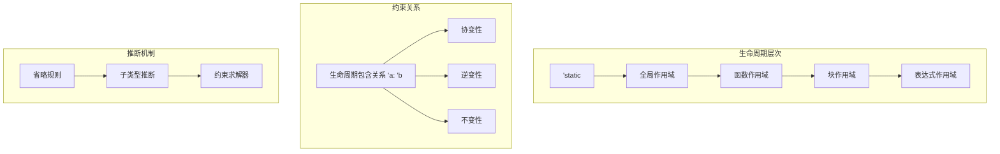

# 1.4.3 Rust生命周期语义模型深度分析

**文档版本**: V1.0  
**创建日期**: 2025-01-27  
**所属层**: 基础语义层 (Foundation Semantics Layer)  
**父模块**: [1.4 所有权系统语义](../00_ownership_system_index.md)  
**交叉引用**: [1.4.1 所有权规则语义](01_ownership_rules_semantics.md), [1.4.2 借用语义](02_borrowing_semantics.md)

---

## 1.4.3.1 生命周期理论基础

### 1.4.3.1.1 生命周期语义域定义

**定义 1.4.3.1** (生命周期语义域)
$$\text{Lifetime} = \langle \text{Scope}, \text{Parameter}, \text{Constraint}, \text{Inference}, \text{Subtyping} \rangle$$

其中：

- $\text{Scope} : \text{CodeRegion} \rightarrow \text{LifetimeRange}$ - 作用域映射
- $\text{Parameter} : \text{LifetimeVar}$ - 生命周期参数
- $\text{Constraint} : \text{LifetimeRel}$ - 生命周期约束关系
- $\text{Inference} : \text{Context} \rightarrow \text{LifetimeBinding}$ - 生命周期推断
- $\text{Subtyping} : \text{Lifetime} \times \text{Lifetime} \rightarrow \text{Boolean}$ - 子类型关系

### 1.4.3.1.2 生命周期关系的偏序结构



---

## 1.4.3.2 生命周期基础语义

### 1.4.3.2.1 显式生命周期标注

```rust
// 基础生命周期标注
fn explicit_lifetime_annotations() {
    // 结构体中的生命周期
    struct Container<'a> {
        data: &'a str,
    }
    
    impl<'a> Container<'a> {
        fn new(data: &'a str) -> Self {
            Container { data }
        }
        
        fn get_data(&self) -> &'a str {
            self.data
        }
    }
    
    // 函数中的生命周期
    fn longest<'a>(x: &'a str, y: &'a str) -> &'a str {
        if x.len() > y.len() {
            x
        } else {
            y
        }
    }
    
    let string1 = String::from("hello");
    let string2 = String::from("world");
    
    let container = Container::new(&string1);
    let result = longest(&string1, &string2);
    
    println!("Container: {}, Longest: {}", container.get_data(), result);
}

// 多个生命周期参数
fn multiple_lifetime_parameters() {
    fn combine<'a, 'b>(x: &'a str, y: &'b str) -> String 
    where
        'a: 'b,  // 'a必须比'b活得更长
    {
        format!("{} {}", x, y)
    }
    
    // 生命周期边界
    fn process_with_bounds<'a, 'b, 'c>(
        data: &'a str,
        formatter: &'b str,
        buffer: &'c mut String,
    ) -> &'c str 
    where
        'a: 'c,  // data必须比buffer活得更长
        'b: 'c,  // formatter必须比buffer活得更长
    {
        buffer.clear();
        buffer.push_str(data);
        buffer.push_str(formatter);
        buffer
    }
}
```

**生命周期约束语义**：
$$\frac{\text{lifetime } 'a : 'b \quad \text{reference } \&'a T}{\text{valid\_subtype}(\&'a T, \&'b T)} \text{[LIFETIME-SUBTYPE]}$$

### 1.4.3.2.2 生命周期省略规则

```rust
// 生命周期省略规则示例
fn lifetime_elision_rules() {
    // 规则1：每个引用参数都有自己的生命周期
    fn first_word(s: &str) -> &str {  
        // 等价于: fn first_word<'a>(s: &'a str) -> &'a str
        s.split_whitespace().next().unwrap_or("")
    }
    
    // 规则2：如果只有一个输入生命周期，它被赋给所有输出
    fn get_slice(data: &[i32]) -> &[i32] {
        // 等价于: fn get_slice<'a>(data: &'a [i32]) -> &'a [i32]
        &data[..data.len().min(5)]
    }
    
    // 规则3：如果有&self或&mut self，self的生命周期被赋给所有输出
    struct Parser<'a> {
        input: &'a str,
    }
    
    impl<'a> Parser<'a> {
        fn parse(&self) -> &str {  
            // 等价于: fn parse(&self) -> &'a str
            self.input.trim()
        }
        
        fn parse_next(&mut self) -> &str {  
            // 等价于: fn parse_next(&mut self) -> &'a str
            // 注意：这里返回的是&'a str，不是&'mut_borrow str
            self.input
        }
    }
}

// 需要显式标注的情况
fn explicit_annotation_required() {
    // 错误：编译器无法推断返回引用的生命周期
    /*
    fn choose(x: &str, y: &str, first: bool) -> &str {
        if first { x } else { y }
    }
    */
    
    // 正确：显式标注
    fn choose<'a>(x: &'a str, y: &'a str, first: bool) -> &'a str {
        if first { x } else { y }
    }
    
    // 或者使用不同的生命周期参数
    fn choose_different<'a, 'b>(x: &'a str, y: &'b str) -> &'a str {
        // 只能返回x，因为y可能活得更短
        x
    }
}
```

---

## 1.4.3.3 高级生命周期特性

### 1.4.3.3.1 Higher-Ranked Trait Bounds (HRTB)

```rust
// 高阶trait边界
fn higher_ranked_trait_bounds() {
    // for<'a> 语法表示对所有可能的生命周期'a都成立
    fn apply_closure<F>(f: F) -> String
    where
        F: for<'a> Fn(&'a str) -> &'a str,
    {
        let data = String::from("hello world");
        f(&data).to_string()
    }
    
    let result = apply_closure(|s| s.trim());
    println!("Applied closure result: {}", result);
    
    // 更复杂的HRTB示例
    fn process_iterator<I, F>(iter: I, processor: F) -> Vec<String>
    where
        I: Iterator,
        I::Item: AsRef<str>,
        F: for<'a> Fn(&'a str) -> &'a str,
    {
        iter.map(|item| processor(item.as_ref()).to_string()).collect()
    }
    
    let words = vec!["  hello  ", "  world  ", "  rust  "];
    let trimmed = process_iterator(words.iter(), |s| s.trim());
    println!("Processed words: {:?}", trimmed);
}

// 生命周期子类型化
fn lifetime_subtyping() {
    // 较长的生命周期可以转换为较短的生命周期
    fn longer_to_shorter<'long: 'short, 'short>(
        long_ref: &'long str
    ) -> &'short str {
        long_ref  // 自动转换：&'long str -> &'short str
    }
    
    // 协变性示例
    fn covariance_example() {
        let long_string = String::from("I live long");
        let long_ref: &'static str = "I live forever";
        
        {
            let short_string = String::from("short");
            
            // 可以将长生命周期引用赋给短生命周期变量
            let short_ref: &str = long_ref;  // &'static str -> &'short str
            
            println!("Short ref: {}", short_ref);
        }
    }
}
```

### 1.4.3.3.2 生命周期参数的变性

```rust
// 生命周期的协变、逆变和不变性
fn variance_in_lifetimes() {
    use std::marker::PhantomData;
    
    // 协变：T<'a> 可以转换为 T<'b> 如果 'a: 'b
    struct Covariant<'a> {
        data: &'a str,
    }
    
    // 逆变：很少见，主要在函数参数中
    struct Contravariant<'a> {
        _marker: PhantomData<fn(&'a str)>,
    }
    
    // 不变：既不是协变也不是逆变
    struct Invariant<'a> {
        data: &'a mut str,  // 可变引用是不变的
    }
    
    fn demonstrate_variance() {
        let long_string = String::from("long lived");
        let long_ref: &'static str = "forever";
        
        {
            // 协变：可以将长生命周期赋给短生命周期
            let covariant_long: Covariant<'static> = Covariant { data: long_ref };
            let covariant_short: Covariant<'_> = covariant_long;  // 协变转换
            
            println!("Covariant data: {}", covariant_short.data);
        }
        
        // 不变性示例
        let mut data = String::from("mutable");
        {
            let mut_ref = &mut data;
            // let invariant = Invariant { data: mut_ref };
            // 不变类型不能进行生命周期转换
        }
    }
    
    demonstrate_variance();
}

// 复杂的生命周期关系
fn complex_lifetime_relationships() {
    // 自引用结构（需要Pin）
    struct SelfReferential<'a> {
        data: String,
        reference: Option<&'a str>,
    }
    
    impl<'a> SelfReferential<'a> {
        fn new(data: String) -> Self {
            SelfReferential {
                data,
                reference: None,
            }
        }
        
        // 注意：这个方法实际上不能编译，因为生命周期问题
        // 真实的自引用需要使用Pin<Box<Self>>
        /*
        fn set_reference(&'a mut self) {
            self.reference = Some(&self.data);
        }
        */
    }
    
    // 使用PhantomData进行生命周期关联
    use std::marker::PhantomData;
    
    struct LifetimeHolder<'a, T> {
        _lifetime: PhantomData<&'a ()>,
        data: T,
    }
    
    impl<'a, T> LifetimeHolder<'a, T> {
        fn new(data: T) -> Self {
            LifetimeHolder {
                _lifetime: PhantomData,
                data,
            }
        }
        
        fn get_data(&self) -> &T {
            &self.data
        }
    }
}
```

---

## 1.4.3.4 生命周期推断算法

### 1.4.3.4.1 约束生成和求解

```rust
// 生命周期推断的概念性实现
use std::collections::{HashMap, HashSet};

#[derive(Debug, Clone, PartialEq, Eq, Hash)]
struct LifetimeVariable(String);

#[derive(Debug, Clone)]
enum LifetimeConstraint {
    Outlives(LifetimeVariable, LifetimeVariable),  // 'a: 'b
    Equal(LifetimeVariable, LifetimeVariable),     // 'a = 'b
}

struct LifetimeInferenceEngine {
    constraints: Vec<LifetimeConstraint>,
    variable_scopes: HashMap<LifetimeVariable, usize>,
    next_var_id: usize,
}

impl LifetimeInferenceEngine {
    fn new() -> Self {
        LifetimeInferenceEngine {
            constraints: Vec::new(),
            variable_scopes: HashMap::new(),
            next_var_id: 0,
        }
    }
    
    fn fresh_lifetime_var(&mut self) -> LifetimeVariable {
        let var = LifetimeVariable(format!("'_{}", self.next_var_id));
        self.next_var_id += 1;
        var
    }
    
    fn add_constraint(&mut self, constraint: LifetimeConstraint) {
        self.constraints.push(constraint);
    }
    
    fn add_outlives_constraint(&mut self, longer: LifetimeVariable, shorter: LifetimeVariable) {
        self.add_constraint(LifetimeConstraint::Outlives(longer, shorter));
    }
    
    // 简化的约束求解器
    fn solve_constraints(&self) -> Result<HashMap<LifetimeVariable, usize>, String> {
        let mut solution = HashMap::new();
        
        // 构建依赖图
        let mut graph: HashMap<LifetimeVariable, Vec<LifetimeVariable>> = HashMap::new();
        let mut all_vars = HashSet::new();
        
        for constraint in &self.constraints {
            match constraint {
                LifetimeConstraint::Outlives(longer, shorter) => {
                    graph.entry(longer.clone()).or_default().push(shorter.clone());
                    all_vars.insert(longer.clone());
                    all_vars.insert(shorter.clone());
                }
                LifetimeConstraint::Equal(a, b) => {
                    // 等式约束：a = b 等价于 a: b 且 b: a
                    graph.entry(a.clone()).or_default().push(b.clone());
                    graph.entry(b.clone()).or_default().push(a.clone());
                    all_vars.insert(a.clone());
                    all_vars.insert(b.clone());
                }
            }
        }
        
        // 拓扑排序确定生命周期顺序
        let mut visited = HashSet::new();
        let mut order = Vec::new();
        
        for var in &all_vars {
            if !visited.contains(var) {
                self.topological_sort(var, &graph, &mut visited, &mut order)?;
            }
        }
        
        // 分配生命周期长度
        for (index, var) in order.iter().enumerate() {
            solution.insert(var.clone(), order.len() - index);
        }
        
        Ok(solution)
    }
    
    fn topological_sort(
        &self,
        var: &LifetimeVariable,
        graph: &HashMap<LifetimeVariable, Vec<LifetimeVariable>>,
        visited: &mut HashSet<LifetimeVariable>,
        order: &mut Vec<LifetimeVariable>,
    ) -> Result<(), String> {
        if visited.contains(var) {
            return Ok(());
        }
        
        visited.insert(var.clone());
        
        if let Some(dependencies) = graph.get(var) {
            for dep in dependencies {
                self.topological_sort(dep, graph, visited, order)?;
            }
        }
        
        order.push(var.clone());
        Ok(())
    }
}

// 使用推断引擎
fn lifetime_inference_example() {
    let mut engine = LifetimeInferenceEngine::new();
    
    // 模拟函数：fn example<'a, 'b>(x: &'a str, y: &'b str) -> &'a str
    let lifetime_a = engine.fresh_lifetime_var();
    let lifetime_b = engine.fresh_lifetime_var();
    let return_lifetime = lifetime_a.clone();
    
    // 添加约束：返回值生命周期必须比参数生命周期短
    // 实际上这里应该是 'a: return，但为了演示简化
    engine.add_outlives_constraint(lifetime_a.clone(), return_lifetime.clone());
    
    match engine.solve_constraints() {
        Ok(solution) => {
            println!("Lifetime inference solution: {:?}", solution);
        }
        Err(error) => {
            println!("Lifetime inference failed: {}", error);
        }
    }
}
```

### 1.4.3.4.2 区域推断 (Region Inference)

```rust
// Rust编译器中的区域推断概念
#[derive(Debug, Clone, PartialEq)]
enum Region {
    Static,
    Universal(String),      // 函数参数的生命周期
    Existential(String),    // 局部推断的生命周期
    Placeholder(String),    // 高阶生命周期的占位符
}

#[derive(Debug)]
struct RegionInferenceContext {
    universal_regions: HashMap<String, Region>,
    existential_regions: HashMap<String, Region>,
    constraints: Vec<RegionConstraint>,
}

#[derive(Debug, Clone)]
enum RegionConstraint {
    Outlives(Region, Region),
    Member(Region, RegionSet),
}

#[derive(Debug, Clone)]
struct RegionSet {
    regions: HashSet<Region>,
}

impl RegionInferenceContext {
    fn new() -> Self {
        RegionInferenceContext {
            universal_regions: HashMap::new(),
            existential_regions: HashMap::new(),
            constraints: Vec::new(),
        }
    }
    
    fn add_universal_region(&mut self, name: String) -> Region {
        let region = Region::Universal(name.clone());
        self.universal_regions.insert(name, region.clone());
        region
    }
    
    fn add_existential_region(&mut self, name: String) -> Region {
        let region = Region::Existential(name.clone());
        self.existential_regions.insert(name, region.clone());
        region
    }
    
    fn add_outlives_constraint(&mut self, sup: Region, sub: Region) {
        self.constraints.push(RegionConstraint::Outlives(sup, sub));
    }
    
    // 简化的区域推断算法
    fn infer_regions(&mut self) -> Result<(), String> {
        // 1. 处理universal regions（它们的值由调用者确定）
        // 2. 计算existential regions的最小满足约束的值
        // 3. 检查所有约束是否满足
        
        // 这里是简化版本，真实的算法更复杂
        for constraint in &self.constraints {
            match constraint {
                RegionConstraint::Outlives(sup, sub) => {
                    // 检查sup是否确实outlive sub
                    if !self.check_outlives(sup, sub) {
                        return Err(format!("Constraint violation: {:?} does not outlive {:?}", sup, sub));
                    }
                }
                RegionConstraint::Member(region, set) => {
                    // 检查region是否在set中
                    if !set.regions.contains(region) {
                        return Err(format!("Membership constraint violation"));
                    }
                }
            }
        }
        
        Ok(())
    }
    
    fn check_outlives(&self, sup: &Region, sub: &Region) -> bool {
        match (sup, sub) {
            (Region::Static, _) => true,  // 'static outlives everything
            (Region::Universal(a), Region::Universal(b)) => {
                // 需要从函数签名中的约束确定
                a == b  // 简化：相同则认为满足
            }
            (Region::Universal(_), Region::Existential(_)) => true,  // 通常满足
            _ => false,  // 其他情况简化为不满足
        }
    }
}
```

---

## 1.4.3.5 'static生命周期

### 1.4.3.5.1 'static的特殊语义

```rust
// 'static生命周期的语义
fn static_lifetime_semantics() {
    // 字符串字面量具有'static生命周期
    let static_str: &'static str = "This lives for the entire program";
    
    // 静态变量
    static GLOBAL_DATA: &str = "Global static data";
    
    // 函数中返回'static引用
    fn get_static_string() -> &'static str {
        "This is a static string"
    }
    
    // 'static trait对象
    fn process_static_object(obj: Box<dyn std::fmt::Display + 'static>) {
        println!("Static object: {}", obj);
    }
    
    process_static_object(Box::new(42));
    process_static_object(Box::new(String::from("owned string")));
}

// 'static与所有权
fn static_and_ownership() {
    // 错误理解：'static不意味着值必须在整个程序期间存在
    fn return_static_reference() -> &'static str {
        // let local = String::from("local");
        // &local  // 错误：local没有'static生命周期
        
        "string literal"  // 正确：字符串字面量是'static
    }
    
    // 正确理解：'static意味着引用可以在整个程序期间有效
    fn demonstrate_static_semantics() {
        let static_ref = return_static_reference();
        
        // 可以在任何地方使用static_ref，因为它保证有效
        {
            {
                {
                    println!("Deep nested use: {}", static_ref);
                }
            }
        }
    }
    
    demonstrate_static_semantics();
}

// 'static约束
fn static_constraints() {
    use std::thread;
    
    // 线程闭包需要'static约束
    fn spawn_thread_with_static() {
        let static_data: &'static str = "thread data";
        
        thread::spawn(move || {
            println!("In thread: {}", static_data);
        });
        
        // 非'static数据不能直接传递给线程
        let local_data = String::from("local");
        thread::spawn(move || {
            println!("In thread: {}", local_data);  // 移动所有权
        });
    }
    
    // 'static trait约束
    fn store_static_closure<F>(f: F) 
    where
        F: Fn() -> String + 'static,
    {
        // 存储闭包，要求它没有非'static引用
        let stored = Box::new(f);
        println!("Stored closure result: {}", stored());
    }
    
    store_static_closure(|| "static closure".to_string());
    
    // let local = String::from("local");
    // store_static_closure(|| local.clone());  // 错误：捕获非'static引用
}
```

---

## 1.4.3.6 生命周期与泛型

### 1.4.3.6.1 生命周期参数与类型参数的交互

```rust
// 生命周期与泛型的组合
fn lifetime_with_generics() {
    // 结构体中的生命周期和泛型
    struct GenericContainer<'a, T> 
    where
        T: std::fmt::Display,
    {
        data: &'a T,
        metadata: String,
    }
    
    impl<'a, T> GenericContainer<'a, T> 
    where
        T: std::fmt::Display,
    {
        fn new(data: &'a T, metadata: String) -> Self {
            GenericContainer { data, metadata }
        }
        
        fn display(&self) -> String {
            format!("{}: {}", self.metadata, self.data)
        }
        
        // 方法中的额外生命周期参数
        fn compare_with<'b, U>(&self, other: &'b U) -> bool 
        where
            U: PartialEq<T>,
            'a: 'b,  // self.data必须比other活得更长
        {
            other == self.data
        }
    }
    
    let number = 42;
    let text = String::from("Hello");
    
    let container1 = GenericContainer::new(&number, "Number".to_string());
    let container2 = GenericContainer::new(&text, "Text".to_string());
    
    println!("{}", container1.display());
    println!("{}", container2.display());
}

// 复杂的生命周期与泛型约束
fn complex_lifetime_generic_constraints() {
    // 高阶trait边界与生命周期
    fn process_with_closure<F, T>(data: Vec<T>, processor: F) -> Vec<String>
    where
        F: for<'a> Fn(&'a T) -> &'a str,
        T: 'static,  // T必须是'static，以便可以安全地在闭包中使用
    {
        data.iter().map(|item| processor(item).to_string()).collect()
    }
    
    // 关联类型与生命周期
    trait DataProcessor<'a> {
        type Input: 'a;
        type Output;
        
        fn process(&self, input: Self::Input) -> Self::Output;
    }
    
    struct StringProcessor;
    
    impl<'a> DataProcessor<'a> for StringProcessor {
        type Input = &'a str;
        type Output = String;
        
        fn process(&self, input: Self::Input) -> Self::Output {
            input.to_uppercase()
        }
    }
    
    let processor = StringProcessor;
    let result = processor.process("hello world");
    println!("Processed: {}", result);
}
```

### 1.4.3.6.2 生命周期的型变性质

```rust
// 生命周期的协变性、逆变性和不变性
fn lifetime_variance() {
    use std::marker::PhantomData;
    
    // 协变：如果'a: 'b，那么Covariant<'a>可以转换为Covariant<'b>
    struct Covariant<'a> {
        data: &'a str,
    }
    
    // 逆变：如果'a: 'b，那么Contravariant<'b>可以转换为Contravariant<'a>
    struct Contravariant<'a> {
        _phantom: PhantomData<fn(&'a str)>,
    }
    
    // 不变：Invariant<'a>不能转换为Invariant<'b>，即使'a: 'b
    struct Invariant<'a> {
        data: &'a mut str,
    }
    
    fn demonstrate_covariance() {
        let long_lived: &'static str = "long lived";
        
        {
            let short_scope = String::from("short");
            
            // 协变：可以将长生命周期赋给短生命周期位置
            let covariant_long: Covariant<'static> = Covariant { data: long_lived };
            let covariant_short: Covariant<'_> = covariant_long;  // 协变转换
            
            println!("Covariant: {}", covariant_short.data);
        }
    }
    
    fn demonstrate_invariance() {
        let mut data1 = String::from("data1");
        let mut data2 = String::from("data2");
        
        {
            let mut_ref1 = &mut data1;
            // let invariant1 = Invariant { data: mut_ref1 };
            
            // 不变性：无法进行生命周期转换
            // let invariant2: Invariant<'_> = invariant1;  // 错误
        }
    }
    
    demonstrate_covariance();
    demonstrate_invariance();
}

// 生命周期子类型化的实际应用
fn lifetime_subtyping_applications() {
    // 函数指针的生命周期子类型化
    fn longer_function(s: &'static str) -> &'static str {
        s
    }
    
    fn shorter_function<'a>(s: &'a str) -> &'a str {
        s
    }
    
    // 协变：可以将长生命周期函数赋给短生命周期函数指针
    let func_ptr: fn(&str) -> &str = longer_function;
    println!("Function result: {}", func_ptr("test"));
    
    // 闭包的生命周期推断
    fn with_closure<F>(f: F) -> String
    where
        F: for<'a> Fn(&'a str) -> &'a str,
    {
        let data = String::from("closure data");
        f(&data).to_string()
    }
    
    let result = with_closure(|s| s.trim());
    println!("Closure result: {}", result);
}
```

---

## 1.4.3.7 相关引用与扩展阅读

### 1.4.3.7.1 内部交叉引用

- [1.4.1 所有权规则语义](01_ownership_rules_semantics.md) - 所有权系统基础
- [1.4.2 借用语义](02_borrowing_semantics.md) - 借用与生命周期的关系
- [1.1.6 类型推断语义](../01_type_system_semantics/06_type_inference_semantics.md) - 生命周期推断

### 1.4.3.7.2 外部参考文献

1. Pierce, B.C. *Types and Programming Languages*. MIT Press, 2002.
2. Ahmed, A. et al. *State of the art: Formal verification of Rust programs*. arXiv preprint, 2021.
3. Rust Reference: [Lifetimes](https://doc.rust-lang.org/reference/lifetime-elision.html)

### 1.4.3.7.3 实现参考

- [rustc_infer](https://doc.rust-lang.org/nightly/nightly-rustc/rustc_infer/index.html) - 生命周期推断
- [Polonius](https://github.com/rust-lang/polonius) - 新一代借用检查器

---

**文档元数据**:

- **复杂度级别**: ⭐⭐⭐⭐⭐ (专家级)
- **前置知识**: Rust所有权系统、借用概念、类型理论基础
- **相关工具**: rustc, rust-analyzer, miri
- **更新频率**: 与Rust生命周期系统演进同步
- **维护者**: Rust基础语义分析工作组
