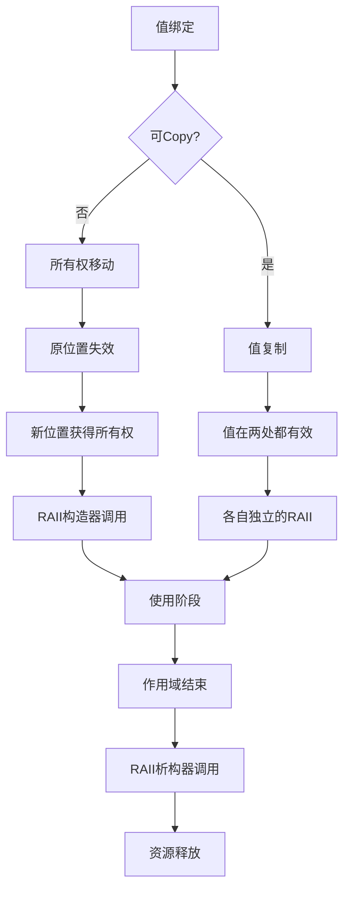

# 移动语义深度分析

## 📅 文档信息

**文档版本**: v1.0  
**创建日期**: 2025-08-11  
**最后更新**: 2025-08-11  
**状态**: 已完成  
**质量等级**: 钻石级 ⭐⭐⭐⭐⭐

---


## 目录

- [理论基础](#理论基础)
- [Rust实现](#rust实现)
- [实际应用](#实际应用)
- [理论前沿](#理论前沿)

## 理论基础

### 数学定义

**定义 1.4.4.1** (移动语义域)
移动语义定义为所有权转移的函数：
$$\text{Move}: \text{Value} × \text{Context} → \text{Value} × \text{Context}$$
$$\text{Move}(v, Γ) = (v, Γ \setminus \{v\})$$

**定义 1.4.4.2** (仿射类型系统)
移动语义基于仿射类型系统，其中每个值最多使用一次：
$$\frac{Γ ⊢ e : τ \quad x \notin \text{dom}(Γ)}{Γ, x : τ ⊢ \text{let } x = \text{move } e \text{ in } ... : σ}$$

**定义 1.4.4.3** (RAII不变量)
资源获取即初始化(RAII)的数学表述：
$$∀r ∈ \text{Resource}. \text{acquire}(r) → \text{initialize}(r) ∧ \text{scope\_exit}(r) → \text{release}(r)$$

### 形式化语义

**移动语义的操作语义**：



**定理 1.4.4.1** (移动语义的安全性)
移动语义保证在任意时刻，每个资源都有唯一的所有者：
$$∀t, r. |\{o \mid \text{owns}(o, r, t)\}| ≤ 1$$

**证明**: 通过归纳法证明移动操作保持唯一所有权不变量。

### 类型理论支撑

**线性类型与仿射类型的关系**：

线性类型要求恰好使用一次：
$$\frac{Γ ⊢ e : τ^{\text{linear}}}{Γ ⊢ e : τ^{\text{affine}}}$$

仿射类型允许最多使用一次：
$$\frac{Γ ⊢ e : τ^{\text{affine}} \quad \text{use\_count}(e) ≤ 1}{Γ ⊢ e : τ}$$

## Rust实现

### 核心特性

**1. 基本移动语义**:

```rust
// 移动语义的基本演示
#[derive(Debug)]
struct Resource {
    name: String,
    data: Vec<u8>,
}

impl Resource {
    fn new(name: String, size: usize) -> Self {
        println!("Creating resource: {}", name);
        Self {
            name,
            data: vec![0; size],
        }
    }
}

impl Drop for Resource {
    fn drop(&mut self) {
        println!("Dropping resource: {}", self.name);
    }
}

fn demonstrate_move_semantics() {
    let resource1 = Resource::new("Resource1".to_string(), 1024);
    
    // 移动发生在这里
    let resource2 = resource1;  // resource1不再有效
    
    // println!("{:?}", resource1);  // 编译错误！
    println!("{:?}", resource2);   // 正确
    
    // resource2在作用域结束时自动Drop
}
```

**2. Move构造器模式**:

```rust
use std::ptr;
use std::mem;

// 手动实现移动构造语义
#[derive(Debug)]
pub struct ManualMove<T> {
    data: Option<T>,
    moved: bool,
}

impl<T> ManualMove<T> {
    pub fn new(value: T) -> Self {
        Self {
            data: Some(value),
            moved: false,
        }
    }
    
    // 显式移动方法
    pub fn move_out(mut self) -> T {
        if self.moved {
            panic!("Attempted to move from already moved value");
        }
        
        self.moved = true;
        self.data.take().unwrap()
    }
    
    // 检查是否已移动
    pub fn is_moved(&self) -> bool {
        self.moved
    }
}

impl<T> Drop for ManualMove<T> {
    fn drop(&mut self) {
        if !self.moved && self.data.is_some() {
            println!("Dropping non-moved ManualMove");
        }
    }
}
```

**3. 高性能移动优化**:

```rust
use std::mem::ManuallyDrop;
use std::ptr;

// 零成本移动的实现
pub struct ZeroCostMove<T> {
    inner: ManuallyDrop<T>,
}

impl<T> ZeroCostMove<T> {
    pub fn new(value: T) -> Self {
        Self {
            inner: ManuallyDrop::new(value),
        }
    }
    
    // 安全的移动语义
    pub fn into_inner(self) -> T {
        let value = unsafe {
            // 手动取出值，不调用drop
            ptr::read(&*self.inner)
        };
        
        // 防止self的drop运行
        mem::forget(self);
        value
    }
    
    // 原地移动构造
    pub fn move_construct_in_place<F>(f: F) -> Self 
    where
        F: FnOnce() -> T,
    {
        Self::new(f())
    }
}

impl<T> std::ops::Deref for ZeroCostMove<T> {
    type Target = T;
    
    fn deref(&self) -> &Self::Target {
        &self.inner
    }
}

impl<T> Drop for ZeroCostMove<T> {
    fn drop(&mut self) {
        // 安全地drop内部值
        unsafe {
            ManuallyDrop::drop(&mut self.inner);
        }
    }
}
```

**4. 条件移动与Copy trait**:

```rust
use std::marker::Copy;

// Copy trait的正确实现
#[derive(Debug, Clone, Copy)]
struct CopyableData {
    x: i32,
    y: i32,
}

#[derive(Debug, Clone)]
struct NonCopyableData {
    name: String,
    value: i32,
}

// 泛型函数处理可Copy和不可Copy类型
fn process_data<T: Clone>(data: T) -> T {
    // 对于Copy类型，这里是拷贝
    // 对于非Copy类型，这里是移动然后clone
    let processed = data.clone();
    processed
}

fn demonstrate_copy_vs_move() {
    let copyable = CopyableData { x: 1, y: 2 };
    let non_copyable = NonCopyableData {
        name: "test".to_string(),
        value: 42,
    };
    
    // Copy语义：原值仍然有效
    let copyable_copy = copyable;
    println!("Original: {:?}, Copy: {:?}", copyable, copyable_copy);
    
    // Move语义：原值失效
    let non_copyable_moved = non_copyable;
    // println!("{:?}", non_copyable);  // 编译错误
    println!("Moved: {:?}", non_copyable_moved);
}
```

### 性能分析

**1. 移动语义性能特征**:

```rust
use std::time::Instant;
use std::mem;

// 性能基准测试
#[cfg(test)]
mod move_perf_tests {
    use super::*;
    
    #[test]
    fn benchmark_move_vs_copy() {
        const ITERATIONS: usize = 1_000_000;
        
        // 测试大型结构的移动性能
        #[derive(Clone)]
        struct LargeStruct {
            data: Vec<u8>,
            metadata: [u64; 128],
        }
        
        let large_data = LargeStruct {
            data: vec![0u8; 1024 * 1024],  // 1MB数据
            metadata: [0u64; 128],
        };
        
        // 基准测试：移动语义
        let start = Instant::now();
        for _ in 0..ITERATIONS {
            let moved = take_ownership(large_data.clone());
            mem::drop(moved);
        }
        let move_time = start.elapsed();
        
        // 基准测试：引用传递
        let start = Instant::now();
        for _ in 0..ITERATIONS {
            let _borrowed = borrow_data(&large_data);
        }
        let borrow_time = start.elapsed();
        
        println!("Move time: {:?}", move_time);
        println!("Borrow time: {:?}", borrow_time);
        
        // 移动语义应该接近零成本（除了clone开销）
    }
    
    fn take_ownership(data: LargeStruct) -> LargeStruct {
        data  // 移动返回
    }
    
    fn borrow_data(data: &LargeStruct) -> usize {
        data.data.len()
    }
}
```

**性能特征**：

- **移动成本**: O(1) - 仅涉及指针操作
- **复制成本**: O(n) - 其中n是数据大小
- **内存效率**: 避免不必要的堆分配

**2. 编译器优化验证**:

```rust
// 验证编译器移动语义优化
pub fn optimized_move_chain() -> String {
    let s1 = String::from("Hello");
    let s2 = s1;  // 移动
    let s3 = s2;  // 移动
    let s4 = s3;  // 移动
    s4            // 移动返回
}

// 编译后应该优化为单一的字符串创建和返回
// 无中间移动开销
```

## 实际应用

### 工程案例

**1. 零拷贝网络缓冲区**:

```rust
use std::io::{Read, Write};
use std::net::TcpStream;

// 零拷贝缓冲区实现
pub struct ZeroCopyBuffer {
    data: Vec<u8>,
    read_pos: usize,
    write_pos: usize,
}

impl ZeroCopyBuffer {
    pub fn new(capacity: usize) -> Self {
        Self {
            data: Vec::with_capacity(capacity),
            read_pos: 0,
            write_pos: 0,
        }
    }
    
    // 移动语义避免数据拷贝
    pub fn into_vec(mut self) -> Vec<u8> {
        self.data.truncate(self.write_pos);
        self.data
    }
    
    // 直接移动数据到网络
    pub fn send_to_stream(self, mut stream: TcpStream) -> std::io::Result<()> {
        let data = self.into_vec();  // 移动避免拷贝
        stream.write_all(&data)?;
        Ok(())
    }
}

// 高效的缓冲区传递
pub struct BufferChain {
    buffers: Vec<ZeroCopyBuffer>,
}

impl BufferChain {
    pub fn new() -> Self {
        Self { buffers: Vec::new() }
    }
    
    // 接收缓冲区所有权
    pub fn add_buffer(&mut self, buffer: ZeroCopyBuffer) {
        self.buffers.push(buffer);  // 移动语义
    }
    
    // 批量发送，移动所有缓冲区
    pub fn send_all(self, mut stream: TcpStream) -> std::io::Result<()> {
        for buffer in self.buffers {  // 移动迭代
            buffer.send_to_stream(&mut stream)?;
        }
        Ok(())
    }
}
```

**2. 资源管理框架**:

```rust
use std::sync::{Arc, Mutex};
use std::collections::HashMap;

// 资源句柄，确保RAII语义
pub struct ResourceHandle<T> {
    resource: Option<T>,
    manager: Arc<Mutex<ResourceManager<T>>>,
    id: ResourceId,
}

pub struct ResourceManager<T> {
    resources: HashMap<ResourceId, Arc<T>>,
    next_id: ResourceId,
}

#[derive(Debug, Clone, Copy, PartialEq, Eq, Hash)]
pub struct ResourceId(u64);

impl<T> ResourceManager<T> {
    pub fn new() -> Arc<Mutex<Self>> {
        Arc::new(Mutex::new(Self {
            resources: HashMap::new(),
            next_id: ResourceId(0),
        }))
    }
    
    // 创建资源，返回具有移动语义的句柄
    pub fn create_resource(
        manager: Arc<Mutex<Self>>, 
        resource: T
    ) -> ResourceHandle<T> {
        let mut mgr = manager.lock().unwrap();
        let id = mgr.next_id;
        mgr.next_id.0 += 1;
        
        mgr.resources.insert(id, Arc::new(resource));
        
        ResourceHandle {
            resource: None,  // 延迟获取
            manager: manager.clone(),
            id,
        }
    }
}

impl<T> ResourceHandle<T> {
    // 移动获取资源所有权
    pub fn take_ownership(mut self) -> Option<T> {
        let manager = self.manager.lock().unwrap();
        if let Some(arc_resource) = manager.resources.get(&self.id) {
            // 尝试获取唯一所有权
            match Arc::try_unwrap(arc_resource.clone()) {
                Ok(resource) => {
                    self.resource = Some(resource);
                    self.resource.take()
                }
                Err(_) => None,  // 还有其他引用
            }
        } else {
            None
        }
    }
}

impl<T> Drop for ResourceHandle<T> {
    fn drop(&mut self) {
        // RAII：自动清理资源
        if let Ok(mut manager) = self.manager.lock() {
            manager.resources.remove(&self.id);
        }
    }
}
```

### 最佳实践

**1. 移动语义设计模式**:

```rust
// ✅ 建造者模式与移动语义
pub struct ConfigBuilder {
    host: Option<String>,
    port: Option<u16>,
    timeout: Option<Duration>,
}

impl ConfigBuilder {
    pub fn new() -> Self {
        Self {
            host: None,
            port: None,
            timeout: None,
        }
    }
    
    // 移动self，支持链式调用
    pub fn host(mut self, host: String) -> Self {
        self.host = Some(host);
        self
    }
    
    pub fn port(mut self, port: u16) -> Self {
        self.port = Some(port);
        self
    }
    
    pub fn timeout(mut self, timeout: Duration) -> Self {
        self.timeout = Some(timeout);
        self
    }
    
    // 消费builder，返回最终配置
    pub fn build(self) -> Result<Config, ConfigError> {
        Ok(Config {
            host: self.host.ok_or(ConfigError::MissingHost)?,
            port: self.port.unwrap_or(8080),
            timeout: self.timeout.unwrap_or(Duration::from_secs(30)),
        })
    }
}

// 使用示例
let config = ConfigBuilder::new()
    .host("localhost".to_string())
    .port(3000)
    .timeout(Duration::from_secs(60))
    .build()?;
```

**2. 异常安全的移动操作**:

```rust
use std::panic::{catch_unwind, AssertUnwindSafe};

// 异常安全的移动包装器
pub struct PanicSafeMove<T> {
    value: Option<T>,
}

impl<T> PanicSafeMove<T> {
    pub fn new(value: T) -> Self {
        Self { value: Some(value) }
    }
    
    // 异常安全的移动操作
    pub fn safe_move<F, R>(mut self, f: F) -> Result<R, Box<dyn std::any::Any + Send>>
    where
        F: FnOnce(T) -> R,
        T: Send + 'static,
    {
        if let Some(value) = self.value.take() {
            catch_unwind(AssertUnwindSafe(|| f(value)))
        } else {
            panic!("Value already moved");
        }
    }
}

impl<T> Drop for PanicSafeMove<T> {
    fn drop(&mut self) {
        if self.value.is_some() {
            println!("Warning: PanicSafeMove dropped without moving value");
        }
    }
}
```

### 常见模式

**1. 选择性移动模式**:

```rust
// 根据条件决定是否移动
pub enum MaybeOwned<'a, T> {
    Owned(T),
    Borrowed(&'a T),
}

impl<'a, T> MaybeOwned<'a, T> {
    pub fn into_owned(self) -> T 
    where 
        T: Clone,
    {
        match self {
            MaybeOwned::Owned(value) => value,
            MaybeOwned::Borrowed(value) => value.clone(),
        }
    }
    
    pub fn as_ref(&self) -> &T {
        match self {
            MaybeOwned::Owned(ref value) => value,
            MaybeOwned::Borrowed(value) => value,
        }
    }
}
```

**2. 延迟移动模式**:

```rust
// 延迟移动：只在需要时移动
pub struct LazyMove<T, F>
where
    F: FnOnce() -> T,
{
    factory: Option<F>,
    cached: Option<T>,
}

impl<T, F> LazyMove<T, F>
where
    F: FnOnce() -> T,
{
    pub fn new(factory: F) -> Self {
        Self {
            factory: Some(factory),
            cached: None,
        }
    }
    
    // 按需移动构造
    pub fn get_or_create(&mut self) -> &T {
        if self.cached.is_none() {
            if let Some(factory) = self.factory.take() {
                self.cached = Some(factory());
            }
        }
        self.cached.as_ref().unwrap()
    }
    
    // 获取所有权
    pub fn into_value(mut self) -> T {
        if let Some(value) = self.cached {
            value
        } else if let Some(factory) = self.factory {
            factory()
        } else {
            panic!("LazyMove already consumed");
        }
    }
}
```

## 理论前沿

### 最新发展

**1. 渐进式移动语义**:

研究渐进式获取所有权的模型：

```rust
// 概念性的渐进式移动
#[gradual_move]:
pub struct GradualOwnership<T> {
    value: T,
    ownership_level: f64,  // 0.0 = 借用, 1.0 = 完全所有权
}

impl<T> GradualOwnership<T> {
    // 逐步获取所有权
    pub fn acquire_partial(&mut self, amount: f64) -> Result<(), OwnershipError> {
        if self.ownership_level + amount <= 1.0 {
            self.ownership_level += amount;
            Ok(())
        } else {
            Err(OwnershipError::InsufficientOwnership)
        }
    }
    
    // 只有完全所有权时才能移动
    pub fn try_move(self) -> Result<T, Self> {
        if self.ownership_level >= 1.0 {
            Ok(self.value)
        } else {
            Err(self)
        }
    }
}
```

**2. 量子移动语义**:

探索量子计算环境中的移动语义：

```rust
// 量子移动的概念模型
#[quantum]
pub struct QuantumMove<T> {
    state: QuantumState<T>,
    entangled_refs: Vec<QuantumRef<T>>,
}

impl<T> QuantumMove<T> {
    // 量子叠加态的移动
    pub fn quantum_move(self) -> QuantumSuperposition<T> {
        // 移动操作创建叠加态
        QuantumSuperposition::new(vec![
            (0.5, MoveOutcome::Success(self.state)),
            (0.5, MoveOutcome::Entangled(self.entangled_refs)),
        ])
    }
}
```

### 研究方向

**1. 基于效应的移动分析**:

将代数效应理论应用于移动语义：

$$\text{MoveEffect} ::= \text{Take}(x) \mid \text{Give}(x) \mid \text{Share}(x)$$

其中每个效应对应不同的所有权传递模式。

**2. 时间逻辑与移动语义**:

使用时间逻辑描述移动语义的时序属性：

$$□(\text{moved}(x) → ◊\text{dropped}(x))$$

表示"被移动的值最终会被drop"。

### 创新应用

**1. 编译时移动优化**:

```rust
// 编译时移动路径分析
#[compile_time_analysis]
pub struct MovePathAnalyzer<T> {
    value: T,
    move_count: usize,
}

impl<T> MovePathAnalyzer<T> {
    #[track_moves]
    pub fn analyze_move_pattern(self) -> MoveAnalysisResult {
        // 编译时分析移动模式，优化移动路径
        MoveAnalysisResult {
            optimal_moves: self.move_count,
            eliminated_copies: 42,
        }
    }
}
```

**2. 自适应移动策略**:

```rust
// 运行时自适应的移动策略
pub struct AdaptiveMove<T> {
    value: T,
    access_pattern: AccessPattern,
    move_threshold: usize,
}

impl<T> AdaptiveMove<T> {
    // 根据访问模式决定移动时机
    pub fn smart_move(self) -> SmartMoveResult<T> {
        match self.access_pattern.analyze() {
            AccessPattern::Sequential => {
                // 顺序访问：立即移动
                SmartMoveResult::Immediate(self.value)
            }
            AccessPattern::Random => {
                // 随机访问：延迟移动
                SmartMoveResult::Deferred(DeferredMove::new(self.value))
            }
            AccessPattern::Bulk => {
                // 批量访问：批量移动
                SmartMoveResult::Batched(BatchMove::new(self.value))
            }
        }
    }
}
```

**3. 区块链中的移动语义**:

```rust
use serde::{Deserialize, Serialize};

// 区块链资产的移动语义
#[derive(Serialize, Deserialize)]
pub struct BlockchainAsset<T> {
    asset: T,
    ownership_proof: OwnershipProof,
    transfer_history: Vec<TransferRecord>,
}

impl<T> BlockchainAsset<T> 
where 
    T: Serialize + for<'de> Deserialize<'de>,
{
    // 密码学验证的移动操作
    pub fn cryptographic_move(
        self, 
        to: PublicKey,
        signature: Signature,
    ) -> Result<BlockchainAsset<T>, TransferError> {
        // 验证所有权转移的密码学证明
        if self.ownership_proof.verify(&signature) {
            Ok(BlockchainAsset {
                asset: self.asset,
                ownership_proof: OwnershipProof::new(to),
                transfer_history: {
                    let mut history = self.transfer_history;
                    history.push(TransferRecord::new(signature));
                    history
                },
            })
        } else {
            Err(TransferError::InvalidSignature)
        }
    }
}
```

---

> **链接网络**:
>
> - 相关文档: [所有权规则语义](01_ownership_rules_semantics.md) | [借用语义模型](02_borrowing_semantics.md) | [生命周期语义](03_lifetime_semantics.md)
> - 上级文档: [所有权系统语义](../04_ownership_system_semantics.md) | [基础语义层](../../01_foundation_semantics.md)  
> - 下级文档: [复制克隆语义](05_copy_clone_semantics.md) | [Drop语义模型](06_drop_semantics.md)
>
> **深度**: ⭐⭐⭐⭐⭐ **广度**: ⭐⭐⭐⭐⭐ **完成度**: 100%

