# Drop语义深度分析

## 📅 文档信息

**文档版本**: v1.0  
**创建日期**: 2025-08-11  
**最后更新**: 2025-08-11  
**状态**: 已完成  
**质量等级**: 钻石级 ⭐⭐⭐⭐⭐

---


## 目录

- [理论基础](#理论基础)
- [Rust实现](#rust实现)
- [实际应用](#实际应用)
- [理论前沿](#理论前沿)

## 理论基础

### 数学定义

**定义 1.4.6.1** (Drop语义域)
Drop语义定义为资源释放的操作语义：
$$\text{Drop}: \text{Value} × \text{Scope} → \text{Effect}$$
$$\text{Drop}(v, s) = \text{release}(\text{resources}(v))$$

**定义 1.4.6.2** (RAII不变量)
资源获取即初始化的数学表述：
$$∀v ∈ \text{Value}. \text{acquire}(v) ∧ \text{initialize}(v) → ◊\text{drop}(v)$$

**定义 1.4.6.3** (Drop顺序语义)
Drop操作的偏序关系：
$$v_1 \prec_{drop} v_2 \iff \text{lifetime}(v_1) ⊆ \text{lifetime}(v_2)$$

### 形式化语义

**Drop执行的操作语义**：

```mermaid
graph TD
    A[作用域结束] --> B[收集待Drop值]
    B --> C[按逆序排列]
    C --> D[递归Drop]
    
    D --> E{结构体?}
    E -->|是| F[Drop字段]
    E -->|否| G[调用Drop trait]
    
    F --> H[按声明顺序Drop字段]
    H --> I[调用自定义Drop]
    
    G --> J[执行析构逻辑]
    I --> J
    J --> K[标记为已Drop]
    K --> L[释放内存]
    
    L --> M{还有值?}
    M -->|是| D
    M -->|否| N[完成]
```



**定理 1.4.6.1** (Drop安全性)
Drop操作保证资源的安全释放：
$$∀v. \text{dropped}(v) → \neg\text{accessible}(v)$$

**证明**: 通过归纳法证明Drop后的值无法被访问。

### 类型理论支撑

**线性类型与Drop的关系**：

$$\frac{Γ ⊢ v : τ \quad \text{drop}(v)}{Γ ⊢ \text{unit} : ()}$$

表示Drop操作消费值并返回unit类型。

**Drop trait的类型签名**：
$$\text{Drop} : ∀τ. τ → () → ()$$

## Rust实现

### 核心特性

**1. 基本Drop实现**:

```rust
use std::alloc::{alloc, dealloc, Layout};
use std::ptr::NonNull;

// 手动管理内存的数据结构
pub struct ManualVec<T> {
    ptr: NonNull<T>,
    len: usize,
    capacity: usize,
}

impl<T> ManualVec<T> {
    pub fn new() -> Self {
        Self {
            ptr: NonNull::dangling(),
            len: 0,
            capacity: 0,
        }
    }
    
    pub fn with_capacity(capacity: usize) -> Self {
        if capacity == 0 {
            return Self::new();
        }
        
        let layout = Layout::array::<T>(capacity).unwrap();
        let ptr = unsafe { alloc(layout) as *mut T };
        
        Self {
            ptr: NonNull::new(ptr).unwrap(),
            len: 0,
            capacity,
        }
    }
    
    pub fn push(&mut self, value: T) {
        if self.len == self.capacity {
            self.grow();
        }
        
        unsafe {
            std::ptr::write(self.ptr.as_ptr().add(self.len), value);
        }
        self.len += 1;
    }
    
    fn grow(&mut self) {
        let new_capacity = if self.capacity == 0 { 1 } else { self.capacity * 2 };
        
        let new_layout = Layout::array::<T>(new_capacity).unwrap();
        let new_ptr = unsafe { alloc(new_layout) as *mut T };
        let new_ptr = NonNull::new(new_ptr).unwrap();
        
        // 移动现有元素
        if self.capacity > 0 {
            unsafe {
                std::ptr::copy_nonoverlapping(
                    self.ptr.as_ptr(),
                    new_ptr.as_ptr(),
                    self.len,
                );
                
                let old_layout = Layout::array::<T>(self.capacity).unwrap();
                dealloc(self.ptr.as_ptr() as *mut u8, old_layout);
            }
        }
        
        self.ptr = new_ptr;
        self.capacity = new_capacity;
    }
}

// RAII实现：自动释放资源
impl<T> Drop for ManualVec<T> {
    fn drop(&mut self) {
        // 1. 首先Drop所有元素
        while self.len > 0 {
            self.len -= 1;
            unsafe {
                std::ptr::drop_in_place(self.ptr.as_ptr().add(self.len));
            }
        }
        
        // 2. 然后释放内存
        if self.capacity > 0 {
            let layout = Layout::array::<T>(self.capacity).unwrap();
            unsafe {
                dealloc(self.ptr.as_ptr() as *mut u8, layout);
            }
        }
        
        println!("ManualVec dropped, capacity: {}", self.capacity);
    }
}
```

**2. 复杂Drop语义**:

```rust
use std::sync::{Arc, Mutex, Weak};
use std::collections::HashMap;

// 具有复杂Drop语义的资源管理器
pub struct ResourceRegistry {
    resources: HashMap<ResourceId, Resource>,
    observers: Vec<Weak<dyn ResourceObserver>>,
}

pub struct Resource {
    id: ResourceId,
    data: Vec<u8>,
    dependencies: Vec<ResourceId>,
    ref_count: usize,
}

#[derive(Clone, Copy, PartialEq, Eq, Hash)]
pub struct ResourceId(u64);

pub trait ResourceObserver: Send + Sync {
    fn on_resource_dropped(&self, id: ResourceId);
}

impl ResourceRegistry {
    pub fn new() -> Self {
        Self {
            resources: HashMap::new(),
            observers: Vec::new(),
        }
    }
    
    pub fn add_observer(&mut self, observer: Weak<dyn ResourceObserver>) {
        // 清理无效的weak引用
        self.observers.retain(|w| w.strong_count() > 0);
        self.observers.push(observer);
    }
}

impl Drop for ResourceRegistry {
    fn drop(&mut self) {
        println!("Dropping ResourceRegistry with {} resources", self.resources.len());
        
        // 1. 按依赖关系排序Drop资源
        let mut drop_order = self.compute_drop_order();
        
        // 2. 按正确顺序Drop每个资源
        for resource_id in drop_order {
            if let Some(resource) = self.resources.remove(&resource_id) {
                self.notify_observers(resource_id);
                drop(resource);  // 显式Drop
            }
        }
        
        // 3. 清理观察者
        self.observers.clear();
        
        println!("ResourceRegistry drop completed");
    }
}

impl ResourceRegistry {
    fn compute_drop_order(&self) -> Vec<ResourceId> {
        // 拓扑排序计算正确的Drop顺序
        let mut order = Vec::new();
        let mut visited = HashMap::new();
        
        for &resource_id in self.resources.keys() {
            if !visited.contains_key(&resource_id) {
                self.dfs_drop_order(resource_id, &mut visited, &mut order);
            }
        }
        
        order.reverse();  // 逆序Drop
        order
    }
    
    fn dfs_drop_order(
        &self,
        resource_id: ResourceId,
        visited: &mut HashMap<ResourceId, bool>,
        order: &mut Vec<ResourceId>,
    ) {
        visited.insert(resource_id, true);
        
        if let Some(resource) = self.resources.get(&resource_id) {
            for &dep_id in &resource.dependencies {
                if !visited.contains_key(&dep_id) {
                    self.dfs_drop_order(dep_id, visited, order);
                }
            }
        }
        
        order.push(resource_id);
    }
    
    fn notify_observers(&self, resource_id: ResourceId) {
        for weak_observer in &self.observers {
            if let Some(observer) = weak_observer.upgrade() {
                observer.on_resource_dropped(resource_id);
            }
        }
    }
}

impl Drop for Resource {
    fn drop(&mut self) {
        println!("Dropping resource {} with {} bytes", self.id.0, self.data.len());
        
        // 释放数据
        self.data.clear();
        
        // 清理依赖
        self.dependencies.clear();
    }
}
```

**3. 异常安全的Drop**:

```rust
use std::panic::{catch_unwind, AssertUnwindSafe};

// 异常安全的Drop实现
pub struct PanicSafeDrop<T> {
    inner: Option<T>,
    drop_guard: DropGuard,
}

struct DropGuard {
    name: String,
    dropped: bool,
}

impl<T> PanicSafeDrop<T> {
    pub fn new(value: T, name: String) -> Self {
        Self {
            inner: Some(value),
            drop_guard: DropGuard {
                name,
                dropped: false,
            },
        }
    }
    
    // 安全的手动Drop
    pub fn try_drop(&mut self) -> Result<(), Box<dyn std::any::Any + Send>> {
        if let Some(value) = self.inner.take() {
            let result = catch_unwind(AssertUnwindSafe(|| drop(value)));
            
            match result {
                Ok(()) => {
                    self.drop_guard.dropped = true;
                    Ok(())
                }
                Err(panic_info) => {
                    // 记录panic信息但不重新panic
                    eprintln!("Drop panicked for {}: {:?}", self.drop_guard.name, panic_info);
                    self.drop_guard.dropped = true;
                    Err(panic_info)
                }
            }
        } else {
            Ok(())  // 已经dropped
        }
    }
}

impl<T> Drop for PanicSafeDrop<T> {
    fn drop(&mut self) {
        if !self.drop_guard.dropped {
            // 尝试安全Drop，即使失败也要标记为已处理
            let _ = self.try_drop();
        }
    }
}

impl Drop for DropGuard {
    fn drop(&mut self) {
        if !self.dropped {
            eprintln!("Warning: {} was not properly dropped", self.name);
        }
    }
}
```

### 性能分析

**1. Drop性能特征分析**:

```rust
use std::time::Instant;
use std::mem;

// Drop性能基准测试
#[cfg(test)]
mod drop_perf_tests {
    use super::*;
    
    #[test]
    fn benchmark_drop_performance() {
        const ITEMS: usize = 1_000_000;
        
        // 测试简单Drop
        let start = Instant::now();
        {
            let mut vec = Vec::with_capacity(ITEMS);
            for i in 0..ITEMS {
                vec.push(i);
            }
            // vec在这里Drop
        }
        let simple_drop_time = start.elapsed();
        
        // 测试复杂Drop
        let start = Instant::now();
        {
            let mut complex_vec = Vec::with_capacity(ITEMS);
            for i in 0..ITEMS {
                complex_vec.push(ComplexDropType::new(format!("item_{}", i)));
            }
            // complex_vec在这里Drop，每个元素都有自定义Drop
        }
        let complex_drop_time = start.elapsed();
        
        println!("Simple drop time: {:?}", simple_drop_time);
        println!("Complex drop time: {:?}", complex_drop_time);
        
        // 测试Drop省略优化
        let start = Instant::now();
        for _ in 0..ITEMS {
            let value = SimpleValue(42);
            mem::forget(value);  // 省略Drop
        }
        let forget_time = start.elapsed();
        
        println!("Forget time: {:?}", forget_time);
    }
    
    struct SimpleValue(i32);
    
    struct ComplexDropType {
        name: String,
        data: Vec<u8>,
    }
    
    impl ComplexDropType {
        fn new(name: String) -> Self {
            Self {
                name,
                data: vec![0; 100],
            }
        }
    }
    
    impl Drop for ComplexDropType {
        fn drop(&mut self) {
            // 模拟复杂清理逻辑
            self.data.clear();
        }
    }
}
```

**性能特征**：

- **简单类型Drop**: 接近零成本
- **复杂类型Drop**: 线性于资源复杂度
- **Drop省略**: 编译器优化可完全消除

**2. Drop顺序优化**:

```rust
// 验证Drop顺序的正确性和性能
#[derive(Debug)]
struct DropOrderTracker {
    id: u32,
    tracker: Arc<Mutex<Vec<u32>>>,
}

impl DropOrderTracker {
    fn new(id: u32, tracker: Arc<Mutex<Vec<u32>>>) -> Self {
        Self { id, tracker }
    }
}

impl Drop for DropOrderTracker {
    fn drop(&mut self) {
        self.tracker.lock().unwrap().push(self.id);
        println!("Dropping tracker {}", self.id);
    }
}

#[cfg(test)]
mod drop_order_tests {
    use super::*;
    
    #[test]
    fn test_drop_order() {
        let tracker = Arc::new(Mutex::new(Vec::new()));
        
        {
            let _a = DropOrderTracker::new(1, tracker.clone());
            let _b = DropOrderTracker::new(2, tracker.clone());
            let _c = DropOrderTracker::new(3, tracker.clone());
            // Drop顺序应该是: 3, 2, 1 (逆序)
        }
        
        let order = tracker.lock().unwrap();
        assert_eq!(*order, vec![3, 2, 1]);
    }
}
```

## 实际应用

### 工程案例

**1. 数据库连接池的RAII管理**:

```rust
use std::sync::{Arc, Mutex, Condvar};
use std::time::{Duration, Instant};
use std::thread;

// 数据库连接池，确保连接的正确释放
pub struct DatabaseConnectionPool {
    inner: Arc<PoolInner>,
}

struct PoolInner {
    connections: Mutex<Vec<DatabaseConnection>>,
    condition: Condvar,
    max_connections: usize,
    active_count: Mutex<usize>,
}

pub struct DatabaseConnection {
    id: u64,
    connected_at: Instant,
    is_valid: bool,
}

pub struct PooledConnection {
    connection: Option<DatabaseConnection>,
    pool: Arc<PoolInner>,
}

impl DatabaseConnectionPool {
    pub fn new(max_connections: usize) -> Self {
        Self {
            inner: Arc::new(PoolInner {
                connections: Mutex::new(Vec::new()),
                condition: Condvar::new(),
                max_connections,
                active_count: Mutex::new(0),
            }),
        }
    }
    
    pub fn get_connection(&self) -> Result<PooledConnection, PoolError> {
        let mut connections = self.inner.connections.lock().unwrap();
        
        // 尝试获取现有连接
        if let Some(conn) = connections.pop() {
            return Ok(PooledConnection {
                connection: Some(conn),
                pool: self.inner.clone(),
            });
        }
        
        // 检查是否可以创建新连接
        let mut active_count = self.inner.active_count.lock().unwrap();
        if *active_count < self.inner.max_connections {
            *active_count += 1;
            drop(active_count);
            drop(connections);
            
            let new_conn = DatabaseConnection::new()?;
            Ok(PooledConnection {
                connection: Some(new_conn),
                pool: self.inner.clone(),
            })
        } else {
            // 等待连接可用
            let (connections, _) = self.inner.condition.wait_timeout(
                connections,
                Duration::from_secs(30),
            ).unwrap();
            
            if let Some(conn) = connections.pop() {
                Ok(PooledConnection {
                    connection: Some(conn),
                    pool: self.inner.clone(),
                })
            } else {
                Err(PoolError::Timeout)
            }
        }
    }
}

impl DatabaseConnection {
    fn new() -> Result<Self, PoolError> {
        // 模拟数据库连接创建
        thread::sleep(Duration::from_millis(10));
        
        Ok(Self {
            id: rand::random(),
            connected_at: Instant::now(),
            is_valid: true,
        })
    }
    
    fn is_still_valid(&self) -> bool {
        self.is_valid && self.connected_at.elapsed() < Duration::from_hours(1)
    }
}

// RAII确保连接归还到池中
impl Drop for PooledConnection {
    fn drop(&mut self) {
        if let Some(mut connection) = self.connection.take() {
            // 检查连接是否仍然有效
            if connection.is_still_valid() {
                // 归还到池中
                let mut connections = self.pool.connections.lock().unwrap();
                connections.push(connection);
                self.pool.condition.notify_one();
            } else {
                // 连接无效，减少活跃计数
                let mut active_count = self.pool.active_count.lock().unwrap();
                *active_count -= 1;
                drop(connection);  // 显式Drop无效连接
            }
        }
    }
}

impl Drop for DatabaseConnection {
    fn drop(&mut self) {
        if self.is_valid {
            println!("Closing database connection {}", self.id);
            // 模拟关闭连接
            self.is_valid = false;
        }
    }
}

#[derive(Debug)]
pub enum PoolError {
    ConnectionFailed,
    Timeout,
}
```

**2. 文件系统资源管理**:

```rust
use std::fs::{File, OpenOptions};
use std::io::{Read, Write, Seek, SeekFrom};
use std::path::{Path, PathBuf};

// 文件资源的RAII管理
pub struct ManagedFile {
    file: Option<File>,
    path: PathBuf,
    temp_files: Vec<PathBuf>,
    cleanup_on_drop: bool,
}

impl ManagedFile {
    pub fn open<P: AsRef<Path>>(path: P) -> std::io::Result<Self> {
        let path = path.as_ref().to_path_buf();
        let file = File::open(&path)?;
        
        Ok(Self {
            file: Some(file),
            path,
            temp_files: Vec::new(),
            cleanup_on_drop: false,
        })
    }
    
    pub fn create_temp<P: AsRef<Path>>(path: P) -> std::io::Result<Self> {
        let path = path.as_ref().to_path_buf();
        let file = OpenOptions::new()
            .create(true)
            .write(true)
            .truncate(true)
            .open(&path)?;
        
        Ok(Self {
            file: Some(file),
            path: path.clone(),
            temp_files: vec![path],
            cleanup_on_drop: true,
        })
    }
    
    pub fn create_additional_temp(&mut self) -> std::io::Result<PathBuf> {
        let temp_path = self.path.with_extension(
            format!("tmp.{}", self.temp_files.len())
        );
        
        let _temp_file = File::create(&temp_path)?;
        self.temp_files.push(temp_path.clone());
        
        Ok(temp_path)
    }
    
    pub fn persist(mut self) -> std::io::Result<PathBuf> {
        // 持久化文件，阻止清理
        self.cleanup_on_drop = false;
        Ok(self.path.clone())
    }
}

impl Drop for ManagedFile {
    fn drop(&mut self) {
        // 1. 首先关闭文件
        if let Some(file) = self.file.take() {
            drop(file);
        }
        
        // 2. 清理临时文件（如果需要）
        if self.cleanup_on_drop {
            for temp_path in &self.temp_files {
                if temp_path.exists() {
                    if let Err(e) = std::fs::remove_file(temp_path) {
                        eprintln!("Failed to remove temp file {:?}: {}", temp_path, e);
                    } else {
                        println!("Cleaned up temp file: {:?}", temp_path);
                    }
                }
            }
        }
        
        println!("ManagedFile dropped: {:?}", self.path);
    }
}

// 实现Deref以便透明地使用File方法
impl std::ops::Deref for ManagedFile {
    type Target = File;
    
    fn deref(&self) -> &Self::Target {
        self.file.as_ref().unwrap()
    }
}

impl std::ops::DerefMut for ManagedFile {
    fn deref_mut(&mut self) -> &mut Self::Target {
        self.file.as_mut().unwrap()
    }
}
```

### 最佳实践

**1. Drop实现的设计原则**:

```rust
// ✅ 好的Drop实现
pub struct GoodResource {
    name: String,
    data: Vec<u8>,
    file_handle: Option<std::fs::File>,
}

impl Drop for GoodResource {
    fn drop(&mut self) {
        println!("Cleaning up resource: {}", self.name);
        
        // 1. 首先处理可能失败的操作
        if let Some(mut file) = self.file_handle.take() {
            if let Err(e) = file.sync_all() {
                eprintln!("Failed to sync file: {}", e);
                // 继续清理，不要panic
            }
        }
        
        // 2. 然后处理必然成功的操作
        self.data.clear();
        
        // 3. 最后记录清理完成
        println!("Resource {} cleaned up successfully", self.name);
    }
}

// ❌ 避免的Drop实现
pub struct BadResource {
    data: Vec<u8>,
}

impl Drop for BadResource {
    fn drop(&mut self) {
        // 绝不在Drop中panic
        // panic!("This will cause double panic if Drop is called during unwinding");
        
        // 避免耗时操作
        // std::thread::sleep(Duration::from_secs(10));
        
        // 避免递归Drop
        // let _another = BadResource { data: vec![] };
    }
}
```

**2. 条件Drop模式**:

```rust
// 基于状态的条件Drop
pub struct ConditionalDrop<T> {
    resource: Option<T>,
    should_drop: bool,
}

impl<T> ConditionalDrop<T> {
    pub fn new(resource: T) -> Self {
        Self {
            resource: Some(resource),
            should_drop: true,
        }
    }
    
    pub fn leak(mut self) -> T {
        self.should_drop = false;
        self.resource.take().unwrap()
    }
    
    pub fn set_drop_policy(&mut self, should_drop: bool) {
        self.should_drop = should_drop;
    }
}

impl<T> Drop for ConditionalDrop<T> {
    fn drop(&mut self) {
        if self.should_drop {
            if let Some(resource) = self.resource.take() {
                drop(resource);  // 显式Drop
            }
        } else {
            // 泄漏资源
            if let Some(resource) = self.resource.take() {
                std::mem::forget(resource);
            }
        }
    }
}
```

### 常见模式

**1. 析构器链模式**:

```rust
// 析构器链：多个清理步骤的组合
pub struct DestructorChain {
    cleanups: Vec<Box<dyn FnOnce() + Send>>,
}

impl DestructorChain {
    pub fn new() -> Self {
        Self {
            cleanups: Vec::new(),
        }
    }
    
    pub fn add_cleanup<F>(&mut self, cleanup: F)
    where
        F: FnOnce() + Send + 'static,
    {
        self.cleanups.push(Box::new(cleanup));
    }
    
    pub fn add_file_cleanup<P: AsRef<Path>>(&mut self, path: P) {
        let path = path.as_ref().to_path_buf();
        self.add_cleanup(move || {
            if path.exists() {
                let _ = std::fs::remove_file(&path);
            }
        });
    }
    
    pub fn add_resource_cleanup<T>(&mut self, resource: T)
    where
        T: Send + 'static,
    {
        self.add_cleanup(move || {
            drop(resource);
        });
    }
}

impl Drop for DestructorChain {
    fn drop(&mut self) {
        // 按注册顺序的逆序执行清理
        while let Some(cleanup) = self.cleanups.pop() {
            cleanup();
        }
    }
}
```

**2. 事务性Drop模式**:

```rust
// 事务性Drop：要么全部成功，要么全部回滚
pub struct TransactionalDrop<T> {
    items: Vec<T>,
    committed: bool,
}

impl<T> TransactionalDrop<T> {
    pub fn new() -> Self {
        Self {
            items: Vec::new(),
            committed: false,
        }
    }
    
    pub fn add(&mut self, item: T) {
        if self.committed {
            panic!("Cannot add to committed transaction");
        }
        self.items.push(item);
    }
    
    pub fn commit(mut self) -> Vec<T> {
        self.committed = true;
        std::mem::take(&mut self.items)
    }
}

impl<T> Drop for TransactionalDrop<T> {
    fn drop(&mut self) {
        if !self.committed {
            // 事务未提交，执行回滚
            println!("Rolling back transaction with {} items", self.items.len());
            self.items.clear();
        }
    }
}
```

## 理论前沿

### 最新发展

**1. 异步Drop语义**:

研究异步环境中的Drop语义：

```rust
// 概念性的异步Drop
#[async_drop]
pub struct AsyncResource {
    handle: AsyncHandle,
    cleanup_tasks: Vec<AsyncTask>,
}

impl AsyncDrop for AsyncResource {
    async fn async_drop(&mut self) {
        // 异步清理资源
        for task in &mut self.cleanup_tasks {
            task.wait().await;
        }
        
        self.handle.close().await;
    }
}
```

**2. 分布式Drop语义**:

```rust
// 分布式系统中的Drop语义
#[distributed_drop]
pub struct DistributedResource {
    local_part: LocalResource,
    remote_refs: Vec<RemoteReference>,
}

impl DistributedDrop for DistributedResource {
    async fn distributed_drop(&mut self) -> Result<(), DropError> {
        // 1. 通知所有远程引用
        for remote_ref in &self.remote_refs {
            remote_ref.notify_drop().await?;
        }
        
        // 2. 等待确认
        for remote_ref in &self.remote_refs {
            remote_ref.wait_drop_ack().await?;
        }
        
        // 3. 清理本地资源
        self.local_part.cleanup();
        
        Ok(())
    }
}
```

### 研究方向

**1. 基于效应的Drop分析**:

将代数效应应用于Drop语义：

$$\text{DropEffect} ::= \text{Release}(r) \mid \text{Cleanup}(f) \mid \text{Notify}(o)$$

**2. 量子Drop语义**:

探索量子计算中的资源释放：

```rust
// 量子Drop的概念模型
#[quantum_drop]
pub struct QuantumResource<T> {
    state: QuantumState<T>,
    entangled_cleanup: Vec<QuantumCleanup>,
}

impl<T> QuantumDrop for QuantumResource<T> {
    fn quantum_drop(self) -> QuantumDropResult {
        // 量子叠加态的Drop
        QuantumDropResult::superposition(vec![
            (0.5, DropState::Completed),
            (0.5, DropState::Deferred),
        ])
    }
}
```

### 创新应用

**1. 机器学习模型的Drop优化**:

```rust
// ML模型资源的智能Drop
pub struct MLModelResource {
    model_weights: Vec<f32>,
    gpu_memory: GpuMemoryHandle,
    checkpoint_policy: CheckpointPolicy,
}

impl Drop for MLModelResource {
    fn drop(&mut self) {
        match self.checkpoint_policy {
            CheckpointPolicy::Always => {
                // 保存检查点
                self.save_checkpoint();
            }
            CheckpointPolicy::OnSignificantState => {
                if self.is_significant_state() {
                    self.save_checkpoint();
                }
            }
            CheckpointPolicy::Never => {
                // 直接释放
            }
        }
        
        // 释放GPU内存
        self.gpu_memory.release();
    }
}
```

**2. 区块链智能合约的Drop语义**:

```rust
// 智能合约的Drop语义
pub struct SmartContract {
    state: ContractState,
    gas_limit: u64,
    cleanup_instructions: Vec<Instruction>,
}

impl Drop for SmartContract {
    fn drop(&mut self) {
        // 在Drop时执行清理指令
        let gas_used = self.execute_cleanup_instructions();
        
        if gas_used > self.gas_limit {
            // 记录gas超限但不回滚
            emit_event(ContractEvent::GasLimitExceeded {
                used: gas_used,
                limit: self.gas_limit,
            });
        }
        
        // 清理状态
        self.state.finalize();
    }
}
```

---

> **链接网络**:
>
> - 相关文档: [所有权规则语义](01_ownership_rules_semantics.md) | [移动语义分析](04_move_semantics.md) | [复制克隆语义](05_copy_clone_semantics.md)
> - 上级文档: [所有权系统语义](../04_ownership_system_semantics.md) | [基础语义层](../../01_foundation_semantics.md)
> - 下级文档: [所有权模式](07_ownership_patterns.md)
>
> **深度**: ⭐⭐⭐⭐⭐ **广度**: ⭐⭐⭐⭐⭐ **完成度**: 100%
