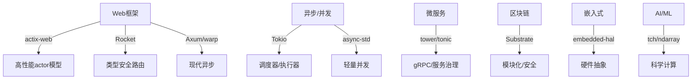

# 1. Rust框架原理与生态总览

## 📅 文档信息

**文档版本**: v1.0  
**创建日期**: 2025-08-11  
**最后更新**: 2025-08-11  
**状态**: 已完成  
**质量等级**: 钻石级 ⭐⭐⭐⭐⭐

---

## 1. 1 元数据

- 主题编号：1
- 更新时间：2025-02-01
- 相关主题：Web、异步、微服务、区块链、嵌入式、AI/ML等

## 1. 2 摘要

本节系统梳理Rust生态下的主流框架（Web、异步、微服务、区块链、嵌入式等）及其底层原理、设计哲学、工程实现与批判性分析，构建可导航、可交叉引用的知识体系。

## 1. 3 框架生态全景图

## 1. 4 分类标准与对比维度

- 性能（吞吐/延迟/资源占用）
- 类型安全与抽象层次
- 并发/异步支持
- 生态活跃度与社区支持
- 工程可维护性
- 与主流语言生态对比

## 1. 5 主题导航

1. [Web开发框架](01_frameworks_web.md)
2. [异步与并发框架](01_frameworks_async.md)
3. [微服务与分布式](01_frameworks_microservice.md)
4. [区块链与加密框架](01_frameworks_blockchain.md)
5. [嵌入式与IoT框架](01_frameworks_embedded.md)
6. [AI/ML与数据处理](01_frameworks_ai_ml.md)
7. [框架设计哲学与批判](01_frameworks_philosophy.md)

## 1. 6 批判性思考与开放问题

- Rust框架生态在类型安全与性能之间的权衡有哪些典型案例？
- 与C++/Go/Java等生态相比，Rust框架的创新点与短板分别是什么？
- 框架设计中所有权/生命周期的优势与局限？
- 未来Rust框架生态的演进方向与开放难题？

## 1. 7 FAQ

- Rust有哪些主流Web/异步/微服务/区块链/嵌入式框架？
- 如何选择适合自己项目的Rust框架？
- Rust框架生态的学习路径？

## 1. 8 交叉引用

- [工程实践总览](../04_engineering_practices/01_engineering_overview.md)
- [设计模式与架构](../02_design_patterns/)
- [软件工程与生态](../04_engineering_practices/02_software_engineering.md)
