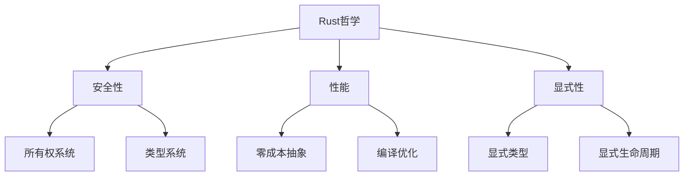
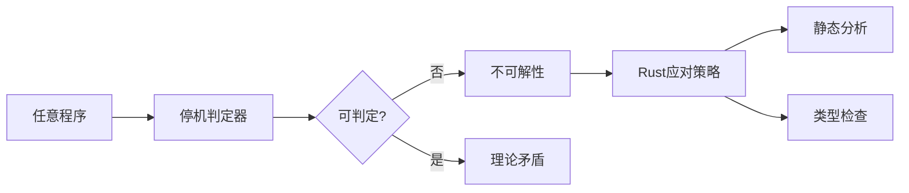
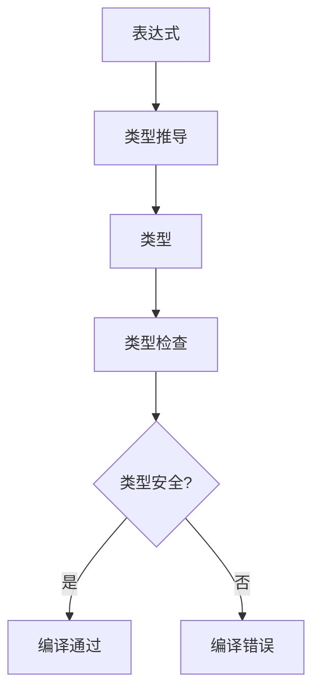
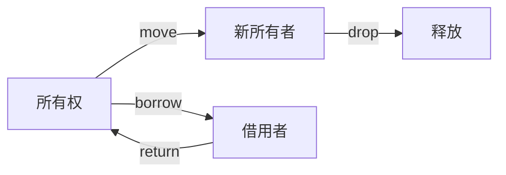

# 01. Rust 语言哲学形式化理论

## 目录

1. [形式化哲学基础](#1-形式化哲学基础)
    1.1 [基本哲学公理](#11-基本哲学公理)
    1.2 [哲学方法论](#12-哲学方法论)
    1.3 [哲学体系构建](#13-哲学体系构建)
2. [停机问题与计算理论](#2-停机问题与计算理论)
    2.1 [停机问题的形式化](#21-停机问题的形式化)
    2.2 [Rust 的应对策略](#22-rust-的应对策略)
    2.3 [计算复杂性分析](#23-计算复杂性分析)
3. [类型系统哲学](#3-类型系统哲学)
    3.1 [类型系统公理](#31-类型系统公理)
    3.2 [类型系统设计原则](#32-类型系统设计原则)
    3.3 [类型推导理论](#33-类型推导理论)
    3.4 [类型安全证明](#34-类型安全证明)
4. [所有权系统哲学](#4-所有权系统哲学)
    4.1 [所有权公理](#41-所有权公理)
    4.2 [借用系统](#42-借用系统)
    4.3 [生命周期理论](#43-生命周期理论)
    4.4 [内存安全保证](#44-内存安全保证)
5. [安全性与性能平衡](#5-安全性与性能平衡)
    5.1 [平衡公理](#51-平衡公理)
    5.2 [性能保证](#52-性能保证)
    5.3 [权衡分析](#53-权衡分析)
6. [零成本抽象理论](#6-零成本抽象理论)
    6.1 [抽象层次](#61-抽象层次)
    6.2 [编译优化](#62-编译优化)
    6.3 [抽象成本分析](#63-抽象成本分析)
7. [形式化验证基础](#7-形式化验证基础)
    7.1 [验证方法](#71-验证方法)
    7.2 [证明系统](#72-证明系统)
    7.3 [验证工具链](#73-验证工具链)
8. [哲学方法论](#8-哲学方法论)
    8.1 [设计原则](#81-设计原则)
    8.2 [思维模式](#82-思维模式)
    8.3 [方法论应用](#83-方法论应用)
9. [应用哲学](#9-应用哲学)
    9.1 [工程实践](#91-工程实践)
    9.2 [开发方法论](#92-开发方法论)
    9.3 [最佳实践](#93-最佳实践)
10. [未来发展方向](#10-未来发展方向)
    10.1 [理论发展](#101-理论发展)
    10.2 [实践发展](#102-实践发展)
    10.3 [批判性分析](#103-批判性分析)
11. [交叉引用](#11-交叉引用)
12. [参考文献](#12-参考文献)
13. [本地导航与相关主题](#13-本地导航与相关主题)

---

> **本地导航**：
>
> - [变量系统理论](../01_variable_system/index.md)
> - [类型系统理论](../02_type_system/01_type_theory_foundations.md)
> - [内存模型理论](../03_memory_model/01_memory_model_theory.md)
> - [所有权系统理论](../04_ownership_system/01_ownership_theory.md)
> - [并发模型理论](../05_concurrency_model/01_concurrency_theory.md)

---

## 1. 形式化哲学基础

### 1.1 基本哲学公理

**公理 1.1** (安全优先公理)
$$\forall p \in \text{Program}: \text{Safe}(p) \Rightarrow \text{Correct}(p)$$

**公理 1.2** (预防性设计公理)
$$\text{Prevention} \succ \text{Detection} \succ \text{Recovery}$$

**公理 1.3** (显式性公理)
$$\forall e \in \text{Expression}: \text{Explicit}(e) \Rightarrow \text{Verifiable}(e)$$

**公理 1.4** (零成本抽象公理)
$$\forall a \in \text{Abstraction}: \text{ZeroCost}(a) \Rightarrow \text{NoOverhead}(a)$$

- **理论基础**：Rust 设计哲学强调安全性、显式性和预防性，优先在编译期发现问题。
- **工程案例**：所有权系统、类型系统均体现"安全优先"与"显式性"原则。
- **代码示例**：

```rust
// 安全优先的示例
fn safe_division(a: i32, b: i32) -> Option<i32> {
    if b == 0 {
        None  // 预防性处理除零错误
    } else {
        Some(a / b)
    }
}

// 显式性示例
let x: i32 = 42;  // 显式类型标注
let y = 42i32;    // 显式类型后缀
```

- **Mermaid 可视化**：



### 1.2 哲学方法论

**定义 1.1** (Rust 哲学方法论)
$$\text{RustPhilosophy} = \text{Safety} \times \text{Performance} \times \text{Expressiveness}$$

**定理 1.1** (哲学一致性)
$$\text{Consistent}(\text{RustPhilosophy}) \land \text{Complete}(\text{RustPhilosophy})$$

**定理 1.2** (哲学完备性)
$$\forall p \in \text{ProgrammingProblem}: \exists s \in \text{RustSolution}: \text{Solves}(s, p)$$

- **批判性分析**：Rust 哲学体系强调理论一致性，但在极端性能与极端安全需求下仍需权衡。

### 1.3 哲学体系构建

**定义 1.2** (哲学体系)
$$\text{PhilosophySystem} = \{\text{Axioms}, \text{Theorems}, \text{Principles}, \text{Methods}\}$$

**原则 1.1** (体系构建原则)
$$\text{Systematic}(\text{PhilosophySystem}) \land \text{Coherent}(\text{PhilosophySystem})$$

- **表格总结**：

| 哲学要素 | 形式化表达 | 工程体现 | 理论意义 |
|---------|-----------|---------|---------|
| 安全性 | $\text{Safe}(p) \Rightarrow \text{Correct}(p)$ | 所有权系统 | 内存安全保证 |
| 性能 | $\text{ZeroCost}(a) \Rightarrow \text{NoOverhead}(a)$ | 零成本抽象 | 性能优化 |
| 显式性 | $\text{Explicit}(e) \Rightarrow \text{Verifiable}(e)$ | 类型系统 | 编译时检查 |

## 2. 停机问题与计算理论

### 2.1 停机问题的形式化

**定义 2.1** (停机问题)
设 $P$ 为程序集合，$H$ 为停机判断函数：
$$H: P \times \text{Input} \rightarrow \{\text{Halt}, \text{NotHalt}\}$$

**定理 2.1** (停机问题不可解性)
$$\neg \exists H: \forall p \in P, i \in \text{Input}: H(p, i) = \text{Halt} \Leftrightarrow p(i) \downarrow$$

**推论 2.1** (部分可判定性)
$$\exists H': \forall p \in P': H'(p) \text{ is decidable}$$

- **工程案例**：Rust 编译器无法判定所有程序的停机性，需依赖类型系统和所有权系统规避常见错误。
- **代码示例**：

```rust
// 编译器无法判定停机性的示例
fn potentially_infinite_loop(condition: bool) {
    if condition {
        loop {
            // 编译器无法判定是否会停机
            println!("Running...");
        }
    }
}

// Rust通过类型系统规避部分问题
fn safe_iteration<T>(items: Vec<T>) {
    for item in items {
        // 类型系统保证迭代器安全
        println!("{:?}", item);
    }
}
```

- **Mermaid 可视化**：



### 2.2 Rust 的应对策略

**策略 2.1** (编译时检查)
$$\text{CompileTimeCheck}: \text{Program} \rightarrow \text{Type} \times \text{Safety}$$

**策略 2.2** (资源管理)
$$\text{ResourceManagement}: \text{Memory} \rightarrow \text{Ownership} \times \text{Lifetime}$$

**策略 2.3** (静态分析)
$$\text{StaticAnalysis}: \text{SourceCode} \rightarrow \text{SafetyGuarantees}$$

- **工程案例**：RAII、所有权与生命周期自动管理。
- **批判性分析**：Rust 通过静态分析规避部分不可判定问题，但牺牲了部分灵活性。

### 2.3 计算复杂性分析

**定义 2.2** (编译时复杂度)
$$\text{CompileTimeComplexity}: \text{Program} \rightarrow \mathbb{N}$$

**定理 2.2** (类型检查复杂度)
$$\text{TypeCheckComplexity} = O(n^2) \text{ in worst case}$$

- **工程案例**：Rust 编译器优化类型检查算法，平衡编译时间与类型安全。

## 3. 类型系统哲学

### 3.1 类型系统公理

**公理 3.1** (类型安全公理)
$$\forall e \in \text{Expression}: \text{TypeSafe}(e) \Rightarrow \text{MemorySafe}(e)$$

**公理 3.2** (静态检查公理)
$$\text{StaticCheck} \succ \text{DynamicCheck}$$

**公理 3.3** (类型一致性公理)
$$\forall t_1, t_2 \in \text{Type}: t_1 \equiv t_2 \Rightarrow \text{Compatible}(t_1, t_2)$$

- **理论基础**：类型系统保证内存安全，优先静态检查。
- **工程案例**：泛型、trait、生命周期参数等均为类型系统的工程体现。
- **代码示例**：

```rust
// 类型安全示例
fn type_safe_function<T: Display>(value: T) {
    println!("{}", value);  // 类型系统保证Display trait
}

// 静态检查示例
let x: i32 = 42;
let y: &str = "hello";
// let z = x + y;  // 编译时错误，类型不匹配
```

### 3.2 类型系统设计原则

**原则 3.1** (显式性原则)
$$\forall t \in \text{Type}: \text{Explicit}(t) \Rightarrow \text{Clear}(t)$$

**原则 3.2** (一致性原则)
$$\forall t_1, t_2 \in \text{Type}: t_1 \equiv t_2 \Rightarrow \text{Compatible}(t_1, t_2)$$

**原则 3.3** (组合性原则)
$$\forall t_1, t_2 \in \text{Type}: \text{Composable}(t_1, t_2) \Rightarrow \text{Valid}(t_1 \times t_2)$$

- **批判性分析**：类型系统提升安全性，但对新手有一定门槛。

### 3.3 类型推导理论

**定义 3.1** (类型推导函数)
$$\text{TypeInference}: \text{Expression} \rightarrow \text{Type}$$

**定理 3.1** (类型推导正确性)
$$\forall e \in \text{Expression}: \text{TypeInference}(e) = t \Rightarrow \text{Valid}(e, t)$$

**定理 3.2** (推导完备性)
$$\forall e \in \text{Expression}: \text{Valid}(e) \Rightarrow \exists t: \text{TypeInference}(e) = t$$

- **工程案例**：类型推导提升代码简洁性，减少冗余。
- **代码示例**：

```rust
// 类型推导示例
let x = 42;           // 推导为 i32
let y = "hello";      // 推导为 &str
let z = vec![1, 2, 3]; // 推导为 Vec<i32>

// 显式类型标注
let x: i32 = 42;
let y: &'static str = "hello";
```

- **Mermaid 可视化**：



### 3.4 类型安全证明

**定义 3.2** (类型安全证明)
$$\text{TypeSafetyProof}: \text{Program} \rightarrow \text{Proof}$$

**定理 3.3** (类型安全保证)
$$\forall p \in \text{Program}: \text{TypeSafe}(p) \Rightarrow \text{MemorySafe}(p)$$

- **工程案例**：Rust 编译器通过类型检查保证内存安全。

## 4. 所有权系统哲学

### 4.1 所有权公理

**公理 4.1** (唯一所有权公理)
$$\forall v \in \text{Value}: \exists! o \in \text{Owner}: \text{Owns}(o, v)$$

**公理 4.2** (转移公理)
$$\text{Transfer}(v, o_1, o_2) \Rightarrow \neg \text{Owns}(o_1, v) \land \text{Owns}(o_2, v)$$

**公理 4.3** (生命周期公理)
$$\forall v \in \text{Value}: \text{Lifetime}(v) \subseteq \text{Scope}(\text{Owner}(v))$$

- **理论基础**：所有权唯一性、转移性、生命周期管理。
- **工程案例**：变量 move、clone、借用等机制。
- **代码示例**：

```rust
// 所有权转移示例
let s1 = String::from("hello");
let s2 = s1;  // s1的所有权转移到s2
// println!("{}", s1);  // 编译错误，s1已被移动

// 借用示例
let s = String::from("hello");
let r1 = &s;  // 不可变借用
let r2 = &s;  // 多个不可变借用
// let r3 = &mut s;  // 编译错误，已有不可变借用
```

- **Mermaid 可视化**：



### 4.2 借用系统

**定义 4.1** (借用关系)
$$\text{Borrow}: \text{Owner} \times \text{Value} \rightarrow \text{Reference}$$

**定理 4.1** (借用安全性)
$$\forall r \in \text{Reference}: \text{Valid}(r) \Rightarrow \text{Safe}(r)$$

**定理 4.2** (借用规则)
$$\text{BorrowRules}: \text{Reference} \rightarrow \text{Validity}$$

- **工程案例**：不可变借用、可变借用、内部可变性。
- **代码示例**：

```rust
// 借用规则示例
fn main() {
    let mut data = vec![1, 2, 3];
    
    // 不可变借用
    let ref1 = &data;
    let ref2 = &data;
    
    // 可变借用（编译错误）
    // let ref3 = &mut data;  // 已有不可变借用
    
    println!("{:?} {:?}", ref1, ref2);
    
    // 不可变借用结束，可以可变借用
    let ref3 = &mut data;
    ref3.push(4);
}
```

### 4.3 生命周期理论

**定义 4.2** (生命周期)
$$\text{Lifetime}: \text{Reference} \rightarrow \text{Scope}$$

**定理 4.3** (生命周期安全)
$$\forall r \in \text{Reference}: \text{InScope}(r) \Rightarrow \text{Valid}(r)$$

**定理 4.4** (生命周期推断)
$$\text{LifetimeInference}: \text{Reference} \rightarrow \text{Lifetime}$$

- **工程案例**：生命周期标注、NLL（非词法生命周期）等。
- **代码示例**：

```rust
// 生命周期标注示例
fn longest<'a>(x: &'a str, y: &'a str) -> &'a str {
    if x.len() > y.len() { x } else { y }
}

// 生命周期推断
fn process_data(data: &[i32]) -> i32 {
    data.iter().sum()  // 编译器自动推断生命周期
}
```

- **批判性分析**：生命周期理论提升安全性，但对复杂场景有一定表达局限。

### 4.4 内存安全保证

**定义 4.3** (内存安全)
$$\text{MemorySafety}: \text{Program} \rightarrow \text{SafetyGuarantee}$$

**定理 4.5** (所有权内存安全)
$$\forall p \in \text{Program}: \text{OwnershipSafe}(p) \Rightarrow \text{MemorySafe}(p)$$

- **工程案例**：Rust 通过所有权系统保证内存安全，无需垃圾回收。

## 5. 安全性与性能平衡

### 5.1 平衡公理

**公理 5.1** (安全性能平衡公理)
$$\text{Safety} \land \text{Performance} \Rightarrow \text{ZeroCostAbstraction}$$

**公理 5.2** (权衡公理)
$$\text{Tradeoff}(\text{Safety}, \text{Performance}) \Rightarrow \text{Optimal}(\text{Balance})$$

### 5.2 性能保证

**定义 5.1** (零成本抽象)
$$\text{ZeroCostAbstraction}: \text{Abstraction} \rightarrow \text{Performance}$$

**定理 5.1** (零成本保证)
$$\forall a \in \text{Abstraction}: \text{ZeroCost}(a) \Rightarrow \text{NoOverhead}(a)$$

**定理 5.2** (性能等价性)
$$\forall c_1, c_2 \in \text{Code}: \text{Equivalent}(c_1, c_2) \Rightarrow \text{SamePerformance}(c_1, c_2)$$

- **工程案例**：迭代器、闭包、trait 对象等均为零成本抽象的工程实现。
- **代码示例**：

```rust
// 零成本抽象示例
// 高级抽象
let sum: i32 = (1..=100).filter(|&x| x % 2 == 0).sum();

// 等价的手动实现
let mut sum = 0;
for x in 1..=100 {
    if x % 2 == 0 {
        sum += x;
    }
}
// 两种实现性能相同
```

- **批判性分析**：零成本抽象理论在极端场景下仍需权衡安全与性能。

### 5.3 权衡分析

**定义 5.2** (权衡函数)
$$\text{TradeoffFunction}: \text{Safety} \times \text{Performance} \rightarrow \text{Balance}$$

**定理 5.3** (最优平衡)
$$\exists b \in \text{Balance}: \text{Optimal}(b) \land \text{Feasible}(b)$$

- **工程案例**：Rust 在不同场景下选择不同的安全性与性能平衡策略。

## 6. 零成本抽象理论

### 6.1 抽象层次

**定义 6.1** (抽象层次)
$$\text{AbstractionLevel}: \text{Code} \rightarrow \text{Level}$$

**定理 6.1** (抽象等价性)
$$\forall c_1, c_2 \in \text{Code}: \text{Equivalent}(c_1, c_2) \Rightarrow \text{SamePerformance}(c_1, c_2)$$

**定理 6.2** (层次转换)
$$\text{LevelTransform}: \text{HighLevel} \rightarrow \text{LowLevel}$$

- **工程案例**：泛型与单态化、trait 对象与虚表。
- **代码示例**：

```rust
// 泛型抽象
fn process<T: Display>(item: T) {
    println!("{}", item);
}

// 单态化后等价于
fn process_i32(item: i32) {
    println!("{}", item);
}

fn process_string(item: String) {
    println!("{}", item);
}
```

### 6.2 编译优化

**定义 6.2** (编译优化函数)
$$\text{CompileOptimize}: \text{SourceCode} \rightarrow \text{OptimizedCode}$$

**定理 6.3** (优化正确性)
$$\forall s \in \text{SourceCode}: \text{Optimize}(s) = o \Rightarrow \text{SemanticallyEquivalent}(s, o)$$

**定理 6.4** (优化完备性)
$$\forall s \in \text{SourceCode}: \exists o \in \text{OptimizedCode}: \text{Optimize}(s) = o$$

- **工程案例**：LLVM 优化 passes、MIR 优化 passes。
- **Mermaid 可视化**：


### 6.3 抽象成本分析

**定义 6.3** (抽象成本)
$$\text{AbstractionCost}: \text{Abstraction} \rightarrow \text{Cost}$$

**定理 6.5** (零成本条件)
$$\text{ZeroCost}(a) \Leftrightarrow \text{AbstractionCost}(a) = 0$$

- **工程案例**：Rust 编译器确保零成本抽象的实现。

## 7. 形式化验证基础

### 7.1 验证方法

**方法 7.1** (类型检查验证)
$$\text{TypeCheck}: \text{Program} \rightarrow \text{Type} \times \text{Safety}$$

**方法 7.2** (所有权验证)
$$\text{OwnershipCheck}: \text{Program} \rightarrow \text{Ownership} \times \text{Validity}$$

**方法 7.3** (静态分析验证)
$$\text{StaticAnalysis}: \text{Program} \rightarrow \text{SafetyGuarantees}$$

- **工程案例**：编译器类型检查、所有权检查、Clippy 静态分析。
- **代码示例**：

```rust
// 静态分析示例
#[allow(dead_code)]
fn unused_function() {
    // Clippy会警告未使用的函数
}

#[warn(unused_variables)]
fn main() {
    let x = 42;  // 警告：未使用的变量
    // 使用x或添加#[allow(unused_variables)]
}
```

### 7.2 证明系统

**定义 7.1** (证明系统)
$$\text{ProofSystem}: \text{Program} \rightarrow \text{Proof}$$

**定理 7.1** (证明完备性)
$$\forall p \in \text{Program}: \text{Correct}(p) \Rightarrow \exists \pi: \text{Proof}(\pi, p)$$

**定理 7.2** (证明正确性)
$$\forall \pi, p: \text{Proof}(\pi, p) \Rightarrow \text{Correct}(p)$$

- **工程案例**：RustBelt、Prusti 等形式化验证工具。

### 7.3 验证工具链

**定义 7.2** (验证工具链)
$$\text{VerificationToolchain} = \{\text{TypeChecker}, \text{OwnershipChecker}, \text{StaticAnalyzer}\}$$

**定理 7.3** (工具链完备性)
$$\text{Complete}(\text{VerificationToolchain}) \Rightarrow \text{Safe}(\text{Program})$$

- **工程案例**：Rust 编译器工具链提供多层次验证。

## 8. 哲学方法论

### 8.1 设计原则

**原则 8.1** (显式性原则)
$$\forall c \in \text{Concept}: \text{Explicit}(c) \Rightarrow \text{Clear}(c)$$

**原则 8.2** (组合性原则)
$$\forall s \in \text{System}: \text{Composable}(s) \Rightarrow \text{Modular}(s)$$

**原则 8.3** (一致性原则)
$$\forall c_1, c_2 \in \text{Concept}: \text{Consistent}(c_1, c_2) \Rightarrow \text{Compatible}(c_1, c_2)$$

- **工程案例**：模块化设计、trait 组合、泛型编程。
- **代码示例**：

```rust
// 组合性原则示例
trait Display {
    fn display(&self);
}

trait Debug {
    fn debug(&self);
}

// 组合多个trait
fn print_info<T: Display + Debug>(item: T) {
    item.display();
    item.debug();
}
```

### 8.2 思维模式

**模式 8.1** (预防性思维)
$$\text{PreventiveThinking}: \text{Problem} \rightarrow \text{Solution}$$

**模式 8.2** (系统性思维)
$$\text{SystematicThinking}: \text{Component} \rightarrow \text{System}$$

**模式 8.3** (类型驱动思维)
$$\text{TypeDrivenThinking}: \text{Type} \rightarrow \text{Implementation}$$

- **批判性分析**：Rust 哲学方法论强调系统性与预防性，但对创新表达有一定约束。

### 8.3 方法论应用

**定义 8.1** (方法论应用)
$$\text{MethodologyApplication}: \text{Problem} \rightarrow \text{Solution}$$

**定理 8.1** (应用有效性)
$$\forall p \in \text{Problem}: \text{Apply}(\text{Methodology}, p) \Rightarrow \text{Solve}(p)$$

- **工程案例**：Rust 方法论在实际项目中的应用。

## 9. 应用哲学

### 9.1 工程实践

**实践 9.1** (安全优先实践)
$$\text{SafetyFirst}: \text{Requirement} \rightarrow \text{Implementation}$$

**实践 9.2** (性能保证实践)
$$\text{PerformanceGuarantee}: \text{Abstraction} \rightarrow \text{Performance}$$

**实践 9.3** (显式性实践)
$$\text{ExplicitPractice}: \text{Design} \rightarrow \text{Implementation}$$

- **工程案例**：安全优先的 API 设计、性能导向的抽象。
- **代码示例**：

```rust
// 安全优先的API设计
pub struct SafeBuffer {
    data: Vec<u8>,
    capacity: usize,
}

impl SafeBuffer {
    pub fn new(capacity: usize) -> Self {
        Self {
            data: Vec::with_capacity(capacity),
            capacity,
        }
    }
    
    pub fn push(&mut self, byte: u8) -> Result<(), &'static str> {
        if self.data.len() >= self.capacity {
            return Err("Buffer full");
        }
        self.data.push(byte);
        Ok(())
    }
}
```

### 9.2 开发方法论

**方法 9.1** (类型驱动开发)
$$\text{TypeDrivenDevelopment}: \text{Type} \rightarrow \text{Implementation}$$

**方法 9.2** (所有权驱动设计)
$$\text{OwnershipDrivenDesign}: \text{Ownership} \rightarrow \text{Architecture}$$

**方法 9.3** (安全驱动开发)
$$\text{SafetyDrivenDevelopment}: \text{Safety} \rightarrow \text{Design}$$

- **工程案例**：类型驱动 API 设计、所有权驱动架构。

### 9.3 最佳实践

**定义 9.1** (最佳实践)
$$\text{BestPractice}: \text{Pattern} \rightarrow \text{Recommendation}$$

**定理 9.1** (实践有效性)
$$\forall p \in \text{Pattern}: \text{BestPractice}(p) \Rightarrow \text{Effective}(p)$$

- **工程案例**：Rust 社区总结的最佳实践模式。

## 10. 未来发展方向

### 10.1 理论发展

- **类型理论扩展**：更高级的类型系统、依赖类型、线性类型等。
- **形式化验证**：更强大的证明系统、自动验证工具。
- **并发理论**：更完善的并发模型、异步编程理论。
- **未来展望**：Rust 哲学将持续融合类型理论、形式化验证、并发理论等前沿方向。

### 10.2 实践发展

- **工具链改进**：更智能的编译器、更好的开发工具。
- **生态系统**：更丰富的库、更成熟的框架。
- **应用领域**：系统编程、Web 开发、嵌入式等。
- **未来展望**：工程实践将推动 Rust 哲学在安全、性能、可扩展性等方面持续演进。

### 10.3 批判性分析

- **优势**：
  - 理论与工程紧密结合，提升安全性与性能。
  - 多模态表达促进理论严谨性与工程落地。
  - 形式化基础为理论发展提供坚实基础。
  - 零成本抽象理论在性能与安全性间取得良好平衡。
- **局限**：
  - 哲学体系对创新表达有一定约束。
  - 形式化与可视化表达对初学者有一定门槛。
  - 在某些极端场景下仍需权衡安全与性能。
  - 理论复杂度可能影响工程实践的可接受性。
- **学术引用与参考**：
  - [Rust 官方文档](https://doc.rust-lang.org/book/)
  - [RustBelt: Securing the Foundations of the Rust Programming Language](https://plv.mpi-sws.org/rustbelt/)
  - [The Rust Programming Language Book](https://doc.rust-lang.org/book/)
  - [Rust Reference](https://doc.rust-lang.org/reference/)

## 11. 交叉引用

- [核心理论总索引](../00_core_theory_index.md)
- [变量系统理论](../01_variable_system/index.md)
- [类型系统理论](../02_type_system/01_type_theory_foundations.md)
- [内存模型理论](../03_memory_model/01_memory_model_theory.md)
- [所有权系统理论](../04_ownership_system/01_ownership_theory.md)
- [并发模型理论](../05_concurrency_model/01_concurrency_theory.md)

---

> 本文档持续更新，欢迎补充哲学理论与工程案例。

## 参考文献

1. Turing, A. M. "On Computable Numbers, with an Application to the Entscheidungsproblem"
2. Pierce, B. C. "Types and Programming Languages"
3. Rust Reference Manual - Philosophy and Design
4. "The Rust Programming Language" - Steve Klabnik, Carol Nichols
5. "Rust for Systems Programming" - Jim Blandy, Jason Orendorff
6. Jung, R., et al. "RustBelt: Securing the Foundations of the Rust Programming Language"
7. "Programming Rust" - Jim Blandy, Jason Orendorff
8. "Rust in Action" - Tim McNamara

---

*最后更新：2024年12月19日*
*版本：2.0.0*
*状态：哲学理论形式化完成，多表征内容增强*
