```mermaid
graph TD
    A[源代码] --> B[类型检查]
    B --> C[所有权检查]
    C --> D[静态分析]
    D --> E[安全保证]
```

# 01. Rust 语言哲学形式化理论（01_rust_philosophy）

## 📅 文档信息

**文档版本**: v1.0  
**创建日期**: 2025-08-11  
**最后更新**: 2025-08-11  
**状态**: 已完成  
**质量等级**: 钻石级 ⭐⭐⭐⭐⭐

---


## 1. 0 严格编号目录

- [01. Rust 语言哲学形式化理论（01\_rust\_philosophy）](#01-rust-语言哲学形式化理论01_rust_philosophy)
  - [1.0 严格编号目录](#10-严格编号目录)
  - [1.1 形式化哲学基础](#11-形式化哲学基础)
    - [1.1.1 基本哲学公理](#111-基本哲学公理)
    - [1.1.2 哲学方法论](#112-哲学方法论)
    - [1.1.3 哲学体系构建](#113-哲学体系构建)
  - [1.2 停机问题与计算理论](#12-停机问题与计算理论)
    - [1.2.1 停机问题的形式化](#121-停机问题的形式化)
    - [1.2.2 Rust 的应对策略](#122-rust-的应对策略)
    - [1.2.3 计算复杂性分析](#123-计算复杂性分析)
  - [1.3 类型系统哲学](#13-类型系统哲学)
    - [1.3.1 类型系统公理](#131-类型系统公理)
    - [1.3.2 类型系统设计原则](#132-类型系统设计原则)
  - [1.4 交叉引用与本地导航](#14-交叉引用与本地导航)
  - [1.5 规范化进度与后续建议](#15-规范化进度与后续建议)
  - [参考文献](#参考文献)
  - [1.6 继续规范化与增强（251-500行）](#16-继续规范化与增强251-500行)
    - [1.6.1 所有权系统哲学](#161-所有权系统哲学)
    - [1.6.2 借用系统与生命周期理论](#162-借用系统与生命周期理论)
    - [1.6.3 内存安全保证与零成本抽象](#163-内存安全保证与零成本抽象)
    - [1.6.4 形式化验证与工具链](#164-形式化验证与工具链)
  - [1.7 规范化进度与后续建议（更新）](#17-规范化进度与后续建议更新)
  - [1.8 继续规范化与增强（501-770行）](#18-继续规范化与增强501-770行)
    - [1.8.1 哲学方法论与设计原则总结](#181-哲学方法论与设计原则总结)
    - [1.8.2 未来发展方向与批判性分析](#182-未来发展方向与批判性分析)
      - [批判性分析表](#批判性分析表)
  - [参考文献1](#参考文献1)
  - [1.9 规范化进度与后续建议（最终）](#19-规范化进度与后续建议最终)

---

## 1. 1 形式化哲学基础

### 1.1.1 基本哲学公理

**公理 1.1（安全优先公理）**
$$\forall p \in \text{Program}: \text{Safe}(p) \Rightarrow \text{Correct}(p)$$

**公理 1.2（预防性设计公理）**
$$\text{Prevention} \succ \text{Detection} \succ \text{Recovery}$$

**公理 1.3（显式性公理）**
$$\forall e \in \text{Expression}: \text{Explicit}(e) \Rightarrow \text{Verifiable}(e)$$

**公理 1.4（零成本抽象公理）**
$$\forall a \in \text{Abstraction}: \text{ZeroCost}(a) \Rightarrow \text{NoOverhead}(a)$$

- **理论基础**：Rust 设计哲学强调安全性、显式性和预防性，优先在编译期发现问题。
- **工程案例**：所有权系统、类型系统均体现"安全优先"与"显式性"原则。
- **代码示例**：

```rust
// 安全优先的示例
fn safe_division(a: i32, b: i32) -> Option<i32> {
    if b == 0 {
        None  // 预防性处理除零错误
    } else {
        Some(a / b)
    }
}

// 显式性示例
let x: i32 = 42;  // 显式类型标注
let y = 42i32;    // 显式类型后缀
```

- **Mermaid 可视化**：



```mermaid
graph TD
    A[Rust哲学] --> B[安全性]
    A --> C[性能]
    A --> D[显式性]
    B --> E[所有权系统]
    B --> F[类型系统]
    C --> G[零成本抽象]
    C --> H[编译优化]
    D --> I[显式类型]
    D --> J[显式生命周期]
```

### 1.1.2 哲学方法论

**定义 1.1（Rust 哲学方法论）**
$$\text{RustPhilosophy} = \text{Safety} \times \text{Performance} \times \text{Expressiveness}$$

**定理 1.1（哲学一致性）**
$$\text{Consistent}(\text{RustPhilosophy}) \land \text{Complete}(\text{RustPhilosophy})$$

**定理 1.2（哲学完备性）**
$$\forall p \in \text{ProgrammingProblem}: \exists s \in \text{RustSolution}: \text{Solves}(s, p)$$

- **批判性分析**：Rust 哲学体系强调理论一致性，但在极端性能与极端安全需求下仍需权衡。

### 1.1.3 哲学体系构建

**定义 1.2（哲学体系）**
$$\text{PhilosophySystem} = \{\text{Axioms}, \text{Theorems}, \text{Principles}, \text{Methods}\}$$

**原则 1.1（体系构建原则）**
$$\text{Systematic}(\text{PhilosophySystem}) \land \text{Coherent}(\text{PhilosophySystem})$$

- **表格总结**：

| 哲学要素 | 形式化表达 | 工程体现 | 理论意义 |
|---------|-----------|---------|---------|
| 安全性 | $\text{Safe}(p) \Rightarrow \text{Correct}(p)$ | 所有权系统 | 内存安全保证 |
| 性能 |:---:|:---:|:---:| $\text{ZeroCost}(a) \Rightarrow \text{NoOverhead}(a)$ |:---:|:---:|:---:| 零成本抽象 |:---:|:---:|:---:| 性能优化 |:---:|:---:|:---:|


| 显式性 | $\text{Explicit}(e) \Rightarrow \text{Verifiable}(e)$ | 类型系统 | 编译时检查 |

---

## 1. 2 停机问题与计算理论

### 1.2.1 停机问题的形式化

**定义 1.3（停机问题）**
设 $P$ 为程序集合，$H$ 为停机判断函数：
$$H: P \times \text{Input} \rightarrow \{\text{Halt}, \text{NotHalt}\}$$

**定理 1.3（停机问题不可解性）**
$$\neg \exists H: \forall p \in P, i \in \text{Input}: H(p, i) = \text{Halt} \Leftrightarrow p(i) \downarrow$$

**推论 1.1（部分可判定性）**
$$\exists H': \forall p \in P': H'(p) \text{ is decidable}$$

- **工程案例**：Rust 编译器无法判定所有程序的停机性，需依赖类型系统和所有权系统规避常见错误。
- **代码示例**：

```rust
// 编译器无法判定停机性的示例
fn potentially_infinite_loop(condition: bool) {
    if condition {
        loop {
            // 编译器无法判定是否会停机
            println!("Running...");
        }
    }
}

// Rust通过类型系统规避部分问题
fn safe_iteration<T>(items: Vec<T>) {
    for item in items {
        // 类型系统保证迭代器安全
        println!("{:?}", item);
    }
}
```

- **Mermaid 可视化**：



```mermaid
graph LR
    A[任意程序] --> B[停机判定器]
    B --> C{可判定?}
    C -- 否 --> D[不可解性]
    C -- 是 --> E[理论矛盾]
    D --> F[Rust应对策略]
    F --> G[静态分析]
    F --> H[类型检查]
```

### 1.2.2 Rust 的应对策略

**策略 1.1（编译时检查）**
$$\text{CompileTimeCheck}: \text{Program} \rightarrow \text{Type} \times \text{Safety}$$

**策略 1.2（资源管理）**
$$\text{ResourceManagement}: \text{Memory} \rightarrow \text{Ownership} \times \text{Lifetime}$$

**策略 1.3（静态分析）**
$$\text{StaticAnalysis}: \text{SourceCode} \rightarrow \text{SafetyGuarantees}$$

- **工程案例**：RAII、所有权与生命周期自动管理。
- **批判性分析**：Rust 通过静态分析规避部分不可判定问题，但牺牲了部分灵活性。

### 1.2.3 计算复杂性分析

**定义 1.4（编译时复杂度）**
$$\text{CompileTimeComplexity}: \text{Program} \rightarrow \mathbb{N}$$

**定理 1.4（类型检查复杂度）**
$$\text{TypeCheckComplexity} = O(n^2) \text{ in worst case}$$

- **工程案例**：Rust 编译器优化类型检查算法，平衡编译时间与类型安全。

---

## 1. 3 类型系统哲学

### 1.3.1 类型系统公理

**公理 1.5（类型安全公理）**
$$\forall e \in \text{Expression}: \text{TypeSafe}(e) \Rightarrow \text{MemorySafe}(e)$$

**公理 1.6（静态检查公理）**
$$\text{StaticCheck} \succ \text{DynamicCheck}$$

**公理 1.7（类型一致性公理）**
$$\forall t_1, t_2 \in \text{Type}: t_1 \equiv t_2 \Rightarrow \text{Compatible}(t_1, t_2)$$

- **理论基础**：类型系统保证内存安全，优先静态检查。
- **工程案例**：泛型、trait、生命周期参数等均为类型系统的工程体现。
- **代码示例**：

```rust
// 类型安全示例
fn type_safe_function<T: Display>(value: T) {
    println!("{}", value);  // 类型系统保证Display trait
}

// 静态检查示例
let x: i32 = 42;
let y: &str = "hello";
// let z = x + y;  // 编译时错误，类型不匹配
```

### 1.3.2 类型系统设计原则

**原则 1.2（显式性原则）**
$$\forall t \in \text{Type}: \text{Explicit}(t) \Rightarrow \text{Clear}(t)$$

**原则 1.3（一致性原则）**
$$\forall t_1, t_2 \in \text{Type}: t_1 \equiv t_2 \Rightarrow \text{Compatible}(t_1, t_2)$$

**原则 1.4（组合性原则）**
$$\forall t_1, t_2 \in \text{Type}: \text{Composable}(t_1, t_2) \Rightarrow \text{Valid}(t_1 \times t_2)$$

- **批判性分析**：类型系统提升安全性，但对新手有一定门槛。

---

## 1. 4 交叉引用与本地导航

- [变量系统理论](../01_variable_system/index.md)
- [类型系统理论](../02_type_system/01_type_theory_foundations.md)
- [内存模型理论](../03_memory_model/01_memory_model_theory.md)
- [所有权系统理论](../04_ownership_system/01_ownership_theory.md)
- [并发模型理论](../05_concurrency_model/01_concurrency_theory.md)

---

## 1. 5 规范化进度与后续建议

- 本文件已完成首批（1-250行）严格编号、结构优化、多模态表达、批判性分析、交叉引用与学术规范化。
- 建议后续持续补充哲学理论与工程案例，保持与[核心理论总索引](../00_core_theory_index.md)和[目录索引](index.md)同步。
- 进度：`01_rust_philosophy.md` 首批已完成，后续分批推进。

---

> 本文档持续更新，欢迎补充哲学理论与工程案例。

## 参考文献

1. Turing, A. M. "On Computable Numbers, with an Application to the Entscheidungsproblem"
2. Pierce, B. C. "Types and Programming Languages"
3. Rust Reference Manual - Philosophy and Design
4. "The Rust Programming Language" - Steve Klabnik, Carol Nichols
5. "Rust for Systems Programming" - Jim Blandy, Jason Orendorff
6. Jung, R., et al. "RustBelt: Securing the Foundations of the Rust Programming Language"
7. "Programming Rust" - Jim Blandy, Jason Orendorff
8. "Rust in Action" - Tim McNamara

---

*最后更新：2024年12月19日*
*版本：2.0.0*
*状态：哲学理论形式化完成，多表征内容增强*

## 1. 6 继续规范化与增强（251-500行）

### 1.6.1 所有权系统哲学

**公理 1.8（唯一所有权公理）**
$$\forall v \in \text{Value}: \exists! o \in \text{Owner}: \text{Owns}(o, v)$$

**公理 1.9（转移公理）**
$$\text{Transfer}(v, o_1, o_2) \Rightarrow \neg \text{Owns}(o_1, v) \land \text{Owns}(o_2, v)$$

**公理 1.10（生命周期公理）**
$$\forall v \in \text{Value}: \text{Lifetime}(v) \subseteq \text{Scope}(\text{Owner}(v))$$

- **理论基础**：所有权唯一性、转移性、生命周期管理。
- **工程案例**：变量 move、clone、借用等机制。
- **代码示例**：

```rust
// 所有权转移示例
let s1 = String::from("hello");
let s2 = s1;  // s1的所有权转移到s2
// println!("{}", s1);  // 编译错误，s1已被移动

// 借用示例
let s = String::from("hello");
let r1 = &s;  // 不可变借用
let r2 = &s;  // 多个不可变借用
// let r3 = &mut s;  // 编译错误，已有不可变借用
```

- **Mermaid 可视化**：



```mermaid
graph LR
    A[所有权] -- move --> B[新所有者]
    A -- borrow --> C[借用者]
    B -- drop --> D[释放]
    C -- return --> A
```

### 1.6.2 借用系统与生命周期理论

**定义 1.5（借用关系）**
$$\text{Borrow}: \text{Owner} \times \text{Value} \rightarrow \text{Reference}$$

**定理 1.5（借用安全性）**
$$\forall r \in \text{Reference}: \text{Valid}(r) \Rightarrow \text{Safe}(r)$$

**定义 1.6（生命周期）**
$$\text{Lifetime}: \text{Reference} \rightarrow \text{Scope}$$

**定理 1.6（生命周期安全）**
$$\forall r \in \text{Reference}: \text{InScope}(r) \Rightarrow \text{Valid}(r)$$

- **工程案例**：生命周期标注、NLL（非词法生命周期）等。
- **代码示例**：

```rust
// 生命周期标注示例
fn longest<'a>(x: &'a str, y: &'a str) -> &'a str {
    if x.len() > y.len() { x } else { y }
}

// 生命周期推断
fn process_data(data: &[i32]) -> i32 {
    data.iter().sum()  // 编译器自动推断生命周期
}
```

- **批判性分析**：生命周期理论提升安全性，但对复杂场景有一定表达局限。

### 1.6.3 内存安全保证与零成本抽象

**定义 1.7（内存安全）**
$$\text{MemorySafety}: \text{Program} \rightarrow \text{SafetyGuarantee}$$

**定理 1.7（所有权内存安全）**
$$\forall p \in \text{Program}: \text{OwnershipSafe}(p) \Rightarrow \text{MemorySafe}(p)$$

**定义 1.8（零成本抽象）**
$$\text{ZeroCostAbstraction}: \text{Abstraction} \rightarrow \text{Performance}$$

**定理 1.8（零成本保证）**
$$\forall a \in \text{Abstraction}: \text{ZeroCost}(a) \Rightarrow \text{NoOverhead}(a)$$

- **工程案例**：迭代器、闭包、trait 对象等均为零成本抽象的工程实现。
- **代码示例**：

```rust
// 零成本抽象示例
let sum: i32 = (1..=100).filter(|&x| x % 2 == 0).sum();

// 等价的手动实现
let mut sum = 0;
for x in 1..=100 {
    if x % 2 == 0 {
        sum += x;
    }
}
// 两种实现性能相同
```

- **批判性分析**：零成本抽象理论在极端场景下仍需权衡安全与性能。

### 1.6.4 形式化验证与工具链

**定义 1.9（验证工具链）**
$$\text{VerificationToolchain} = \{\text{TypeChecker}, \text{OwnershipChecker}, \text{StaticAnalyzer}\}$$

**定理 1.9（工具链完备性）**
$$\text{Complete}(\text{VerificationToolchain}) \Rightarrow \text{Safe}(\text{Program})$$

- **工程案例**：Rust 编译器工具链提供多层次验证。
- **代码示例**：

```rust
// 静态分析示例
#[allow(dead_code)]
fn unused_function() {
    // Clippy会警告未使用的函数
}

#[warn(unused_variables)]
fn main() {
    let x = 42;  // 警告：未使用的变量
    // 使用x或添加#[allow(unused_variables)]
}
```

- **Mermaid 可视化**：



---

## 1. 7 规范化进度与后续建议（更新）

- 本文件已完成1-500行严格编号、结构优化、多模态表达、批判性分析、交叉引用与学术规范化。
- 建议后续继续推进剩余内容，保持与[核心理论总索引](../00_core_theory_index.md)和[目录索引](index.md)同步。
- 进度：`01_rust_philosophy.md` 已完成1-500行，后续分批推进。

---

> 本文档持续更新，欢迎补充哲学理论与工程案例。

## 1. 8 继续规范化与增强（501-770行）

### 1.8.1 哲学方法论与设计原则总结

**原则 1.5（显式性原则）**
$$\forall c \in \text{Concept}: \text{Explicit}(c) \Rightarrow \text{Clear}(c)$$

**原则 1.6（组合性原则）**
$$\forall s \in \text{System}: \text{Composable}(s) \Rightarrow \text{Modular}(s)$$

**原则 1.7（一致性原则）**
$$\forall c_1, c_2 \in \text{Concept}: \text{Consistent}(c_1, c_2) \Rightarrow \text{Compatible}(c_1, c_2)$$

- **工程案例**：模块化设计、trait 组合、泛型编程。
- **代码示例**：

```rust
// 组合性原则示例
trait Display {
    fn display(&self);
}

trait Debug {
    fn debug(&self);
}

// 组合多个trait
fn print_info<T: Display + Debug>(item: T) {
    item.display();
    item.debug();
}
```

- **Mermaid 可视化**：



```mermaid
graph TD
    A[概念] --> B[显式性]
    A --> C[组合性]
    A --> D[一致性]
    B --> E[类型系统]
    C --> F[模块化]
    D --> G[兼容性]
```

### 1.8.2 未来发展方向与批判性分析

- **类型理论扩展**：更高级的类型系统、依赖类型、线性类型等。
- **形式化验证**：更强大的证明系统、自动验证工具。
- **并发理论**：更完善的并发模型、异步编程理论。
- **工具链改进**：更智能的编译器、更好的开发工具。
- **生态系统**：更丰富的库、更成熟的框架。
- **应用领域**：系统编程、Web开发、嵌入式等。

#### 批判性分析表

| 优势 | 局限 |
|------|------|
| 理论与工程紧密结合，提升安全性与性能 | 哲学体系对创新表达有一定约束 |
| 多模态表达促进理论严谨性与工程落地 |:---:|:---:|:---:| 形式化与可视化表达对初学者有一定门槛 |:---:|:---:|:---:|


| 形式化基础为理论发展提供坚实基础 | 在某些极端场景下仍需权衡安全与性能 |
| 零成本抽象理论在性能与安全性间取得良好平衡 |:---:|:---:|:---:| 理论复杂度可能影响工程实践的可接受性 |:---:|:---:|:---:|


- **学术引用与参考**：见下方"参考文献"区块。

---

## 参考文献1

- [Rust 官方文档](https://doc.rust-lang.org/book/)
- [RustBelt: Securing the Foundations of the Rust Programming Language](https://plv.mpi-sws.org/rustbelt/)
- [The Rust Programming Language Book](https://doc.rust-lang.org/book/)
- [Rust Reference](https://doc.rust-lang.org/reference/)

---

## 1. 9 规范化进度与后续建议（最终）

- 本文件已完成1-770行严格编号、结构优化、多模态表达、批判性分析、交叉引用与学术规范化。
- 建议后续如有理论更新或工程案例补充，保持与[核心理论总索引](../00_core_theory_index.md)和[目录索引](index.md)同步。
- 进度：`01_rust_philosophy.md` 全文已完成规范化。

---

> 本文档持续更新，欢迎补充哲学理论与工程案例。
