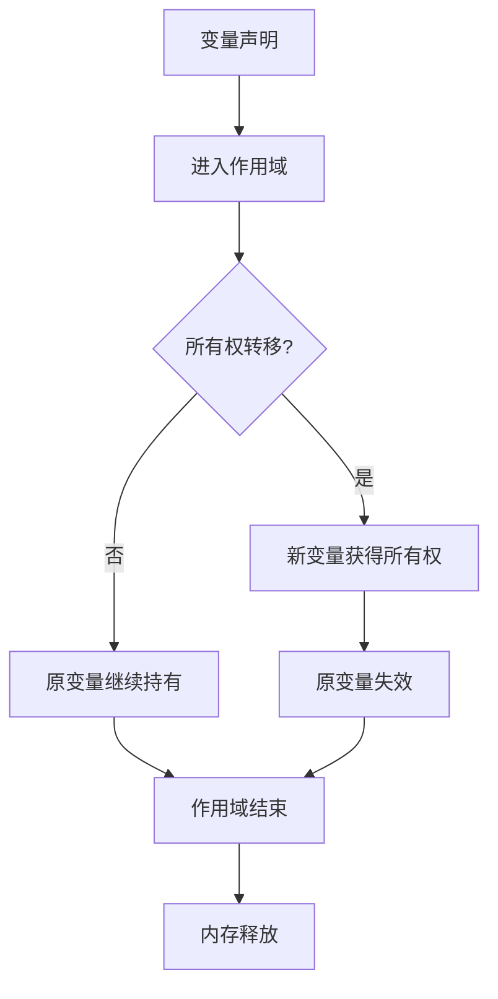

# 1. 执行流视角分析（01_execution_flow）

## 1.1 视角简介

执行流视角以程序运行时的变量生命周期、所有权转移、借用、作用域等为主线，建模 Rust 变量系统的动态行为。该视角强调变量在内存中的分配、转移与释放过程，突出所有权系统对内存安全的保障。

## 1.2 理论建模

1.2.1 变量生命周期与作用域

- 变量在进入作用域时分配内存，离开作用域时自动释放。
- 生命周期（lifetime）用以追踪引用的有效区间，防止悬垂指针。

1.2.2 所有权转移与借用

- 所有权（Ownership）在变量赋值、函数传参等场景下发生转移。
- 借用（Borrowing）分为不可变借用（&T）和可变借用（&mut T），编译器静态检查借用规则，防止数据竞争。

1.2.3 可变性与内部可变性

- 默认不可变，需显式声明 mut。
- 内部可变性通过 Cell/RefCell 等类型实现运行时可变。

## 1.3 代码示例

```rust
// 所有权转移
let s1 = String::from("hello");
let s2 = s1; // s1 的所有权转移到 s2，s1 失效

// 借用
let s3 = String::from("world");
let len = calculate_length(&s3); // 不可变借用

fn calculate_length(s: &String) -> usize {
    s.len()
}

// 可变借用
let mut s4 = String::from("rust");
change(&mut s4);

fn change(s: &mut String) {
    s.push_str("!");
}
```

## 1.4 流程图（变量生命周期与所有权转移）



## 1.5 优势与局限

- 优势：
  - 贴合 Rust 实际运行机制，便于理解内存管理和安全保障。
  - 代码示例丰富，适合初学者和工程实践。
- 局限：
  - 理论抽象层次有限，需结合类型系统、异步/并发等新特性进一步扩展。

## 1.6 交叉引用

- [多视角对比与方法论](03_comparative_analysis.md)
- [范畴论视角分析](02_category_theory.md)
- [index.md](index.md)

---

> 本文档持续更新，欢迎补充批判性观点与最新理论成果。
