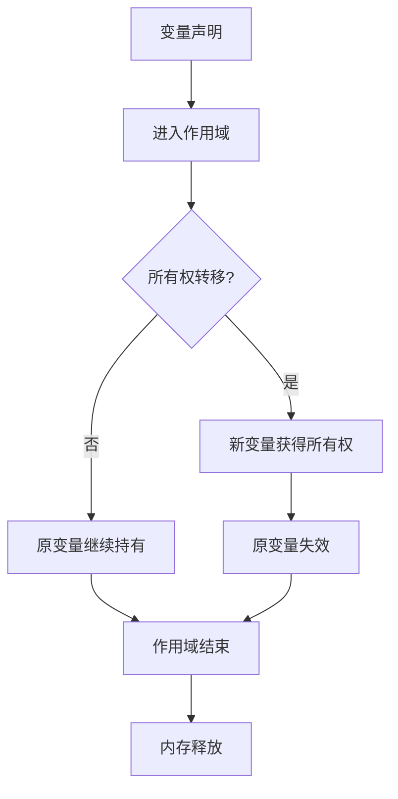

# 1. 执行流视角分析（01_execution_flow）

## 1.0 严格编号目录

- [1. 执行流视角分析（01\_execution\_flow）](#1-执行流视角分析01_execution_flow)
  - [1.0 严格编号目录](#10-严格编号目录)
  - [1.1 视角简介](#11-视角简介)
  - [1.2 理论建模](#12-理论建模)
    - [1.2.1 变量生命周期与作用域](#121-变量生命周期与作用域)
    - [1.2.2 所有权转移与借用](#122-所有权转移与借用)
    - [1.2.3 可变性与内部可变性](#123-可变性与内部可变性)
  - [1.3 代码示例](#13-代码示例)
  - [1.4 流程图与形式化描述（变量生命周期与所有权转移）](#14-流程图与形式化描述变量生命周期与所有权转移)
  - [1.5 优势与局限（表格）](#15-优势与局限表格)
  - [1.6 交叉引用](#16-交叉引用)

## 1.1 视角简介

执行流视角以程序运行时的变量生命周期、所有权转移、借用、作用域等为主线，建模 Rust 变量系统的动态行为。强调变量在内存中的分配、转移与释放过程，突出所有权系统对内存安全的保障。

## 1.2 理论建模

### 1.2.1 变量生命周期与作用域

**定义 1.1（变量生命周期）** 设 $v$ 为程序中的变量，其生命周期 $L(v)$ 定义为 $v$ 从分配内存到释放内存的区间。

- 变量进入作用域时分配内存，离开作用域时自动释放。
- 生命周期（lifetime）用于追踪引用的有效区间，防止悬垂指针。

### 1.2.2 所有权转移与借用

**定义 1.2（所有权）** 变量 $v$ 的所有权 $O(v)$ 是对其内存资源的唯一控制权。

- 所有权（Ownership）在变量赋值、函数传参等场景下发生转移。
- 借用（Borrowing）分为不可变借用（&T）和可变借用（&mut T），编译器静态检查借用规则，防止数据竞争。

### 1.2.3 可变性与内部可变性

- 默认不可变，需显式声明 mut。
- 内部可变性通过 Cell/RefCell 等类型实现运行时可变。

## 1.3 代码示例

```rust
// 所有权转移
let s1 = String::from("hello");
let s2 = s1; // s1 的所有权转移到 s2，s1 失效

// 借用
let s3 = String::from("world");
let len = calculate_length(&s3); // 不可变借用
fn calculate_length(s: &String) -> usize {
    s.len()
}

// 可变借用
let mut s4 = String::from("rust");
change(&mut s4);
fn change(s: &mut String) {
    s.push_str("!");
}

// 边界情况：可变借用与不可变借用不能同时存在
let mut v = vec![1, 2, 3];
let r1 = &v;
let r2 = &v;
// let r3 = &mut v; // 编译错误：不能同时有可变和不可变借用
```

## 1.4 流程图与形式化描述（变量生命周期与所有权转移）



**形式化描述：**

- 设 $v$ 为变量，$S$ 为作用域，$O(v)$ 为所有权。
- $v \in S$ 时，$v$ 分配内存。
- 所有权转移：$O(v_1) \to O(v_2)$，$v_1$ 失效。
- $v$ 离开 $S$ 时，内存释放。

## 1.5 优势与局限（表格）

| 视角         | 优势                                                         | 局限                                                         |
|--------------|--------------------------------------------------------------|--------------------------------------------------------------|
| 执行流视角   | 贴合实际、结构清晰、代码示例丰富、便于理解内存管理           | 可扩展性有限，理论深度有待提升，需结合异步/并发/内部可变性   |

## 1.6 交叉引用

- [3. 多视角对比与方法论](03_comparative_analysis.md)
- [2. 范畴论视角分析](02_category_theory.md)
- [index.md（主索引）](index.md)

---

> 本文档持续更新，欢迎补充批判性观点与最新理论成果。
