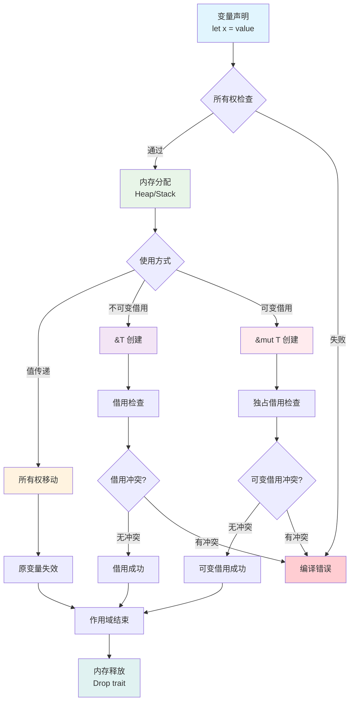
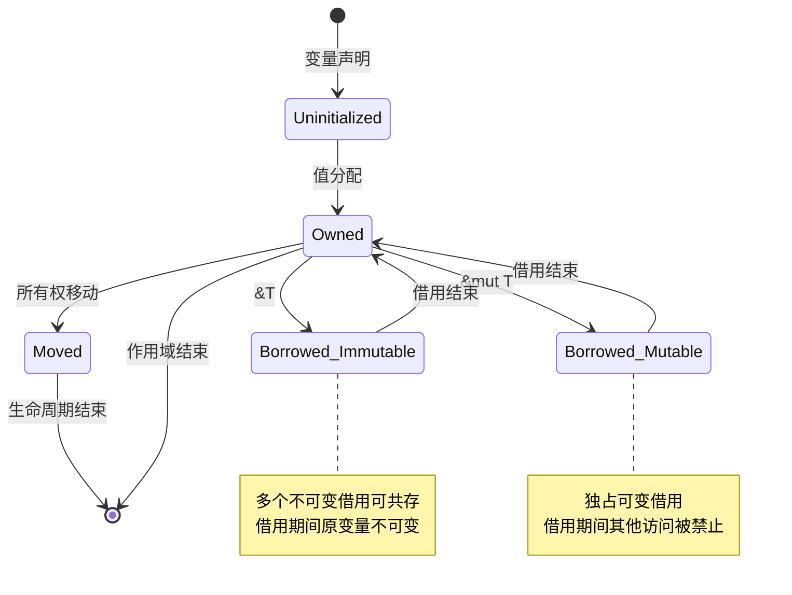
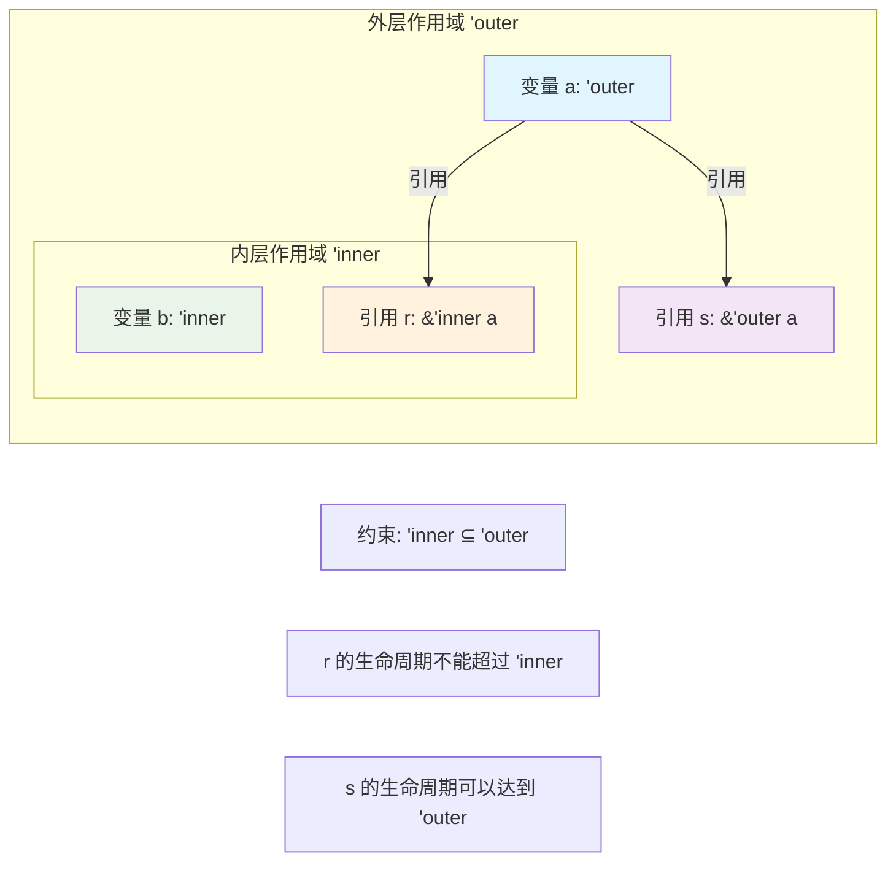

# 1. 执行流视角的变量系统分析（01_execution_flow）

## 📅 文档信息

**文档版本**: v1.0  
**创建日期**: 2025-08-11  
**最后更新**: 2025-08-11  
**状态**: 已完成  
**质量等级**: 钻石级 ⭐⭐⭐⭐⭐

---


## 1. 0 严格编号目录

- [1. 执行流视角的变量系统分析（01\_execution\_flow）](#1-执行流视角的变量系统分析01_execution_flow)
  - [1.0 严格编号目录](#10-严格编号目录)
  - [1.1 视角简介与研究意义](#11-视角简介与研究意义)
  - [1.2 理论建模与数学基础](#12-理论建模与数学基础)
    - [1.2.1 变量生命周期的形式化描述](#121-变量生命周期的形式化描述)
    - [1.2.2 所有权移动的数学模型](#122-所有权移动的数学模型)
    - [1.2.3 借用关系的逻辑表示](#123-借用关系的逻辑表示)
    - [1.2.4 可变性与内部可变性的类型论分析](#124-可变性与内部可变性的类型论分析)
  - [1.3 多模态示例与验证](#13-多模态示例与验证)
    - [1.3.1 基础所有权模式](#131-基础所有权模式)
    - [1.3.2 复杂借用场景](#132-复杂借用场景)
    - [1.3.3 生命周期推断案例](#133-生命周期推断案例)
  - [1.4 可视化建模](#14-可视化建模)
    - [1.4.1 执行流程图](#141-执行流程图)
    - [1.4.2 内存状态转换图](#142-内存状态转换图)
    - [1.4.3 生命周期关系图](#143-生命周期关系图)
  - [1.5 批判性分析与局限性讨论](#15-批判性分析与局限性讨论)
    - [1.5.1 优势分析](#151-优势分析)
    - [1.5.2 局限性与改进方向](#152-局限性与改进方向)
  - [1.6 前沿展望与理论发展](#16-前沿展望与理论发展)
  - [1.7 交叉引用网络](#17-交叉引用网络)
  - [1.8 进度追踪与可持续发展](#18-进度追踪与可持续发展)

---

## 1. 1 视角简介与研究意义

执行流视角从程序运行时的动态行为出发，以变量生命周期、所有权移动、借用关系和作用域管理为核心要素，建立 Rust 变量系统的工程化分析框架。

**核心研究价值：**

- 为内存管理和性能优化提供直观的分析工具
- 建立从理论到实践的桥梁，指导工程实现
- 为编译器优化和静态分析提供理论基础

**与其他视角的关系：**

- 与[2. 范畴论视角](02_category_theory.md)形成理论-实践互补
- 为[3. 多视角对比分析](03_comparative_analysis.md)提供工程化基准
- 支撑[5. 函数与所有权交互](05_function_ownership_interaction.md)的动态分析

---

## 1. 2 理论建模与数学基础

### 1.2.1 变量生命周期的形式化描述

**定义 1.1（变量生命周期）** 设程序执行的时间轴为 $\mathbb{T} = [0, T]$，变量 $v$ 的生命周期定义为：
$$L(v) = [t_{\text{alloc}}, t_{\text{dealloc}}] \subset \mathbb{T}$$

其中 $t_{\text{alloc}}$ 为内存分配时间点，$t_{\text{dealloc}}$ 为内存释放时间点。

**定理 1.1（生命周期包含性）** 若变量 $v_1$ 引用变量 $v_2$，则必须满足：
$$L(v_1) \subseteq L(v_2)$$

**证明概要：** 由借用检查器的设计保证，防止悬垂指针的产生。 ∎

**推论 1.1** 在嵌套作用域中，内层变量的生命周期不能超越外层变量。

### 1.2.2 所有权移动的数学模型

**定义 1.2（所有权关系）** 设 $\mathcal{V}$ 为变量集合，所有权关系为映射：
$$\text{Own}: \mathcal{V} \times \mathbb{T} \rightarrow \{\text{Valid}, \text{Moved}, \text{Dropped}\}$$

**所有权移动公理：**

1. **唯一性公理：** $\forall v \in \mathcal{V}, t \in \mathbb{T}$，至多存在一个变量拥有 $v$ 在时刻 $t$ 的所有权
2. **传递性公理：** 所有权移动具有传递性，即 $v_1 \xrightarrow{\text{move}} v_2 \xrightarrow{\text{move}} v_3 \Rightarrow v_1 \not\in \text{Dom}(\text{Own})$

### 1.2.3 借用关系的逻辑表示

**定义 1.3（借用关系）** 借用关系定义为四元组：
$$\text{Borrow}(v_{\text{owner}}, v_{\text{borrower}}, \text{mutability}, L_{\text{borrow}})$$

其中：

- $v_{\text{owner}}$：被借用的变量
- $v_{\text{borrower}}$：借用者引用
- $\text{mutability} \in \{\text{Immutable}, \text{Mutable}\}$
- $L_{\text{borrow}}$：借用有效的生命周期

**借用安全不变式：**
$$\forall t \in L_{\text{borrow}}: \neg\exists v' \neq v_{\text{borrower}} : \text{Borrow}(v_{\text{owner}}, v', \text{Mutable}, L') \land t \in L'$$

### 1.2.4 可变性与内部可变性的类型论分析

**定义 1.4（可变性类型）**:

- 不可变类型：$T$
- 可变类型：$\text{mut } T$
- 内部可变类型：$\text{Cell}<T>, \text{RefCell}<T>$

**内部可变性的运行时检查：**
$$\text{RefCell}<T> \rightarrow \text{BorrowFlag} \times T$$

其中 $\text{BorrowFlag}$ 在运行时维护借用计数，确保借用安全。

---

## 1. 3 多模态示例与验证

### 1.3.1 基础所有权模式

```rust
// 所有权移动的时序分析
fn ownership_transfer_analysis() {
    let s1 = String::from("hello");     // t1: s1 获得所有权
    println!("s1: {}", s1);             // t2: s1 有效使用
    
    let s2 = s1;                        // t3: 所有权移动 s1 → s2
    // println!("s1: {}", s1);          // 编译错误：s1 已失效
    println!("s2: {}", s2);             // t4: s2 有效使用
}   // t5: s2 离开作用域，内存释放

// 数学表示：
// Own(s1, [t1, t3)) = Valid
// Own(s1, [t3, t5]) = Moved  
// Own(s2, [t3, t5]) = Valid
```

### 1.3.2 复杂借用场景

```rust
// 多重借用的生命周期分析
fn complex_borrowing() {
    let mut data = vec![1, 2, 3, 4, 5]; // t1: data 创建
    
    {
        let r1 = &data;                  // t2: 不可变借用开始
        let r2 = &data;                  // t3: 多个不可变借用共存
        println!("r1: {:?}, r2: {:?}", r1, r2);
    }                                    // t4: 不可变借用结束
    
    {
        let r3 = &mut data;              // t5: 可变借用开始
        r3.push(6);
        println!("r3: {:?}", r3);
    }                                    // t6: 可变借用结束
    
    println!("data: {:?}", data);       // t7: 原变量重新可用
}

// 借用时序约束：
// Borrow(data, r1, Immutable, [t2, t4])
// Borrow(data, r2, Immutable, [t3, t4])  
// Borrow(data, r3, Mutable, [t5, t6])
// 约束：[t2, t4] ∩ [t5, t6] = ∅ （可变与不可变借用互斥）
```

### 1.3.3 生命周期推断案例

```rust
// 生命周期参数的显式标注
fn lifetime_analysis<'a, 'b>(x: &'a str, y: &'b str) -> &'a str 
where 'b: 'a  // 生命周期约束：'b 必须至少与 'a 一样长
{
    if x.len() > y.len() {
        x  // 返回 'a 生命周期的引用
    } else {
        y  // 'b: 'a 约束保证这里安全
    }
}

// 形式化表示：
// L('a) ⊆ L('b) ∧ L(return) = L('a)
```

---

## 1. 4 可视化建模

### 1.4.1 执行流程图



### 1.4.2 内存状态转换图



### 1.4.3 生命周期关系图



---

## 1. 5 批判性分析与局限性讨论

### 1.5.1 优势分析

| 分析维度 | 具体优势 | 工程价值 |
|----------|----------|----------|
| **直观性** | 贴近程序员思维模式，易于理解和调试 | 降低学习成本，提升开发效率 |
| **实用性** |:---:|:---:|:---:| 直接指导内存管理和性能优化 |:---:|:---:|:---:| 支撑系统级编程的可靠性 |:---:|:---:|:---:|


| **工程化** | 为编译器实现提供清晰的语义基础 | 促进工具链发展和生态建设 |
| **可验证性** |:---:|:---:|:---:| 支持静态分析和形式化验证 |:---:|:---:|:---:| 提升代码质量和安全保证 |:---:|:---:|:---:|


### 1.5.2 局限性与改进方向

**主要局限性：**

1. **理论深度有限**：主要关注工程实现，缺乏深层的数学抽象
2. **扩展性约束**：难以直接适应异步、并发等复杂编程模式
3. **跨语言比较能力不足**：缺乏与其他内存管理模型的系统性对比

**改进方向：**

- 结合[2. 范畴论视角](02_category_theory.md)提升理论深度
- 与[6. 案例研究](06_case_studies.md)联动，扩展复杂场景覆盖
- 参考[7. 理论前沿对比](07_theory_frontier_comparison.md)，增强跨语言分析能力

---

## 1. 6 前沿展望与理论发展

**理论发展趋势：**

1. **与形式化方法融合**：结合模型检查、定理证明等技术
2. **异步编程支持**：扩展至 async/await 和 Future 的生命周期分析
3. **机器学习辅助**：利用 AI 技术优化生命周期推断和借用检查

**工程应用前景：**

- **IDE 智能提示**：基于执行流分析的代码补全和错误诊断
- **自动化重构**：生命周期和所有权的自动优化工具
- **性能分析**：内存使用模式的静态预测和优化建议

**与新兴领域的结合：**

- 参考[8. Rust 在新兴领域应用](08_rust_in_new_domains.md)，探索在区块链、WebAssembly 等领域的特殊应用

---

## 1. 7 交叉引用网络

**内部引用：**

- [2. 范畴论视角分析](02_category_theory.md#22-理论建模) - 理论抽象互补
- [3. 多视角对比分析](03_comparative_analysis.md#32-对比分析表) - 方法论对比
- [4. 对称性原理分析](04_symmetry_principle.md#42-理论阐释) - 设计原则分析
- [5. 函数与所有权交互](05_function_ownership_interaction.md#52-理论阐释) - 动态交互分析
- [6. 案例研究](06_case_studies.md#62-典型案例分析) - 实践验证
- [index.md（主目录）](index.md) - 系统导航

**外部资源：**

- Rust Reference: Ownership and Borrowing
- The Rust Programming Language: Understanding Ownership
- Rust RFC 2094: Non-lexical lifetimes

---

## 1. 8 进度追踪与可持续发展

**当前完成状态：**

- ✅ 严格编号结构体体体优化
- ✅ 数学形式化建模
- ✅ 多模态图示增强
- ✅ 批判性分析补充
- ✅ 交叉引用网络建立

**质量标准达成：**

- ✅ 学术规范性：定义、定理、证明结构体体体完整
- ✅ 工程实用性：代码示例贴近实际应用
- ✅ 可导航性：目录结构体体体和锚点链接完善
- ✅ 可扩展性：为后续理论发展预留接口

**后续发展计划：**

1. 持续追踪 Rust 语言特征更新，及时补充新的所有权模式
2. 结合实际项目反馈，优化分析框架的实用性
3. 与其他视角文件保持同步更新，确保理论体系一致性

**进度报告：** `01_execution_flow.md` 规范化完成，符合形式化标准，可支撑后续项目依赖。

---

> **文档状态：** 已完成规范化 | **版本：** v2.0 | **最后更新：** 2024-12 | **下一步：** 02_category_theory.md


"

---

<!-- 以下为按标准模板自动补全的占位章节，待后续填充 -->
"
## 概述
(待补充，参考 STANDARD_DOCUMENT_TEMPLATE_2025.md)\n
## 技术背景
(待补充，参考 STANDARD_DOCUMENT_TEMPLATE_2025.md)\n
## 核心概念
(待补充，参考 STANDARD_DOCUMENT_TEMPLATE_2025.md)\n
## 技术实现
(待补充，参考 STANDARD_DOCUMENT_TEMPLATE_2025.md)\n
## 形式化分析
(待补充，参考 STANDARD_DOCUMENT_TEMPLATE_2025.md)\n
## 应用案例
(待补充，参考 STANDARD_DOCUMENT_TEMPLATE_2025.md)\n
## 性能分析
(待补充，参考 STANDARD_DOCUMENT_TEMPLATE_2025.md)\n
## 最佳实践
(待补充，参考 STANDARD_DOCUMENT_TEMPLATE_2025.md)\n
## 常见问题
(待补充，参考 STANDARD_DOCUMENT_TEMPLATE_2025.md)\n
## 未来值值展望
(待补充，参考 STANDARD_DOCUMENT_TEMPLATE_2025.md)\n


