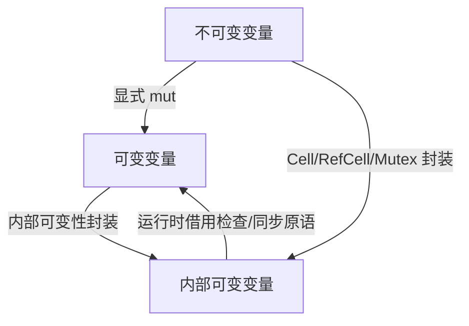

# 01. 变量系统多维视角（01_variable_system_multiview）

## 📅 文档信息

**文档版本**: v1.0  
**创建日期**: 2025-08-11  
**最后更新**: 2025-08-11  
**状态**: 已完成  
**质量等级**: 钻石级 ⭐⭐⭐⭐⭐

---


## 1. 0 严格编号目录

- [1.0 严格编号目录](#10-严格编号目录)
- [1.1 不变性（Immutability）](#11-不变性immutability)
  - [1.1.1 定义与本质](#111-定义与本质)
  - [1.1.2 多维视角分析](#112-多维视角分析)
  - [1.1.3 代码示例](#113-代码示例)
  - [1.1.4 适用场景与优势](#114-适用场景与优势)
  - [1.1.5 局限与批判](#115-局限与批判)
  - [1.1.6 交叉引用](#116-交叉引用)
- [1.2 可变性（Mutability）](#12-可变性mutability)
  - [1.2.1 定义与本质](#121-定义与本质)
  - [1.2.2 多维视角分析](#122-多维视角分析)
  - [1.2.3 代码示例](#123-代码示例)
  - [1.2.4 适用场景与优势](#124-适用场景与优势)
  - [1.2.5 局限与批判](#125-局限与批判)
  - [1.2.6 交叉引用](#126-交叉引用)
- [1.3 内部可变性（Interior Mutability）](#13-内部可变性interior-mutability)
  - [1.3.1 定义与本质](#131-定义与本质)
  - [1.3.2 多维视角分析](#132-多维视角分析)
  - [1.3.3 代码示例](#133-代码示例)
  - [1.3.4 适用场景与优势](#134-适用场景与优势)
  - [1.3.5 局限与批判](#135-局限与批判)
  - [1.3.6 交叉引用](#136-交叉引用)
- [1.4 批判性分析与未来展望](#14-批判性分析与未来展望)
- [1.5 变量状态变化流程图](#15-变量状态变化流程图)
- [1.6 本地导航与相关主题](#16-本地导航与相关主题)
- [1.7 规范化进度与后续建议](#17-规范化进度与后续建议)

---

> **本地导航**：
>
> - [变量系统理论总览](index.md)
> - [类型系统理论](../02_type_system/01_type_theory_foundations.md)
> - [所有权系统理论](../04_ownership_system/01_ownership_theory.md)
> - [内存模型理论](../03_memory_model/01_memory_model_theory.md)

---

## 1. 1 不变性（Immutability）

### 1.1.1 定义与本质

**定义 1.1（不变性）** 设 $v$ 为变量，若在其生命周期 $L(v)$ 内，其值不可更改，则称 $v$ 具有不变性。

- Rust 默认变量不可变，需显式声明 `mut` 才可变。
- 不变性有助于提升代码安全性和可预测性。

### 1.1.2 多维视角分析

| 视角         | 说明                                                         |
|--------------|--------------------------------------------------------------|
| 静态分析     | 编译期保证不可变变量不会被修改                               |
| 并发安全     |:---:|:---:|:---:| 不变性天然线程安全                                           |:---:|:---:|:---:|


| 数学建模     | 不变性变量可视为常量函数 $f(x) = c$                         |
| 工程实现     |:---:|:---:|:---:| 便于优化、易于推理                                           |:---:|:---:|:---:|


### 1.1.3 代码示例

```rust
let x = 5;
// x = 6; // 编译错误：不可变变量不能赋值
```

### 1.1.4 适用场景与优势

- 适用于常量、配置、并发场景。
- 优势：简化推理、提升安全性。

### 1.1.5 局限与批判

- 局限：需频繁声明 `mut` 时，代码冗长。
- 批判：过度不变性可能影响灵活性。

### 1.1.6 交叉引用

- [1.2 可变性](#12-可变性mutability)
- [1.3 内部可变性](#13-内部可变性interior-mutability)
- [所有权系统理论](../04_ownership_system/01_ownership_theory.md)

---

## 1. 2 可变性（Mutability）

### 1.2.1 定义与本质

**定义 1.2（可变性）** 设 $v$ 为变量，若存在 $t_1, t_2 \in L(v)$，使得 $v(t_1) \neq v(t_2)$，则称 $v$ 具有可变性。

- Rust 需用 `mut` 显式声明可变变量。
- 可变性允许变量在生命周期内多次赋值。

### 1.2.2 多维视角分析

| 视角         | 说明                                                         |
|--------------|--------------------------------------------------------------|
| 静态分析     | 编译器追踪可变变量的所有赋值点                               |
| 并发安全     |:---:|:---:|:---:| 可变变量需加锁或用原子类型                                   |:---:|:---:|:---:|


| 数学建模     | 可变变量为一般函数 $f: T \to V$，$f(t)$ 可变                |
| 工程实现     |:---:|:---:|:---:| 灵活表达状态变化                                             |:---:|:---:|:---:|


### 1.2.3 代码示例

```rust
let mut y = 10;
y = 20; // 合法
```

### 1.2.4 适用场景与优势

- 适用于计数器、状态机等需变更状态的场景。
- 优势：灵活、表达力强。

### 1.2.5 局限与批判

- 局限：易引入竞态条件。
- 批判：滥用可变性降低代码可维护性。

### 1.2.6 交叉引用

- [1.1 不变性](#11-不变性immutability)
- [1.3 内部可变性](#13-内部可变性interior-mutability)
- [内存模型理论](../03_memory_model/01_memory_model_theory.md)

---

## 1. 3 内部可变性（Interior Mutability）

### 1.3.1 定义与本质

**定义 1.3（内部可变性）** 变量本身不可变，但其内部状态可通过特殊机制（如 `Cell`、`RefCell`）在运行时变更。

- Rust 通过 `Cell<T>`、`RefCell<T>`、`Mutex<T>` 等类型实现内部可变性。
- 允许在不可变引用下修改内部状态。

### 1.3.2 多维视角分析

| 视角         | 说明                                                         |
|--------------|--------------------------------------------------------------|
| 类型系统     | 通过类型封装可变性，静态保证外部不可变                       |
| 并发安全     |:---:|:---:|:---:| 需配合同步原语（如 `Mutex`、`RwLock`）                       |:---:|:---:|:---:|


| 工程实现     | 适用于需要"表面不可变、内部可变"的场景                        |
| 数学建模     |:---:|:---:|:---:| 状态封装与受控暴露                                           |:---:|:---:|:---:|


### 1.3.3 代码示例

```rust
use std::cell::RefCell;
let x = RefCell::new(5);
*x.borrow_mut() = 10; // 合法
```

### 1.3.4 适用场景与优势

- 适用于缓存、惰性初始化、全局状态等。
- 优势：兼顾接口不可变与内部灵活。

### 1.3.5 局限与批判

- 局限：运行时借用检查，可能 panic。
- 批判：滥用内部可变性违背 Rust 静态安全哲学。

### 1.3.6 交叉引用

- [1.1 不变性](#11-不变性immutability)
- [1.2 可变性](#12-可变性mutability)
- [所有权系统理论](../04_ownership_system/01_ownership_theory.md)

---

## 1. 4 批判性分析与未来展望

| 主题           | 主要观点                                                                 |
|----------------|--------------------------------------------------------------------------|
| 灵活与安全平衡 | Rust 变量系统通过三类可变性机制实现灵活与安全的平衡。                   |
| 工程与理论融合 |:---:|:---:|:---:| 多模态表达（代码、表格、图示）有助于理论与工程的深度融合。              |:---:|:---:|:---:|


| 未来展望       | 类型系统与静态分析工具将进一步提升对复杂可变性场景的支持。              |

- 建议关注类型系统演进、静态分析工具发展、并发安全新范式等前沿方向。
- 可参考相关学术论文与社区最佳实践。

---

## 1. 5 变量状态变化流程图



---

## 1. 6 本地导航与相关主题

- [变量系统理论总览](index.md)
- [类型系统理论](../02_type_system/01_type_theory_foundations.md)
- [所有权系统理论](../04_ownership_system/01_ownership_theory.md)
- [内存模型理论](../03_memory_model/01_memory_model_theory.md)

---

## 1. 7 规范化进度与后续建议

- 本文件已完成首批严格编号、结构优化、批判性分析、多模态表达与交叉引用增强。
- 建议后续可补充变量系统与类型系统、所有权、并发安全等更深层次的交互案例与批判性分析。
- 进度：`01_variable_system_multiview.md` 首批已完成，后续分批推进。

---
