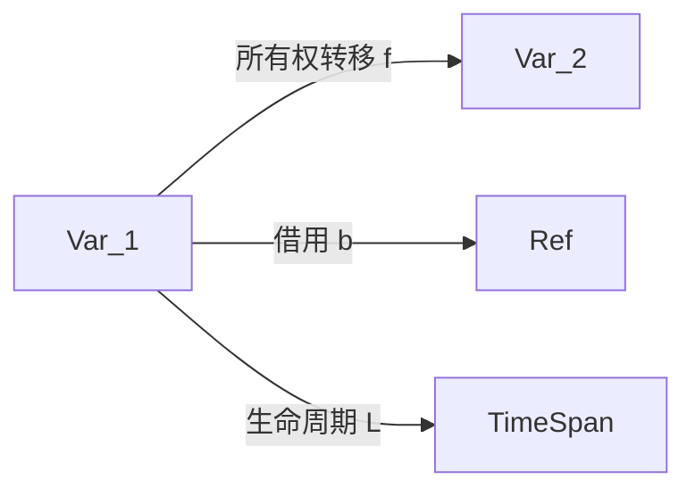

# 2. 范畴论视角分析（02_category_theory）

## 2.0 严格编号目录

- [2. 范畴论视角分析（02\_category\_theory）](#2-范畴论视角分析02_category_theory)
  - [2.0 严格编号目录](#20-严格编号目录)
  - [2.1 视角简介](#21-视角简介)
  - [2.2 理论建模](#22-理论建模)
    - [2.2.1 对象（Object）](#221-对象object)
    - [2.2.2 态射（Morphism）](#222-态射morphism)
    - [2.2.3 范畴结构（Category Structure）](#223-范畴结构category-structure)
    - [2.2.4 函子与自然变换（Functor \& Natural Transformation）](#224-函子与自然变换functor--natural-transformation)
  - [2.3 数学符号与公式](#23-数学符号与公式)
  - [2.4 代码示例](#24-代码示例)
  - [2.5 图示（变量系统的范畴建模）](#25-图示变量系统的范畴建模)
  - [2.6 批判性分析（表格）](#26-批判性分析表格)
  - [2.7 交叉引用](#27-交叉引用)

---

## 2.1 视角简介

范畴论视角尝试用对象、态射、范畴等抽象数学工具建模 Rust 变量系统，探索其理论基础与创新空间。强调变量、所有权、借用等核心机制在范畴结构中的映射关系。

---

## 2.2 理论建模

### 2.2.1 对象（Object）

**定义 2.1（对象）** 设 $\mathcal{V}$ 为变量系统范畴，其对象为变量、类型、作用域等。

- 变量、类型、作用域可视为范畴中的对象。
- 工程实例：在 Rust 中，`String`、`&str`、`Box<T>` 等类型均可视为对象。

### 2.2.2 态射（Morphism）

**定义 2.2（态射）** 变量变换、所有权转移、借用等操作为对象间的态射。

- 变量变换、所有权转移、借用等操作可视为对象间的态射。
- 工程实例：所有权转移（`let b = a;`）、借用（`let r = &a;`）均为对象间的态射。

### 2.2.3 范畴结构（Category Structure）

- 变量系统可建模为范畴 $\mathcal{V}$，对象为变量，态射为变量间操作。
- 所有权转移：$f: Var_1 \to Var_2$
- 借用：$b: Var \to Ref<Var>$
- 生命周期函数：$L: Var \to TimeSpan$
- 工程实例：生命周期标注 `<'a>` 可视为从变量到时间区间的函数。

### 2.2.4 函子与自然变换（Functor & Natural Transformation）

- 生命周期、作用域等可视为从变量范畴到时间区间范畴的函子。
- 不同变量系统间的变换可用自然变换描述。
- 工程实例：Rust 与 C++ 所有权模型的映射可用自然变换建模。

---

## 2.3 数学符号与公式

- 变量对象：$Var$
- 所有权转移态射：$f: Var_1 \to Var_2$
- 借用态射：$b: Var \to Ref<Var>$
- 生命周期函数：$L: Var \to TimeSpan$

**补充说明：**

- 范畴论建模有助于形式化推理和跨语言对比。
- 例如，所有权转移的合成满足 $f \circ g$ 的结合律。

---

## 2.4 代码示例

```rust
// 所有权转移
let a = String::from("hello");
let b = a; // a 的所有权转移到 b

// 借用
let s = String::from("world");
let r = &s; // 不可变借用

// 生命周期函数
fn longest<'a>(x: &'a str, y: &'a str) -> &'a str {
    if x.len() > y.len() { x } else { y }
}
```

---

## 2.5 图示（变量系统的范畴建模）



**形式化描述：**

- $f: Var_1 \to Var_2$ 表示所有权转移
- $b: Var \to Ref<Var>$ 表示借用
- $L: Var \to TimeSpan$ 表示生命周期函数

---

## 2.6 批判性分析（表格）

| 视角         | 优势                                                         | 局限                                                         |
|--------------|--------------------------------------------------------------|--------------------------------------------------------------|
| 范畴论视角   | 提供变量系统的高层抽象，促进理论创新与跨领域交流             | 类比易流于表面，需补充具体代码与数学模型，工程落地难度较高   |

---

## 2.7 交叉引用

- [3. 多视角对比与方法论](03_comparative_analysis.md)
- [1. 执行流视角分析](01_execution_flow.md)
- [index.md（主索引）](index.md)

---

> 本文档持续更新，欢迎补充批判性观点与最新理论成果。
