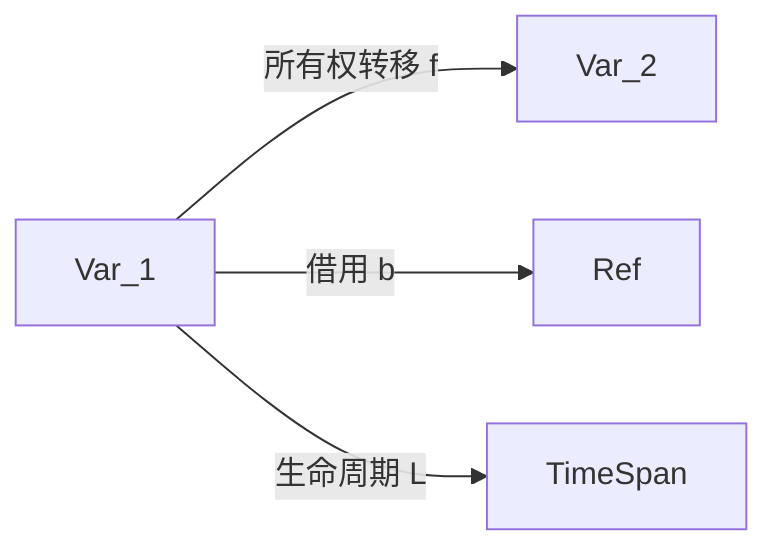

# 2. 范畴论视角分析（02_category_theory）

## 2.1 视角简介

范畴论视角尝试用对象、态射、范畴等抽象数学工具建模 Rust 变量系统，探索其理论基础与创新空间。
该视角强调变量、所有权、借用等核心机制在范畴结构中的映射关系。

## 2.2 理论建模

2.2.1 对象（Object）

- 变量、类型、作用域可视为范畴中的对象。

2.2.2 态射（Morphism）

- 变量变换、所有权转移、借用等操作可视为对象间的态射。

2.2.3 范畴结构（Category Structure）

- 变量系统可建模为范畴 $\mathcal{V}$，对象为变量，态射为变量间的操作。
- 所有权转移：$f: Var_1 \to Var_2$
- 借用：$b: Var \to Ref<Var>$
- 生命周期函子：$L: Var \to TimeSpan$

2.2.4 函子与自然变换（Functor & Natural Transformation）

- 生命周期、作用域等可视为从变量范畴到时间区间范畴的函子。
- 不同变量系统间的变换可用自然变换描述。

## 2.3 数学符号与公式

- 变量对象：$Var$
- 所有权转移态射：$f: Var_1 \to Var_2$
- 借用态射：$b: Var \to Ref<Var>$
- 生命周期函子：$L: Var \to TimeSpan$

## 2.4 代码示例

```rust
// 示例：所有权转移
let a = String::from("hello");
let b = a; // a 的所有权转移到 b

// 示例：借用
let s = String::from("world");
let r = &s; // 不可变借用
```

## 2.5 图示（变量系统的范畴建模）



## 2.6 批判性分析

- 优势：
  - 提供变量系统的高层抽象，促进理论创新与跨领域交流。
  - 有助于与类型理论、资源管理等数学工具结合。
- 局限：
  - 类比易流于表面，需补充具体代码与数学模型。
  - 主题易发散，需聚焦 Rust 变量系统的核心特性。

## 2.7 交叉引用

- [多视角对比与方法论](03_comparative_analysis.md)
- [执行流视角分析](01_execution_flow.md)
- [index.md](index.md)

---

> 本文档持续更新，欢迎补充批判性观点与最新理论成果。
