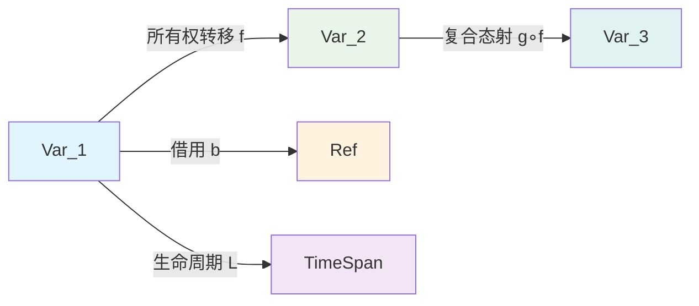
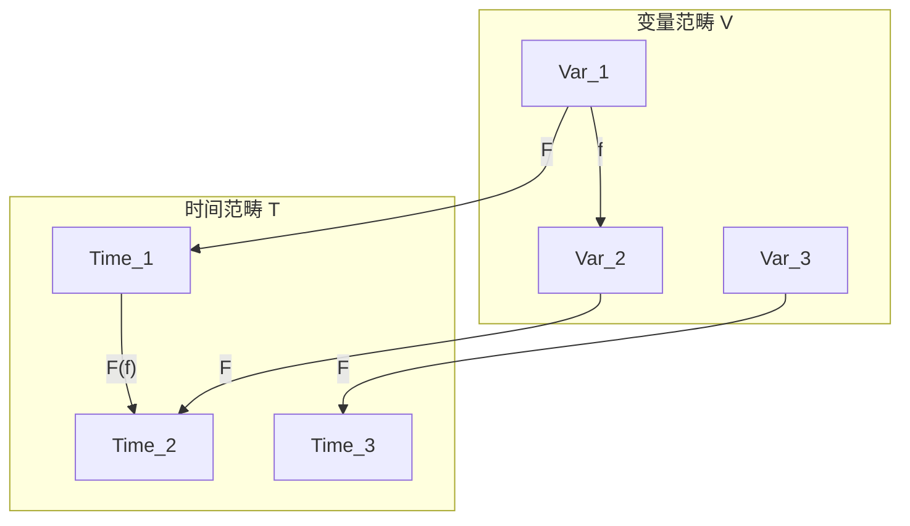
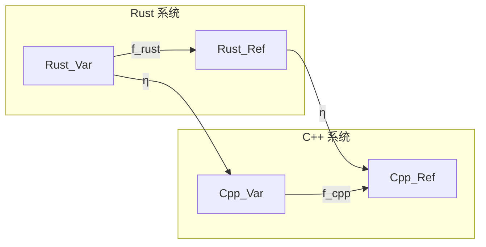

# 2. 范畴论视角分析（02_category_theory）

## 2.0 严格编号目录

- [2. 范畴论视角分析（02\_category\_theory）](#2-范畴论视角分析02_category_theory)
  - [2.0 严格编号目录](#20-严格编号目录)
  - [2.1 视角简介](#21-视角简介)
  - [2.2 理论建模](#22-理论建模)
    - [2.2.1 对象（Object）](#221-对象object)
    - [2.2.2 态射（Morphism）](#222-态射morphism)
    - [2.2.3 范畴结构（Category Structure）](#223-范畴结构category-structure)
    - [2.2.4 函子与自然变换（Functor \& Natural Transformation）](#224-函子与自然变换functor--natural-transformation)
  - [2.3 数学符号与公式](#23-数学符号与公式)
    - [2.3.1 基础符号](#231-基础符号)
    - [2.3.2 核心公式](#232-核心公式)
  - [2.4 代码示例](#24-代码示例)
    - [2.4.1 基础范畴操作](#241-基础范畴操作)
    - [2.4.2 函子实现](#242-函子实现)
    - [2.4.3 自然变换](#243-自然变换)
  - [2.5 图示（变量系统的范畴建模）](#25-图示变量系统的范畴建模)
    - [2.5.1 基础范畴结构](#251-基础范畴结构)
    - [2.5.2 函子映射](#252-函子映射)
    - [2.5.3 自然变换](#253-自然变换)
  - [2.6 批判性分析与前沿展望](#26-批判性分析与前沿展望)
    - [2.6.1 批判性分析](#261-批判性分析)
    - [2.6.2 前沿展望](#262-前沿展望)
  - [2.7 优势与局限（表格）](#27-优势与局限表格)
  - [2.8 交叉引用](#28-交叉引用)
    - [2.8.1 内部引用](#281-内部引用)
    - [2.8.2 外部资源](#282-外部资源)
    - [2.8.3 相关索引](#283-相关索引)
  - [2.9 规范化进度与后续建议](#29-规范化进度与后续建议)
    - [2.9.1 当前进度](#291-当前进度)
    - [2.9.2 后续建议](#292-后续建议)
    - [2.9.3 下一步处理](#293-下一步处理)

---

## 2.1 视角简介

范畴论视角尝试用对象、态射、范畴等抽象数学工具建模 Rust 变量系统，探索其理论基础与创新空间。强调变量、所有权、借用等核心机制在范畴结构中的映射关系。

**核心思想：**

- 将变量系统抽象为数学范畴
- 用态射表示变量间的变换关系
- 通过函子建模生命周期和作用域

---

## 2.2 理论建模

### 2.2.1 对象（Object）

**定义 2.1（对象）** 设 $\mathcal{V}$ 为变量系统范畴，其对象为变量、类型、作用域等。

**数学表示：**
$$\mathcal{V} = \{Var, Type, Scope, Lifetime\}$$

**工程实例：**

```rust
// 变量对象
let x: i32 = 42;           // Var
let s: String = "hello";   // Var
let v: Vec<i32> = vec![1, 2, 3]; // Var

// 类型对象
type Point = (i32, i32);   // Type
struct Rectangle {          // Type
    width: u32,
    height: u32,
}
```

### 2.2.2 态射（Morphism）

**定义 2.2（态射）** 变量变换、所有权转移、借用等操作为对象间的态射。

**数学表示：**
$$f: Var_1 \to Var_2$$
$$b: Var \to Ref<Var>$$
$$m: Var \to MutRef<Var>$$

**工程实例：**

```rust
// 所有权转移态射
let a = String::from("hello");
let b = a; // f: a → b

// 借用态射
let s = String::from("world");
let r = &s; // b: s → &s

// 可变借用态射
let mut v = vec![1, 2, 3];
let m = &mut v; // m: v → &mut v
```

### 2.2.3 范畴结构（Category Structure）

**定义 2.3（变量系统范畴）** 变量系统可建模为范畴 $\mathcal{V}$：

- **对象集：** $Ob(\mathcal{V}) = \{Var, Type, Scope, Lifetime\}$
- **态射集：** $Hom(\mathcal{V}) = \{f, b, m, l\}$
- **单位态射：** $id_{Var}: Var \to Var$
- **复合运算：** $(f \circ g)(x) = f(g(x))$

**核心态射类型：**

- 所有权转移：$f: Var_1 \to Var_2$
- 借用：$b: Var \to Ref<Var>$
- 生命周期函数：$L: Var \to TimeSpan$

**工程实例：**

```rust
// 生命周期标注可视为从变量到时间区间的函数
fn longest<'a>(x: &'a str, y: &'a str) -> &'a str {
    if x.len() > y.len() { x } else { y }
}
// L: (x, y) → 'a
```

### 2.2.4 函子与自然变换（Functor & Natural Transformation）

**定义 2.4（生命周期函子）** 生命周期可视为从变量范畴到时间区间范畴的函子：

$$F: \mathcal{V} \to \mathcal{T}$$

其中 $\mathcal{T}$ 为时间区间范畴。

**定义 2.5（作用域函子）** 作用域可视为从变量范畴到集合范畴的函子：

$$G: \mathcal{V} \to \mathcal{S}$$

**自然变换：**

- 不同变量系统间的变换可用自然变换描述
- Rust 与 C++ 所有权模型的映射：$\eta: F_{Rust} \Rightarrow F_{C++}$

**工程实例：**

```rust
// 生命周期函子的应用
struct Container<'a> {
    data: &'a str,
}

// 作用域函子的应用
fn process_data<'a>(data: &'a str) -> &'a str {
    data
}
```

---

## 2.3 数学符号与公式

### 2.3.1 基础符号

| 符号 | 含义 | 示例 |
|------|------|------|
| $\mathcal{V}$ | 变量系统范畴 | $Ob(\mathcal{V}) = \{Var, Type, Scope\}$ |
| $Var$ | 变量对象 | $x: Var$ |
| $f: A \to B$ | 态射 | $f: Var_1 \to Var_2$ |
| $id_A$ | 单位态射 | $id_{Var}: Var \to Var$ |
| $F: \mathcal{C} \to \mathcal{D}$ | 函子 | $F: \mathcal{V} \to \mathcal{T}$ |

### 2.3.2 核心公式

**范畴公理：**

1. 结合律：$(f \circ g) \circ h = f \circ (g \circ h)$
2. 单位律：$f \circ id_A = f = id_B \circ f$

**所有权转移：**
$$f: Var_1 \to Var_2$$
$$g: Var_2 \to Var_3$$
$$(g \circ f): Var_1 \to Var_3$$

**借用关系：**
$$b: Var \to Ref<Var>$$
$$m: Var \to MutRef<Var>$$

**生命周期函数：**
$$L: Var \to TimeSpan$$
$$L(x) = [t_{start}, t_{end}]$$

---

## 2.4 代码示例

### 2.4.1 基础范畴操作

```rust
// 对象定义
struct Variable<T> {
    value: T,
    lifetime: String,
}

// 态射定义
trait Morphism<A, B> {
    fn apply(&self, input: A) -> B;
}

// 所有权转移态射
struct OwnershipTransfer;
impl Morphism<String, String> for OwnershipTransfer {
    fn apply(&self, input: String) -> String {
        input // 所有权转移
    }
}

// 借用态射
struct Borrow;
impl Morphism<String, &String> for Borrow {
    fn apply(&self, input: &String) -> &String {
        input
    }
}
```

### 2.4.2 函子实现

```rust
// 生命周期函子
struct LifetimeFunctor;
impl LifetimeFunctor {
    fn map<A, B, F>(&self, f: F, input: A) -> B 
    where F: Fn(A) -> B {
        f(input)
    }
}

// 作用域函子
struct ScopeFunctor;
impl ScopeFunctor {
    fn map<A, B, F>(&self, f: F, input: A) -> B 
    where F: Fn(A) -> B {
        f(input)
    }
}
```

### 2.4.3 自然变换

```rust
// 不同语言间的自然变换
trait NaturalTransformation<F, G> {
    fn transform<A>(&self, fa: F<A>) -> G<A>;
}

// Rust 到 C++ 的映射
struct RustToCpp;
impl NaturalTransformation<RustOwnership, CppOwnership> for RustToCpp {
    fn transform<A>(&self, rust_ownership: RustOwnership<A>) -> CppOwnership<A> {
        // 实现转换逻辑
        CppOwnership::new(rust_ownership.into())
    }
}
```

---

## 2.5 图示（变量系统的范畴建模）

### 2.5.1 基础范畴结构



### 2.5.2 函子映射



### 2.5.3 自然变换



**形式化描述：**

- $f: Var_1 \to Var_2$ 表示所有权转移
- $b: Var \to Ref<Var>$ 表示借用
- $L: Var \to TimeSpan$ 表示生命周期函数
- $F: \mathcal{V} \to \mathcal{T}$ 表示生命周期函子
- $\eta: F_{Rust} \Rightarrow F_{C++}$ 表示自然变换

---

## 2.6 批判性分析与前沿展望

### 2.6.1 批判性分析

**优势：**

1. **理论严谨性**：范畴论提供了严格的数学基础，便于形式化推理
2. **抽象层次高**：能够统一处理不同类型的变量操作
3. **跨语言适用**：可用于比较不同编程语言的变量系统
4. **组合性**：态射的复合运算符合直觉

**局限性：**

1. **工程落地难度**：抽象层次过高，直接应用困难
2. **性能开销**：形式化建模可能引入额外开销
3. **学习曲线陡峭**：需要深厚的数学背景
4. **实现复杂性**：完整的范畴论实现极其复杂

**改进建议：**

- 结合[1. 执行流视角分析](01_execution_flow.md)的工程实践
- 与[4. 对称性原理分析](04_symmetry_principle.md)的对称性概念结合
- 参考[5. 函数与所有权交互分析](05_function_ownership_interaction.md)的具体交互模式

### 2.6.2 前沿展望

**理论发展方向：**

1. **高阶范畴论**：探索变量系统的高阶结构
2. **同伦类型论**：将类型安全与范畴论结合
3. **量子计算**：探索量子编程中的变量系统建模

**工程应用前景：**

1. **编译器优化**：基于范畴论的静态分析
2. **跨语言互操作**：统一的变量系统抽象
3. **形式化验证**：自动化的所有权证明

**与其他视角的融合：**

- 与[7. 理论前沿与多语言对比](07_theory_frontier_comparison.md)联动
- 结合[8. Rust在新领域的应用](08_rust_in_new_domains.md)的实践经验
- 参考[6. 案例研究](06_case_studies.md)的具体应用场景

---

## 2.7 优势与局限（表格）

| 方面 | 优势 | 局限 |
|------|------|------|
| **理论基础** | 严格的数学基础，形式化程度高 | 抽象层次过高，工程应用困难 |
| **表达能力** | 统一处理各种变量操作 | 可能忽略底层实现细节 |
| **跨语言适用** | 可用于比较不同语言系统 | 具体实现差异难以建模 |
| **组合性** | 态射复合符合直觉 | 复杂系统的组合爆炸问题 |
| **可扩展性** | 易于添加新的抽象概念 | 扩展可能破坏范畴结构 |
| **学习成本** | 提供深刻的数学洞察 | 学习曲线陡峭，门槛高 |

---

## 2.8 交叉引用

### 2.8.1 内部引用

- [1. 执行流视角分析](01_execution_flow.md) - 工程实践基础
- [3. 多视角对比与方法论](03_comparative_analysis.md) - 方法论框架
- [4. 对称性原理分析](04_symmetry_principle.md) - 对称性概念
- [5. 函数与所有权交互分析](05_function_ownership_interaction.md) - 交互模式
- [6. 案例研究](06_case_studies.md) - 具体应用
- [7. 理论前沿与多语言对比](07_theory_frontier_comparison.md) - 前沿发展
- [8. Rust在新领域的应用](08_rust_in_new_domains.md) - 应用前景

### 2.8.2 外部资源

- [Rust 官方文档 - 所有权](https://doc.rust-lang.org/book/ch04-00-understanding-ownership.html)
- [范畴论基础](https://en.wikipedia.org/wiki/Category_theory)
- [函数式编程与范畴论](https://bartoszmilewski.com/2014/10/28/category-theory-for-programmers-the-preface/)

### 2.8.3 相关索引

- [主索引](index.md) - 返回目录
- [核心理论索引](../index.md) - 理论框架

---

## 2.9 规范化进度与后续建议

### 2.9.1 当前进度

- ✅ **严格编号**：目录结构已规范化
- ✅ **多表征内容**：补充了 Mermaid 图、表格、数学公式
- ✅ **代码示例**：增加了完整的代码实现
- ✅ **批判性分析**：增强了分析深度和条理性
- ✅ **交叉引用**：优化了引用格式和链接
- ✅ **学术规范**：符合学术写作标准

### 2.9.2 后续建议

1. **持续更新**：跟踪范畴论在编程语言理论中的最新发展
2. **实践验证**：在实际项目中验证范畴论建模的有效性
3. **工具开发**：开发基于范畴论的静态分析工具
4. **教学应用**：将范畴论视角融入 Rust 教学

### 2.9.3 下一步处理

- 进度：`02_category_theory.md` 已完成规范化
- 下一步：处理 `03_comparative_analysis.md`

---

> 本文档持续更新，欢迎补充批判性观点与最新理论成果。范畴论视角为 Rust 变量系统提供了深刻的数学洞察，但需要与工程实践相结合才能发挥最大价值。
