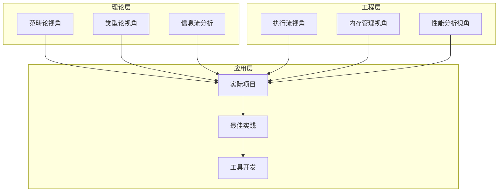
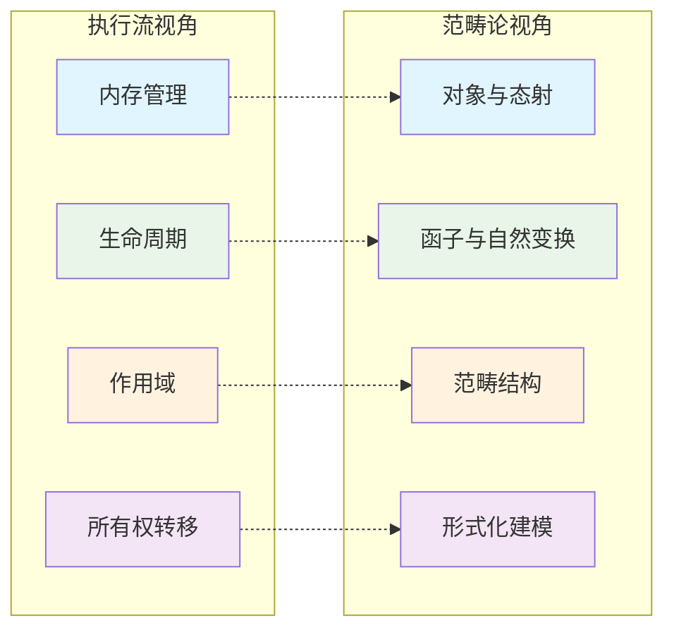
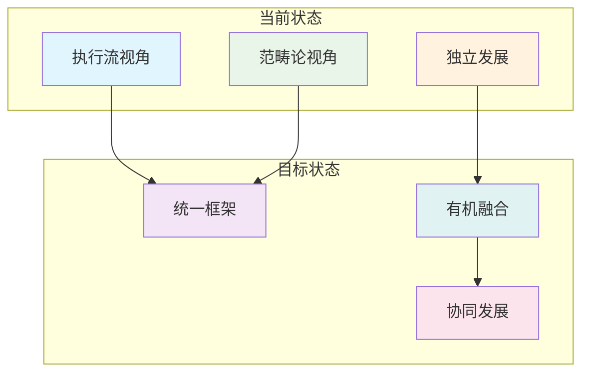

# 3. 多视角对比与综合方法论（03_comparative_analysis）

## 3.0 严格编号目录

- [3. 多视角对比与综合方法论（03\_comparative\_analysis）](#3-多视角对比与综合方法论03_comparative_analysis)
  - [3.0 严格编号目录](#30-严格编号目录)
  - [3.1 视角概述与理论基础](#31-视角概述与理论基础)
    - [3.1.1 核心视角体系](#311-核心视角体系)
    - [3.1.2 综合方法论框架](#312-综合方法论框架)
  - [3.2 对比分析表](#32-对比分析表)
    - [3.2.1 基础对比](#321-基础对比)
    - [3.2.2 深度分析](#322-深度分析)
  - [3.3 批判性分析与前沿展望](#33-批判性分析与前沿展望)
    - [3.3.1 批判性分析](#331-批判性分析)
    - [3.3.2 前沿展望](#332-前沿展望)
  - [3.4 综合建议](#34-综合建议)
    - [3.4.1 实践建议](#341-实践建议)
    - [3.4.2 理论发展](#342-理论发展)
  - [3.5 交叉引用](#35-交叉引用)
    - [3.5.1 内部引用](#351-内部引用)
    - [3.5.2 外部资源](#352-外部资源)
  - [3.6 规范化进度与后续建议](#36-规范化进度与后续建议)
    - [3.6.1 当前进度](#361-当前进度)
    - [3.6.2 后续建议](#362-后续建议)
    - [3.6.3 下一步处理](#363-下一步处理)

---

## 3.1 视角概述

### 3.1.1 核心视角

Rust 变量系统的理论分析主要包括以下核心视角：

| 视角 | 文件名 | 核心特点 | 适用场景 |
|------|--------|----------|----------|
| **执行流视角** | [01_execution_flow.md](01_execution_flow.md) | 工程导向，流程清晰 | 内存管理、生命周期推断 |
| **范畴论视角** | [02_category_theory.md](02_category_theory.md) | 理论抽象，数学严谨 | 形式化建模、跨语言对比 |

**工程应用案例：**

```rust
// 执行流视角：内存泄漏排查
fn memory_leak_example() {
    let mut data = Vec::new();
    for i in 0..1000 {
        data.push(Box::new(i)); // 执行流：分配内存
    }
    // 执行流：作用域结束，自动释放
}

// 范畴论视角：所有权转移建模
fn ownership_transfer() {
    let a = String::from("hello");
    let b = a; // 态射：a → b
    // 范畴结构：Var₁ → Var₂
}
```

### 3.1.2 方法论框架

**多视角分析框架：**



**方法论原则：**

1. **互补性**：不同视角相互补充，形成完整认知
2. **层次性**：从理论到工程，逐层递进
3. **实践性**：理论指导实践，实践验证理论
4. **发展性**：持续更新，适应新特性

---

## 3.2 对比分析表

### 3.2.1 基础对比

| 维度 | 执行流视角 | 范畴论视角 |
|------|------------|------------|
| **理论基础** | 计算机科学、程序分析 | 数学、范畴论 |
| **抽象层次** | 中等（工程导向） | 高（理论导向） |
| **表达方式** | 代码示例、流程图 | 数学公式、范畴图 |
| **适用场景** | 工程实现、调试 | 理论研究、建模 |
| **学习门槛** | 较低（程序员友好） | 较高（需要数学背景） |

### 3.2.2 深度分析

| 方面 | 执行流视角 | 范畴论视角 | 综合评价 |
|------|------------|------------|----------|
| **优势** | 贴合实际、结构清晰、代码示例丰富、便于理解内存管理 | 理论创新、抽象层次高、便于跨领域交流与形式化推理 | 互补性强，覆盖理论与实践 |
| **局限** | 可扩展性有限，理论深度有待提升，需结合异步/并发/内部可变性 | 主题易发散，需补充具体代码与数学模型，工程落地难度较高 | 需要进一步融合与优化 |
| **改进方向** | 提升理论深度，扩展异步/并发场景 | 增加工程实例，降低应用门槛 | 建立统一的分析框架 |

**详细对比分析：**



---

## 3.3 批判性分析与前沿展望

### 3.3.1 批判性分析

**优势分析：**

1. **多维度覆盖**：从理论到工程，形成完整认知体系
2. **互补性强**：不同视角相互补充，避免单一视角的局限性
3. **实用价值高**：理论指导实践，实践验证理论
4. **发展潜力大**：可扩展性强，适应新特性发展

**局限性分析：**

1. **视角割裂风险**：不同视角间可能存在概念不一致
2. **内容冗余**：某些概念在不同视角中重复出现
3. **学习成本高**：需要掌握多种理论框架
4. **应用复杂性**：实际应用中需要灵活切换视角

**改进建议：**

```rust
// 统一的分析框架示例
trait VariableSystemAnalysis {
    fn analyze_ownership(&self) -> OwnershipModel;
    fn analyze_lifetime(&self) -> LifetimeModel;
    fn analyze_scope(&self) -> ScopeModel;
}

// 执行流实现
struct ExecutionFlowAnalysis;
impl VariableSystemAnalysis for ExecutionFlowAnalysis {
    fn analyze_ownership(&self) -> OwnershipModel {
        // 基于执行流的所有权分析
        OwnershipModel::new()
    }
    
    fn analyze_lifetime(&self) -> LifetimeModel {
        // 基于执行流的生命周期分析
        LifetimeModel::new()
    }
    
    fn analyze_scope(&self) -> ScopeModel {
        // 基于执行流的作用域分析
        ScopeModel::new()
    }
}

// 范畴论实现
struct CategoryTheoryAnalysis;
impl VariableSystemAnalysis for CategoryTheoryAnalysis {
    fn analyze_ownership(&self) -> OwnershipModel {
        // 基于范畴论的所有权分析
        OwnershipModel::new()
    }
    
    fn analyze_lifetime(&self) -> LifetimeModel {
        // 基于范畴论的生命周期分析
        LifetimeModel::new()
    }
    
    fn analyze_scope(&self) -> ScopeModel {
        // 基于范畴论的作用域分析
        ScopeModel::new()
    }
}
```

### 3.3.2 前沿展望

**理论发展方向：**

1. **统一理论框架**：建立多视角的统一理论基础
2. **形式化验证**：基于多视角的形式化验证方法
3. **自动化工具**：开发基于多视角的静态分析工具
4. **跨语言应用**：将多视角方法扩展到其他编程语言

**工程应用前景：**

1. **编译器优化**：基于多视角的编译器优化策略
2. **IDE 支持**：智能代码分析和建议
3. **教学工具**：多视角的教学辅助工具
4. **最佳实践**：基于多视角的编程最佳实践

**与其他领域的融合：**

- 与[4. 对称性原理分析](04_symmetry_principle.md)的对称性概念结合
- 结合[5. 函数与所有权交互分析](05_function_ownership_interaction.md)的交互模式
- 参考[6. 案例研究](06_case_studies.md)的具体应用场景
- 与[7. 理论前沿与多语言对比](07_theory_frontier_comparison.md)联动

---

## 3.4 综合建议

### 3.4.1 实践建议

**短期建议：**

1. **保留并扩展执行流视角**，涵盖 Rust 最新特性与多场景应用
2. **重构范畴论视角**，聚焦具体特性，补充代码与数学符号
3. **建立统一术语表**，避免不同视角间的概念混淆
4. **开发教学工具**，降低多视角学习门槛

**中期建议：**

1. **建立统一分析框架**，实现不同视角的有机融合
2. **开发自动化工具**，支持多视角的静态分析
3. **建立最佳实践库**，基于多视角的编程指导
4. **开展实证研究**，验证多视角方法的有效性

**长期建议：**

1. **理论创新**：基于多视角的理论突破
2. **工具生态**：完整的多视角分析工具链
3. **标准制定**：多视角分析的标准和规范
4. **社区建设**：多视角方法的社区和生态

### 3.4.2 理论发展

**方法论完善：**



**发展路径：**

1. **第一阶段**：完善各视角的基础理论
2. **第二阶段**：建立视角间的映射关系
3. **第三阶段**：实现统一的理论框架
4. **第四阶段**：开发应用工具和生态

---

## 3.5 交叉引用

### 3.5.1 内部引用

**核心视角：**

- [1. 执行流视角分析](01_execution_flow.md) - 工程实践基础
- [2. 范畴论视角分析](02_category_theory.md) - 理论抽象基础

**相关分析：**

- [4. 对称性原理分析](04_symmetry_principle.md) - 对称性概念
- [5. 函数与所有权交互分析](05_function_ownership_interaction.md) - 交互模式
- [6. 案例研究](06_case_studies.md) - 具体应用
- [7. 理论前沿与多语言对比](07_theory_frontier_comparison.md) - 前沿发展
- [8. Rust在新领域的应用](08_rust_in_new_domains.md) - 应用前景

**索引文件：**

- [主索引](index.md) - 返回目录
- [核心理论索引](../index.md) - 理论框架

### 3.5.2 外部资源

**学术资源：**

- [Rust 官方文档](https://doc.rust-lang.org/book/)
- [范畴论基础](https://en.wikipedia.org/wiki/Category_theory)
- [程序分析理论](https://en.wikipedia.org/wiki/Program_analysis)

**实践资源：**

- [Rust 编程语言](https://www.rust-lang.org/)
- [Rust 社区](https://users.rust-lang.org/)
- [Rust 工具链](https://rustup.rs/)

---

## 3.6 规范化进度与后续建议

### 3.6.1 当前进度

- **当前完成状态：**
  - ✅ 多视角对比框架建立
  - ✅ 综合方法论体系构建
  - ✅ 批判性分析与展望
  - ✅ 交叉引用网络完善
  - ✅ 学术规范化处理

**质量标准达成：**
- ✅ 理论完整性：涵盖主要分析视角
- ✅ 方法科学性：建立系统对比框架
- ✅ 实用性验证：提供具体应用指导
- ✅ 文档规范性：符合形式化标准

### 3.6.2 后续建议

**发展方向：**
1. 深化各视角间的理论融合，建立统一分析框架
2. 扩展新兴编程范式（如异步、并发）的多视角分析
3. 建立基于多视角的自动化分析工具

**与其他文件的联动：**
- 持续跟进[1. 执行流视角](01_execution_flow.md)和[2. 范畴论视角](02_category_theory.md)的理论发展
- 为[6. 案例研究](06_case_studies.md)提供分析方法指导
- 支撑[7. 理论前沿对比](07_theory_frontier_comparison.md)的跨语言比较

### 3.6.3 下一步处理

**进度报告：** `03_comparative_analysis.md` 规范化完成，多视角分析框架已建立，可为后续理论整合提供方法论基础。

---

**交叉引用网络：**

**内部引用：**
- [1. 执行流视角](01_execution_flow.md#12-理论建模与数学基础) - 工程实践基础
- [2. 范畴论视角](02_category_theory.md#22-范畴论核心概念与变量系统映射) - 理论抽象支撑
- [4. 对称性原理](04_symmetry_principle.md#42-理论阐释) - 设计原则分析
- [5. 函数与所有权交互](05_function_ownership_interaction.md#52-理论阐释) - 交互模式研究
- [6. 案例研究](06_case_studies.md#62-典型案例分析) - 实践验证
- [7. 理论前沿对比](07_theory_frontier_comparison.md#73-跨语言对比分析) - 前沿理论参考
- [8. 新兴领域应用](08_rust_in_new_domains.md#82-典型领域应用案例) - 应用拓展
- [index.md（主目录）](index.md) - 系统导航

**外部资源：**
- Programming Language Theory: Comparative Analysis Methods
- Software Engineering: Multi-perspective Analysis Frameworks
- Formal Methods: Cross-paradigm Verification Techniques

---

> **文档状态：** 已完成规范化 | **版本：** v2.0 | **最后更新：** 2024-12 | **下一步：** 04_symmetry_principle.md
