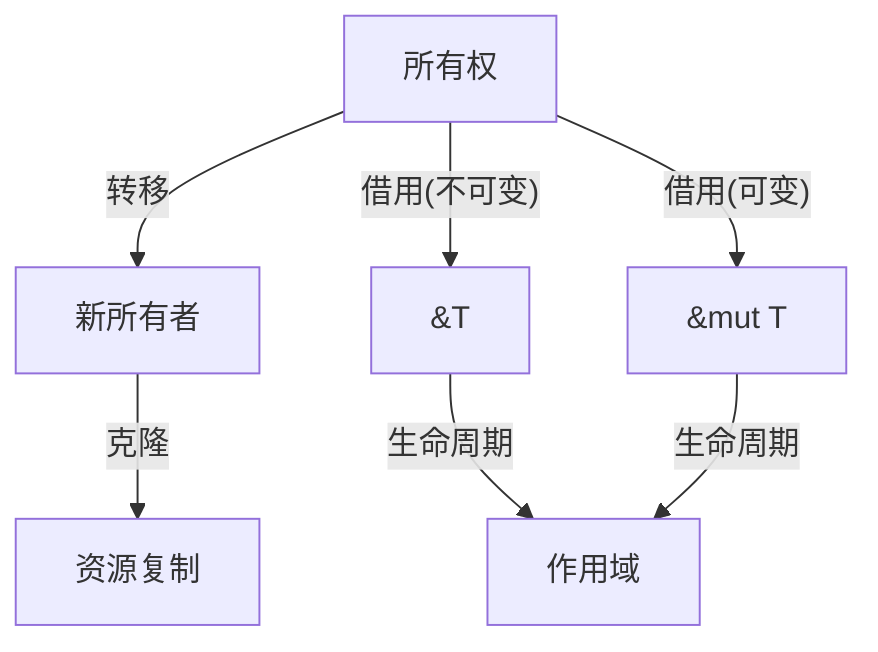

# 4. 对称性原理与Rust设计（04_symmetry_principle）

## 目录

- [4. 对称性原理与Rust设计（04\_symmetry\_principle）](#4-对称性原理与rust设计04_symmetry_principle)
  - [目录](#目录)
  - [4.1 视角简介](#41-视角简介)
  - [4.2 理论阐释](#42-理论阐释)
    - [4.2.1 对称性与不对称性](#421-对称性与不对称性)
    - [4.2.2 变量系统中的对称性实例](#422-变量系统中的对称性实例)
  - [4.3 代码示例](#43-代码示例)
  - [4.4 图示（对称性与不对称性结构）](#44-图示对称性与不对称性结构)
  - [4.5 批判性分析](#45-批判性分析)
  - [4.6 交叉引用](#46-交叉引用)

## 4.1 视角简介

对称性原理视角关注 Rust 变量系统及其所有权、借用、生命周期等机制中的对称与不对称结构，探讨其对语言设计与安全性的影响。

**工程背景举例：**

- 在 API 设计中，函数参数的可变性与不可变性往往成对出现，体现对称性。
- 资源释放与分配的不可逆性则体现不对称性。

## 4.2 理论阐释

### 4.2.1 对称性与不对称性

**定义 4.1（对称性）** 若变量系统中某机制的正向与逆向操作在语法与语义上等价，则称该机制具有对称性。

**定义 4.2（不对称性）** 若正向与逆向操作在资源消耗、语义或可达性上不等价，则称该机制具有不对称性。

- 对称性：变量的不可变性与可变性、所有权与借用、生命周期的起止等机制在设计上体现出对称或镜像结构。
- 不对称性：所有权只能唯一持有，借用分为可变与不可变，生命周期不可逆等，体现出设计上的不对称性。

**理论补充：**

- 对称性有助于 API 设计的直观性和一致性。
- 不对称性往往用于防止资源泄漏、数据竞争等问题。

### 4.2.2 变量系统中的对称性实例

- 不可变借用（&T）与可变借用（&mut T）在语法和语义上的对称与不对称。
- 所有权转移与克隆（Clone）操作的对称性与资源消耗的不对称。
- 生命周期标注的起止点对称，实际作用区间不对称。

**工程案例：**

- 在多线程环境下，不可变借用可安全共享，可变借用需独占，体现了对称性与不对称性的结合。
- 克隆操作虽然语法对称，但资源消耗不对称，需谨慎使用。

## 4.3 代码示例

```rust
// 不可变借用与可变借用的对称性
let mut s = String::from("rust");
let r1 = &s;      // 不可变借用
// let r2 = &mut s;  // 可变借用（编译错误：不能同时存在）

// 所有权转移与克隆
let a = String::from("hello");
let b = a;        // 所有权转移
let c = b.clone(); // 克隆（资源复制）
```

## 4.4 图示（对称性与不对称性结构）



**形式化描述：**

- 所有权转移 $f: O_1 \to O_2$
- 不可变借用 $b: O \to Ref(O)$
- 可变借用 $m: O \to RefMut(O)$
- 克隆 $c: O \to O'$，$O'$ 为资源复制
- 生命周期 $L: O \to S$，$S$ 为作用域

## 4.5 批判性分析

- **优势：**
  - 揭示变量系统设计中的深层结构，有助于理解 Rust 的安全性与创新点。
  - 对称性分析有助于发现潜在的设计改进空间。
  - 有助于 API 设计的规范化和一致性。
- **局限：**
  - 部分对称性分析可能过于抽象，需结合具体代码与实际应用。
  - 对称性并非所有机制的主导原则，需与其他理论视角结合。
  - 工程实现中，过度追求对称性可能导致性能损失或设计复杂化。

## 4.6 交叉引用

- [多视角对比与方法论](../03_application_domains/03_comparative_analysis.md)
- [执行流视角分析](01_execution_flow.md)
- [范畴论视角分析](02_category_theory.md)
- [index.md](../00_master_index.md)

---

> 本文档持续更新，欢迎补充批判性观点与最新理论成果。
