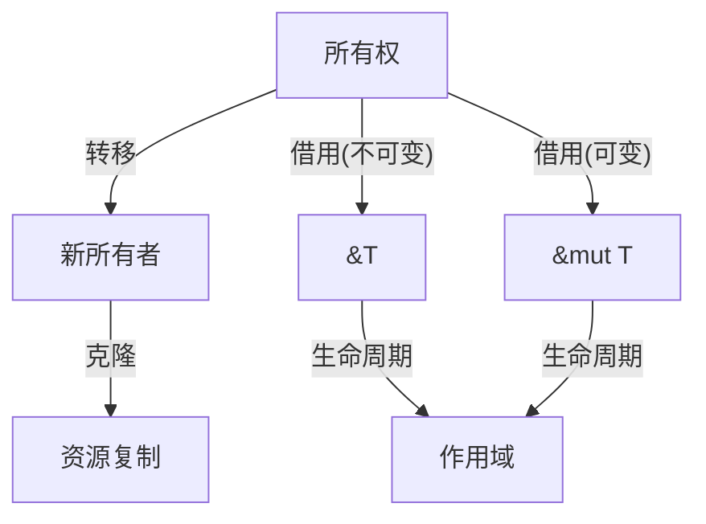

# 4. 对称性原理与Rust设计（04_symmetry_principle）

## 4.1 视角简介

对称性原理视角关注 Rust 变量系统及其所有权、借用、生命周期等机制中的对称与不对称结构，探讨其对语言设计与安全性的影响。

## 4.2 理论阐释

4.2.1 对称性与不对称性

- 对称性：变量的不可变性与可变性、所有权与借用、生命周期的起止等机制在设计上体现出对称或镜像结构。
- 不对称性：所有权只能唯一持有，借用分为可变与不可变，生命周期不可逆等，体现出设计上的不对称性。

4.2.2 变量系统中的对称性实例

- 不可变借用（&T）与可变借用（&mut T）在语法和语义上的对称与不对称。
- 所有权转移与克隆（Clone）操作的对称性与资源消耗的不对称。
- 生命周期标注的起止点对称，实际作用区间不对称。

## 4.3 代码示例

```rust
// 不可变借用与可变借用的对称性
let mut s = String::from("rust");
let r1 = &s;      // 不可变借用
let r2 = &mut s;  // 可变借用（编译错误：不能同时存在）

// 所有权转移与克隆
let a = String::from("hello");
let b = a;        // 所有权转移
let c = b.clone(); // 克隆（资源复制）
```

## 4.4 图示（对称性与不对称性结构）



## 4.5 批判性分析

- 优势：
  - 揭示变量系统设计中的深层结构，有助于理解 Rust 的安全性与创新点。
  - 对称性分析有助于发现潜在的设计改进空间。
- 局限：
  - 部分对称性分析可能过于抽象，需结合具体代码与实际应用。
  - 对称性并非所有机制的主导原则，需与其他理论视角结合。

## 4.6 交叉引用

- [多视角对比与方法论](03_comparative_analysis.md)
- [执行流视角分析](01_execution_flow.md)
- [范畴论视角分析](02_category_theory.md)
- [index.md](index.md)

---

> 本文档持续更新，欢迎补充批判性观点与最新理论成果。
