# 4. 对称性原理与变量系统设计（04_symmetry_principle）

## 📅 文档信息

**文档版本**: v1.0  
**创建日期**: 2025-08-11  
**最后更新**: 2025-08-11  
**状态**: 已完成  
**质量等级**: 钻石级 ⭐⭐⭐⭐⭐

---


## 4. 0 严格编号目录

- [4. 对称性原理与变量系统设计（04\_symmetry\_principle）](#4-对称性原理与变量系统设计04_symmetry_principle)
  - [4.0 严格编号目录](#40-严格编号目录)
  - [4.1 视角简介](#41-视角简介)
  - [4.2 理论阐释](#42-理论阐释)
    - [4.2.1 对称性与非对称性](#421-对称性与非对称性)
    - [4.2.2 变量系统中的对称性实例](#422-变量系统中的对称性实例)
    - [4.2.3 数学形式化](#423-数学形式化)
  - [4.3 代码示例](#43-代码示例)
    - [4.3.1 基础对称性示例](#431-基础对称性示例)
    - [4.3.2 高级对称性模式](#432-高级对称性模式)
  - [4.4 图示（对称性与非对称性结构）](#44-图示对称性与非对称性结构)
    - [4.4.1 基础对称性结构](#441-基础对称性结构)
    - [4.4.2 复杂对称性关系](#442-复杂对称性关系)
  - [4.5 批判性分析与前沿展望](#45-批判性分析与前沿展望)
    - [4.5.1 批判性分析](#451-批判性分析)
    - [4.5.2 前沿展望](#452-前沿展望)
  - [4.6 优势与局限（表格）](#46-优势与局限表格)
  - [4.7 交叉引用](#47-交叉引用)
    - [4.7.1 内部引用](#471-内部引用)
    - [4.7.2 外部资源](#472-外部资源)
    - [4.7.3 相关索引](#473-相关索引)
  - [4.8 规范化进度与后续建议](#48-规范化进度与后续建议)
    - [4.8.1 当前进度](#481-当前进度)
    - [4.8.2 后续建议](#482-后续建议)
    - [4.8.3 下一步处理](#483-下一步处理)

---

## 4. 1 视角简介

对称性原理视角关注 Rust 变量系统及其所有权、借用、生命周期等机制中的对称与非对称结构，探讨其对语言设计与安全性的影响。

**核心思想：**

- 识别变量系统中的对称与非对称模式
- 分析对称性对API设计和用户体验的影响
- 探讨非对称性在安全性保证中的作用

**研究价值：**

- 提供设计原则的理论基础
- 指导API设计的一致性
- 理解Rust安全模型的深层结构

---

## 4. 2 理论阐释

### 4.2.1 对称性与非对称性

**定义 4.1（对称性）** 若变量系统中某机制的正向与逆向操作在语法与语义上等价，则称该机制具有对称性。

**定义 4.2（非对称性）** 若正向与逆向操作在资源消耗、语义或可达性上不等价，则称该机制具有非对称性。

**数学表示：**

- 对称性：$f(x) = f^{-1}(x)$ 或 $f(x) \equiv f^{-1}(x)$
- 非对称性：$f(x) \neq f^{-1}(x)$ 或 $f(x) \not\equiv f^{-1}(x)$

**理论补充：**

- 对称性有助于API设计的直观性与一致性
- 非对称性常用于防止资源泄漏、数据竞争等问题
- 对称性操作通常具有可逆性，非对称性操作通常不可逆

### 4.2.2 变量系统中的对称性实例

**对称性实例：**

- 不可变借用（&T）与可变借用（&mut T）在语法结构上的对称
- 生命周期标注的起止点对称
- 作用域的进入与退出对称

**非对称性实例：**

- 所有权只能唯一持有，转移后原变量不可用
- 借用分为可变与不可变，权限不同
- 生命周期不可逆，只能向前推进
- 克隆操作消耗额外资源

### 4.2.3 数学形式化

**对称性关系：**
$$S: \mathcal{V} \times \mathcal{V} \to \{true, false\}$$

其中 $\mathcal{V}$ 为变量集合，$S(v_1, v_2)$ 表示变量 $v_1$ 和 $v_2$ 之间的对称性关系。

**非对称性关系：**
$$A: \mathcal{V} \times \mathcal{V} \to \{true, false\}$$

**对称性公理：**

1. 自反性：$S(v, v) = true$
2. 对称性：$S(v_1, v_2) = S(v_2, v_1)$
3. 传递性：$S(v_1, v_2) \land S(v_2, v_3) \implies S(v_1, v_3)$

---

## 4. 3 代码示例

### 4.3.1 基础对称性示例

```rust
// 对称性：不可变借用与可变借用的语法对称
struct SymmetricBorrowing {
    data: String,
}

impl SymmetricBorrowing {
    // 不可变借用 - 语法对称
    fn immutable_borrow(&self) -> &str {
        &self.data
    }
    
    // 可变借用 - 语法对称
    fn mutable_borrow(&mut self) -> &mut str {
        &mut self.data
    }
}

// 非对称性：所有权转移不可逆
fn ownership_transfer() {
    let a = String::from("hello");
    let b = a; // 所有权转移：a → b
    
    // 编译错误：a 已被移动，不可再使用
    // println!("{}", a);
    
    // 非对称性：无法从 b 恢复 a
    // let a = b; // 这只会再次转移所有权
}

// 对称性：生命周期标注的起止对称
fn symmetric_lifetime<'a>(x: &'a str, y: &'a str) -> &'a str {
    if x.len() > y.len() { x } else { y }
}
```

### 4.3.2 高级对称性模式

```rust
// 对称性：Builder 模式的对称性设计
struct ConfigBuilder {
    host: Option<String>,
    port: Option<u16>,
    timeout: Option<u64>,
}

impl ConfigBuilder {
    // 对称的 setter 方法
    fn host(mut self, host: String) -> Self {
        self.host = Some(host);
        self
    }
    
    fn port(mut self, port: u16) -> Self {
        self.port = Some(port);
        self
    }
    
    fn timeout(mut self, timeout: u64) -> Self {
        self.timeout = Some(timeout);
        self
    }
    
    // 对称的 getter 方法
    fn get_host(&self) -> Option<&String> {
        self.host.as_ref()
    }
    
    fn get_port(&self) -> Option<u16> {
        self.port
    }
    
    fn get_timeout(&self) -> Option<u64> {
        self.timeout
    }
}

// 非对称性：资源管理的非对称性
struct ResourceManager {
    resources: Vec<Box<dyn std::any::Any>>,
}

impl ResourceManager {
    // 添加资源 - 简单操作
    fn add_resource<T: 'static>(&mut self, resource: T) {
        self.resources.push(Box::new(resource));
    }
    
    // 移除资源 - 复杂操作，需要类型检查
    fn remove_resource<T: 'static>(&mut self) -> Option<T> {
        for (i, resource) in self.resources.iter().enumerate() {
            if resource.is::<T>() {
                let resource = self.resources.remove(i);
                return resource.downcast::<T>().ok().map(|b| *b);
            }
        }
        None
    }
}
```

---

## 4. 4 图示（对称性与非对称性结构）

### 4.4.1 基础对称性结构

```mermaid
graph TD
    A[所有权] -- 转移 --> B[新所有者]
    A -- 借用(不可变) --> C[&T]
    A -- 借用(可变) --> D[&mut T]
    B -- 克隆 --> E[资源复制]
    C -- 生命周期 --> F[作用域]
    D -- 生命周期 --> F
    
    style A fill:#e1f5fe
    style B fill:#e8f5e8
    style C fill:#fff3e0
    style D fill:#f3e5f5
    style E fill:#e0f2f1
    style F fill:#fce4ec
```



### 4.4.2 复杂对称性关系

```mermaid
graph LR
    subgraph "对称性操作"
        A1[不可变借用]
        A2[可变借用]
        A3[生命周期开始]
        A4[生命周期结束]
    end
    
    subgraph "非对称性操作"
        B1[所有权转移]
        B2[资源克隆]
        B3[内存分配]
        B4[内存释放]
    end
    
    subgraph "对称性关系"
        C1[A1 ↔ A2]
        C2[A3 ↔ A4]
    end
    
    subgraph "非对称性关系"
        D1[B1 → B2]
        D2[B3 → B4]
    end
    
    A1 -.-> C1
    A2 -.-> C1
    A3 -.-> C2
    A4 -.-> C2
    
    B1 --> D1
    B2 --> D1
    B3 --> D2
    B4 --> D2
    
    style A1 fill:#e1f5fe
    style A2 fill:#e1f5fe
    style A3 fill:#e1f5fe
    style A4 fill:#e1f5fe
    style B1 fill:#ffebee
    style B2 fill:#ffebee
    style B3 fill:#ffebee
    style B4 fill:#ffebee
```



**形式化描述：**

- 所有权转移 $f: O_1 \to O_2$（非对称）
- 不可变借用 $b: O \to Ref(O)$（对称）
- 可变借用 $m: O \to RefMut(O)$（对称）
- 克隆 $c: O \to O'$，$O'$ 为资源复制（非对称）
- 生命周期 $L: O \to S$，$S$ 为作用域（对称）

---

## 4. 5 批判性分析与前沿展望

### 4.5.1 批判性分析

**优势：**

1. **设计指导**：对称性原理为API设计提供了清晰的指导原则
2. **一致性保证**：对称性有助于保持系统设计的一致性
3. **用户体验**：对称的API更容易学习和使用
4. **理论价值**：为理解Rust设计哲学提供了理论框架

**局限性：**

1. **过度追求**：过度追求对称性可能导致性能损失
2. **实现复杂**：某些对称性设计可能增加实现复杂度
3. **适用性限制**：并非所有操作都适合对称性设计
4. **安全考虑**：某些非对称性设计是出于安全考虑

**改进建议：**

- 结合[3. 多视角对比与方法论](03_comparative_analysis.md)的平衡原则
- 参考[5. 函数与所有权交互分析](05_function_ownership_interaction.md)的交互模式
- 与[6. 案例研究](06_case_studies.md)的实际应用相结合

### 4.5.2 前沿展望

**理论发展方向：**

1. **形式化验证**：基于对称性的形式化验证方法
2. **自动检测**：自动检测API设计中的对称性
3. **优化策略**：基于对称性的编译器优化
4. **跨语言应用**：将对称性原理应用到其他语言

**工程应用前景：**

1. **API设计工具**：基于对称性的API设计辅助工具
2. **代码生成**：自动生成对称的API代码
3. **静态分析**：检测代码中的对称性违反
4. **教学工具**：基于对称性的编程教学工具

**与其他领域的融合：**

- 与[7. 理论前沿与多语言对比](07_theory_frontier_comparison.md)的跨语言分析
- 结合[8. Rust在新领域的应用](08_rust_in_new_domains.md)的实践经验
- 参考[2. 范畴论视角分析](02_category_theory.md)的数学基础

---

## 4. 6 优势与局限（表格）

| 方面 | 优势 | 局限 |
|------|------|------|
| **设计指导** | 提供清晰的API设计原则 | 可能过度简化复杂问题 |
| **一致性** |:---:|:---:|:---:| 保证系统设计的一致性 |:---:|:---:|:---:| 可能限制创新空间 |:---:|:---:|:---:|


| **用户体验** | 对称API更易学习使用 | 某些非对称设计更高效 |
| **理论价值** |:---:|:---:|:---:| 提供设计哲学的理论基础 |:---:|:---:|:---:| 理论可能过于抽象 |:---:|:---:|:---:|


| **实现复杂度** | 对称设计通常更直观 | 某些对称性实现复杂 |
| **性能影响** |:---:|:---:|:---:| 对称操作通常更可预测 |:---:|:---:|:---:| 可能引入性能开销 |:---:|:---:|:---:|


---

## 4. 7 交叉引用

### 4.7.1 内部引用

**核心视角：**

- [1. 执行流视角分析](01_execution_flow.md) - 工程实践基础
- [2. 范畴论视角分析](02_category_theory.md) - 理论抽象基础
- [3. 多视角对比与方法论](03_comparative_analysis.md) - 方法论框架

**相关分析：**

- [5. 函数与所有权交互分析](05_function_ownership_interaction.md) - 交互模式
- [6. 案例研究](06_case_studies.md) - 具体应用
- [7. 理论前沿与多语言对比](07_theory_frontier_comparison.md) - 前沿发展
- [8. Rust在新领域的应用](08_rust_in_new_domains.md) - 应用前景

**索引文件：**

- [主索引](index.md) - 返回目录
- [核心理论索引](../index.md) - 理论框架

### 4.7.2 外部资源

**学术资源：**

- [Rust 官方文档](https://doc.rust-lang.org/book/)
- [设计模式与对称性](https://en.wikipedia.org/wiki/Design_pattern)
- [软件工程中的对称性](https://en.wikipedia.org/wiki/Symmetry)

**实践资源：**

- [Rust 编程语言](https://www.rust-lang.org/)
- [Rust 社区](https://users.rust-lang.org/)
- [Rust 设计模式](https://rust-unofficial.github.io/patterns/)

### 4.7.3 相关索引

- [主索引](index.md) - 返回目录
- [核心理论索引](../index.md) - 理论框架

---

## 4. 8 规范化进度与后续建议

### 4.8.1 当前进度

**当前完成状态：**

- ✅ 对称性原理理论建模
- ✅ 数学形式化表达完善
- ✅ 代码示例与工程验证
- ✅ 可视化图示优化
- ✅ 批判性分析与前沿展望

**质量标准达成：**

- ✅ 理论严谨性：对称性概念清晰定义
- ✅ 工程实用性：提供具体设计指导
- ✅ 数学准确性：形式化表达规范
- ✅ 文档完整性：结构层次分明

### 4.8.2 后续建议

**理论发展方向：**

1. 深化对称性与性能优化的关系研究
2. 探索对称性原理在并发编程中的应用
3. 建立对称性度量与评估方法

**工程应用扩展：**

- 将对称性原理应用于API设计指导
- 开发基于对称性的代码分析工具
- 建立对称性设计模式库

### 4.8.3 下一步处理

**进度报告：** `04_symmetry_principle.md` 规范化完成，对称性原理分析框架已建立，可为语言设计和API优化提供理论指导。

---

**交叉引用网络：**

**内部引用：**

- [1. 执行流视角](01_execution_flow.md#14-可视化建模) - 动态行为分析
- [2. 范畴论视角](02_category_theory.md#22-范畴论核心概念与变量系统映射) - 数学结构对称性
- [3. 多视角对比](03_comparative_analysis.md#32-对比分析表) - 分析方法互补
- [5. 函数与所有权交互](05_function_ownership_interaction.md#52-理论阐释) - 交互对称性
- [6. 案例研究](06_case_studies.md#62-典型案例分析) - 实践中的对称性
- [7. 理论前沿对比](07_theory_frontier_comparison.md#73-跨语言对比分析) - 跨语言对称性比较
- [index.md（主目录）](index.md) - 系统导航

**外部资源：**

- Group Theory in Programming Language Design
- Symmetry Principles in Software Architecture
- Category Theory and Symmetry in Type Systems

---

> **文档状态：** 已完成规范化 | **版本：** v2.0 | **最后更新：** 2024-12 | **下一步：** 05_function_ownership_interaction.md
