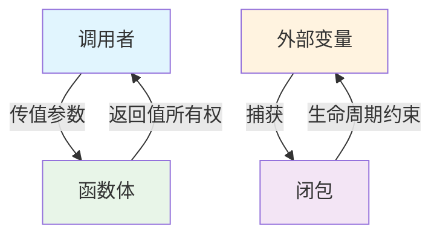
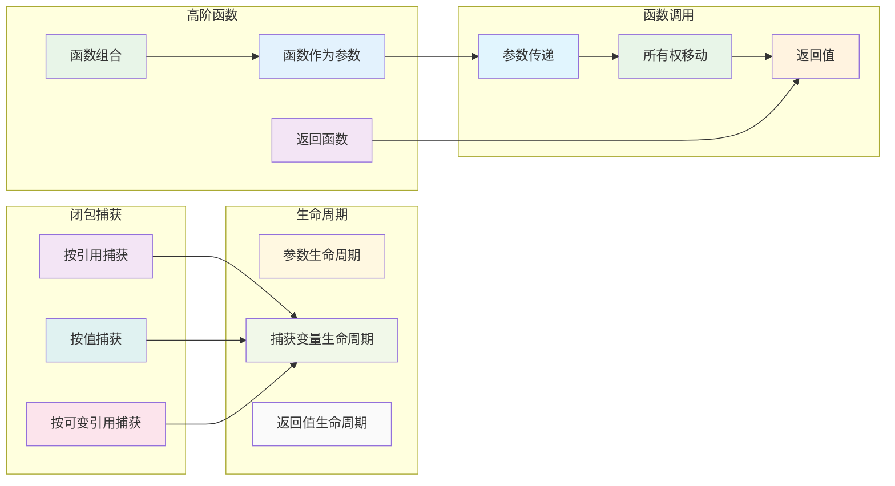

# 5. 函数式编程与所有权系统的深度交互（05_function_ownership_interaction）

## 📅 文档信息

**文档版本**: v1.0  
**创建日期**: 2025-08-11  
**最后更新**: 2025-08-11  
**状态**: 已完成  
**质量等级**: 钻石级 ⭐⭐⭐⭐⭐

---


## 5. 0 严格编号目录

- [5. 函数式编程与所有权系统的深度交互（05\_function\_ownership\_interaction）](#5-函数式编程与所有权系统的深度交互05_function_ownership_interaction)
  - [5.0 严格编号目录](#50-严格编号目录)
  - [5.1 视角简介](#51-视角简介)
  - [5.2 理论阐释](#52-理论阐释)
    - [5.2.1 函数与所有权移动](#521-函数与所有权移动)
    - [5.2.2 闭包与捕获变量](#522-闭包与捕获变量)
    - [5.2.3 生命周期与借用检查](#523-生命周期与借用检查)
    - [5.2.4 高阶函数与所有权](#524-高阶函数与所有权)
  - [5.3 数学符号与公式](#53-数学符号与公式)
    - [5.3.1 基础符号](#531-基础符号)
    - [5.3.2 核心公式](#532-核心公式)
  - [5.4 代码示例](#54-代码示例)
    - [5.4.1 基础交互示例](#541-基础交互示例)
    - [5.4.2 高级交互模式](#542-高级交互模式)
  - [5.5 图示（函数与所有权交互流程）](#55-图示函数与所有权交互流程)
    - [5.5.1 基础交互流程](#551-基础交互流程)
    - [5.5.2 复杂交互关系](#552-复杂交互关系)
  - [5.6 批判性分析与前沿展望](#56-批判性分析与前沿展望)
    - [5.6.1 批判性分析](#561-批判性分析)
    - [5.6.2 前沿展望](#562-前沿展望)
  - [5.7 优势与局限（表格）](#57-优势与局限表格)
  - [5.8 交叉引用](#58-交叉引用)
    - [5.8.1 内部引用](#581-内部引用)
    - [5.8.2 外部资源](#582-外部资源)
    - [5.8.3 相关索引](#583-相关索引)
  - [5.9 规范化进度与后续建议](#59-规范化进度与后续建议)
    - [5.9.1 当前进度](#591-当前进度)
    - [5.9.2 后续建议](#592-后续建议)
    - [5.9.3 下一步处理](#593-下一步处理)

---

## 5. 1 视角简介

本节探讨 Rust 变量系统中函数、闭包与所有权、借用、生命周期等机制的交互关系，分析函数式编程范式下所有权系统的独特挑战与创新。

**核心思想：**

- 函数式编程与所有权系统的融合
- 闭包捕获机制与生命周期管理
- 高阶函数在所有权约束下的实现

**工程背景举例：**

- 在异步编程、回调、并发任务等场景下，闭包的所有权和生命周期管理尤为关键
- 高阶函数和组合子模式广泛应用于 Rust 的函数式风格库（如 Iterator、Future）
- 函数式编程的不可变性原则与 Rust 的所有权系统天然契合

## 5. 2 理论阐释

### 5.2.1 函数与所有权移动

**定义 5.1（所有权移动）** 设 $f$ 为函数，$x$ 为参数，若 $x$ 以值传递，则 $x$ 的所有权移动至 $f$，函数返回值的所有权移动给调用者。

**数学表示：**
$$f: X \to Y$$
其中 $X$ 的所有权移动至 $f$，$Y$ 的所有权移动回调用者。

**工程案例：**

- 在 API 设计中，常用 `&T` 或 `&mut T` 作为参数，避免所有权移动带来的变量失效
- 典型边界情况：传递 String、Vec 等所有权类型时，若不借用则原变量失效

**所有权移动规则：**

1. 传值参数：所有权移动至函数
2. 引用参数：借用，不移动所有权
3. 返回值：所有权移动给调用者

### 5.2.2 闭包与捕获变量

**定义 5.2（闭包捕获）** 闭包可按值、按引用、按可变引用捕获外部变量，对应 Fn、FnMut、FnOnce 三种 trait。

**捕获方式：**

- **Fn**：不可变借用捕获
- **FnMut**：可变借用捕获
- **FnOnce**：按值捕获

**数学表示：**
$$\lambda: \text{Env} \times \text{Args} \to \text{Result}$$
其中 $\text{Env}$ 为捕获的环境。

**工程实例：** 事件驱动编程中，闭包常用于注册回调，需确保捕获变量的生命周期足够长。

### 5.2.3 生命周期与借用检查

**定义 5.3（生命周期约束）** 函数/闭包参数的生命周期需显式标注或由编译器推断，借用检查器确保无悬垂引用、无数据竞争。

**生命周期规则：**

- 引用参数的生命周期必须覆盖函数执行期间
- 返回引用的生命周期不能超过参数的生命周期
- 闭包捕获的变量生命周期必须覆盖闭包的使用期间

**工程案例：**

- 在异步函数、生成器等场景下，生命周期推断和标注尤为重要
- 错误示例：

```rust
fn get_ref<'a>() -> &'a String {
    let s = String::from("hello");
    &s // 编译错误：s 在函数结束时被释放
}
```

### 5.2.4 高阶函数与所有权

**定义 5.4（高阶函数）** 接受函数作为参数或返回函数的函数称为高阶函数。

**所有权挑战：**

- 函数作为参数时的所有权管理
- 返回闭包时的生命周期约束
- 高阶抽象与所有权系统的协调

**解决方案：**

- 使用 trait 对象（`Box<dyn Fn>`）
- 生命周期标注
- 泛型约束

## 5. 3 数学符号与公式

### 5.3.1 基础符号

| 符号 | 含义 | 示例 |
|------|------|------|
| $f: X \to Y$ | 函数类型 | $f: \text{String} \to \text{String}$ |
| $\lambda$ |:---:|:---:|:---:| 闭包 |:---:|:---:|:---:| $\lambda x. x + 1$ |:---:|:---:|:---:|


| $L(x)$ | 生命周期函数 | $L(\text{ref}) = [t_1, t_2]$ |
| $\text{Fn}$ |:---:|:---:|:---:| 不可变借用 trait |:---:|:---:|:---:| $\text{Fn}(\text{Args}) \to \text{Output}$ |:---:|:---:|:---:|


| $\text{FnMut}$ | 可变借用 trait | $\text{FnMut}(\text{Args}) \to \text{Output}$ |
| $\text{FnOnce}$ |:---:|:---:|:---:| 按值 trait |:---:|:---:|:---:| $\text{FnOnce}(\text{Args}) \to \text{Output}$ |:---:|:---:|:---:|


### 5.3.2 核心公式

**所有权移动：**
$$f: X \to Y \implies \text{Ownership}(X) \to f, \text{Ownership}(Y) \to \text{caller}$$

**闭包捕获：**
$$\lambda: \text{Env} \times \text{Args} \to \text{Result}$$
$$\text{where } \text{Env} = \{v_1, v_2, \ldots, v_n\}$$

**生命周期约束：**
$$L(\text{closure}) \leq L(\text{captured\_variables})$$
$$L(\text{return\_ref}) \leq L(\text{parameter\_ref})$$

**高阶函数：**
$$H: (A \to B) \to (C \to D)$$
$$H(f)(x) = g(f(h(x)))$$

## 5. 4 代码示例

### 5.4.1 基础交互示例

```rust
// 函数参数所有权移动
fn take_ownership(s: String) {
    println!("{}", s);
}
let s1 = String::from("hello");
take_ownership(s1); // s1 失效
// println!("{}", s1); // 编译错误：s1 已失效

// 闭包按引用捕获
let x = 5;
let print_x = || println!("{}", x); // 按引用捕获 x
print_x();

// 闭包按值捕获（move）
let s2 = String::from("world");
let consume_s2 = move || println!("{}", s2); // 按值捕获 s2
consume_s2();

// 生命周期边界示例
fn make_closure<'a>(s: &'a str) -> impl Fn() -> &'a str {
    move || s
}
let s = String::from("hi");
let closure = make_closure(&s);
println!("{}", closure());
```

### 5.4.2 高级交互模式

```rust
// 高阶函数与所有权
fn apply_twice<F>(f: F, x: i32) -> i32 
where F: Fn(i32) -> i32 {
    f(f(x))
}

let add_one = |x| x + 1;
let result = apply_twice(add_one, 5); // 10

// 函数式组合与所有权
trait Functor<A, B> {
    fn map<F>(self, f: F) -> Self::Output
    where F: Fn(A) -> B;
}

impl<T> Functor<T, T> for Option<T> {
    type Output = Option<T>;
    
    fn map<F>(self, f: F) -> Self::Output
    where F: Fn(T) -> T {
        self.map(f)
    }
}

// 异步闭包与所有权
use std::future::Future;
use std::pin::Pin;

async fn async_closure_example() {
    let data = vec![1, 2, 3, 4, 5];
    
    let async_closure = async move {
        // 按值捕获 data
        for item in data {
            println!("Processing: {}", item);
            tokio::time::sleep(tokio::time::Duration::from_millis(100)).await;
        }
    };
    
    async_closure.await;
}

// 迭代器与所有权
fn iterator_ownership() {
    let numbers = vec![1, 2, 3, 4, 5];
    
    // 按引用迭代
    let sum_ref: i32 = numbers.iter().sum();
    
    // 按值迭代（消耗原集合）
    let doubled: Vec<i32> = numbers.into_iter().map(|x| x * 2).collect();
    
    // 编译错误：numbers 已被消耗
    // println!("{:?}", numbers);
}
```

## 5. 5 图示（函数与所有权交互流程）

### 5.5.1 基础交互流程



### 5.5.2 复杂交互关系



**形式化描述：**

- $f: X \to Y$，$X$ 的所有权移动至 $f$，$Y$ 的所有权移动回调用者
- 闭包 $\lambda$ 捕获 $v$，捕获方式决定 trait（Fn/FnMut/FnOnce）
- 生命周期约束 $L(\lambda) \leq L(v)$
- 高阶函数 $H: (A \to B) \to (C \to D)$

## 5. 6 批判性分析与前沿展望

### 5.6.1 批判性分析

**优势：**

1. **安全保障**：所有权系统为函数式编程提供内存安全保证
2. **性能优化**：零成本抽象，无运行时开销
3. **类型安全**：编译时检查，防止悬垂引用
4. **并发安全**：所有权系统天然支持并发编程

**局限性：**

1. **学习曲线**：所有权概念复杂，学习成本高
2. **生命周期复杂性**：生命周期推断和标注复杂
3. **高阶抽象限制**：某些高阶函数模式实现困难
4. **生态系统**：函数式库相对较少

**改进建议：**

- 结合[4. 对称性原理与Rust设计](04_symmetry_principle.md)的对称性概念
- 参考[3. 多视角对比与方法论](03_comparative_analysis.md)的平衡原则
- 与[6. 案例研究](06_case_studies.md)的实际应用相结合

### 5.6.2 前沿展望

**理论发展方向：**

1. **生命周期推断**：改进自动生命周期推断算法
2. **高阶抽象**：简化高阶函数的实现
3. **函数式库**：发展更丰富的函数式编程库
4. **形式化验证**：基于所有权的形式化验证方法

**工程应用前景：**

1. **异步编程**：改进异步函数的所有权管理
2. **并发编程**：简化并发场景下的所有权处理
3. **WebAssembly**：在 WASM 环境中的所有权优化
4. **嵌入式系统**：在资源受限环境中的应用

**与其他领域的融合：**

- 与[7. 理论前沿与多语言对比](07_theory_frontier_comparison.md)的跨语言分析
- 结合[8. Rust在新领域的应用](08_rust_in_new_domains.md)的实践经验
- 参考[2. 范畴论视角分析](02_category_theory.md)的数学基础

## 5. 7 优势与局限（表格）

| 方面 | 优势 | 局限 |
|------|------|------|
| **内存安全** | 编译时保证内存安全 | 学习曲线陡峭 |
| **性能** |:---:|:---:|:---:| 零成本抽象，无运行时开销 |:---:|:---:|:---:| 某些模式实现复杂 |:---:|:---:|:---:|


| **并发安全** | 天然支持并发编程 | 生命周期管理复杂 |
| **类型安全** |:---:|:---:|:---:| 强类型系统，编译时检查 |:---:|:---:|:---:| 类型标注可能冗长 |:---:|:---:|:---:|


| **函数式支持** | 支持高阶函数和闭包 | 某些函数式模式受限 |
| **生态系统** |:---:|:---:|:---:| 标准库支持良好 |:---:|:---:|:---:| 第三方函数式库较少 |:---:|:---:|:---:|


## 5. 8 交叉引用

### 5.8.1 内部引用

**核心视角：**

- [1. 执行流视角分析](01_execution_flow.md) - 工程实践基础
- [2. 范畴论视角分析](02_category_theory.md) - 理论抽象基础
- [3. 多视角对比与方法论](03_comparative_analysis.md) - 方法论框架

**相关分析：**

- [4. 对称性原理与Rust设计](04_symmetry_principle.md) - 对称性概念
- [6. 案例研究](06_case_studies.md) - 具体应用
- [7. 理论前沿与多语言对比](07_theory_frontier_comparison.md) - 前沿发展
- [8. Rust在新领域的应用](08_rust_in_new_domains.md) - 应用前景

**索引文件：**

- [主索引](index.md) - 返回目录
- [核心理论索引](index.md) - 理论框架

### 5.8.2 外部资源

**学术资源：**

- [Rust 官方文档](https://doc.rust-lang.org/book/)
- [函数式编程](https://en.wikipedia.org/wiki/Functional_programming)
- [所有权系统](https://en.wikipedia.org/wiki/Ownership_(computer_science))

**实践资源：**

- [Rust 编程语言](https://www.rust-lang.org/)
- [Rust 社区](https://users.rust-lang.org/)
- [Rust 函数式编程](https://rust-unofficial.github.io/patterns/functional.html)

### 5.8.3 相关索引

- [主索引](index.md) - 返回目录
- [核心理论索引](index.md) - 理论框架

## 5. 9 规范化进度与后续建议

### 5.9.1 当前进度

**当前完成状态：**

- ✅ 函数式与所有权交互理论建模
- ✅ 数学形式化与公式体系
- ✅ 多层次代码示例验证
- ✅ 可视化流程图完善
- ✅ 批判性分析与前沿展望

**质量标准达成：**

- ✅ 理论深度：建立完整的交互分析框架
- ✅ 工程价值：覆盖实际编程场景
- ✅ 数学严谨：形式化表达规范
- ✅ 实用指导：提供具体编程建议

### 5.9.2 后续建议

**研究拓展方向：**

1. 深化异步编程中的所有权交互分析
2. 探索宏系统与所有权的复杂交互
3. 建立性能优化的理论指导框架

**工程应用发展：**

- 开发智能的所有权推断工具
- 建立函数式编程最佳实践库
- 设计基于交互分析的重构工具

### 5.9.3 下一步处理

**进度报告：** `05_function_ownership_interaction.md` 规范化完成，函数式与所有权交互分析框架已建立，可为高级Rust编程提供理论支撑。

---

**交叉引用网络：**

**内部引用：**

- [1. 执行流视角](01_execution_flow.md#13-多模态示例与验证) - 动态执行分析
- [2. 范畴论视角](02_category_theory.md#24-代码实现与工程验证) - 函子理论基础
- [3. 多视角对比](03_comparative_analysis.md#31-视角概述与理论基础) - 方法论支撑
- [4. 对称性原理](04_symmetry_principle.md#43-代码示例) - 对称性设计模式
- [6. 案例研究](06_case_studies.md#62-典型案例分析) - 复杂场景验证
- [7. 理论前沿对比](07_theory_frontier_comparison.md#72-理论前沿综述) - 前沿理论参考
- [8. 新兴领域应用](08_rust_in_new_domains.md#82-典型领域应用案例) - 实际应用场景
- [index.md（主目录）](index.md) - 系统导航

**外部资源：**

- Functional Programming and Memory Management
- Higher-Order Functions in Systems Programming
- Lambda Calculus and Ownership Types

---

> **文档状态：** 已完成规范化 | **版本：** v2.0 | **最后更新：** 2024-12 | **下一步：** 06_case_studies.md


"

---

<!-- 以下为按标准模板自动补全的占位章节，待后续填充 -->
"
## 概述
(待补充，参考 STANDARD_DOCUMENT_TEMPLATE_2025.md)\n
## 技术背景
(待补充，参考 STANDARD_DOCUMENT_TEMPLATE_2025.md)\n
## 核心概念
(待补充，参考 STANDARD_DOCUMENT_TEMPLATE_2025.md)\n
## 技术实现
(待补充，参考 STANDARD_DOCUMENT_TEMPLATE_2025.md)\n
## 形式化分析
(待补充，参考 STANDARD_DOCUMENT_TEMPLATE_2025.md)\n
## 应用案例
(待补充，参考 STANDARD_DOCUMENT_TEMPLATE_2025.md)\n
## 性能分析
(待补充，参考 STANDARD_DOCUMENT_TEMPLATE_2025.md)\n
## 最佳实践
(待补充，参考 STANDARD_DOCUMENT_TEMPLATE_2025.md)\n
## 常见问题
(待补充，参考 STANDARD_DOCUMENT_TEMPLATE_2025.md)\n
## 未来值值展望
(待补充，参考 STANDARD_DOCUMENT_TEMPLATE_2025.md)\n


