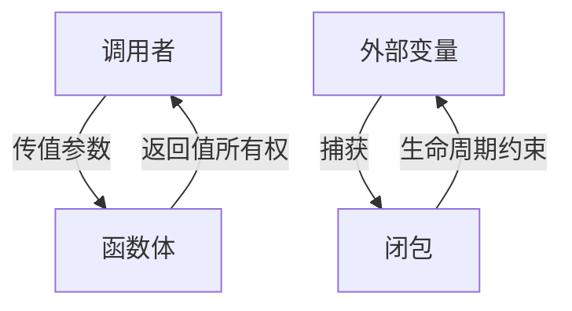

# 5. 函数式与所有权交互（05_function_ownership_interaction）

## 目录

- [5. 函数式与所有权交互（05\_function\_ownership\_interaction）](#5-函数式与所有权交互05_function_ownership_interaction)
  - [目录](#目录)
  - [5.1 视角简介](#51-视角简介)
  - [5.2 理论阐释](#52-理论阐释)
    - [5.2.1 函数与所有权转移](#521-函数与所有权转移)
    - [5.2.2 闭包与捕获变量](#522-闭包与捕获变量)
    - [5.2.3 生命周期与借用检查](#523-生命周期与借用检查)
  - [5.3 代码示例](#53-代码示例)
  - [5.4 图示（函数与所有权交互流程）](#54-图示函数与所有权交互流程)
  - [5.5 批判性分析](#55-批判性分析)
  - [5.6 交叉引用](#56-交叉引用)

## 5.1 视角简介

本节探讨 Rust 变量系统中函数、闭包与所有权、借用、生命周期等机制的交互关系，分析函数式编程范式下所有权系统的独特挑战与创新。

## 5.2 理论阐释

### 5.2.1 函数与所有权转移

**定义 5.1（所有权转移）** 设 $f$ 为函数，$x$ 为参数，若 $x$ 以值传递，则 $x$ 的所有权转移至 $f$，函数返回值的所有权转移给调用者。

- 函数参数的所有权转移：传值参数会发生所有权转移，引用参数则为借用。
- 返回值的所有权归属：函数返回值的所有权转移给调用者。

### 5.2.2 闭包与捕获变量

**定义 5.2（闭包捕获）** 闭包可按值、按引用、按可变引用捕获外部变量，对应 Fn、FnMut、FnOnce 三种 trait。

- 闭包可按值、按引用、按可变引用捕获外部变量，对应 Fn、FnMut、FnOnce 三种 trait。
- 闭包的生命周期与捕获变量的生命周期紧密相关，需编译器静态检查。

### 5.2.3 生命周期与借用检查

- 函数/闭包参数的生命周期需显式标注或由编译器推断。
- 借用检查器确保无悬垂引用、无数据竞争。

## 5.3 代码示例

```rust
// 函数参数所有权转移
fn take_ownership(s: String) {
    println!("{}", s);
}
let s1 = String::from("hello");
take_ownership(s1); // s1 失效

// 闭包按引用捕获
let x = 5;
let print_x = || println!("{}", x); // 按引用捕获 x
print_x();

// 闭包按值捕获（move）
let s2 = String::from("world");
let consume_s2 = move || println!("{}", s2); // 按值捕获 s2
consume_s2();
```

## 5.4 图示（函数与所有权交互流程）



**形式化描述：**

- $f: X \to Y$，$X$ 的所有权转移至 $f$，$Y$ 的所有权转移回调用者
- 闭包 $\lambda$ 捕获 $v$，捕获方式决定 $\lambda$ 的 trait（Fn/FnMut/FnOnce）
- 生命周期约束 $L(\lambda) \leq L(v)$

## 5.5 批判性分析

- 优势：
  - 明确所有权归属，防止悬垂引用和数据竞争。
  - 闭包 trait 体系灵活支持多种捕获方式。
- 局限：
  - 函数式编程中所有权转移与生命周期管理复杂，易导致所有权错误。
  - 某些高级用法（如自引用闭包、异步闭包）实现难度大。

## 5.6 交叉引用

- [多视角对比与方法论](../03_application_domains/03_comparative_analysis.md)
- [执行流视角分析](01_execution_flow.md)
- [index.md](../00_master_index.md)

---

> 本文档持续更新，欢迎补充批判性观点与最新理论成果。
