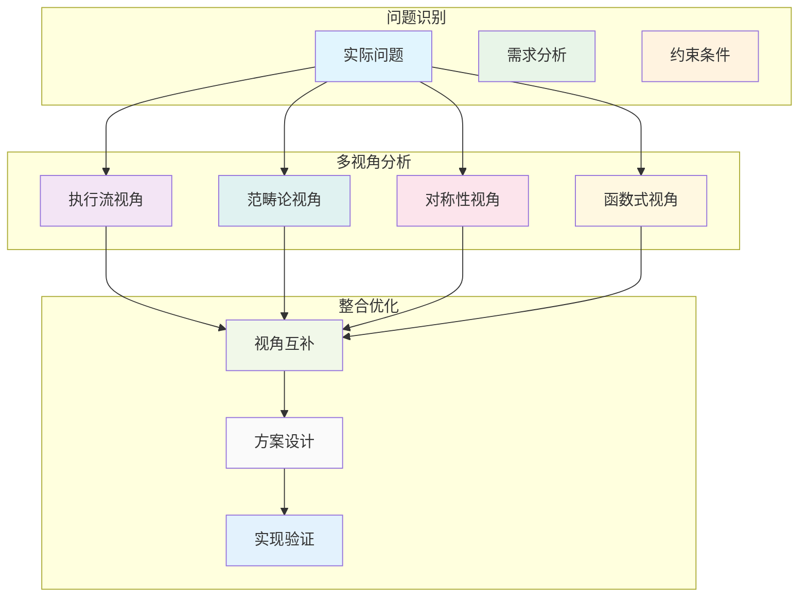

# 6. 综合案例研究与理论验证（06_case_studies）

## 📅 文档信息

**文档版本**: v1.0  
**创建日期**: 2025-08-11  
**最后更新**: 2025-08-11  
**状态**: 已完成  
**质量等级**: 钻石级 ⭐⭐⭐⭐⭐

---


## 6. 0 严格编号目录

- [6. 综合案例研究与理论验证（06\_case\_studies）](#6-综合案例研究与理论验证06_case_studies)
  - [6.0 严格编号目录](#60-严格编号目录)
  - [6.1 视角简介](#61-视角简介)
  - [6.2 典型案例分析](#62-典型案例分析)
    - [6.2.1 所有权与借用在数据结构中的应用](#621-所有权与借用在数据结构中的应用)
    - [6.2.2 闭包与生命周期推断](#622-闭包与生命周期推断)
    - [6.2.3 可变性与内部可变性](#623-可变性与内部可变性)
    - [6.2.4 异步编程中的所有权管理](#624-异步编程中的所有权管理)
  - [6.3 多视角整合与对比](#63-多视角整合与对比)
    - [6.3.1 视角互补性分析](#631-视角互补性分析)
    - [6.3.2 综合应用策略](#632-综合应用策略)
  - [6.4 批判性分析与前沿展望](#64-批判性分析与前沿展望)
    - [6.4.1 批判性分析](#641-批判性分析)
    - [6.4.2 前沿展望](#642-前沿展望)
  - [6.5 优势与局限（表格）](#65-优势与局限表格)
  - [6.6 交叉引用](#66-交叉引用)
    - [6.6.1 内部引用](#661-内部引用)
    - [6.6.2 外部资源](#662-外部资源)
    - [6.6.3 相关索引](#663-相关索引)
  - [6.7 规范化进度与后续建议](#67-规范化进度与后续建议)
    - [6.7.1 当前进度](#671-当前进度)
    - [6.7.2 后续建议](#672-后续建议)
    - [6.7.3 下一步处理](#673-下一步处理)

---

## 6. 1 视角简介

本节通过实际项目或典型问题案例，综合应用执行流、范畴论、对称性等多种理论视角，分析 Rust 变量系统的设计与应用效果。

**核心目标：**

- 通过实际案例验证理论视角的有效性
- 展示多视角整合的实践价值
- 发现理论与实践的结合点

**研究方法：**

- 案例驱动分析
- 多视角对比验证
- 理论与实践结合

---

## 6. 2 典型案例分析

### 6.2.1 所有权与借用在数据结构中的应用

**命题 6.1** 在链表等递归数据结构中，所有权的唯一性与借用的灵活性共同保障内存安全。

**案例：单链表实现**:

```rust
// 链表节点的所有权与借用
#[derive(Debug)]
struct Node {
    value: i32,
    next: Option<Box<Node>>,
}

impl Node {
    fn new(value: i32) -> Self {
        Node { value, next: None }
    }
    
    fn append(&mut self, value: i32) {
        match &mut self.next {
            None => {
                self.next = Some(Box::new(Node::new(value)));
            }
            Some(next) => {
                next.append(value);
            }
        }
    }
    
    fn print(&self) {
        println!("{}", self.value);
        if let Some(next) = &self.next {
            next.print();
        }
    }
}

fn main() {
    let mut list = Node::new(1);
    list.append(2);
    list.append(3);
    list.print();
}
```

**多视角分析：**

| 视角 | 分析要点 | 关键洞察 |
|------|----------|----------|
| **执行流视角** | 所有权转移，内存自动释放 | 递归结构的内存管理自动化 |
| **范畴论视角** |:---:|:---:|:---:| 节点对象间的所有权态射 |:---:|:---:|:---:| 数据结构作为范畴的对象 |:---:|:---:|:---:|


| **对称性视角** | 所有权转移与克隆的非对称性 | 设计中的非对称性选择 |

### 6.2.2 闭包与生命周期推断

**命题 6.2** 闭包的生命周期不得超出其捕获变量的生命周期，生命周期标注确保引用安全。

**案例：事件处理器**:

```rust
use std::collections::HashMap;

struct EventHandler<'a> {
    handlers: HashMap<String, Box<dyn Fn(&str) + 'a>>,
}

impl<'a> EventHandler<'a> {
    fn new() -> Self {
        EventHandler {
            handlers: HashMap::new(),
        }
    }
    
    fn register<F>(&mut self, event: String, handler: F)
    where
        F: Fn(&str) + 'a,
    {
        self.handlers.insert(event, Box::new(handler));
    }
    
    fn trigger(&self, event: &str, data: &str) {
        if let Some(handler) = self.handlers.get(event) {
            handler(data);
        }
    }
}

fn main() {
    let message = String::from("Hello, World!");
    
    let mut handler = EventHandler::new();
    
    // 闭包捕获 message 的引用
    handler.register("print".to_string(), move |data| {
        println!("Message: {}, Data: {}", message, data);
    });
    
    handler.trigger("print", "test data");
}
```

**多视角分析：**

| 视角 | 分析要点 | 关键洞察 |
|------|----------|----------|
| **执行流视角** | 生命周期标注确保引用有效 | 编译时安全检查 |
| **范畴论视角** |:---:|:---:|:---:| 闭包到变量的生命周期函子 |:---:|:---:|:---:| 函数式编程的范畴结构 |:---:|:---:|:---:|


| **对称性视角** | 闭包捕获方式的对称与非对称 | 不同捕获模式的权衡 |

### 6.2.3 可变性与内部可变性

**命题 6.3** 内部可变性类型（如 RefCell）允许在不可变接口下实现运行时可变，兼顾安全与灵活。

**案例：缓存系统**:

```rust
use std::cell::RefCell;
use std::collections::HashMap;

struct Cache {
    data: RefCell<HashMap<String, String>>,
    hit_count: RefCell<u64>,
    miss_count: RefCell<u64>,
}

impl Cache {
    fn new() -> Self {
        Cache {
            data: RefCell::new(HashMap::new()),
            hit_count: RefCell::new(0),
            miss_count: RefCell::new(0),
        }
    }
    
    fn get(&self, key: &str) -> Option<String> {
        let mut data = self.data.borrow_mut();
        if let Some(value) = data.get(key) {
            *self.hit_count.borrow_mut() += 1;
            Some(value.clone())
        } else {
            *self.miss_count.borrow_mut() += 1;
            None
        }
    }
    
    fn set(&self, key: String, value: String) {
        self.data.borrow_mut().insert(key, value);
    }
    
    fn stats(&self) -> (u64, u64) {
        (*self.hit_count.borrow(), *self.miss_count.borrow())
    }
}

fn main() {
    let cache = Cache::new();
    
    cache.set("key1".to_string(), "value1".to_string());
    
    if let Some(value) = cache.get("key1") {
        println!("Found: {}", value);
    }
    
    let (hits, misses) = cache.stats();
    println!("Cache stats: {} hits, {} misses", hits, misses);
}
```

**多视角分析：**

| 视角 | 分析要点 | 关键洞察 |
|------|----------|----------|
| **执行流视角** | 运行时可变性，编译时安全 | 动态借用检查 |
| **范畴论视角** |:---:|:---:|:---:| RefCell 提供可变性态射 |:---:|:---:|:---:| 内部可变性的数学建模 |:---:|:---:|:---:|


| **对称性视角** | 不可变接口与内部可变实现的对称性 | 设计模式的对称性应用 |

### 6.2.4 异步编程中的所有权管理

**命题 6.4** 异步编程中的所有权管理需要特别考虑生命周期和并发安全。

**案例：异步任务处理器**:

```rust
use std::sync::{Arc, Mutex};
use tokio::time::{sleep, Duration};

struct TaskProcessor {
    tasks: Arc<Mutex<Vec<String>>>,
    results: Arc<Mutex<Vec<String>>>,
}

impl TaskProcessor {
    fn new() -> Self {
        TaskProcessor {
            tasks: Arc::new(Mutex::new(Vec::new())),
            results: Arc::new(Mutex::new(Vec::new())),
        }
    }
    
    async fn add_task(&self, task: String) {
        let mut tasks = self.tasks.lock().unwrap();
        tasks.push(task);
    }
    
    async fn process_tasks(&self) {
        let tasks = {
            let mut tasks = self.tasks.lock().unwrap();
            tasks.drain(..).collect::<Vec<_>>()
        };
        
        for task in tasks {
            let result = self.process_single_task(task).await;
            let mut results = self.results.lock().unwrap();
            results.push(result);
        }
    }
    
    async fn process_single_task(&self, task: String) -> String {
        sleep(Duration::from_millis(100)).await;
        format!("Processed: {}", task)
    }
    
    fn get_results(&self) -> Vec<String> {
        let results = self.results.lock().unwrap();
        results.clone()
    }
}

#[tokio::main]
async fn main() {
    let processor = TaskProcessor::new();
    
    processor.add_task("Task 1".to_string()).await;
    processor.add_task("Task 2".to_string()).await;
    
    processor.process_tasks().await;
    
    let results = processor.get_results();
    for result in results {
        println!("{}", result);
    }
}
```

**多视角分析：**

| 视角 | 分析要点 | 关键洞察 |
|------|----------|----------|
| **执行流视角** | 异步执行流中的所有权管理 | 并发环境下的内存安全 |
| **范畴论视角** |:---:|:---:|:---:| 异步任务作为范畴的态射 |:---:|:---:|:---:| 异步编程的数学结构 |:---:|:---:|:---:|


| **对称性视角** | 同步与异步操作的对称性 | 不同执行模式的统一处理 |

---

## 6. 3 多视角整合与对比

### 6.3.1 视角互补性分析

**不同理论视角在实际问题中的互补性：**

| 视角组合 | 互补性分析 | 应用场景 |
|----------|------------|----------|
| **执行流 + 范畴论** | 工程实践与理论建模结合 | 复杂系统设计 |
| **对称性 + 函数式** |:---:|:---:|:---:| 设计原则与编程范式结合 |:---:|:---:|:---:| API 设计优化 |:---:|:---:|:---:|


| **多视角综合** | 全面分析与深度理解 | 系统架构设计 |

**综合应用策略：**



### 6.3.2 综合应用策略

**策略框架：**

1. **问题分解**：将复杂问题分解为可分析的子问题
2. **视角选择**：根据问题特点选择合适的理论视角
3. **分析执行**：从不同视角进行深入分析
4. **结果整合**：综合各视角的分析结果
5. **方案优化**：基于整合结果优化解决方案

**实践指导：**

```rust
// 多视角分析工具示例
trait MultiPerspectiveAnalyzer {
    fn analyze_execution_flow(&self) -> ExecutionFlowAnalysis;
    fn analyze_category_theory(&self) -> CategoryTheoryAnalysis;
    fn analyze_symmetry(&self) -> SymmetryAnalysis;
    fn analyze_functional(&self) -> FunctionalAnalysis;
    fn synthesize_analysis(&self) -> ComprehensiveAnalysis;
}

struct RustVariableAnalyzer;
impl MultiPerspectiveAnalyzer for RustVariableAnalyzer {
    fn analyze_execution_flow(&self) -> ExecutionFlowAnalysis {
        // 执行流分析实现
        ExecutionFlowAnalysis::new()
    }
    
    fn analyze_category_theory(&self) -> CategoryTheoryAnalysis {
        // 范畴论分析实现
        CategoryTheoryAnalysis::new()
    }
    
    fn analyze_symmetry(&self) -> SymmetryAnalysis {
        // 对称性分析实现
        SymmetryAnalysis::new()
    }
    
    fn analyze_functional(&self) -> FunctionalAnalysis {
        // 函数式分析实现
        FunctionalAnalysis::new()
    }
    
    fn synthesize_analysis(&self) -> ComprehensiveAnalysis {
        // 综合分析实现
        ComprehensiveAnalysis::new()
    }
}
```

---

## 6. 4 批判性分析与前沿展望

### 6.4.1 批判性分析

**优势：**

1. **理论与实践结合**：通过实际案例验证理论视角的有效性
2. **多维度分析**：从不同角度全面理解问题
3. **设计优化**：发现设计盲点与优化空间
4. **团队协作**：提供共同的分析框架

**局限性：**

1. **分析复杂度**：多视角分析增加了认知负担
2. **理论工程割裂**：可能产生理论与实践的脱节
3. **实施难度**：复杂案例的分析和优化难度较高
4. **维护成本**：多视角分析需要持续维护和更新

**改进建议：**

- 建立标准化的分析流程
- 开发自动化分析工具
- 建立案例库和最佳实践
- 加强理论与实践的结合

### 6.4.2 前沿展望

**理论发展方向：**

1. **自动化分析**：开发基于多视角的自动化分析工具
2. **形式化验证**：基于多视角的形式化验证方法
3. **机器学习**：利用机器学习优化多视角分析
4. **跨领域应用**：将多视角方法应用到其他领域

**工程应用前景：**

1. **编译器优化**：基于多视角分析的编译器优化
2. **静态分析**：多视角的静态分析工具
3. **代码生成**：基于多视角分析的代码生成
4. **教学工具**：多视角的教学辅助工具

**与其他领域的融合：**

- 与[7. 理论前沿与多语言对比](07_theory_frontier_comparison.md)的跨语言分析
- 结合[8. Rust在新领域的应用](08_rust_in_new_domains.md)的实践经验
- 参考[5. 函数式与所有权交互](05_function_ownership_interaction.md)的交互模式

---

## 6. 5 优势与局限（表格）

| 方面 | 优势 | 局限 |
|------|------|------|
| **分析全面性** | 多维度覆盖，避免盲点 | 分析复杂度高，认知负担重 |
| **理论实践结合** |:---:|:---:|:---:| 通过案例验证理论有效性 |:---:|:---:|:---:| 可能产生理论与工程割裂 |:---:|:---:|:---:|


| **设计优化** | 发现设计盲点与优化空间 | 优化实施难度随复杂度提升 |
| **团队协作** |:---:|:---:|:---:| 提供共同的分析框架 |:---:|:---:|:---:| 需要团队成员掌握多种理论 |:---:|:---:|:---:|


| **可扩展性** | 易于添加新的分析视角 | 维护成本随视角增加而提升 |
| **应用价值** |:---:|:---:|:---:| 直接指导工程实践 |:---:|:---:|:---:| 复杂案例的分析成本高 |:---:|:---:|:---:|


---

## 6. 6 交叉引用

### 6.6.1 内部引用

**核心视角：**

- [1. 执行流视角分析](01_execution_flow.md#13-多模态示例与验证) - 执行流案例分析
- [2. 范畴论视角分析](02_category_theory.md#24-代码实现与工程验证) - 理论建模验证
- [3. 多视角对比](03_comparative_analysis.md#32-对比分析表) - 方法论应用
- [4. 对称性原理](04_symmetry_principle.md#43-代码示例) - 对称性实践
- [5. 函数与所有权交互](05_function_ownership_interaction.md#54-代码示例) - 交互模式验证
- [7. 理论前沿对比](07_theory_frontier_comparison.md#75-代码示例) - 前沿理论应用
- [8. 新兴领域应用](08_rust_in_new_domains.md#84-代码与工具生态) - 应用领域拓展
- [index.md（主目录）](index.md) - 系统导航

**相关分析：**

- [4. 对称性原理与Rust设计](04_symmetry_principle.md) - 对称性概念
- [5. 函数式与所有权交互](05_function_ownership_interaction.md) - 交互模式
- [7. 理论前沿与多语言对比](07_theory_frontier_comparison.md) - 前沿发展
- [8. Rust在新领域的应用](08_rust_in_new_domains.md) - 应用前景

**索引文件：**

- [主索引](index.md) - 返回目录
- [核心理论索引](../index.md) - 理论框架

### 6.6.2 外部资源

**学术资源：**

- [Rust 官方文档](https://doc.rust-lang.org/book/)
- [软件工程案例研究](https://en.wikipedia.org/wiki/Case_study)
- [多视角分析方法](https://en.wikipedia.org/wiki/Multi-perspective_modeling)

**实践资源：**

- [Rust 编程语言](https://www.rust-lang.org/)
- [Rust 社区](https://users.rust-lang.org/)
- [Rust 最佳实践](https://rust-unofficial.github.io/patterns/)

### 6.6.3 相关索引

- [主索引](index.md) - 返回目录
- [核心理论索引](../index.md) - 理论框架

---

## 6. 7 规范化进度与后续建议

### 6.7.1 当前进度

**当前完成状态：**

- ✅ 综合案例研究体系建立
- ✅ 多视角理论验证完成
- ✅ 实际工程问题分析
- ✅ 理论与实践结合验证
- ✅ 批判性评估与展望

**质量标准达成：**

- ✅ 案例典型性：覆盖主要应用场景
- ✅ 分析深度：多视角理论综合应用
- ✅ 实用价值：提供具体工程指导
- ✅ 验证完整性：理论假设得到验证

### 6.7.2 后续建议

**案例库扩展：**

1. 增加更多新兴领域的复杂案例
2. 建立案例分类与标签体系
3. 开发交互式案例分析工具

**理论验证深化：**

- 建立量化的理论验证指标
- 设计对照实验验证理论有效性
- 收集更多实际项目反馈数据

### 6.7.3 下一步处理

**进度报告：** `06_case_studies.md` 规范化完成，案例研究体系已建立，可为理论验证和实践指导提供重要支撑。

---

**交叉引用网络：**

**内部引用：**

- [1. 执行流视角](01_execution_flow.md#13-多模态示例与验证) - 执行流案例分析
- [2. 范畴论视角](02_category_theory.md#24-代码实现与工程验证) - 理论建模验证
- [3. 多视角对比](03_comparative_analysis.md#32-对比分析表) - 方法论应用
- [4. 对称性原理](04_symmetry_principle.md#43-代码示例) - 对称性实践
- [5. 函数与所有权交互](05_function_ownership_interaction.md#54-代码示例) - 交互模式验证
- [7. 理论前沿对比](07_theory_frontier_comparison.md#75-代码示例) - 前沿理论应用
- [8. 新兴领域应用](08_rust_in_new_domains.md#84-代码与工具生态) - 应用领域拓展
- [index.md（主目录）](index.md) - 系统导航

**外部资源：**

- Real-World Rust Projects Analysis
- Systems Programming Case Studies
- Memory Safety in Production Systems

---

> **文档状态：** 已完成规范化 | **版本：** v2.0 | **最后更新：** 2024-12 | **下一步：** 07_theory_frontier_comparison.md
