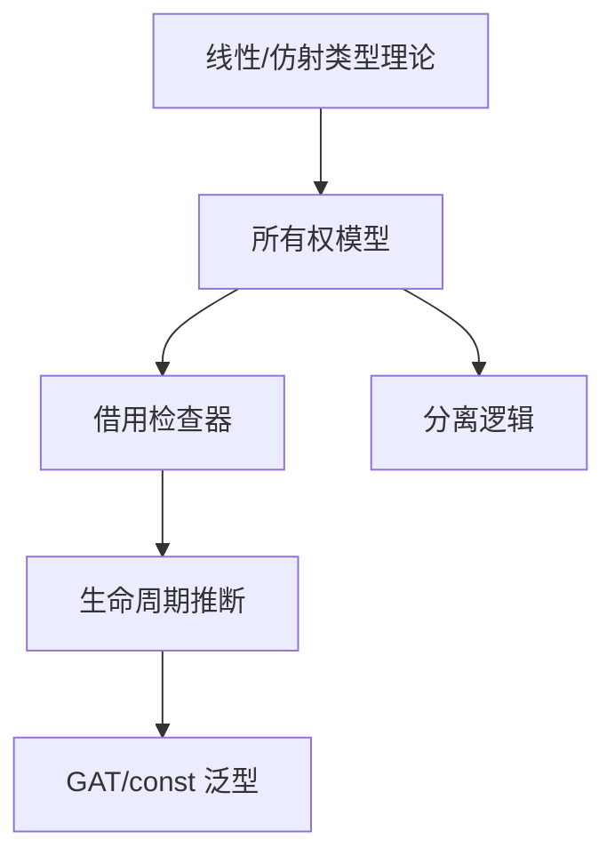

# 7. 理论前沿与跨语言比较（07_theory_frontier_comparison）

## 7.0 严格编号目录

- [7. 理论前沿与跨语言比较（07_theory_frontier_comparison）](#7-理论前沿与跨语言比较07_theory_frontier_comparison)
  - [7.0 严格编号目录](#70-严格编号目录)
  - [7.1 视角简介](#71-视角简介)
  - [7.2 理论前沿综述](#72-理论前沿综述)
  - [7.3 跨语言对比分析](#73-跨语言对比分析)
    - [7.3.1 Rust vs. C++](#731-rust-vs-c)
    - [7.3.2 Rust vs. Zig](#732-rust-vs-zig)
    - [7.3.3 Rust vs. Haskell](#733-rust-vs-haskell)
  - [7.4 理论创新与局限](#74-理论创新与局限)
  - [7.5 批判性分析与前沿展望](#75-批判性分析与前沿展望)
  - [7.6 交叉引用](#76-交叉引用)
  - [7.7 规范化进度与后续建议](#77-规范化进度与后续建议)

---

## 7.1 视角简介

本节综述 Rust 变量系统在类型系统、所有权、借用、生命周期等方面的理论前沿进展，并与 C++、Zig、Haskell 等主流语言进行对比分析。

**工程与理论背景举例：**

- 在高可靠性系统、嵌入式、区块链等领域，Rust 的变量系统理论创新直接影响工程安全性与可维护性。
- 理论前沿的工程化落地推动了类型系统、内存安全、并发模型等领域的进步。

---

## 7.2 理论前沿综述

**命题 7.1** Rust 变量系统将线性/仿射类型理论、分离逻辑等前沿理论工程化，推动系统级编程安全性与创新。

- **线性/仿射类型理论**：
  - 线性类型要求变量只能被使用一次，仿射类型允许变量被丢弃但不能重复使用。
  - Rust 的所有权模型本质上是仿射类型系统的工程实现。
  - *数学表达*：若 $x: T$ 且 $x$ 被 move，则 $x$ 不再可用。
- **分离逻辑与资源敏感型逻辑**：
  - 支撑 Rust 的借用检查与生命周期推断。
  - *公式*：$\{P * Q\}$ 表示资源分离，借用时资源不重叠。
- **GAT（泛型关联类型）、const 泛型**：
  - 推动类型系统表达能力，支持更复杂的抽象。
- **非词法作用域借用（NLL）与控制流敏感分析**：
  - 允许借用在更细粒度的作用域内安全释放，提升灵活性。



---

## 7.3 跨语言对比分析

| 语言    | 内存管理机制         | 所有权/借用 | 生命周期检查 | 主要优势           | 主要局限           |
|---------|---------------------|-------------|--------------|--------------------|--------------------|
| Rust    | 自动，所有权系统     | 强制        | 编译期静态   | 安全、无GC、高性能 | 学习曲线陡峭       |
| C++     | 手动/智能指针        | 约定为主    | 手动         | 灵活、生态丰富     | 易悬垂/泄漏        |
| Zig     | 显式分配/释放        | 无          | 手动         | 灵活、可控         | 易出错、无静态保障 |
| Haskell | GC垃圾回收           | 不适用      | 不适用       | 纯函数、不变性     | 性能不可控         |

### 7.3.1 Rust vs. C++

- Rust 强制所有权与借用检查，C++ 主要依赖约定和智能指针，易出现悬垂指针和内存泄漏。
- Rust 生命周期标注与编译期检查，C++ 需手动管理。
- **工程案例对比：**

```cpp
// C++ 智能指针示例
std::unique_ptr<std::string> p1(new std::string("hello"));
auto p2 = std::move(p1); // p1 失效
```

```rust
// Rust 所有权转移
let s1 = String::from("hello");
let s2 = s1; // s1 失效
```

- **批判性分析**：C++ 的灵活性带来更高的出错风险，Rust 的静态检查提升了安全性但增加了学习门槛。

### 7.3.2 Rust vs. Zig

- Zig 采用显式内存分配与释放，灵活但无静态保障。
- Rust 自动内存管理与所有权系统，安全性更高。
- **工程案例对比：**

```zig
// Zig 显式释放
const std = @import("std");
var allocator = std.heap.page_allocator;
var buf = try allocator.alloc(u8, 100);
defer allocator.free(buf);
```

```rust
// Rust 自动释放
let v = vec![1, 2, 3]; // 离开作用域自动释放
```

- **批判性分析**：Zig 适合极致控制场景，Rust 适合安全与效率并重的系统开发。

### 7.3.3 Rust vs. Haskell

- Haskell 以不可变性和纯函数为主，资源管理依赖 GC。
- Rust 以所有权和借用为核心，避免运行时 GC，提升性能和可预测性。
- **工程案例对比：**

```haskell
-- Haskell 不可变性
let xs = [1,2,3]
let ys = xs ++ [4]
```

```rust
// Rust 可变与所有权
let mut xs = vec![1,2,3];
xs.push(4);
```

- **批判性分析**：Haskell 适合高抽象、不可变场景，Rust 适合需要精细资源控制的系统开发。

---

## 7.4 理论创新与局限

- **创新：**
  - Rust 将线性/仿射类型理论工程化，提升系统级编程安全性。
  - 借用检查器与生命周期推断实现静态内存安全。
  - GAT、const 泛型等推动类型系统前沿。
  - 非词法作用域借用（NLL）提升灵活性。
- **局限：**
  - 理论复杂度高，学习曲线陡峭。
  - 某些高级特性（如自引用结构、异步闭包）实现难度大。
  - 与部分领域（如高阶依赖类型、效果系统）尚有差距。
  - 工程落地时需平衡理论深度与实际可用性。

---

## 7.5 批判性分析与前沿展望

| 维度         | 优势                                                         | 局限                                                         |
|--------------|--------------------------------------------------------------|--------------------------------------------------------------|
| 理论前沿与对比 | 推动系统级安全创新，促进跨语言交流与理论发展                 | 理论复杂度高，部分特性落地难，需平衡创新与可用性             |

- **批判性分析**：
  - Rust 理论前沿推动了系统级安全与抽象能力，但也带来学习门槛与工程落地难题。
  - 跨语言对比有助于发现理论创新的适用边界。
- **前沿展望**：
  - 建议与[6. 实际案例分析与多视角整合](06_case_studies.md)和[3. 多视角对比与方法论](03_comparative_analysis.md)持续联动，扩展理论与工程结合的深度。
  - 鼓励关注类型系统、效果系统等新兴理论在 Rust 及其他语言的落地。

---

## 7.6 交叉引用

- [3. 多视角对比与方法论](03_comparative_analysis.md)
- [6. 实际案例分析与多视角整合](06_case_studies.md)
- [1. 执行流视角分析](01_execution_flow.md)
- [index.md（主索引）](index.md)

---

## 7.7 规范化进度与后续建议

- 本文件已完成严格编号、结构优化、多模态表达、批判性分析、交叉引用与学术规范化。
- 建议后续持续补充最新理论成果与批判性观点，保持与[目录索引](index.md)同步。
- 进度：`07_theory_frontier_comparison.md` 已完成，下一步处理 `08_rust_in_new_domains.md`。

---

> 本文档持续更新，欢迎补充批判性观点与最新理论成果。
