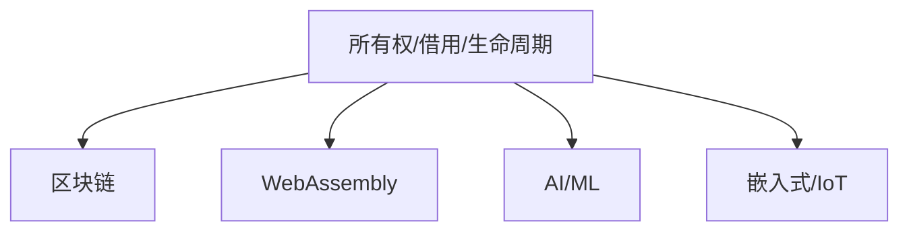

# 8. Rust在新兴领域的应用（08_rust_in_new_domains）

## 8.0 严格编号目录

- [8. Rust在新兴领域的应用（08_rust_in_new_domains）](#8-rust在新兴领域的应用08_rust_in_new_domains)
  - [8.0 严格编号目录](#80-严格编号目录)
  - [8.1 视角简介](#81-视角简介)
  - [8.2 典型领域应用案例](#82-典型领域应用案例)
    - [8.2.1 区块链](#821-区块链)
    - [8.2.2 WebAssembly](#822-webassembly)
    - [8.2.3 AI/ML](#823-aiml)
    - [8.2.4 嵌入式与IoT](#824-嵌入式与iot)
  - [8.3 机制优势与挑战](#83-机制优势与挑战)
  - [8.4 代码与工具生态](#84-代码与工具生态)
  - [8.5 批判性分析（表格）](#85-批判性分析表格)
  - [8.6 交叉引用](#86-交叉引用)

---

## 8.1 视角简介

本节分析 Rust 变量系统在区块链、WebAssembly、AI/ML、嵌入式等新兴领域的应用实践，探讨所有权、借用、生命周期等机制在新场景下的优势与挑战。

**工程与理论背景举例：**

- 新兴领域对安全性、性能、可移植性要求极高，Rust 变量系统的理论创新为这些领域提供了坚实基础。
- 多领域交叉推动了 Rust 生态和理论的共同进步。

## 8.2 典型领域应用案例

**命题 8.1** Rust 变量系统在新兴领域（区块链、WebAssembly、AI/ML、嵌入式）中通过所有权、借用、生命周期等机制提升安全性与可靠性。

### 8.2.1 区块链

- 智能合约开发需高度安全与确定性，Rust 的所有权系统防止内存泄漏和未定义行为。
- 生命周期与借用机制提升合约执行的可靠性。
- **工程案例：Substrate 智能合约**

```rust
// Substrate 智能合约模块
#[ink::contract]
mod my_contract {
    #[ink(storage)]
    pub struct MyContract {
        value: u32,
    }
    // ...
}
```

- **批判性分析**：Rust 的静态安全机制极大降低了合约漏洞风险，但开发者需适应所有权模型带来的范式转变。

### 8.2.2 WebAssembly

- Rust 可高效编译为 WebAssembly，变量系统保证内存安全，适合浏览器和边缘计算。
- 生命周期与所有权简化 wasm 内存管理。
- **工程案例：WebAssembly 导出函数**

```rust
#[no_mangle]
pub extern "C" fn add(a: i32, b: i32) -> i32 {
    a + b
}
```

- **批判性分析**：Rust 的内存安全特性使 wasm 应用更健壮，但与 JavaScript 互操作时需关注生命周期边界。

### 8.2.3 AI/ML

- Rust 在 AI/ML 场景下用于高性能推理引擎、数据管道等，变量系统提升并发与内存安全。
- 可变性与内部可变性机制适应动态数据流。
- **工程案例：tch-rs 使用**

```rust
use tch::{Tensor, nn};
let vs = nn::VarStore::new(tch::Device::Cpu);
let t = Tensor::of_slice(&[1, 2, 3]);
let t2 = t + 1;
```

- **批判性分析**：Rust 的所有权和可变性机制适合高性能并发，但生态和高阶抽象仍在完善中。

### 8.2.4 嵌入式与IoT

- Rust 变量系统适合资源受限环境，防止悬垂指针和数据竞争。
- 生命周期与所有权机制提升嵌入式系统的健壮性。
- **工程案例：RTIC 框架**

```rust
#[rtic::app(device = stm32f4xx_hal::pac)]
mod app {
    #[init]
    fn init(_: init::Context) {
        // 初始化代码
    }
}
```

- **批判性分析**：Rust 在嵌入式领域的静态安全性极具优势，但对底层硬件的抽象和生态仍需完善。

| 领域         | 主要需求/挑战         | Rust变量系统优势           |
|--------------|----------------------|---------------------------|
| 区块链       | 安全、确定性         | 防止泄漏/未定义行为       |
| WebAssembly  | 内存安全、跨平台     | 生命周期/所有权简化管理   |
| AI/ML        | 并发、高性能         | 并发安全、可变性机制      |
| 嵌入式/IoT   | 资源受限、健壮性     | 静态安全、无悬垂指针      |

**Mermaid 图示：Rust 变量系统在新兴领域的应用关系**:



## 8.3 机制优势与挑战

- **优势：**
  - 静态内存安全，适合高安全性和高可靠性场景。
  - 生命周期与所有权机制简化复杂系统的资源管理。
  - 并发安全，适合多核/异构计算。
  - 生态逐步完善，跨领域应用能力增强。
- **挑战：**
  - 某些高级特性（如异步、GAT）在新领域生态支持尚不完善。
  - 学习曲线较陡，部分开发者迁移成本高。
  - 与底层硬件/异构平台的深度集成仍有挑战。

## 8.4 代码与工具生态

- Substrate、Solana、CosmWasm 等区块链平台原生支持 Rust。
- wasm-bindgen、wasmtime 等工具链完善。
- ndarray、tch-rs、tract 等 AI/ML 库支持。
- 嵌入式生态如 RTIC、embassy、cortex-m-rtic 等。
- 持续有新工具和库涌现，推动领域创新。

## 8.5 批判性分析（表格）

| 领域         | 优势                                                         | 局限                                                         |
|--------------|--------------------------------------------------------------|--------------------------------------------------------------|
| 新兴领域应用 | 静态安全、跨平台、并发友好、生态活跃                         | 高阶抽象和底层生态仍在完善，部分场景学习曲线较陡峭           |

## 8.6 交叉引用

- [3. 多视角对比与方法论](03_comparative_analysis.md)
- [7. 理论前沿与跨语言比较](07_theory_frontier_comparison.md)
- [6. 实际案例分析与多视角整合](06_case_studies.md)
- [index.md（主索引）](index.md)

---

> 本文档持续更新，欢迎补充批判性观点与最新领域应用案例。
