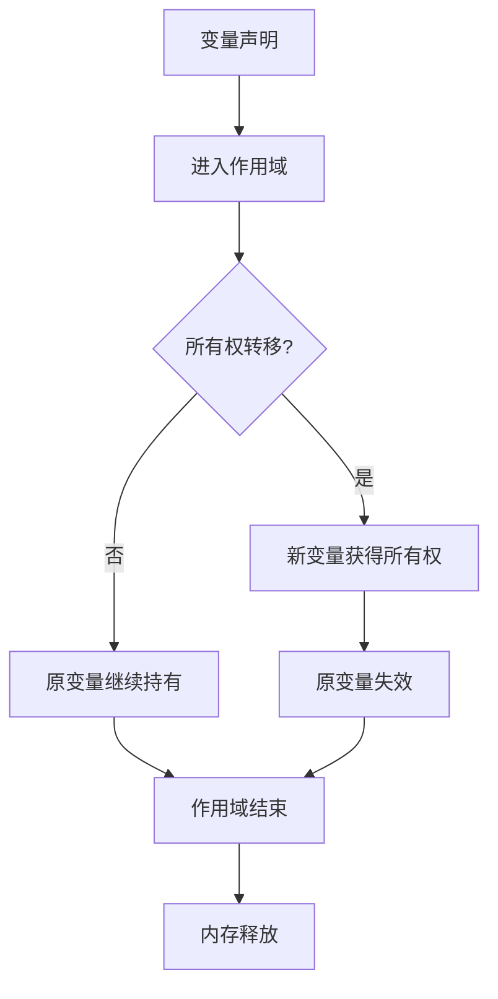
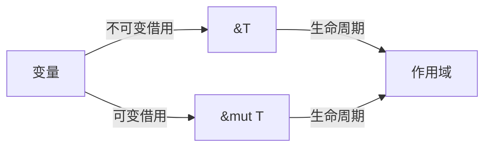
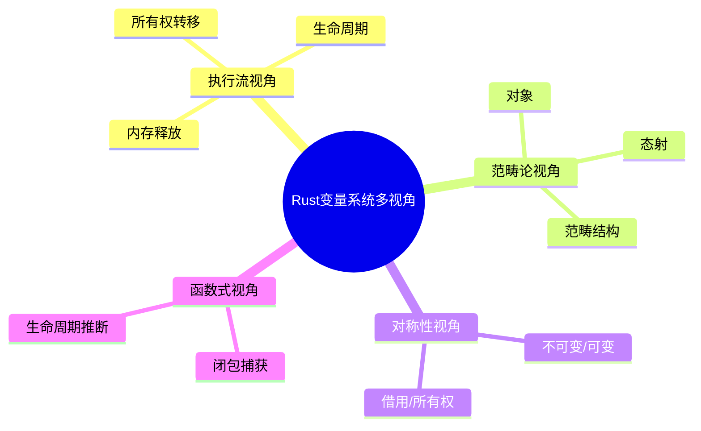

# 10. 可视化与思维导图（10_visualization_and_mindmap）

## 10.1 视角简介

本节通过可视化图表、思维导图等多表征方式，辅助理解 Rust 变量系统的核心机制、理论结构与多视角对比。

## 10.2 变量系统核心机制可视化

### 10.2.1 所有权与生命周期流程图

### 10.2.2 借用规则与数据流

### 10.2.3 多视角结构思维导图

## 10.3 交互式可视化建议

- 嵌入 Rust Playground 代码可视化
- 动态流程图与生命周期模拟
- 思维导图工具（如 markmap、XMind）集成

## 10.4 批判性分析

- 优势：
  - 可视化降低理论门槛，提升复杂机制的可理解性。
  - 多表征方式有助于不同认知风格的学习者。
- 局限：
  - 复杂理论的可视化需防止过度简化。
  - 动态交互式工具开发成本较高。

## 10.5 交叉引用

- [执行流视角分析](01_execution_flow.md)
- [多视角对比与方法论](03_comparative_analysis.md)
- [分层学习路径与交互式内容](09_learning_path_and_interactive.md)
- [index.md](index.md)

---

> 本文档持续更新，欢迎补充更多可视化与思维导图资源。
