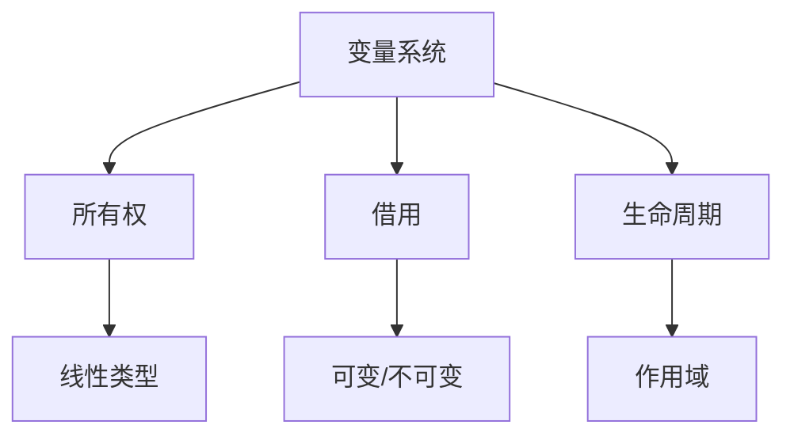

# 10. 可视化与思维导图（10_visualization_and_mindmap）

## 10.1 可视化方法

- 10.1.1 结构化文本与层级目录
- 10.1.2 Mermaid 流程图与关系图
- 10.1.3 思维导图工具（如 XMind、MindNode）

## 10.2 典型思维导图

## 10.3 批判性分析

- 优势：可视化表达有助于梳理复杂关系，提升理解效率
- 局限：需结合文本解释，避免过度简化

## 10.4 交叉引用

- [分层学习路径与交互式内容](09_learning_path_and_interactive.md)
- [类型系统分析](../02_type_system/index.md)
- [目录](index.md)

---

> 本文档持续更新，欢迎补充新的可视化案例与思维导图资源。
