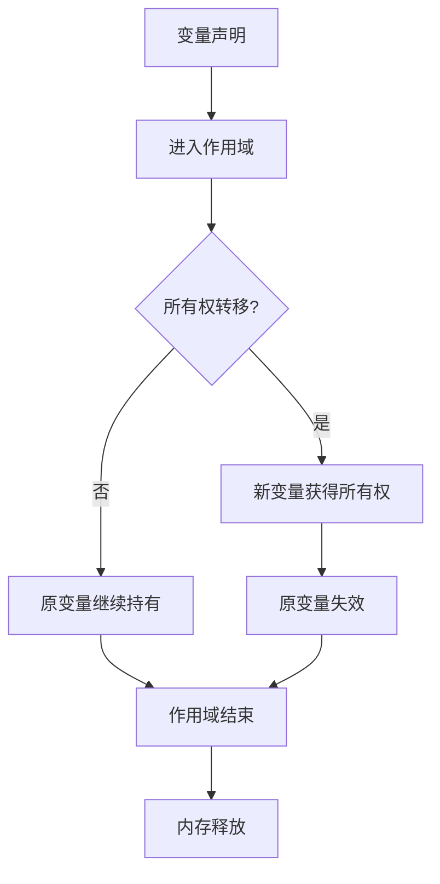
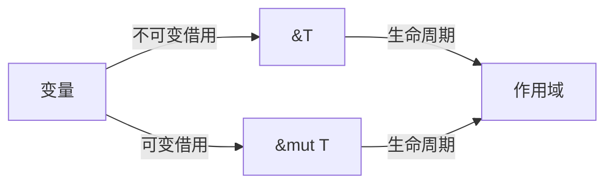
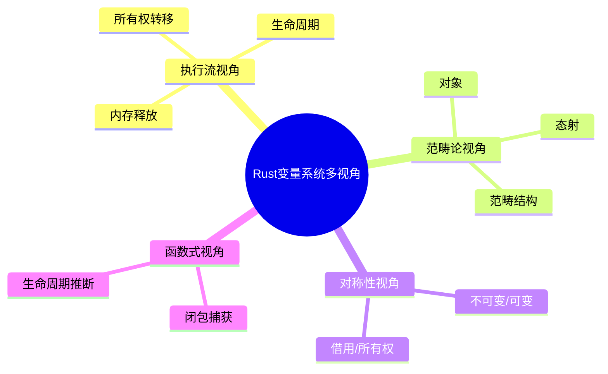

# 10. 可视化与思维导图（10_visualization_and_mindmap）

## 目录

- [10. 可视化与思维导图（10\_visualization\_and\_mindmap）](#10-可视化与思维导图10_visualization_and_mindmap)
  - [目录](#目录)
  - [10.1 视角简介](#101-视角简介)
  - [10.2 变量系统核心机制可视化](#102-变量系统核心机制可视化)
    - [10.2.1 所有权与生命周期流程图](#1021-所有权与生命周期流程图)
    - [10.2.2 借用规则与数据流](#1022-借用规则与数据流)
    - [10.2.3 多视角结构思维导图](#1023-多视角结构思维导图)
  - [10.3 交互式可视化建议](#103-交互式可视化建议)
  - [10.4 批判性分析](#104-批判性分析)
  - [10.5 交叉引用](#105-交叉引用)

## 10.1 视角简介

本节通过可视化图表、思维导图等多表征方式，辅助理解 Rust 变量系统的核心机制、理论结构与多视角对比。

**工程与理论背景举例：**

- 复杂理论结构（如所有权、生命周期、借用）通过可视化更易于工程落地和团队沟通。
- 多表征方式有助于不同认知风格的学习者高效掌握变量系统。

## 10.2 变量系统核心机制可视化

**命题 10.1** 多表征可视化有助于揭示 Rust 变量系统的结构与动态行为，促进理论与实践结合。

### 10.2.1 所有权与生命周期流程图

- **批判性分析**：该流程图直观展示了所有权流转与生命周期终结，但实际工程中还需考虑复杂数据结构、闭包等特殊场景。

### 10.2.2 借用规则与数据流

- **工程案例**：在多线程并发场景下，借用规则可防止数据竞争。
- **批判性分析**：静态借用检查提升安全性，但对新手有一定理解门槛。

### 10.2.3 多视角结构思维导图

- **批判性分析**：思维导图有助于全局把握理论结构，但需结合具体案例深化理解。

## 10.3 交互式可视化建议

- 嵌入 Rust Playground 代码可视化，实时展示变量生命周期变化。
- 动态流程图与生命周期模拟（如 Web 可交互 Mermaid、markmap）。
- 思维导图工具（如 markmap、XMind）集成，支持知识点导航。
- 变量所有权流转动画演示，辅助理解复杂所有权链。
- 工程案例：集成自动化测试与可视化反馈，提升学习与开发体验。

## 10.4 批判性分析

- **优势：**
  - 可视化降低理论门槛，提升复杂机制的可理解性。
  - 多表征方式有助于不同认知风格的学习者。
  - 动态交互式工具促进理论与工程的结合。
- **局限：**
  - 复杂理论的可视化需防止过度简化。
  - 动态交互式工具开发成本较高。
  - 需持续更新以适应新特性和新理论。

## 10.5 交叉引用

- [执行流视角分析](01_execution_flow.md)
- [多视角对比与方法论](../03_application_domains/03_comparative_analysis.md)
- [分层学习路径与交互式内容](09_learning_path_and_interactive.md)
- [index.md](../00_master_index.md)

---

> 本文档持续更新，欢迎补充更多可视化与思维导图资源。
