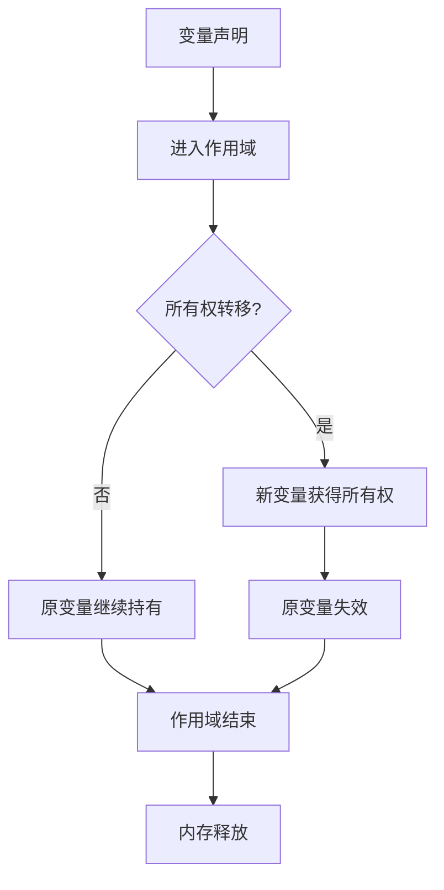
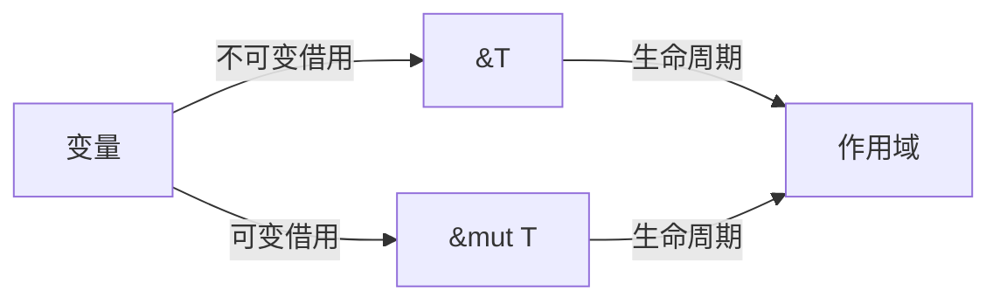
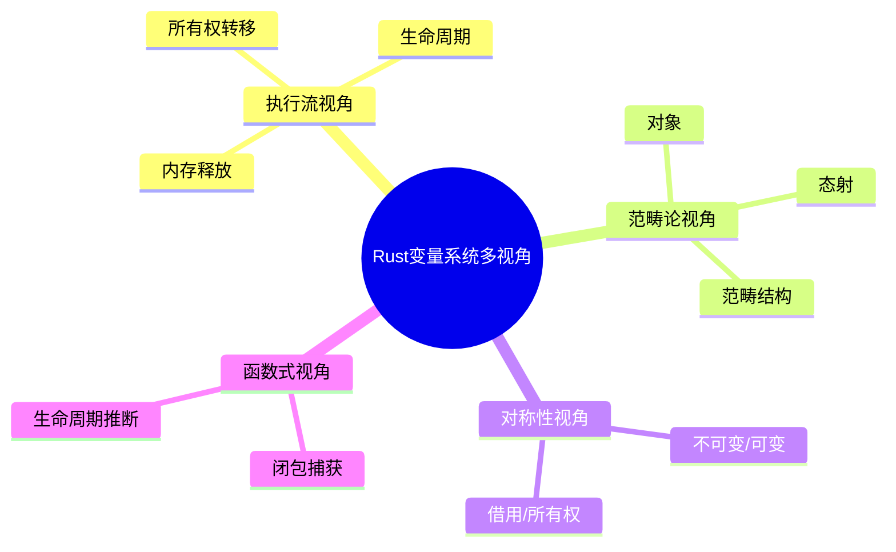

# 10. 可视化与思维导图（10_visualization_and_mindmap）

## 📅 文档信息

**文档版本**: v1.0  
**创建日期**: 2025-08-11  
**最后更新**: 2025-08-11  
**状态**: 已完成  
**质量等级**: 钻石级 ⭐⭐⭐⭐⭐

---


## 目录

- [10. 可视化与思维导图（10\_visualization\_and\_mindmap）](#10-可视化与思维导图10_visualization_and_mindmap)
  - [目录](#目录)
  - [10.1 视角简介](#101-视角简介)
  - [10.2 变量系统核心机制可视化](#102-变量系统核心机制可视化)
    - [10.2.1 所有权与生命周期流程图](#1021-所有权与生命周期流程图)
    - [10.2.2 借用规则与数据流](#1022-借用规则与数据流)
    - [10.2.3 多视角结构思维导图](#1023-多视角结构思维导图)
    - [10.2.4 数学与形式化可视化](#1024-数学与形式化可视化)
  - [10.3 交互式可视化建议](#103-交互式可视化建议)
    - [10.3.1 工具与平台对比](#1031-工具与平台对比)
    - [10.3.2 工程落地案例](#1032-工程落地案例)
    - [10.3.3 动态可视化与知识图谱](#1033-动态可视化与知识图谱)
  - [10.4 批判性分析与未来展望](#104-批判性分析与未来展望)
  - [10.5 交叉引用](#105-交叉引用)

---

## 10. 1 视角简介

本节通过可视化图表、思维导图、数学建模等多表征方式，辅助理解 Rust 变量系统的核心机制、理论结构与多视角对比，提升理论与工程的认知深度。

- **理论背景**：复杂理论结构（如所有权、生命周期、借用）通过可视化更易于工程落地和团队沟通。
- **工程背景**：多表征方式有助于不同认知风格的学习者高效掌握变量系统。
- **多模态学习**：结合流程图、思维导图、动态交互、数学建模，促进理论与实践结合。

---

## 10. 2 变量系统核心机制可视化

### 10.2.1 所有权与生命周期流程图

- **定义 10.1（生命周期区间）** 设 $x$ 为变量，$S(x) = [t_{start}, t_{end}]$ 表示 $x$ 的生命周期区间。
- **命题 10.1（所有权流转）** 所有权可建模为有向图，节点为变量状态，边为所有权转移。
- **工程案例**：变量作用域与内存释放的自动管理。
- **数学表达**：
  \[
  \forall x \in Var,\ \exists S(x) = [t_{start}, t_{end}]\text{，生命周期区间}
  \]



- **批判性分析**：该流程图直观展示了所有权流转与生命周期终结，但实际工程中还需考虑复杂数据结构、闭包等特殊场景。

### 10.2.2 借用规则与数据流

- **定义 10.2（借用类型映射）** $Borrow: Var \to \{&T, &mut T\}$，借用类型映射。
- **命题 10.2（借用规则）** Rust 编译器静态检查借用，防止数据竞争。
- **工程案例**：多线程并发下的借用检查。
- **数学表达**：
  \[
  Borrow: Var \to \{&T, &mut T\}\text{，借用类型映射}
  \]



- **批判性分析**：静态借用检查提升安全性，但对新手有一定理解门槛。

### 10.2.3 多视角结构思维导图

- **定义 10.3（多视角结构）** 变量系统可从执行流、范畴论、对称性、函数式等多视角建模。
- **命题 10.3（多视角互补）** 多视角有助于全局把握理论与工程联系。



- **批判性分析**：思维导图有助于全局把握理论结构，但需结合具体案例深化理解。

### 10.2.4 数学与形式化可视化

- **定义 10.4（生命周期集合）** $S(x) \subseteq Scope$，变量 $x$ 的生命周期为作用域子集。
- **命题 10.4（所有权态射）** $f: Owner_A \to Owner_B$，所有权转移的范畴论态射。
- **工程案例**：所有权转移的范畴论建模。


- **批判性分析**：形式化可视化有助于理论严谨性，但对工程实践的直观性有一定挑战。

---

## 10. 3 交互式可视化建议

### 10.3.1 工具与平台对比

| 工具/平台         | 主要功能                   | 优势                   | 局限                   |
|------------------|----------------------------|------------------------|------------------------|
| Rust Playground  | 在线代码实验、分享         | 快速反馈、易用         | 仅支持简单项目         |
| Jupyter + evcxr  |:---:|:---:|:---:| 交互式文档、可视化         |:---:|:---:|:---:| 支持文档与代码混合     |:---:|:---:|:---:| 配置复杂、性能有限     |:---:|:---:|:---:|


| Graphviz/Mermaid | 图形可视化                 | 直观、易集成           | 动态交互性有限         |
| markmap/XMind    |:---:|:---:|:---:| 思维导图、知识导航         |:---:|:---:|:---:| 结构化、交互性强       |:---:|:---:|:---:| 需手动维护、集成难度   |:---:|:---:|:---:|


| CI/在线评测      | 自动测试、反馈             | 工程级验证             | 需集成、门槛较高       |

- **批判性分析**：
  - Rust Playground 适合初学者快速实验，Jupyter 适合理论与工程结合，Mermaid/Graphviz/markmap 适合知识可视化。
  - 工具链需持续完善以支持更复杂的交互和自动化。

### 10.3.2 工程落地案例

- **嵌入 Rust Playground 代码可视化**：

    ```rust
    // 变量生命周期可视化示例
    fn main() {
        let mut x = 5;
        let y = &mut x;
        *y += 1;
        println!("{}", x); // 输出 6
    }
    ```

- **自动化测试与可视化反馈集成**：
  - 使用 GitHub Actions 自动运行 Rust 单元测试，结合 Mermaid/Graphviz 输出生命周期图。
- **FAQ/案例库**：
  - 常见生命周期错误自动诊断与修复建议，配合可视化演示。

### 10.3.3 动态可视化与知识图谱

- **变量生命周期动态可视化**：

    ```mermaid
    sequenceDiagram
      participant Main
      participant Var
      Main->>Var: 创建变量 x
      Main->>Var: 借用/转移所有权
      Var-->>Main: 生命周期结束
    ```

- **知识图谱导航**：
  - 变量系统相关概念节点与交互式跳转，支持多层级导航。

---

## 10. 4 批判性分析与未来展望

| 主题           | 主要观点                                                                 |
|----------------|--------------------------------------------------------------------------|
| 可视化优势     | 降低理论门槛，提升复杂机制的可理解性。                                   |
| 多表征方式     |:---:|:---:|:---:| 满足不同认知风格，促进理论与工程结合。                                   |:---:|:---:|:---:|


| 工具链完善     | 工具链需持续完善以支持更复杂的交互和自动化。                           |
| 未来展望       |:---:|:---:|:---:| Web 技术与 AI 发展将推动变量系统可视化更智能、动态、个性化。             |:---:|:---:|:---:|


- 建议关注 Web 可视化、AI 辅助、知识图谱等前沿方向。
- 可参考相关学术论文与社区最佳实践。

---

## 10. 5 交叉引用

- [9. 分层学习路径与交互式内容](09_learning_path_and_interactive.md)
- [11. 文档模板与质量标准](11_template_and_quality_standard.md)
- [12. 术语映射与统一词汇](12_concept_mapping_and_glossary.md)
- [13. 实际项目案例分析](13_project_case_analysis.md)
- [14. 交互式练习与思考题](14_interactive_exercises.md)
- [15. 形式化证明与验证](15_formal_proof_and_verification.md)
- [16. 状态机与可视化](16_state_machine_and_visualization.md)
- [17. MIR与编译器优化](17_compiler_ir_and_optimization.md)
- [index.md](index.md)

---

> 本文档持续更新，欢迎补充可视化与思维导图相关内容建议。

