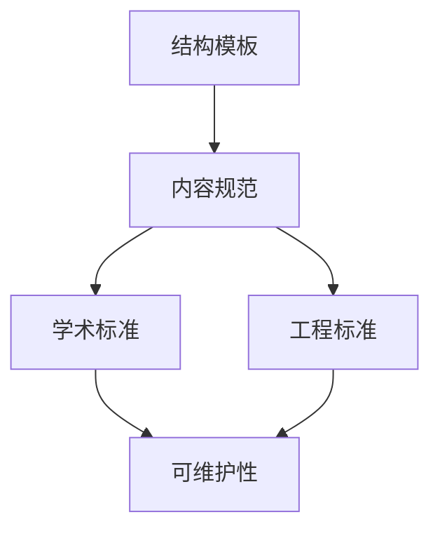

# 11. 文档模板与质量标准（11_template_and_quality_standard）

## 目录

- [11. 文档模板与质量标准（11\_template\_and\_quality\_standard）](#11-文档模板与质量标准11_template_and_quality_standard)
  - [目录](#目录)
  - [11.1 视角简介](#111-视角简介)
  - [11.2 推荐文档结构模板](#112-推荐文档结构模板)
  - [11.3 内容规范与要求](#113-内容规范与要求)
  - [11.4 学术与工程质量标准](#114-学术与工程质量标准)
  - [11.5 批判性分析](#115-批判性分析)
  - [11.6 交叉引用](#116-交叉引用)

## 11.1 视角简介

本节提供 Rust 变量系统相关文档的推荐结构模板与内容规范，明确学术与工程质量标准，促进多表征、交叉引用、去重与规范化。

**工程与理论背景举例：**

- 统一模板有助于团队协作、知识沉淀与持续演进。
- 质量标准保障文档的可维护性、可扩展性与学术严谨性。

## 11.2 推荐文档结构模板

1. 标题与编号（如"1. 执行流视角分析"）
2. 视角简介/主题概述
3. 理论阐释/机制建模
4. 代码示例/数学符号/图表
5. 典型案例/应用场景
6. 优势与局限的批判性分析
7. 交叉引用与扩展阅读
8. 持续更新声明与贡献说明

**模板示例：**

```markdown
# X. 主题名称（编号_英文名）

## 目录
- [X. 主题名称（编号_英文名）](#x-主题名称编号_英文名)
  - [目录](#目录)
  - [X.1 视角简介](#x1-视角简介)
  - [X.2 理论阐释/机制建模](#x2-理论阐释机制建模)
  - [X.3 代码与案例](#x3-代码与案例)
  - [X.4 批判性分析](#x4-批判性分析)
  - [X.5 交叉引用](#x5-交叉引用)

## X.1 视角简介

## X.2 理论阐释/机制建模

## X.3 代码与案例

## X.4 批判性分析

## X.5 交叉引用
```

## 11.3 内容规范与要求

- 严格编号的树形目录，便于导航与引用
- 多表征（文本、代码、图、表、公式等）
- 交叉引用本地相关文档，支持跳转
- 避免内容重复，保持分类严谨
- 论证过程与结论分明，支持形式化表达
- 保持与最新理论和工程实践同步

## 11.4 学术与工程质量标准

- 论证严谨、引用权威、数据准确
- 代码示例可编译、可运行、注释清晰
- 图表/公式规范，便于二次编辑
- 语言表达规范，术语统一
- 支持持续更新与社区贡献

**Mermaid 可视化：文档结构与质量标准关系**:



## 11.5 批判性分析

- **优势：**
  - 统一模板与标准提升文档可维护性与可扩展性。
  - 多表征与交叉引用增强知识网络。
- **局限：**
  - 过度规范可能抑制创新表达。
  - 持续维护需投入额外精力。

## 11.6 交叉引用

- [index.md](../00_master_index.md)
- [分层学习路径与交互式内容](09_learning_path_and_interactive.md)
- [可视化与思维导图](10_visualization_and_mindmap.md)

---

> 本文档持续更新，欢迎补充模板建议与质量标准案例。
