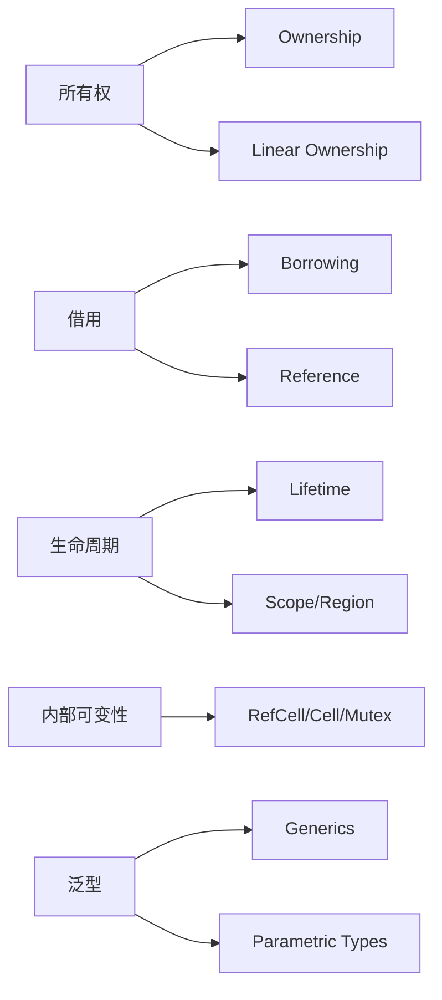

# 12. 术语映射与统一词汇表（12_concept_mapping_and_glossary）

## 目录

- [12. 术语映射与统一词汇表（12\_concept\_mapping\_and\_glossary）](#12-术语映射与统一词汇表12_concept_mapping_and_glossary)
  - [目录](#目录)
  - [12.1 术语映射表](#121-术语映射表)
    - [12.1.1 理论基础与工程案例](#1211-理论基础与工程案例)
    - [12.1.2 数学与形式化描述](#1212-数学与形式化描述)
    - [12.1.3 Mermaid 可视化](#1213-mermaid-可视化)
  - [12.2 统一词汇表](#122-统一词汇表)
    - [12.2.1 英文对照与典型用法](#1221-英文对照与典型用法)
  - [12.3 批判性分析与未来展望](#123-批判性分析与未来展望)
  - [12.4 交叉引用](#124-交叉引用)

---

## 12.1 术语映射表

| 概念/术语         | Rust官方术语 | 其他语言/理论术语 | 说明/备注           |
|-------------------|--------------|------------------|---------------------|
| 所有权            | Ownership    | Linear Ownership | 资源唯一性与转移     |
| 借用              | Borrowing    | Reference        | 可变/不可变借用      |
| 生命周期          | Lifetime     | Scope/Region     | 生命周期标注与推断   |
| 泛型              | Generics     | Parametric Types | 类型参数化           |
| trait             | Trait        | Interface        | 行为抽象与约束       |
| 型变              | Variance     | Variance         | 协变/逆变/不变       |
| 内部可变性        | Interior Mutability | Mutable Reference at Runtime | RefCell/Cell/Mutex等 |
| 不变性            | Immutability | Constness        | 默认不可变           |
| 可变性            | Mutability   | Mutability       | 需显式声明           |
| 作用域            | Scope        | Block/Region     | 变量/生命周期的边界   |
| 生命周期标注      | Lifetime Annotation | Region Annotation | 明确生命周期关系     |
| 线性类型          | Linear Type  | Linear Type      | 变量仅用一次         |
| 仿射类型          | Affine Type  | Affine Type      | 变量可用零次或一次   |
| ...               | ...          | ...              | ...                 |

### 12.1.1 理论基础与工程案例

- **所有权（Ownership）**：
  - 理论：资源唯一归属，防止悬垂指针和双重释放。
  - 工程案例：

    ```rust
    let s1 = String::from("hello");
    let s2 = s1; // s1 所有权转移给 s2，s1 失效
    // println!("{}", s1); // 编译错误
    println!("{}", s2);
    ```

- **借用（Borrowing）**：
  - 理论：临时访问权，分为可变与不可变借用。
  - 工程案例：

    ```rust
    let mut x = 5;
    let y = &mut x;
    *y += 1;
    println!("{}", x); // 输出 6
    ```

- **生命周期（Lifetime）**：
  - 理论：变量或引用在内存中的有效区间。
  - 工程案例：

    ```rust
    struct StrHolder<'a> { s: &'a str }
    fn get_str<'a>(input: &'a str) -> &'a str { input }
    ```

- **内部可变性（Interior Mutability）**：
  - 理论：允许在不可变引用下修改内部状态。
  - 工程案例：

    ```rust
    use std::cell::RefCell;
    struct Data { value: RefCell<i32> }
    let d = Data { value: RefCell::new(42) };
    *d.value.borrow_mut() += 1;
    ```

### 12.1.2 数学与形式化描述

- **所有权函数映射**：
  \[
  Own: Var \to Owner\text{，变量到所有者的映射}
  \]
- **生命周期集合论**：
  \[
  \forall x \in Var,\ \exists S(x) = [t_{start}, t_{end}]\text{，生命周期区间}
  \]
- **借用类型映射**：
  \[
  Borrow: Var \to \{&T, &mut T\}\text{，借用类型}
  \]

### 12.1.3 Mermaid 可视化



## 12.2 统一词汇表

- 所有权（Ownership）：Ownership. 资源的唯一归属权，决定变量的生命周期和可用性。
- 借用（Borrowing）：Borrowing. 对资源的临时访问权，包括可变借用和不可变借用。
- 生命周期（Lifetime）：Lifetime. 变量或引用在内存中的有效区间。
- 泛型（Generics）：Generics. 支持类型参数化的机制。
- trait：Trait. 定义共享行为的抽象接口。
- 型变（Variance）：Variance. 类型参数在子类型关系中的变化规则。
- 内部可变性（Interior Mutability）：Interior Mutability. 允许在不可变引用下修改内部状态。
- 不变性（Immutability）：Immutability. 默认不可变，需显式声明可变性。
- 可变性（Mutability）：Mutability. 变量可被修改，需用 mut 关键字声明。
- 作用域（Scope）：Scope. 变量/生命周期的边界。
- 生命周期标注（Lifetime Annotation）：Lifetime Annotation. 明确生命周期关系。
- 线性类型（Linear Type）：Linear Type. 变量仅用一次。
- 仿射类型（Affine Type）：Affine Type. 变量可用零次或一次。
- ...

### 12.2.1 英文对照与典型用法

| 中文术语   | 英文术语         | 典型用法/代码片段 |
|------------|------------------|-------------------|
| 所有权     | Ownership        | let s2 = s1;      |
| 借用       | Borrowing        | let y = &x;       |
| 生命周期   | Lifetime         | fn f<'a>(x: &'a T)|
| 泛型       | Generics         | `fn f<T>(x: T)`   |
| trait      | Trait            | trait Foo { ... } |
| 型变       | Variance         | 协变/逆变/不变     |
| 内部可变性 | Interior Mutability | RefCell/Cell     |
| ...        | ...              | ...               |

## 12.3 批判性分析与未来展望

- **优势：**
  - 统一术语有助于消除歧义，便于跨文档、跨语言理解。
  - 术语映射促进理论与工程的结合。
  - 多模态表达提升知识网络的可导航性。
- **局限：**
  - 部分术语在不同语境下含义不同，需结合上下文灵活解释。
  - 术语标准需持续维护与更新。
  - 形式化与可视化表达对初学者有一定门槛。
- **未来展望：**
  - 随着 Rust 生态与类型理论发展，术语体系将持续演进。
  - 多模态、知识图谱与自动化术语校验将成为工程与学术的重要方向。
- **学术引用与参考：**
  - [Rust 官方文档](https://doc.rust-lang.org/book/)
  - [A Formal Perspective on Ownership, Borrowing, and Lifetimes in Rust](https://arxiv.org/abs/1809.00738)

## 12.4 交叉引用

- [文档模板与质量标准](11_template_and_quality_standard.md)
- [类型系统分析](../02_type_system/index.md)
- [分层学习路径与交互式内容](09_learning_path_and_interactive.md)
- [可视化与思维导图](10_visualization_and_mindmap.md)
- [index.md](../00_master_index.md)

---

> 本文档持续更新，欢迎补充术语映射与词汇表内容。
