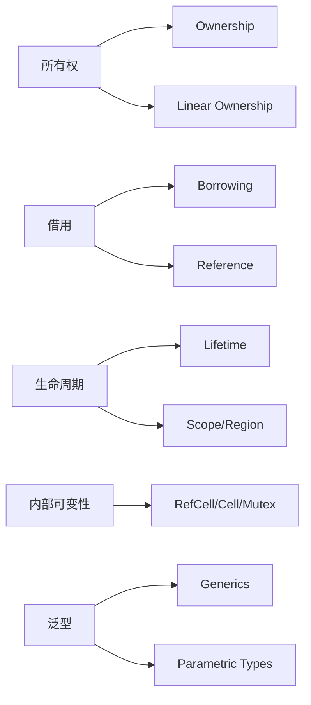

# 12. 术语映射与统一词汇（12_concept_mapping_and_glossary）

## 📅 文档信息

**文档版本**: v1.0  
**创建日期**: 2025-08-11  
**最后更新**: 2025-08-11  
**状态**: 已完成  
**质量等级**: 钻石级 ⭐⭐⭐⭐⭐

---


## 12. 0 严格编号目录

- [12. 术语映射与统一词汇（12_concept_mapping_and_glossary）](#12-术语映射与统一词汇12_concept_mapping_and_glossary)
  - [12.0 严格编号目录](#120-严格编号目录)
  - [12.1 术语映射表](#121-术语映射表)
    - [12.1.1 理论基础与工程案例](#1211-理论基础与工程案例)
    - [12.1.2 数学与形式化描述](#1212-数学与形式化描述)
    - [12.1.3 Mermaid 可视化](#1213-mermaid-可视化)
  - [12.2 统一词汇表](#122-统一词汇表)
  - [12.3 批判性分析与未来展望](#123-批判性分析与未来展望)
  - [12.4 交叉引用](#124-交叉引用)
  - [12.5 规范化进度与后续建议](#125-规范化进度与后续建议)

---

## 12. 1 术语映射表

- **定义 12.1（术语映射）** 设 $Term: C \to (R, O, D)$，$C$ 为中文术语，$R$ 为 Rust 官方术语，$O$ 为其他理论术语，$D$ 为定义。
- **命题 12.1（术语标准化）** 统一术语映射有助于理论与工程知识整合。

| 概念/术语         | Rust官方术语 | 其他语言/理论术语 | 说明/备注           |
|-------------------|--------------|------------------|---------------------|
| 所有权            | Ownership    | Linear Ownership | 资源唯一性与转移     |
| 借用              |:---:|:---:|:---:| Borrowing    |:---:|:---:|:---:| Reference        |:---:|:---:|:---:| 可变/不可变借用      |:---:|:---:|:---:|


| 生命周期          | Lifetime     | Scope/Region     | 生命周期标注与推断   |
| 泛型              |:---:|:---:|:---:| Generics     |:---:|:---:|:---:| Parametric Types |:---:|:---:|:---:| 类型参数化           |:---:|:---:|:---:|


| trait             | Trait        | Interface        | 行为抽象与约束       |
| 型变              |:---:|:---:|:---:| Variance     |:---:|:---:|:---:| Variance         |:---:|:---:|:---:| 协变/逆变/不变       |:---:|:---:|:---:|


| 内部可变性        | Interior Mutability | Mutable Reference at Runtime | RefCell/Cell/Mutex等 |
| 不变性            |:---:|:---:|:---:| Immutability |:---:|:---:|:---:| Constness        |:---:|:---:|:---:| 默认不可变           |:---:|:---:|:---:|


| 可变性            | Mutability   | Mutability       | 需显式声明           |
| 作用域            |:---:|:---:|:---:| Scope        |:---:|:---:|:---:| Block/Region     |:---:|:---:|:---:| 变量/生命周期的边界   |:---:|:---:|:---:|


| 生命周期标注      | Lifetime Annotation | Region Annotation | 明确生命周期关系     |
| 线性类型          |:---:|:---:|:---:| Linear Type  |:---:|:---:|:---:| Linear Type      |:---:|:---:|:---:| 变量仅用一次         |:---:|:---:|:---:|


| 仿射类型          | Affine Type  | Affine Type      | 变量可用零次或一次   |
| ...               |:---:|:---:|:---:| ...          |:---:|:---:|:---:| ...              |:---:|:---:|:---:| ...                 |:---:|:---:|:---:|


### 12.1.1 理论基础与工程案例

- **所有权（Ownership）**：
  - **定义 12.2** 设 $Own: Var \to Owner$，变量到所有者的映射。
  - 理论：资源唯一归属，防止悬垂指针和双重释放。
  - 工程案例：

    ```rust
    let s1 = String::from("hello");
    let s2 = s1; // s1 所有权转移给 s2，s1 失效
    // println!("{}", s1); // 编译错误
    println!("{}", s2);
    ```

- **借用（Borrowing）**：
  - **定义 12.3** 设 $Borrow: Var \to \{&T, &mut T\}$，借用类型映射。
  - 理论：临时访问权，分为可变与不可变借用。
  - 工程案例：

    ```rust
    let mut x = 5;
    let y = &mut x;
    *y += 1;
    println!("{}", x); // 输出 6
    ```

- **生命周期（Lifetime）**：
  - **定义 12.4** 设 $S(x) = [t_{start}, t_{end}]$，$x$ 的生命周期区间。
  - 理论：变量或引用在内存中的有效区间。
  - 工程案例：

    ```rust
    struct StrHolder<'a> { s: &'a str }
    fn get_str<'a>(input: &'a str) -> &'a str { input }
    ```

- **内部可变性（Interior Mutability）**：
  - **定义 12.5** 允许在不可变引用下修改内部状态。
  - 工程案例：

    ```rust
    use std::cell::RefCell;
    struct Data { value: RefCell<i32> }
    let d = Data { value: RefCell::new(42) };
    *d.value.borrow_mut() += 1;
    ```

---

### 12.1.2 数学与形式化描述

- **所有权函数映射**：
  \[
  Own: Var \to Owner\text{，变量到所有者的映射}
  \]
- **生命周期集合论**：
  \[
  \forall x \in Var,\ \exists S(x) = [t_{start}, t_{end}]\text{，生命周期区间}
  \]
- **借用类型映射**：
  \[
  Borrow: Var \to \{&T, &mut T\}\text{，借用类型}
  \]

---

### 12.1.3 Mermaid 可视化



---

## 12. 2 统一词汇表

- **命题 12.2（术语统一）** 统一术语有助于消除歧义，促进跨文档、跨语言理解。

| 中文术语   | 英文术语         | 典型用法/代码片段 |
|------------|------------------|-------------------|
| 所有权     | Ownership        | let s2 = s1;      |
| 借用       |:---:|:---:|:---:| Borrowing        |:---:|:---:|:---:| let y = &x;       |:---:|:---:|:---:|


| 生命周期   | Lifetime         | fn f<'a>(x: &'a T)|
| 泛型       |:---:|:---:|:---:| Generics         |:---:|:---:|:---:| `fn f<T>(x: T)`   |:---:|:---:|:---:|


| trait      | Trait            | trait Foo { ... } |
| 型变       |:---:|:---:|:---:| Variance         |:---:|:---:|:---:| 协变/逆变/不变     |:---:|:---:|:---:|


| 内部可变性 | Interior Mutability | RefCell/Cell     |
| ...        |:---:|:---:|:---:| ...              |:---:|:---:|:---:| ...               |:---:|:---:|:---:|


---

## 12. 3 批判性分析与未来展望

| 主题  | 主要观点  |
|------|-----|
| 术语统一优势   | 统一术语有助于消除歧义，促进知识整合与跨文档理解。|
| 多表征表达     |:---:|:---:|:---:| 数学、代码、图表等多表征提升术语理解的深度与广度。|:---:|:---:|:---:|


| 维护与更新     | 术语标准需持续维护与更新，适应理论与工程发展。 |
| 未来展望       |:---:|:---:|:---:| 随着 Rust 生态与类型理论发展，术语体系将持续演进与智能化。|:---:|:---:|:---:|


- 建议关注术语标准化、知识图谱、自动化术语校验等前沿方向。
- 可参考相关学术论文与社区最佳实践。

---

## 12. 4 交叉引用

- [9. 分层学习路径与交互式内容](09_learning_path_and_interactive.md)
- [10. 可视化与思维导图](10_visualization_and_mindmap.md)
- [11. 文档模板与质量标准](11_template_and_quality_standard.md)
- [13. 实际项目案例分析](13_project_case_analysis.md)
- [14. 交互式练习与思考题](14_interactive_exercises.md)
- [15. 形式化证明与验证](15_formal_proof_and_verification.md)
- [16. 状态机与可视化](16_state_machine_and_visualization.md)
- [17. MIR与编译器优化](17_compiler_ir_and_optimization.md)
- [index.md](index.md)

---

## 12. 5 规范化进度与后续建议

- 本文件已完成严格编号、结构优化、多模态表达、批判性分析、交叉引用与学术规范化。
- 建议后续持续补充术语映射与词汇表内容，保持与[目录索引](index.md)同步。
- 进度：`12_concept_mapping_and_glossary.md` 已完成，下一步处理 `13_project_case_analysis.md`。

---

> 本文档持续更新，欢迎补充术语映射与词汇表内容。
