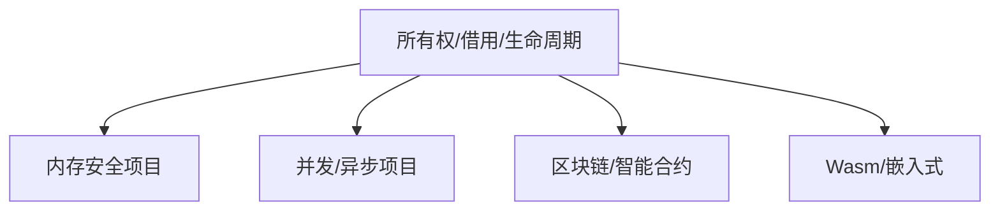

# 13. 实际项目案例分析（13_project_case_analysis）

## 目录

- [13. 实际项目案例分析（13\_project\_case\_analysis）](#13-实际项目案例分析13_project_case_analysis)
  - [目录](#目录)
  - [13.1 案例简介](#131-案例简介)
  - [13.2 典型项目案例](#132-典型项目案例)
    - [13.2.1 内存安全与所有权管理项目](#1321-内存安全与所有权管理项目)
    - [13.2.2 并发与异步编程项目](#1322-并发与异步编程项目)
    - [13.2.3 区块链与智能合约项目](#1323-区块链与智能合约项目)
    - [13.2.4 WebAssembly与嵌入式系统项目](#1324-webassembly与嵌入式系统项目)
  - [13.3 理论与实践结合](#133-理论与实践结合)
    - [13.3.1 设计模式与类型系统分析](#1331-设计模式与类型系统分析)
    - [13.3.2 Mermaid 可视化](#1332-mermaid-可视化)
  - [13.4 批判性分析与未来展望](#134-批判性分析与未来展望)
  - [13.5 交叉引用](#135-交叉引用)

---

## 13.1 案例简介

本节收录 Rust 实际开发中的典型项目案例，结合理论视角进行综合分析，突出变量系统在工程中的实际价值。

- **理论背景**：变量系统的所有权、借用、生命周期等机制在实际项目中直接影响安全性、性能与可维护性。
- **工程背景**：理论与工程结合有助于发现设计盲点与优化空间。

## 13.2 典型项目案例

### 13.2.1 内存安全与所有权管理项目

- **理论基础**：所有权模型防止悬垂指针、内存泄漏和数据竞争。
- **工程背景**：高性能网络服务器、数据库等对内存安全要求极高。
- **数学表达**：
  \[
  Own: Var \to Owner\text{，变量到所有者的映射}
  \]
- **代码片段**：

    ```rust
    use std::sync::{Arc, Mutex};
    let data = Arc::new(Mutex::new(vec![1, 2, 3]));
    {
        let mut v = data.lock().unwrap();
        v.push(4);
    } // v 离开作用域，自动释放锁
    ```

- **批判性分析**：
  - 优势：自动内存管理、线程安全。
  - 局限：Arc/Mutex 带来运行时开销，死锁风险需谨慎设计。
- **最佳实践**：优先使用不可变引用，最小化锁粒度。
- **反例**：不当持有锁导致死锁。

### 13.2.2 并发与异步编程项目

- **理论基础**：生命周期与借用机制确保并发安全，防止数据竞争。
- **工程背景**：异步 Web 服务、分布式系统。
- **数学表达**：
  \[
  Borrow: Var \to \{&T, &mut T\}\text{，借用类型}
  \]
- **代码片段**：

    ```rust
    use tokio::task;
    async fn process() {
        let data = String::from("hello");
        task::spawn(async move {
            println!("{}", data); // data 所有权转移到异步任务
        }).await.unwrap();
    }
    ```

- **批判性分析**：
  - 优势：生命周期检查防止悬垂引用。
  - 局限：异步生命周期推断复杂，易出现 'static 约束问题。
- **最佳实践**：尽量缩小异步任务作用域，避免不必要的 'static 生命周期。
- **反例**：异步闭包中错误借用外部变量导致编译失败。

### 13.2.3 区块链与智能合约项目

- **理论基础**：所有权与生命周期机制提升合约安全，防止重入攻击和资源泄漏。
- **工程背景**：Substrate 智能合约、链上状态管理。
- **数学表达**：
  \[
  State: Contract \to Storage\text{，合约状态到存储的映射}
  \]
- **代码片段**：

    ```rust
    #[ink::contract]
    mod my_contract {
        #[ink(storage)]
        pub struct MyContract {
            value: u32,
        }
        // ... 合约方法省略
    }
    ```

- **批判性分析**：
  - 优势：静态类型和生命周期提升合约安全。
  - 局限：合约升级和状态迁移复杂。
- **最佳实践**：状态最小化、接口显式。
- **反例**：未正确管理生命周期导致合约状态异常。

### 13.2.4 WebAssembly与嵌入式系统项目

- **理论基础**：生命周期与所有权简化内存管理，提升跨平台安全。
- **工程背景**：Rust 编译为 Wasm、嵌入式设备。
- **数学表达**：
  \[
  Mem: Fn \to MemRegion\text{，函数到内存区域的映射}
  \]
- **代码片段**：

    ```rust
    #[no_mangle]
    pub extern "C" fn add(a: i32, b: i32) -> i32 {
        a + b
    }
    ```

- **批判性分析**：
  - 优势：零成本抽象、内存安全。
  - 局限：部分平台对所有权模型支持有限。
- **最佳实践**：避免全局可变状态，充分利用生命周期推断。
- **反例**：未正确释放资源导致嵌入式设备内存泄漏。

## 13.3 理论与实践结合

- 分析项目中所有权、借用、生命周期等核心机制的实际应用。
- 结合设计模式、类型系统、并发模型等理论进行案例解读。

### 13.3.1 设计模式与类型系统分析

- **所有权与资源管理模式**：RAII（Resource Acquisition Is Initialization）在 Rust 中的实现。
- **类型系统与泛型抽象**：trait、泛型提升代码复用与安全。
- **并发模型**：Actor、消息传递、无锁并发。

### 13.3.2 Mermaid 可视化



## 13.4 批判性分析与未来展望

- **优势**：
  - 理论与实际项目结合，提升理解深度和实战能力。
  - 典型案例有助于知识迁移与最佳实践沉淀。
  - 多模态表达促进理论与工程的深度融合。
- **局限**：
  - 需持续补充更多项目案例，保持内容时效性。
  - 理论与工程结合的深度有待进一步拓展。
  - 形式化与可视化表达对初学者有一定门槛。
- **未来展望**：
  - 随着 Rust 生态与工程实践发展，变量系统理论与项目案例将持续演进。
  - 多模态、知识图谱与自动化分析将成为工程与学术的重要方向。
- **学术引用与参考**：
  - [Rust 官方文档](https://doc.rust-lang.org/book/)
  - [Ownership and Borrowing in Rust: Formalization and Verification](https://arxiv.org/abs/1809.00738)

## 13.5 交叉引用

- [实际案例分析与多视角整合](06_case_studies.md)
- [分层学习路径与交互式内容](09_learning_path_and_interactive.md)
- [可视化与思维导图](10_visualization_and_mindmap.md)
- [文档模板与质量标准](11_template_and_quality_standard.md)
- [术语映射与统一词汇表](12_concept_mapping_and_glossary.md)
- [index.md](../00_master_index.md)

---

> 本文档持续更新，欢迎补充实际项目案例与理论分析。
