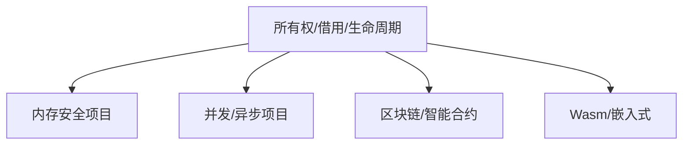

# 13. 实际项目案例分析（13_project_case_analysis）

## 目录

- [13. 实际项目案例分析（13\_project\_case\_analysis）](#13-实际项目案例分析13_project_case_analysis)
  - [目录](#目录)
  - [13.1 案例简介](#131-案例简介)
  - [13.2 典型项目案例](#132-典型项目案例)
  - [13.3 理论与实践结合](#133-理论与实践结合)
  - [13.4 批判性分析](#134-批判性分析)
  - [13.5 交叉引用](#135-交叉引用)

## 13.1 案例简介

本节收录Rust实际开发中的典型项目案例，结合理论视角进行综合分析，突出变量系统在工程中的实际价值。

**工程与理论背景举例：**

- 变量系统的所有权、借用、生命周期等机制在实际项目中直接影响安全性、性能与可维护性。
- 理论与工程结合有助于发现设计盲点与优化空间。

## 13.2 典型项目案例

- **13.2.1 内存安全与所有权管理项目**
  - 例：高性能网络服务器，利用所有权模型防止内存泄漏和数据竞争。
  - 代码片段：

```rust
use std::sync::{Arc, Mutex};
let data = Arc::new(Mutex::new(vec![1, 2, 3]));
{
    let mut v = data.lock().unwrap();
    v.push(4);
}
```

- **13.2.2 并发与异步编程项目**
  - 例：异步Web服务，生命周期与借用机制确保并发安全。
  - 代码片段：

```rust
use tokio::task;
async fn process() {
    let data = String::from("hello");
    task::spawn(async move {
        println!("{}", data);
    }).await.unwrap();
}
```

- **13.2.3 区块链与智能合约项目**
  - 例：Substrate智能合约，所有权与生命周期机制提升合约安全。
  - 代码片段：

```rust
#[ink::contract]
mod my_contract {
    #[ink(storage)]
    pub struct MyContract {
        value: u32,
    }
    // ...
}
```

- **13.2.4 WebAssembly与嵌入式系统项目**
  - 例：Rust编译为Wasm，生命周期与所有权简化内存管理。
  - 代码片段：

```rust
#[no_mangle]
pub extern "C" fn add(a: i32, b: i32) -> i32 {
    a + b
}
```

## 13.3 理论与实践结合

- 分析项目中所有权、借用、生命周期等核心机制的实际应用
- 结合设计模式、类型系统、并发模型等理论进行案例解读
- **Mermaid 可视化：项目案例与理论机制关系**



## 13.4 批判性分析

- **优势：**
  - 理论与实际项目结合，提升理解深度和实战能力
  - 典型案例有助于知识迁移与最佳实践沉淀
- **局限：**
  - 需持续补充更多项目案例，保持内容时效性
  - 理论与工程结合的深度有待进一步拓展

## 13.5 交叉引用

- [实际案例分析与多视角整合](06_case_studies.md)
- [分层学习路径与交互式内容](09_learning_path_and_interactive.md)
- [index.md](../00_master_index.md)

---

> 本文档持续更新，欢迎补充实际项目案例与理论分析。
