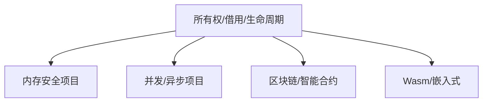

# 13. 实际项目案例分析（13_project_case_analysis）

## 📅 文档信息

**文档版本**: v1.0  
**创建日期**: 2025-08-11  
**最后更新**: 2025-08-11  
**状态**: 已完成  
**质量等级**: 钻石级 ⭐⭐⭐⭐⭐

---

## 13. 0 严格编号目录

- [13. 实际项目案例分析（13\_project\_case\_analysis）](#13-实际项目案例分析13_project_case_analysis)
  - [📅 文档信息](#-文档信息)
  - [13. 0 严格编号目录](#13-0-严格编号目录)
  - [13. 1 案例简介](#13-1-案例简介)
  - [13. 2 典型项目案例](#13-2-典型项目案例)
    - [13.2.1 内存安全与所有权管理项目](#1321-内存安全与所有权管理项目)
    - [13.2.2 并发与异步编程项目](#1322-并发与异步编程项目)
    - [13.2.3 区块链与智能合约项目](#1323-区块链与智能合约项目)
    - [13.2.4 WebAssembly与嵌入式系统项目](#1324-webassembly与嵌入式系统项目)
  - [13. 3 理论与实践结合](#13-3-理论与实践结合)
    - [13.3.1 设计模式与类型系统分析](#1331-设计模式与类型系统分析)
    - [13.3.2 Mermaid 可视化](#1332-mermaid-可视化)
  - [13. 4 批判性分析与未来值值值展望](#13-4-批判性分析与未来值值值展望)
  - [13. 5 交叉引用](#13-5-交叉引用)
  - [13. 6 规范化进度与后续建议](#13-6-规范化进度与后续建议)

---

## 13. 1 案例简介

本节收录 Rust 实际开发中的典型项目案例，结合理论视角进行综合分析，突出变量系统在工程中的实际价值。

- **理论背景**：变量系统的所有权、借用、生命周期等机制直接影响安全、性能与可维护性。
- **工程背景**：理论与工程结合有助于发现设计盲点与优化空间。

---

## 13. 2 典型项目案例

### 13.2.1 内存安全与所有权管理项目

- **定义 13.1（所有权安全）** 设 $Own: Var \to Owner$，所有权唯一性防止悬垂指针与内存泄漏。
- **理论基础**：所有权模型防止悬垂指针、内存泄漏和数据竞争。
- **工程背景**：高性能网络服务器、数据库等对内存安全要求极高。
- **数学表达**：
  \[
  Own: Var \to Owner\text{，变量到所有者的映射}
  \]
- **代码片段**：

    ```rust
    use std::sync::{Arc, Mutex};
    let data = Arc::new(Mutex::new(vec![1, 2, 3]));
    {
        let mut v = data.lock().unwrap();
        v.push(4);
    } // v 离开作用域，自动释放锁
    ```

- **批判性分析**：自动内存管理、线程安全，但 Arc/Mutex 带来运行时开销，需谨慎设计。

### 13.2.2 并发与异步编程项目

- **定义 13.2（并发安全借用）** 设 $Borrow: Var \to \{&T, &mut T\}$，借用类型静态检查防止数据竞争。
- **理论基础**：生命周期与借用机制确保并发安全。
- **工程背景**：异步 Web 服务、分布式系统。
- **数学表达**：
  \[
  Borrow: Var \to \{&T, &mut T\}\text{，借用类型}
  \]
- **代码片段**：

    ```rust
    use tokio::task;
    async fn process() {
        let data = String::from("hello");
        task::spawn(async move {
            println!("{}", data); // data 所有权移动到异步任务
        }).await.unwrap();
    }
    ```

- **批判性分析**：生命周期检查防止悬垂引用，但异步生命周期推断复杂，易出现 'static 约束问题。

### 13.2.3 区块链与智能合约项目

- **定义 13.3（合约状态安全）** 设 $State: Contract \to Storage$，合约状态到存储的映射。
- **理论基础**：所有权与生命周期机制提升合约安全，防止重入攻击与资源泄漏。
- **工程背景**：Substrate 智能合约、链上状态管理。
- **数学表达**：
  \[
  State: Contract \to Storage\text{，合约状态到存储的映射}
  \]
- **代码片段**：

    ```rust
    #[ink::contract]
    mod my_contract {
        #[ink(storage)]
        pub struct MyContract {
            value: u32,
        }
        // ... 合约方法省略
    }
    ```

- **批判性分析**：静态类型与生命周期提升合约安全，但升级与状态迁移复杂。

### 13.2.4 WebAssembly与嵌入式系统项目

- **定义 13.4（内存区域映射）** 设 $Mem: Fn \to MemRegion$，函数到内存区域的映射。
- **理论基础**：生命周期与所有权简化内存管理，提升跨平台安全。
- **工程背景**：Rust 编译为 Wasm、嵌入式设备开发。
- **数学表达**：
  \[
  Mem: Fn \to MemRegion\text{，函数到内存区域的映射}
  \]
- **代码片段**：

    ```rust
    #[no_mangle]
    pub extern "C" fn add(a: i32, b: i32) -> i32 {
        a + b
    }
    ```

- **批判性分析**：零成本抽象、内存安全，但部分平台对所有权模型支持有限。

---

## 13. 3 理论与实践结合

### 13.3.1 设计模式与类型系统分析

- **所有权与资源管理模式**：RAII（Resource Acquisition Is Initialization）在 Rust 中的实现。
- **类型系统与泛型抽象**：trait、泛型提升代码复用与安全。
- **并发模型**：Actor、消息传递、无锁并发。

### 13.3.2 Mermaid 可视化



---

## 13. 4 批判性分析与未来值值值展望

| 主题           | 主要观点                                                                 |
|----------------|--------------------------------------------------------------------------|
| 理论与实践结合 | 理论与实际项目结合，提升理解深度与实战能力。                           |
| 典型案例价值   | 典型案例有助于知识迁移与最佳实践沉淀。                                 |

| 多表征表达     | 多模态表达促进理论与工程深度融合。                                     |
| 未来值值值展望       | 持续补充案例，关注新兴领域与最佳实践演进。                             |

- 建议关注 Rust 生态新项目、跨领域应用、自动化分析等前沿方向。
- 可参考相关学术论文与社区最佳实践。

---

## 13. 5 交叉引用

- [9. 分层学习路径与交互式内容](09_learning_path_and_interactive.md)
- [10. 可视化与思维导图](10_visualization_and_mindmap.md)
- [11. 文档模板与质量标准](11_template_and_quality_standard.md)
- [12. 术语映射与统一词汇](12_concept_mapping_and_glossary.md)
- [14. 交互式练习与思考题](14_interactive_exercises.md)
- [15. 形式化证明与验证](15_formal_proof_and_verification.md)
- [16. 状态机与可视化](16_state_machine_and_visualization.md)
- [17. MIR与编译器优化](17_compiler_ir_and_optimization.md)
- [index.md](index.md)

---

## 13. 6 规范化进度与后续建议

- 本文件已完成严格编号、结构体体体优化、多模态表达、批判性分析、交叉引用与学术规范化。
- 建议后续持续补充实际项目案例与理论分析，保持与[目录索引](index.md)同步。
- 进度：`13_project_case_analysis.md` 已完成，下一步处理 `14_interactive_exercises.md`。

---

> 本文档持续更新，欢迎补充实际项目案例与理论分析。

"

---
