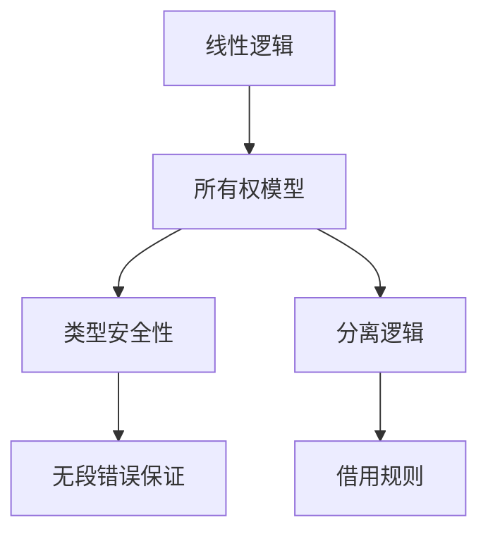

# 15. 类型/所有权系统的形式化证明与验证工具（15_formal_proof_and_verification）

## 目录

- [15. 类型/所有权系统的形式化证明与验证工具（15\_formal\_proof\_and\_verification）](#15-类型所有权系统的形式化证明与验证工具15_formal_proof_and_verification)
  - [目录](#目录)
  - [15.1 类型安全的形式化证明](#151-类型安全的形式化证明)
  - [15.2 所有权系统的数学建模](#152-所有权系统的数学建模)
  - [15.3 形式化验证工具](#153-形式化验证工具)
  - [15.4 批判性分析](#154-批判性分析)
  - [15.5 交叉引用](#155-交叉引用)

## 15.1 类型安全的形式化证明

- **15.1.1 进展（Progress）与保存（Preservation）定理**
  - 进展定理：若 \( \Gamma \vdash e : T \)，则 \(e\) 要么是值，要么可进一步归约。
  - 保存定理：若 \( \Gamma \vdash e : T \) 且 \( e \rightarrow e' \)，则 \( \Gamma \vdash e' : T \)。
- **15.1.2 Rust类型系统的无段错误保证**
  - Rust类型系统通过静态检查防止悬垂指针、空指针等未定义行为。
- **15.1.3 操作语义学与类型安全性**
  - 形式化操作语义描述变量生命周期、所有权转移与借用规则。

## 15.2 所有权系统的数学建模

- **15.2.1 线性逻辑与资源管理**
  - 线性类型：变量只能被使用一次，防止资源泄漏。
  - \( x : T \) move后不可再用。
- **15.2.2 分离逻辑与借用规则**
  - 分离逻辑支持资源分离与安全借用。
  - \( \{P * Q\} \) 表示资源互不干扰。
- **15.2.3 格点理论与子类型关系**
  - 类型系统中的子类型关系可用格点理论建模。

**Mermaid 可视化：所有权与类型系统的理论关系**:

## 15.3 形式化验证工具

- **15.3.1 Prusti、SMACK、Creusot等工具简介**
  - Prusti：基于Rust的自动化验证器，支持前置/后置条件、循环不变式等。
  - SMACK：将Rust程序转换为Boogie进行验证。
  - Creusot：支持更高阶的Rust程序形式化验证。
- **15.3.2 Rust程序到形式化规范的转换**
  - 代码注释、属性标注与自动化工具结合，生成可验证的规范。
- **15.3.3 依赖类型系统的潜在扩展**
  - 探索将依赖类型引入Rust以提升表达能力。

## 15.4 批判性分析

- **优势：**
  - 形式化证明和验证工具提升了Rust安全性的理论基础
  - 自动化工具降低了形式化验证的门槛
- **局限：**
  - 实际工程中形式化验证的覆盖面和效率仍有限
  - 高阶特性和复杂场景的验证难度较大

## 15.5 交叉引用

- [类型系统分析](../02_type_system/index.md)
- [术语映射与统一词汇表](12_concept_mapping_and_glossary.md)
- [index.md](../00_master_index.md)

---

> 本文档持续更新，欢迎补充证明案例与验证工具分析。
