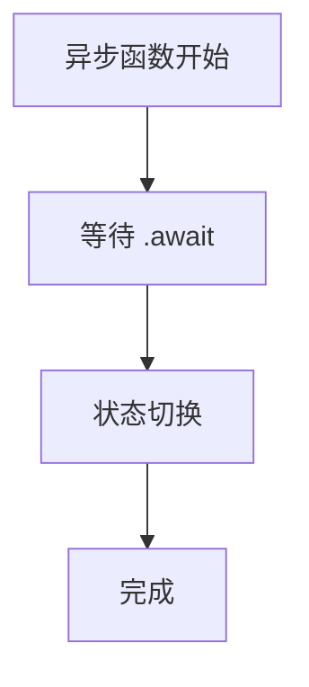

# 16. 状态机与可视化（16_state_machine_and_visualization）

## 目录

- [16. 状态机与可视化（16_state_machine_and_visualization）](#16-状态机与可视化16_state_machine_and_visualization)
  - [目录](#目录)
  - [16.1 状态机建模](#161-状态机建模)
  - [16.2 图表与可视化](#162-图表与可视化)
  - [16.3 批判性分析](#163-批判性分析)
  - [16.4 交叉引用](#164-交叉引用)

## 16.1 状态机建模

- 16.1.1 异步函数的状态机转换
- 16.1.2 所有权转移与借用的状态图
- 16.1.3 生命周期推导的自动机模型

## 16.2 图表与可视化

- 16.2.1 借用关系图、生命周期图
- 16.2.2 内存布局可视化

## 16.3 批判性分析

- 优势：状态机与可视化有助于理解复杂机制，提升理论与实践映射
- 局限：需结合具体代码和实际案例，避免抽象化过度

## 16.4 交叉引用

- [可视化与思维导图](10_visualization_and_mindmap.md)
- [交互式练习与思考题](14_interactive_exercises.md)
- [index.md](../00_master_index.md)

---

> 本文档持续更新，欢迎补充状态机建模与可视化案例。
